# 			 第一章  类的加载器

## 1.1  类加载的整体过程

​	当我们使用一个类的时候,这个类会加载到内存中,那么这个类是如何加载到内存中的,是谁把这个类加载的呢?

接下来咱们通过一张图为大家讲解!

定义一个类

```java
package classloader;
public class Demo01_ClassLoader {

    public static final int a = 100;
    public static Person p = new Person();
    public static void main(String[] args) {
        Demo01_ClassLoader d = new Demo01_ClassLoader();
        d.method();
    }
    public int method(){
        int a = 10;
        int b = 20;
        int c = (a+b)*100;

        return c;
    }
}
```

当我们在运行这个类的时候，这个类一定会加载到内存,以下是这个类加载的大概过程.

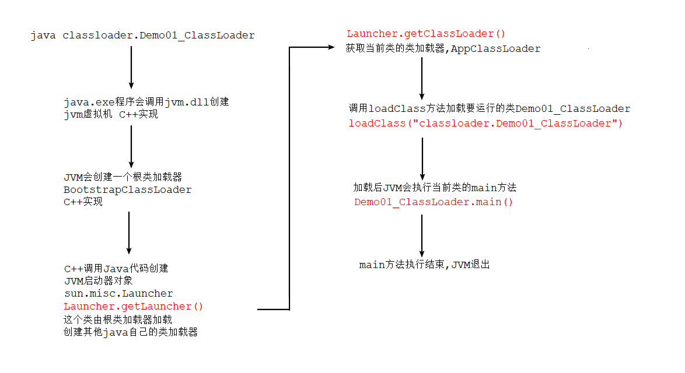

首先由C++语言创建JVM虚拟机，然后创建一个根类加载器，由根类加载器加载一个类sum.misc.Launcher,这个类中有一个静态方法getLauncher()获取这个类的实例，然后调用getClassLoader方法获取当前要运行类的类加载器，调用类加载器的loadClass方法加载这个类，然后调用main方法，最后main方法执行结束，JVM退出。

其中loadClass又分为以下3步：

**1.加载**

- 通过一个类的全限定名来获取定义此类的二进制字节流
- 将这个字节流所代表的静态存储结构转化为方法区的运行时数据结构
- 在内存中生成一个代表这个类的java.lang.Class对象，作为方法区这个类的各种数据的访问入口。

**2.连接**

- 验证 

  ​	  确保Class文件的字节流中包含的信息符合当前虚拟机的要求。

  ​	  对文件的格式验证，对元数据的验证，对字节码验证，符号引用的验证等等。

- 准备

  ​	为类变量分配内存并设置类静态变量初始值，这些内存都将在方法区中分配。

  ​	注意：只对static修饰的静态变量进行内存分配、赋默认值。对final的**静态字面值常量**直接赋初值 

  ​		（赋初值不是赋默认值，如果不是字面值静态常量，那么会和静态变量一样赋默认值）

- 解析

  ​	将常量池中的符号引用替换为直接引用（内存地址）的过程

  ​	符号引用就是一组符号来描述目标，可以是任何字面量。属于编译原理方面的概念如：包括类和接口的	    

  ​	全限定名、字段的名称和描述符、方法的名称和描述符。

  ​	 假设：一个类有一个静态变量，该静态变量是一个自定义的类型，那么经过解析后，该静态变量将是一

  ​	 个指针，指向该类在方法区的内存地址

**3.初始化**

​		为类的静态变量赋初值，运行静态代码块

所以就一个类的生命周期而言需要经历**加载-->验证-->准备-->解析--->初始化--->使用--->卸载**几个过程.其中加载、验证、准备、初始化和卸载这5个阶段的顺序是确定的，类的加载过程必须按照这种顺序进行，而解析阶段则不一定，它在某些情况下可能在初始化阶段后在开始，因为java支持运行时绑定。加载（loading）阶段，java虚拟机规范中没有进行约束，但初始化阶段，java虚拟机严格规定了有且只有如下5种情况必须立即进行初始化（初始化前，必须经过加载、验证、准备阶段）：

1.使用new实例化对象时，读取和设置类的静态变量、静态非字面值常量（静态字面值常量除外）时，调用静态方法时.

2.对类反射调用时.

3.当初始化一个类时，如果父类没有进行初始化，需要先初始化父类。

4.直接运行一个类的main方法 

5.当使用1.7的动态语言支持时。当java.lang.invoke.MethodHandler实例后的结果是REF-getStatic/REF_putstatic/REF_invokeStatic的句柄，并且这些句柄对应的类没初始化的话应该首先初始。

```java
public class MyMath {
    static{
        System.out.println("我被初始化了");
    }

    public static int sum(int a,int b){
        return a + b;
    }
}
public class Test {
    public static void main(String[] args) throws Throwable {
        MethodHandles.Lookup lookup = MethodHandles.lookup();
        MethodType mt = MethodType.methodType(int.class, int.class, int.class);
        MethodHandle mh = lookup.findStatic(MyMath.class, "sum", mt);
        Object invoke = mh.invoke(10, 20);
        System.out.println(invoke);
    }
}

运行结果:
	我被初始化了
	30
```

如上5种场景又被称为类的主动引用，除此之外的引用称为被动引用,被动引用有如下几种常见情况

- 通过子类引用父类的静态字段，只会触发父类的初始化，而不会触发子类的初始化。
- 定义对象数组和集合，不会触发该类的初始化
- 类A引用类B的static final常量不会导致类B初始化（注意静态常量必须是字面值常量，否则还是会触发B的初始化）
- 通过类名获取Class对象，不会触发类的初始化。如System.out.println(Person.class);
- 通过Class.forName加载指定类时，如果指定参数initialize为false时，也不会触发类初始化。
- 通过ClassLoader默认的loadClass方法，也不会触发初始化动作

**注意:**被动引用不会导致类初始化，但不代表类不会经历加载、验证、准备阶段。

## 1.2  类加载器的介绍

类的加载过程主要通过类的加载器实现,Java中提供了以下几种类加载器:

- 引导类加载器Bootstrap：是C++语言编写，负责加载JDK核心类库，核心类库位置\jdk\jre\lib\下的jar包。由于引导类加载器器在JVM内部，开发人员是不能直接操作的。
- 扩展类加载器ExtClassLoader：Java语言编写的类加载器，负责加载JDK扩展类库，类库位置\jdk\lib\ext\下的jar包。
- 应用类加载器AppClassLoader：Java语言编写的类加载器，负责加载我们定义的类和第三方jar包中的类。

```java
public class Demo02_ClassLoader {
    public static void main(String[] args) {

        //获取String类的类加载器
        ClassLoader bootstrap = String.class.getClassLoader();
        //获取扩展包下的类的类加载器
        ClassLoader ext = DNSNameService.class.getClassLoader();
        //获取当前类的的类加载器
        ClassLoader app = Demo02_ClassLoader.class.getClassLoader();

        //由于根类加载器根本不是java语言写的 所以获取的是null值
        System.out.println(bootstrap);//null
        //扩展包下的类用 ext加载器加载
        System.out.println(ext);//sun.misc.Launcher$ExtClassLoader@6d6f6e28
        //我们定义的类用 app加载器加载
        System.out.println(app);//sun.misc.Launcher$AppClassLoader@18b4aac2


        System.out.println("---------------父加载器----------------------");

        //应用加载器的父加载器是扩展加载器
        ClassLoader parent = app.getParent();
        System.out.println(parent);//sun.misc.Launcher$ExtClassLoader@6d6f6e28

        //扩展加载器的父加载器是根类加载器
        ClassLoader parent1 = ext.getParent();
        System.out.println(parent1);//null


        System.out.println("-------------根类加载器loadPath--------------------");

        URL[] urLs = Launcher.getBootstrapClassPath().getURLs();
        for (URL urL : urLs) {
            System.out.println(urL);
        }
        System.out.println("--------------扩展类加载器loadPath---------------------");
        URLClassLoader extClassLoader = (URLClassLoader)ext;
        URL[] urLs1 = extClassLoader.getURLs();
        for (URL url : urLs1) {
            System.out.println(url);
        }

        System.out.println(extClassLoader);
        System.out.println("--------------应用加载器loadPath---------------------");
        URLClassLoader appClassLoader = (URLClassLoader)app;
        URL[] urLs2 = appClassLoader.getURLs();
        for (URL url : urLs2) {
            System.out.println(url);
        }
    }
}

```

**类加载器的初始化过程(源码,只有必要代码)**

```java
public class Launcher {
  	 private static Launcher launcher = new Launcher();
  	 private ClassLoader loader;
  	 
  	 //静态方法返回Launcher对象
  	 public static Launcher getLauncher() {
        return launcher;
     }
  	 //Launcher构造方法
  	 public Launcher() {
       	  
          Launcher.ExtClassLoader var1;
          try {
             //构造扩展类加载器 会将其parent加载器设置为null 跟着方法向下走可以看到
              var1 = Launcher.ExtClassLoader.getExtClassLoader();
          } catch (IOException var10) {
              throw new InternalError("Could not create extension class loader", var10);
          }

          try {
              //构造应用类加载器 将其parent加载器设置为ext加载器
              this.loader = Launcher.AppClassLoader.getAppClassLoader(var1);
          } catch (IOException var9) {
              throw new InternalError("Could not create application class loader", var9);
          }

          Thread.currentThread().setContextClassLoader(this.loader);
		 ......
    }
  
   public ClassLoader getClassLoader() {
        return this.loader;
    }
}
```

## 1.3 双亲委派机制

双亲委派模型的工作过程是：**如果一个类加载器收到了类加载的请求，它首先不会自己去尝试加载这个类，而是把这个请求委派给父类加载器去完成，每一个层次的类加载器都是如此**，因此所有的加载请求最终都应该传送到顶层的启动类加载器中，只有**当父加载器反馈自己无法完成这个加载请求（它的搜索范围中没有找到所需的类）时，子加载器才会尝试自己去加载**。

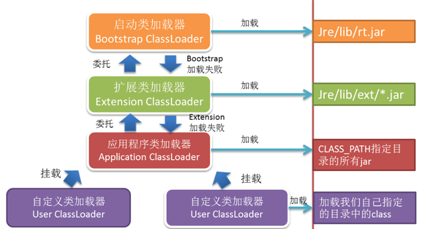


源码解析:

``` java

//运行我们写的Demo01_ClassLoader类进入源码
public class Launcher {
  
  static class AppClassLoader extends URLClassLoader {
    	 
    	 public Class<?> loadClass(String var1, boolean var2) throws ClassNotFoundException {
           		/*
                  class AppClassLoader extends URLClassLoader
                  class ExtClassLoader extends URLClassLoader
                  class URLClassLoader extends SecureClassLoader
                  class SecureClassLoader extends ClassLoader
                  
                  此时调用的是ClassLoader类的loadClass方法
           		*/
                return super.loadClass(var1, var2);
            }
        }
  }
  
}
public abstract class ClassLoader {
  
  	protected Class<?> loadClass(String name, boolean resolve)
        throws ClassNotFoundException
    {
        synchronized (getClassLoadingLock(name)) {
          
          	//第一次 使用AppClassLoader查看是否加载过这个类  没加载过 返回null值
           // 第二次 使用ExtClassLoader查询是否加载过这个类 加载过 返回null值
            Class<?> c = findLoadedClass(name);
          	//c为null
            if (c == null) {
                long t0 = System.nanoTime();
                try {
                  	//判断父加载器是否为null  第一次时父加载器是ext不为null
                    //第二次 ExtClassLoader的父加载器是引导类加载器 为nulll
                    if (parent != null) {
                        //使用ExtClassLoader重新调用loadClass方法 
                        c = parent.loadClass(name, false);
                    } else {
                        //使用根类加载器加载这个类 加载不了 返回null
                        c = findBootstrapClassOrNull(name);
                    }
                } catch (ClassNotFoundException e) {
                    // ClassNotFoundException thrown if class not found
                    // from the non-null parent class loader
                }
			   //c为null
                if (c == null) {
                    // If still not found, then invoke findClass in order
                    // to find the class.
                    long t1 = System.nanoTime();
                    //此时ExtClassLoader调用findClass方法
                    //ExtClassLoader中没有findClass方法 用的是父类URLClassLoader的findClass方法
                    c = findClass(name);

                    // this is the defining class loader; record the stats
                    sun.misc.PerfCounter.getParentDelegationTime().addTime(t1 - t0);
                    sun.misc.PerfCounter.getFindClassTime().addElapsedTimeFrom(t1);
                    sun.misc.PerfCounter.getFindClasses().increment();
                }
            }
            if (resolve) {
                resolveClass(c);
            }
            return c;
        }
    }
}

public class URLClassLoader extends SecureClassLoader implements Closeable {
  	 protected Class<?> findClass(final String name){
          final Class<?> result;
          try {
              result = AccessController.doPrivileged(
                  new PrivilegedExceptionAction<Class<?>>() {
                      public Class<?> run() throws ClassNotFoundException {
                          // 获取当前类的路径 classloader/load/Demo01_ClassLoader.class
                          String path = name.replace('.', '/').concat(".class");
                        //通过路径 去查找对应的类资源 由于第一次是使用ExtClassLoader 查找不到返回null
                        //第二次使用appClassLoader 查找到 
                          Resource res = ucp.getResource(path, false);
                          if (res != null) {
                              try {
                                  //加载类
                                  return defineClass(name, res);
                              } catch (IOException e) {
                                  throw new ClassNotFoundException(name, e);
                              }
                          } else {
                              return null;
                          }
                      }
                  }, acc);
          } catch (java.security.PrivilegedActionException pae) {
              throw (ClassNotFoundException) pae.getException();
          }
          if (result == null) {
              throw new ClassNotFoundException(name);
          }
          return result;
    }
}
```

**双亲委派机制的好处:**

- 沙箱安全机制：自己写的java.lang.String.class类不会被加载，这样便可以防止核心 API库被随意篡
- 避免类的重复加载：当父亲已经加载了该类时，就没有必要子ClassLoader再加载一 次，保证被加载类的唯一性

```java
package java.lang;

public class String {
    public static void main(String[] args) {
        System.out.println("my String class");
    }
}
```

运行结果:

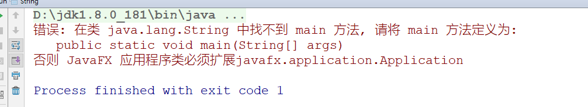

这个结果是因为java加载的并不是我们写的java.lang.String,而是加载的原来的String,因为引导类已经加载过java.lang.String,由于双亲委托机制我们写的String不会被加载,而根类加载器加载的String中没有main方法.所以抛出这个异常.这样避免了有人使用自己写的类替换java的核心类.

**全盘负责委托机制**

“**全盘 负责 ”是 指当一个**ClassLoder装载一 个类 时，除 非显示的 使用另外 一个ClassLoder，该类 所依赖 及引 用的 类也由这 个ClassLoder载入 。比如我们Demo01_ClassLoader类中 使用了Person类,那么在AppClassLoader加载Demo01_ClassLoader这个类的同时也会加载Person.class.

## 1.4 自定义类加载器

自定义类加载器只需要继承 java.lang.ClassLoader 类，该类有两个核心方法，一个是 loadClass(String, boolean)，实现了**双亲委派机制**，还有一 个方法是 findClass， 默认实现是空的,所以我们自定义类加载器主要是**重写**findClass方法.

```java
//定义自己的类加载器继承ClassLoader
public class MyClassLoader extends ClassLoader {

    private String classPath;


    public MyClassLoader(String classPath){
        this.classPath = classPath;
    }

    //读取指定位置的class文件 并将其转换为字节数组
    public byte[] getBytes(String path){
        try {
            InputStream in = new FileInputStream(path);
            //获取class文件中数据的长度  这个方法只有获取本地文件才可以使用 网络中会有问题
            int len = in.available();

            byte[] bytes = new byte[len];
            //将数组读取到字节数组中
            in.read(bytes);
            in.close();

            return bytes;


        } catch (IOException e) {
            throw  new RuntimeException("获取类的字节数组失败:"+e);
        }

    }
    @Override
    protected Class<?> findClass(String name) throws ClassNotFoundException {

        // classloader/load/Person1.class
        String path = name.replace(".", "/").concat(".class");
        // 获取字节数组
        byte[] bytes = getBytes(classPath+"/"+path);
        //调用方法对类进行加载 返回class
        return defineClass(name, bytes, 0, bytes.length);
    }

    public static void main(String[] args) throws ClassNotFoundException, NoSuchMethodException, IllegalAccessException, InstantiationException, InvocationTargetException {
        //创建字节的类加载器对象 并指定加载的位置
        ClassLoader l = new MyClassLoader("d:\\test");
        Class<?> c = l.loadClass("classloader.load.Person1");

        //反射调用其toString方法
        Method m = c.getMethod("toString");
        Object s = m.invoke(c.newInstance());
        System.out.println(s);

        //获取当前的类 类加载器
        ClassLoader classLoader = c.getClassLoader();
        System.out.println(classLoader);
    }
}
```

当测试的时候大家一定要注意,这个Person1的class文件在idea中一定要删除,也就是out目录下不能有对应的这个Person1.class,否则根据类的双亲委托机制,我们定义的类加载器的父加载器是AppClassLoader,在其加载范围内有对应的class文件,AppClassLoader就会直接加载.


所以我们应该让其加载范围内没有对应的class文件,而将这个class文件放在我们自定义的类加载器的加载路径中

注意:类带包名需要创建对应的文件夹.


这样就是我们自己的类加载器加载Person1.class文件了.

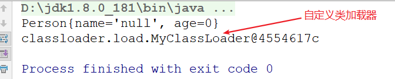

OK!由此可见自定义类加载器只要重写findClass方法就可以了,这样我们就可以按照自己的逻辑来加载类,比如有些类的逻辑不想让别人看到,我们可以对其进行加密,这样即使使用反编译工具也无法反编译,然后通过自己写的类加载器对其进行解密加载.

```java
/*
	将idea下编译后的person1.class读取
	然后写到硬盘上 写的时候将里面的每个字节都 与0xFF进行 ^ 运算
	
*/
public class ClassChange {
    
    public static void main(String[] args) throws IOException {
        String src = "D:\\IdeaProjects\\optimization\\out\\production\\jvm\\classloader\\load\\Person1.class";
        String dest = "d:\\test\\classLoader\\load\\Person1.class";
        InputStream in = new BufferedInputStream(new FileInputStream(src));
        OutputStream out =new BufferedOutputStream(new FileOutputStream(dest));
        changeFile(in,out);

        in.close();
        out.close();

    }
	//这个方法既可以加密 也可以解密  0^1 = 1    1^1 = 0   0xFF=0b1111 1111
    public static void changeFile(InputStream in, OutputStream out) throws IOException {

        int len = 0;
        while((len = in.read())!=-1){
            out.write(len ^ 0xFF);
        }


    }

}
```

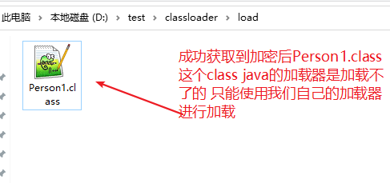

接下来我们来修改自定义类加载器的逻辑

```java
/*
	其他代码都不需要改动 唯一需要改动一下 getBytes方法 
	读取数据后 将读取到的数据 ^0xFF 进行解密
	然后将读取的数据转换为byte数组

*/
public class MyClassLoader extends ClassLoader {

    private String classPath;


    public MyClassLoader(String classPath){
        this.classPath = classPath;
    }

    //读取指定位置的class文件 并将其转换为字节数组
    public byte[] getBytes(String path){
        try {
            InputStream in = new FileInputStream(path);
            ByteArrayOutputStream out = new ByteArrayOutputStream();

            //调用方法进行解密
            ClassChange.changeFile(in,out);

            //将读取到的数据转换为字节数组
            byte[] bytes = out.toByteArray();
            in.close();
            out.close();

            return bytes;


        } catch (IOException e) {
            throw  new RuntimeException("获取类的字节数组失败:"+e);
        }

    }
    @Override
    protected Class<?> findClass(String name) throws ClassNotFoundException {

        // classloader/load/Person1.myclass
      
        String path = name.replace(".", "/").concat(".myclass");
        // 获取字节数组
        byte[] bytes = getBytes(classPath+"/"+path);
        return defineClass(name, bytes, 0, bytes.length);
    }

    public static void main(String[] args) throws ClassNotFoundException, NoSuchMethodException, IllegalAccessException, InstantiationException, InvocationTargetException {
        //创建字节的类加载器对象 并指定加载的位置
        ClassLoader l = new MyClassLoader("d:\\test");
        Class<?> c = l.loadClass("classloader.load.Person1");

        //反射调用其toString方法
        Method m = c.getMethod("toString");
        Object s = m.invoke(c.newInstance());
        System.out.println(s);

        //获取当前的类加载器
        ClassLoader classLoader = c.getClassLoader();
        System.out.println(classLoader);
    }
}

```

OK!接下来我们将idea目录下的Person1.class文件替换成加密后的Person1.class文件,运行代码,由于双亲委托机制,此时AppClassLoader会在自己的目录下找到这个类,尝试加载!

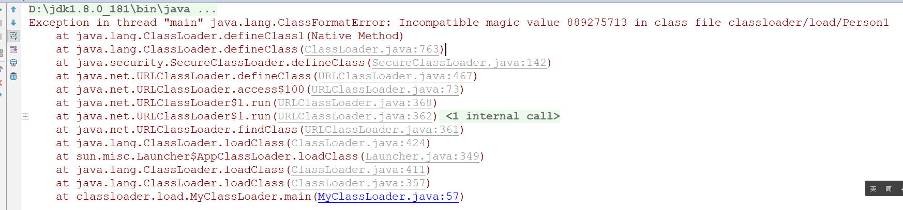

哈哈!报错了,它说类的格式化错误,删掉idea目录下的Person1.class文件 ,让我们的类加载器去加载这个类!

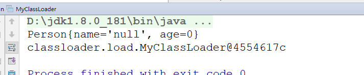

OK!使用自定义的类加载器加载成功!通过自定义加载器加载了一个加密的class文件.但是我们要知道一般情况下不可能真的只是单独加载一个类,通常都是加载jar包中的一个类.那么如何使用自定义类加载器加载jar包中的类呢?那么接下来我们来自定义一个加载jar包中类的类加载器.

首先新创建一个moudle名字为mytest,创建包classLoader.load和我们之前的包名保持一致,然后创建一个Person1类.

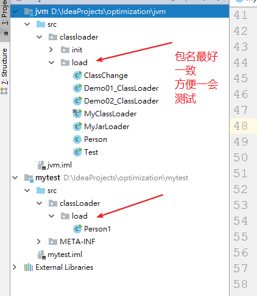

```java
public class Person1 {

  // 需要定义一个main方法 要不idea生成的jar包可能有问题
    public static void main(String[] args) {

    }
    private String name;
    private int age;

    public Person1() {
    }

	//get/set

    @Override
    public String toString() {
      System.out.println("版本1 Person");
        return "Person{" +
                "name='" + name + '\'' +
                ", age=" + age +
                '}';
    }
}

```

接下来将mytest打成jar包!

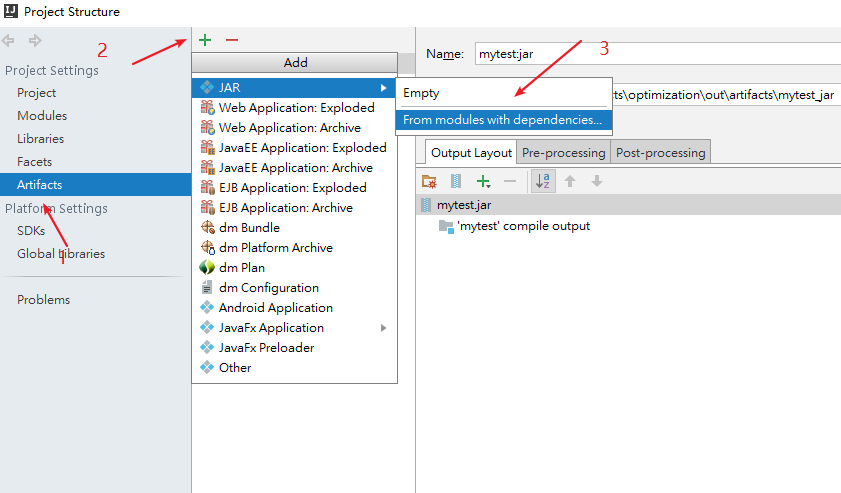

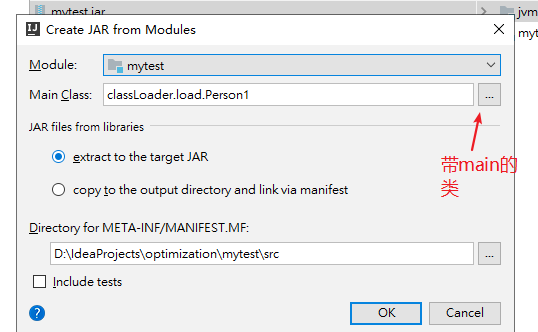

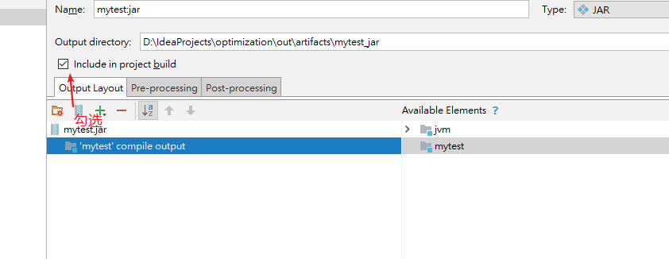

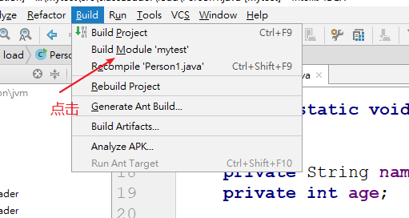

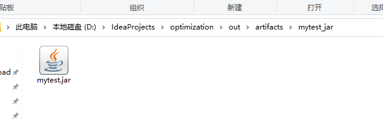

生成jar包后我们将生成的jar包放入到刚才的D:\\test目录下

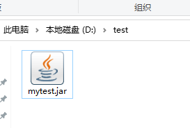

接下来定义一个从jar包中读取class文件的自定义类加载器

```java
public class MyJarLoader extends ClassLoader {
    private String jarFile;


    public MyJarLoader(String jarFile){
        this.jarFile = jarFile;
    }


    @Override
    protected Class<?> findClass(String name) throws ClassNotFoundException {

        //获取要加载类的路径
        String path = name.replace(".", "/").concat(".class");
        try {
            //创建Url对象 指定要加载的类路径
            URL url = new URL("jar:file:\\"+this.jarFile+"!/"+path);
            //通过url对象获取一个字节输入流
            InputStream in = url.openStream();
            ByteArrayOutputStream out = new ByteArrayOutputStream();

            //这里没有加密
            int len = 0;
            while((len = in.read())!=-1){
                out.write(len);
            }

            byte[] bytes = out.toByteArray();

            in.close();
            out.close();


            return defineClass(name, bytes, 0, bytes.length);

        } catch (Exception e) {
            throw new RuntimeException(e);

        }


    }

    public static void main(String[] args) throws ClassNotFoundException, NoSuchMethodException, IllegalAccessException, InstantiationException, InvocationTargetException, InterruptedException {
        //创建自定义加载器对象 加载指定的jar包
        ClassLoader l = new MyJarLoader("d:\\test\\mytest.jar");
        //使用类加载器指定要加载的类
        Class<?> c = l.loadClass("classLoader.load.Person1");


        //使用死循环模拟web程序 一直运行不停止
        while(true){
            //反射调用其toString方法
            Method m = c.getMethod("toString");
            Object s = m.invoke(c.newInstance());
            System.out.println(s);

            //获取当前的类加载器
            ClassLoader classLoader = c.getClassLoader();
            System.out.println(classLoader);
          // 睡眠5秒
            Thread.sleep(5000);
            }
        }
        
}
```

运行结果

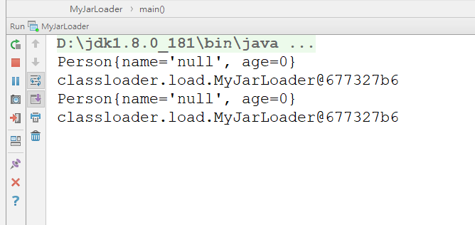

这样我们就加载了jar包中的指定的class文件.我们都知道服务器上的程序是一直不停的,所以这里使用循环来模拟了服务器程序一直不停.那么我们都知道有一种加载方式叫做**热加载**,当我修改了类中的文件,程序不停的基础上重新加载这个文件.我们现在的程序能达到这个效果吗?Ok!我们来验证一下!

首先将mytest中的Person1文件的toString方法进行一次修改.

```java
public class Person1 {

    public static void main(String[] args) {

    }
    private String name;
    private int age;

    public Person1() {
    }

    public String getName() {
        return name;
    }

    public void setName(String name) {
        this.name = name;
    }

    public int getAge() {
        return age;
    }

    public void setAge(int age) {
        this.age = age;
    }
    @Override
    public String toString() {
      //将原来的版本1 改为版本2  然后重新打成jar包
      System.out.println("版本2 Person");
        return "Person{" +
                "name='" + name + '\'' +
                ", age=" + age +
                '}';
    }
}
```

将修改后的Person1.class重新打成jar包,将打成后的jar包与正在运行程序的mytest.jar进行替换,运行效果如下:

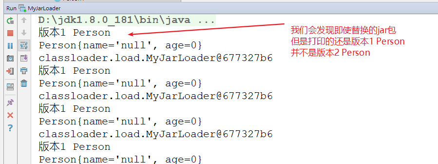

但是当我们关闭程序重启后,运行的就是替换后的jar包的内容!

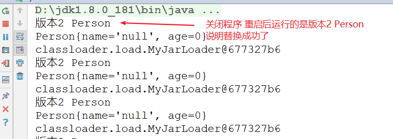

那么也就是说明,我们的类加载器并不能实现热加载,那如何才能让自定义的类加载器实现热加载呢?为什么我们明明替换了jar包,它并没有重新加载我们替换后的jar包呢,其实这里主要是加载的缓存问题!我们之前看过类加载器的loadClass方法.

```java
protected Class<?> loadClass(String name, boolean resolve)
        throws ClassNotFoundException
    {
        synchronized (getClassLoadingLock(name)) {
            // First, check if the class has already been loaded
            
            //这行代码代表 从缓存中查找对应name的class文件 
            //我们第一次加载的类的时候 这个方法返回的是null值,因为是第一次加载
            //当我们加载完一个类之后,再调用这个方法时 就会从缓存中去找,返回的不是null值
            //那么此时 c!=null 就不会执行我们重写后的findClass方法
            Class<?> c = findLoadedClass(name);
            if (c == null) {
                long t0 = System.nanoTime();
                try {
                    if (parent != null) {
                        c = parent.loadClass(name, false);
                    } else {
                        c = findBootstrapClassOrNull(name);
                    }
                } catch (ClassNotFoundException e) {
                    // ClassNotFoundException thrown if class not found
                    // from the non-null parent class loader
                }

                if (c == null) {
                    // If still not found, then invoke findClass in order
                    // to find the class.
                    long t1 = System.nanoTime();
                    c = findClass(name);

                    // this is the defining class loader; record the stats
                    sun.misc.PerfCounter.getParentDelegationTime().addTime(t1 - t0);
                    sun.misc.PerfCounter.getFindClassTime().addElapsedTimeFrom(t1);
                    sun.misc.PerfCounter.getFindClasses().increment();
                }
            }
            if (resolve) {
                resolveClass(c);
            }
            return c;
        }
    }
```

通过查看源码,发现是因为一个类加载一次之后,下次使用的时候就不会再次加载了,我们虽然更换了jar包,更换了对应的class文件 ,但是由于已经是加载过的类,使用时直接从缓冲中找,而不会重新加载我们替换后的jar中的类,这样虽然替换的jar包但是没有作用,那么如何才能实现热加载呢?只要每次使用时,重新加载类,不走缓存就解决了问题.其实非常简单也就是每次重新创建一个类加载器去加载对应的类,这样每次都是新的类加载器,就不会有缓存的问题了!

```java
package classloader.load;

import sun.misc.Launcher;

import java.io.ByteArrayOutputStream;
import java.io.InputStream;
import java.lang.reflect.InvocationTargetException;
import java.lang.reflect.Method;
import java.net.URL;

@SuppressWarnings("all")
public class MyJarLoader extends ClassLoader {
    private String jarFile;


    public MyJarLoader(String jarFile){
        this.jarFile = jarFile;
    }


    @Override
    protected Class<?> findClass(String name) throws ClassNotFoundException {

        //获取要加载类的路径
        String path = name.replace(".", "/").concat(".class");
        try {
            //创建Url对象 指定要加载的类路径
            URL url = new URL("jar:file:\\"+this.jarFile+"!/"+path);
            //通过url对象获取一个字节输入流
            InputStream in = url.openStream();
            ByteArrayOutputStream out = new ByteArrayOutputStream();

            //这里没有加密
            int len = 0;
            while((len = in.read())!=-1){
                out.write(len);
            }

            byte[] bytes = out.toByteArray();

            in.close();
            out.close();


            return defineClass(name, bytes, 0, bytes.length);

        } catch (Exception e) {
            throw new RuntimeException(e);

        }


    }

    public static void main(String[] args) throws ClassNotFoundException, NoSuchMethodException, IllegalAccessException, InstantiationException, InvocationTargetException, InterruptedException {

        while(true){
            //创建自定义加载器对象 加载指定的jar包 将创建类加载器的代码放入到循环中
            //每次循环都会重新创建类的加载器,这样就不会有缓存的问题了 每次加载类都会重新加载
            ClassLoader l = new MyJarLoader("d:\\test\\mytest.jar");
            //使用类加载器指定要加载的类
            Class<?> c = l.loadClass("classLoader.load.Person1");
            //反射调用其toString方法
            Method m = c.getMethod("toString");
            Object s = m.invoke(c.newInstance());
            System.out.println(s);

            //获取当前的类加载器
            ClassLoader classLoader = c.getClassLoader();
            System.out.println(classLoader);
            Thread.sleep(5000);
            }
        }

}

```

重复之前的动作,查看效果!

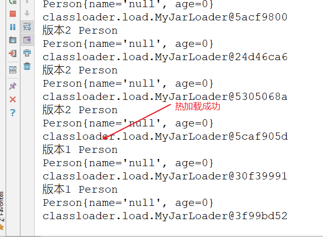

虽然热加载成功了,但是这里面有一点小问题,当我们Thread.sleep时间比较短时,可能会出现异常,加载不成功因为加载类也需要时间,有可能还没有加载完就返回 可能读取到的class文件是不完全的就会抛出异常.

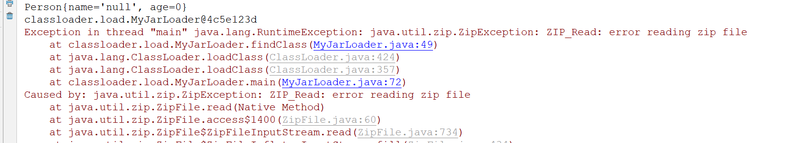

此时我们可以对代码进行简单的修改,让其不再抛出运行时异常,让代码不中断!

```java
public class MyJarLoader extends ClassLoader {
    private String jarFile;


    public MyJarLoader(String jarFile){
        this.jarFile = jarFile;
    }


    @Override
    protected Class<?> findClass(String name) throws ClassNotFoundException {

        //获取要加载类的路径
        String path = name.replace(".", "/").concat(".class");
        try {
            //创建Url对象 指定要加载的类路径
            URL url = new URL("jar:file:\\"+this.jarFile+"!/"+path);
            //通过url对象获取一个字节输入流
            InputStream in = url.openStream();
            ByteArrayOutputStream out = new ByteArrayOutputStream();

            //这里没有加密
            int len = 0;
            while((len = in.read())!=-1){
                out.write(len);
            }

            byte[] bytes = out.toByteArray();

            in.close();
            out.close();


            return defineClass(name, bytes, 0, bytes.length);

        } catch (Exception e) {
            //不要抛出运行时异常 因为可能会读取一般 出现异常 如果这里抛出运行时异常代码就停了
//            throw new RuntimeException(e);

            //这里可以给予提示
            System.out.println("class正在加载,下次生效!");


        }

        return null;

    }

    public static void main(String[] args) throws ClassNotFoundException, NoSuchMethodException, IllegalAccessException, InstantiationException, InvocationTargetException, InterruptedException {


        while(true){
            //创建自定义加载器对象 加载指定的jar包 将创建类加载器的代码放入到循环中
            //每次循环都会重新创建类的加载器,这样就不会有缓存的问题了 每次加载类都会重新加载
            ClassLoader l = new MyJarLoader("d:\\test\\mytest.jar");
            //使用类加载器指定要加载的类
            Class<?> c = l.loadClass("classLoader.load.Person1");
            //如果c为null说明当前次循环没有加载成功 尝试下一次循环加载
            //c不为null才说明加载成功
            if(c !=null){
                //反射调用其toString方法
                Method m = c.getMethod("toString");
                Object s = m.invoke(c.newInstance());
                System.out.println(s);

                //获取当前的类加载器
                ClassLoader classLoader = c.getClassLoader();
                System.out.println(classLoader);
//            Thread.sleep(0);
            }
            }
        }

}

```

这样我们就实现了热加载功能!热加载功能虽然方便,可以不需要重启就加载新的jar包,但是热加载功能也有很多弊端,比如我们刚才出现的问题,没有全部加载完就开始执行,抛出异常,再者每次都重新创建类加载器对象,不走缓存也会在内存中产生大量的垃圾,所以热加载功能使用的地方并不多,我们这里只是了解这种功能的机制.

## 1.5 Tomcat打破双亲委托机制

以Tomcat类加载为例，**Tomcat 如果使用默认的双亲委派类加载机制行不行**？ 

我们思考一下：Tomcat是个web容器， 那么它要解决什么问题： 

1. 一个web容器可能需要部署两个应用程序，不同的应用程序可能会依赖同一个第三方类库的 

不同版本，不能要求同一个类库在同一个服务器只有一份，因此要保证每个应用程序的类库都是 

独立的，保证相互隔离。 

2. 部署在同一个web容器中相同的类库相同的版本可以共享。否则，如果服务器有10个应用程 

序，那么要有10份相同的类库加载进虚拟机。 

3. web容器也有自己依赖的类库，不能与应用程序的类库混淆。基于安全考虑，应该让容器的 

类库和程序的类库隔离开来。 

4. web容器要支持jsp的修改，我们知道，jsp 文件最终也是要编译成class文件才能在虚拟机中 

运行，但程序运行后修改jsp已经是司空见惯的事情， web容器需要支持 jsp 修改后不用重启。

**那么Tomcat能够使用默认的双亲委托机制吗?** **当然不能!**

第一个问题，如果使用默认的类加载器机制，那么是无法加载两个相同类库的不同版本的，默认 

的类加器是不管你是什么版本的，只在乎你的全限定类名，并且只有一份。 

第二个问题，默认的类加载器是能够实现的，因为他的职责就是保证唯一性。 

第三个问题和第一个问题一样。 

我们再看第四个问题，我们想我们要怎么实现jsp文件的热加载，jsp 文件其实也就是class文 

件，那么如果修改了，但类名还是一样，类加载器会直接取方法区中已经存在的，修改后的jsp 

是不会重新加载的。那么怎么办呢？我们可以直接卸载掉这jsp文件的类加载器，所以你应该想 

到了，每个jsp文件对应一个唯一的类加载器，当一个jsp文件修改了，就直接卸载这个jsp类加载 

器。重新创建类加载器，重新加载jsp文件。

**Tomcat类加载器结构如图**

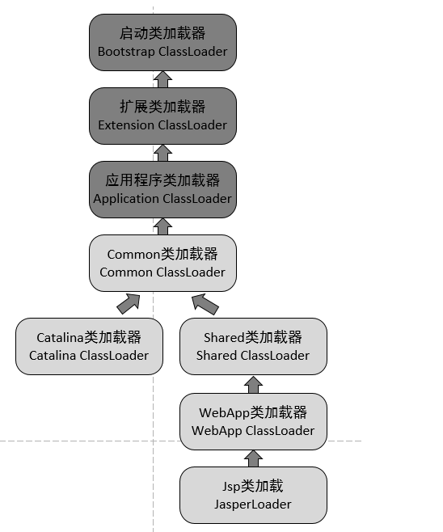


tomcat的几个主要类加载器： 

**commonLoader：**Tomcat最基本的类加载器，加载路径中的class可以被Tomcat容器本身以及各个Webapp访问； 

**catalinaLoader：**Tomcat容器私有的类加载器，加载路径中的class对于Webapp不可见；

**sharedLoader：**各个Webapp共享的类加载器,加载路径中的class对于所有Webapp可见，但是对于Tomcat容器不可见； 

**WebappClassLoader：**各个Webapp私有的类加载器，加载路径中的class只对当前Webapp可见，比如加载war包里相关的类，每个war包应用都有自己的WebappClassLoader，实现相互隔离，比如不同war包应用引入了不同的spring版本， 这样实现就能加载各自的spring版本； 

由此可见,每个webappClassLoader加载自己应用,会实现多个版本共同存在,此时不会传递给父加载器,打破了双亲委托机制.那么我们能不能模拟webappClassLoader实现这种多版本共存的情况呢?当然可以,之前通过查看源码我们知道,类的双亲委托核心的逻辑就在loadClass方法中,只要我们重新对loadClass方法进行重写就可以打破双亲委托机制,并按照自己的逻辑来进行类的加载!

```java
package classloader.load;

import java.io.ByteArrayOutputStream;
import java.io.InputStream;
import java.lang.reflect.InvocationTargetException;
import java.lang.reflect.Method;
import java.net.URL;

@SuppressWarnings("all")
public class MyJarLoaderBreakParent extends ClassLoader {
    private String jarFile;


    public MyJarLoaderBreakParent(String jarFile) {
        this.jarFile = jarFile;
    }


    protected Class<?> loadClass(String name, boolean resolve)
            throws ClassNotFoundException {
        synchronized (getClassLoadingLock(name)) {
            // First, check if the class has already been loaded

            Class<?> c = findLoadedClass(name);

            if (c == null) {

                long t1 = System.nanoTime();
                if (name.startsWith("classloader.load")) {
                    c = findClass(name);
                } else {
                    c = this.getParent().loadClass(name);
                }

                // this is the defining class loader; record the stats
//                    sun.misc.PerfCounter.getParentDelegationTime().addTime(t1 - t0);
                sun.misc.PerfCounter.getFindClassTime().addElapsedTimeFrom(t1);
                sun.misc.PerfCounter.getFindClasses().increment();

            }
            if (resolve) {
                resolveClass(c);
            }
            return c;
        }
    }


    @Override
    protected Class<?> findClass(String name) throws ClassNotFoundException {

        //获取要加载类的路径
        String path = name.replace(".", "/").concat(".class");
        try {
            //创建Url对象 指定要加载的类路径
            URL url = new URL("jar:file:\\" + this.jarFile + "!/" + path);
            //通过url对象获取一个字节输入流
            InputStream in = url.openStream();
            ByteArrayOutputStream out = new ByteArrayOutputStream();

            //这里没有加密
            int len = 0;
            while ((len = in.read()) != -1) {
                out.write(len);
            }

            byte[] bytes = out.toByteArray();

            in.close();
            out.close();


            return defineClass(name, bytes, 0, bytes.length);

        } catch (Exception e) {
            //不要抛出运行时异常 因为可能会读取一般 出现异常 如果这里抛出运行时异常代码就停了
//            throw new RuntimeException(e);

            //这里可以给予提示
            System.out.println("class正在加载,下次生效!");


        }

        return null;

    }

    public static void main(String[] args) throws ClassNotFoundException, NoSuchMethodException, IllegalAccessException, InstantiationException, InvocationTargetException, InterruptedException {

        while (true) {

            ClassLoader l = new MyJarLoaderBreakParent("d:\\test\\mytest.jar");

            Class<?> c = l.loadClass("classloader.load.Person1");

            if (c != null) {
                //反射调用其toString方法
                Method m = c.getMethod("toString");
                Object s = m.invoke(c.newInstance());
                System.out.println(s);

                //获取当前的类加载器
                ClassLoader classLoader = c.getClassLoader();
                System.out.println(classLoader);

            }


            ClassLoader l2 = new MyJarLoaderBreakParent("d:\\test2\\mytest.jar");
            Class<?> c2 = l2.loadClass("classloader.load.Person1");

            if (c2 != null) {
                //反射调用其toString方法
                Method m = c2.getMethod("toString");
                Object s = m.invoke(c2.newInstance());
                System.out.println(s);

                //获取当前的类加载器
                ClassLoader classLoader = c2.getClassLoader();
                System.out.println(classLoader);
//
            }


            //创建字节的类加载器对象 并指定加载的位置
            ClassLoader l3 = new MyClassLoader("d:\\test");
            Class<?> c3 = l3.loadClass("classloader.load.Person1");

            //反射调用其toString方法
            Method m = c3.getMethod("toString");
            Object s = m.invoke(c3.newInstance());
            System.out.println(s);

            //获取当前的类加载器
            ClassLoader classLoader = c3.getClassLoader();
            System.out.println(classLoader);

            Thread.sleep(5000);

        }
    }

}

```


