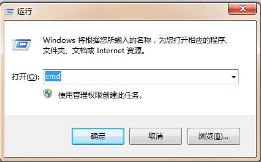
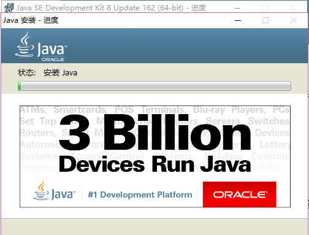

# 第一天 	HelloWorld&常量

## 今日内容 

- Java语言的发展历史
- Java开发环境搭建
- 编写HelloWorld程序
- 注释、关键字、标识符
- 数据类型、常量

# 第一章  开发前言

## 1.1 Java语言概述

### 什么是Java语言

Java语言是美国Sun公司（Stanford University Network），在1995年推出的高级的编程语言。所谓编程语言，是计算机的语言，人们可以使用编程语言对计算机下达命令，让计算机完成人们需要的功能。

### Java语言发展历史 

- 1995年Sun公司发布Java1.0版本
- 1997年发布Java 1.1版本
- 1998年发布Java 1.2版本
- 2000年发布Java 1.3版本
- 2002年发布Java 1.4版本
- 2004年发布Java 1.5版本
- 2006年发布Java 1.6版本
- 2009年Oracle甲骨文公司收购Sun公司，并于2011发布Java 1.7版本
- 2014年发布Java 1.8版本
- 2017年发布Java 9.0版本
- 2018年3月发布Java 10.0版本,9月发布11.0版本
- 2019年3月发布java 12.0版本,9月分布13.0版本
- 2020年3月发布java 14.0版本

### Java语言能做什么

Java语言主要应用在互联网程序的开发领域。常见的互联网程序比如天猫、京东、物流系统、网银系统等，以及服务器后台处理大数据的存储、查询、数据挖掘等也有很多应用。


## 1.2 计算机基础知识

### **通用快捷键**

通用快捷键适用于广泛的环境，在例如Windows的操作系统以及绝大部分的软件中都适用。需要熟练这些

Ctrl+C     复制选中内容

Ctrl+V     粘贴 

Ctrl+X     剪切

Ctrl+A     全选

Ctrl+Z     撤销操作

Ctrl+Y     恢复操作

Ctrl+S	保存

### 常用DOS命令

Java语言的初学者，学习一些DOS命令，会非常有帮助。DOS是一个早期的操作系统，现在已经被Windows系统取代，对于我们开发人员，目前需要在DOS中完成一些事情，因此就需要掌握一些必要的命令。

- **进入DOS操作窗口**

  - 按下Windows+R键盘，打开运行窗口，输入cmd回车，进入到DOS的操作窗口。

    

  - 打开DOS命令行后，看到一个路径 c:\user  就表示我们现在操作的磁盘是c盘。


- **常用命令**

  | 命令       | 操作符号      |
  | -------- | --------- |
  | 盘符切换命令   | `盘符名:`    |
  | 查看当前文件夹  | ` dir`    |
  | 进入文件夹命令  | `cd 文件夹名` |
  | 退出文件夹命令  | `cd..`    |
  | 退出到磁盘根目录 | `cd\`     |
  | 清屏       | `cls`     |

# 第二章  Java语言开发环境搭建

## 2.1 Java虚拟机——JVM

- **JVM**（Java Virtual Machine ）：Java虚拟机，简称JVM，是运行所有Java程序的假想计算机，是Java程序的运行环境，是Java 最具吸引力的特性之一。我们编写的Java代码，都运行在`JVM` 之上。


- **跨平台**：任何软件的运行，都必须要运行在操作系统之上，而我们用Java编写的软件可以运行在任何的操作系统上，这个特性称为**Java语言的跨平台特性**。该特性是由JVM实现的，我们编写的程序运行在JVM上，而JVM运行在操作系统上。

如图所示，Java的虚拟机本身不具备跨平台功能的，每个操作系统下都有不同版本的虚拟机。

## 2.2 JRE 和 JDK

- **JRE ** (Java Runtime Environment) ：是Java程序的运行时环境，包含`JVM` 和运行时所需要的`核心类库` 。
- **JDK**  (Java Development Kit)：是Java程序开发工具包，包含`JRE` 和开发人员使用的工具。

我们想要运行一个已有的Java程序，那么只需安装`JRE` 即可。

我们想要开发一个全新的Java程序，那么必须安装`JDK` 。 类库


> 小贴士：
>
> 三者关系： JDK > JRE > JVM

## 2.3 JDK8安装图解





> 小贴士：
>
> 安装路径中，不要包含中文和空格。

## 2.4 JAVA_HOME环境变量的配置

### **配置环境变量作用**

开发Java程序，需要使用JDK中提供的工具，工具在JDK8安装目录的`bin` 目录下。


在DOS命令行下使用这些工具，就要先进入到JDK的bin目录下，这个过程就会非常的麻烦。


不进入JDK的`bin`目录，这些工具就不能使用，会报错。


为了开发方便，我们想**在任意的目录下都可以使用JDK的开发工具**，则必须要配置环境变量，配置环境变量的意义在于告诉操作系统，我们使用的JDK开发工具在哪个目录下。

### 配置环境变量步骤

#### Windows 7,8版本

1. 计算机鼠标右键,选择`属性 ` 


1. 选择`高级系统设置` 


1. `高级` 选项卡，点击`环境变量` 


1. 点击`新建` ，创建新的环境变量


1. 变量名输入`JAVA_HOME`，变量值输入JDK8的安装目录 `D:\02_DevelopTools\Java\jdk1.8.0_162` 


1. 选中`Path` 环境变量，`双击`或者`点击编辑` 


> 小贴士:
>
> Path中`C:\ProgrammaData\Oracle\Java... `，该路径是安装后默认配置的路径，可以删除。

1. 在变量值的最前面，键入`%JAVA_HOME%\bin;`  分号必须要写，必须是英文格式。


1. 环境变量配置完成，重新开启DOS命令行，在任意目录下输入`javac` 命令，运行成功。


#### Windows 10 版本

1. 文件资源管理器 --> 此电脑鼠标右键 --> 选择`属性 ` 


1. 选择`高级系统设置`  --> 选择  `环境变量`


1. 点击下方系统变量的 `新建` ，创建新的环境变量，变量名输入`JAVA_HOME`，变量值输入JDK8的安装目录 `D:\02_DevelopTools\Java\jdk1.8.0_162` 


1. 选中`Path` 环境变量，`双击`或者`点击编辑`


1. 点击` 新建`，键入`%JAVA_HOME%\bin` ，必须是英文格式。选中该行，上移到最上方，点击确定。


1. 环境变量配置完成，重新开启DOS命令行，在任意目录下输入`javac` 命令。


# 第三章 HelloWorld入门程序

## 3.1 程序开发步骤说明

开发环境已经搭建完毕，可以开发我们第一个Java程序了。

Java程序开发三步骤：**编写**、**编译**、**运行**。


## 3.2 编写Java源程序

1. 在`d:\day01` 目录下新建文本文件，完整的文件名修改为`HelloWorld.java`，其中文件名为`HelloWorld`，后缀名必须为`.java` 。
2. 用记事本打开

> 使用notepad++记事本软件。

1. 在文件中键入文本并保存，代码如下：

```java
public class HelloWorld {
  	public static void main(String[] args) {
    	System.out.println("Hello World!");
  	}
}

```

> 文件名必须是`HelloWorld` ，保证文件名和类的名字是一致的，注意大小写。
>
> 每个字母和符号必须与示例代码一模一样。

第一个`HelloWord` 源程序就编写完成了，但是这个文件是程序员编写的，JVM是看不懂的，也就不能运行，因此我们必须将编写好的`Java源文件` 编译成JVM可以看懂的`字节码文件` 。

## 3.3 编译Java源文件

在DOS命令行中，**进入Java源文件的目录**，使用`javac` 命令进行编译。

命令：

```java
javac Java源文件名.后缀名
```

举例：

```
javac HelloWorld.java
```


编译成功后，命令行没有任何提示。打开`d:\day01`目录，发现产生了一个新的文件 `HelloWorld.class`，该文件就是编译后的文件，是Java的可运行文件，称为**字节码文件**，有了字节码文件，就可以运行程序了。 

> Java源文件的编译工具`javac.exe`，在JDK安装目录的bin目录下。但是由于配置了环境变量，可以再任意目录下使用。

## 3.4 运行Java程序

在DOS命令行中，**进入Java源文件的目录**，使用`java` 命令进行运行。

命令：

```java
java 类名字
```

举例：

```
java HelloWorld
```

> java HelloWord  不要写 不要写 不要写 .class


> Java程序`.class文件` 的运行工具`java.exe` ，在JDK安装目录的bin目录下。但是由于配置了环境变量，可以再任意目录下使用。

## 3.5 入门程序说明

### 编译和运行是两回事

- **编译**：是指将我们编写的Java源文件翻译成JVM认识的class文件，在这个过程中，`javac` 编译器会检查我们所写的程序是否有错误，有错误就会提示出来，如果没有错误就会编译成功。
- **运行**：是指将`class文件` 交给JVM去运行，此时JVM就会去执行我们编写的程序了。

### 关于main方法

- **main方法**：称为主方法。写法是**固定格式**不可以更改。main方法是程序的入口点或起始点，无论我们编写多少程序，JVM在运行的时候，都会从main方法这里开始执行。

## 3.6 添加注释comment

- 通常我们需要在源代码中添加文字用来对进行代码解释说明，但这些文字并不是Java代码的语法，会导致编译出错。这时我们可以使用注释来完成这一事项！

  在编译时，编译器会忽略注释的存在，就好像注释内容不存在一样。所以注释并不会导致编译出错，同时注释还方便编写者和其他人阅读源代码，加强对代码的理解。

  Java中提供了三种注释方式，分别是：

  l 单行注释    //

  l 多行注释    /* 内容 */

  l 文档注释   /**  内容 */

  　　其中文档注释与多行注释作用基本相同，唯一的区别是文档注释可以使用javadoc.exe命令生成API文档。在这里我们不对其进行讲解，等大家对API有一定了解后在学习文档注释生成API文档的相关知识！

  HelloWorld.java

  ```java
  /*
   * 实现步骤：
   * 1.定义一个类 class
   * 2.编写程序执行的入口方法，main主方法
   * 3.通过输出语句System.out.println()将信息”HelloWorld!”打印在控制台上
   */
  // 定义一个类 class
  public class HelloWorld {
  	// 编写程序执行的入口方法，main主方法
  	public static void main(String[] args) {
  		// 通过Java提供的输出语句, 将信息”HelloWorld!”打印在控制台上
  		System.out.println("HelloWorld!");
  	}
  }
  ```

  ​

## 3.7 关键字keywords

- **关键字**：是指在程序中，Java已经定义好的单词，具有特殊含义。
  - HelloWorld案例中，出现的关键字有 `public ` 、`class` 、 `static` 、  `void`  等，这些单词已经被Java定义好，全部都是小写字母，notepad++中颜色特殊。
  - 关键字比较多，不能死记硬背，学到哪里记到哪里即可。


## 3.8 标识符

- **标识符**：是指在程序中，我们自己定义内容。比如类的名字、方法的名字和变量的名字等等，都是标识符。
  - HelloWorld案例中，出现的标识符有类名字`HelloWorld` 。
- **命名规则：`硬性要求`**
  - 标识符可以包含`英文字母26个(区分大小写)`、`0-9数字` 、`$（美元符号）`和`_（下划线）`。
  - 标识符不能以数字开头。
  - 标识符不能是关键字。
- **命名规范：`软性建议`**
  - 类名规范：首字母大写，后面每个单词首字母大写（大驼峰式）。
  - 方法名规范： 首字母小写，后面每个单词首字母大写（小驼峰式）。
  - 变量名规范：首字母小写，后面每个单词首字母大写（小驼峰式）。

# 第四章 数据类型和常量

## 4.1数据类型

在生活中数据是有类型的，例如人的姓名是字符串类型，人的年龄是正整数类型。在Java中数据也是有类型的（任何数据必然会有类型），下面是Java中数据的类型：

Java的数据类型分为两大类

- **基本数据类型**：包括 `整数`、`浮点数`、`字符`、`布尔`。 
- **引用数据类型**：包括 `类`、`数组`、`接口`。 

基本数据类型是Java语言中内置的类型，分别是整数类型、小数类型、字符类型、布尔类型。这四类基本类型是最简单、最基础的类型。

引用数据类型是强大的数据类型，它是基于基本数据类型创建的。JavaSE中提供了一个超级类库，类库中包含了近万种引用数据类型。不过现在我们先要学习的是基本类型！

## 4.2 常量

Java中的数据量分为常量和变量，我们先来学习常量！

常量就是不变的数据量，例如100就是常量，任何数据量都有其类型，那么100这个常量是什么类型呢？回忆一下基本类型中有四类，分别是整数、小数（浮点数）、字符、布尔。那么100是哪一类型呢？没错，就是整数常量！！！

| 类型    | 含义                            | 数据举例                   |
| :---- | :---------------------------- | :--------------------- |
| 整数常量  | 所有的整数 0b代表二进制 0x代表16进制 0代表8进制 | 0，10，0b1011,0x23A2,07  |
| 小数常量  | 所有的小数                         | 0.0，  -0.1，  2.55      |
| 字符常量  | 单引号引起来,只能写一个字符,必须有内容          | 'a' ， ' '，  '好'        |
| 字符串常量 | 双引号引起来,可以写多个字符,也可以不写          | "A" ，"Hello" ，"你好" ，"" |
| 布尔常量  | 只有两个值（流程控制中讲解）                | true ，  false          |
| 空常量   | 只有一个值（引用数据类型中讲解）              | null                   |

回顾HelloWorld案例，其中System.out.println(“Hello World!”)的圆括号中放的就是一个字符串。那么我们是否可以把圆括号中的字符串换成其他字符串呢？答案是可以的！不只是可以换成其他字符串，还可以把圆括号中的字符串换成其他类型的常量，例如：

```java
/*
* 常量的演示
*/
public class Const {
	public static void main(String[] args) {
		//整数类型
//10进制
		System.out.println(100);
		System.out.println(12345);
		System.out.println( 10 );
		//2进制
		System.out.println( 0b1010 );
		//8进制
		System.out.println( 012 );
		//16进制
		System.out.println(0xA);
		//小数类型
		System.out.println(3.15);
		//字符类型
		System.out.println('a');
		System.out.println('A');
		System.out.println('0');
		System.out.println('家');
		//布尔类型
		System.out.println(true);
		System.out.println(false);
		//字符串类型
		System.out.println("我爱Java");
		System.out.println("0123");
	}
}
```

'a' ---->ASCII---->97----->2进制 存储

2进制---->97----->ASCII --- a


'1'  ---->ASCII ---->49 ---->2进制


## 课后练习

打印水果报价单


  通过完全是字符串的方式打印

​		System.out.println(“水果编号   水果名称    水果单价   计价单位  品质”) 

  通过区分数据类型的方式打印(可以使用+连接字符串和其他数据类型 )

​		System.out.println(“ ”+1+“榴莲”);			

​			