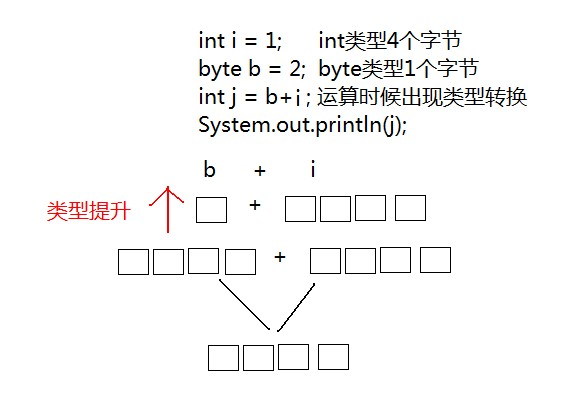
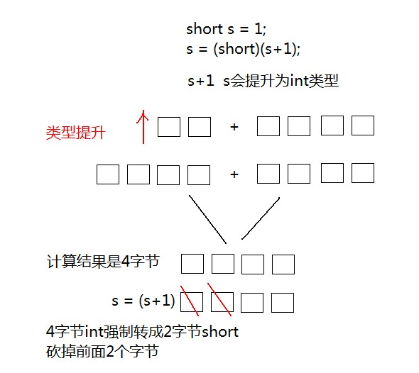

# day02 【变量、运算符】

## 今日内容

- 变量
- 数据类型转换
- 运算符

# 第一章 变量

## 1.1 变量概述

前面我们已经学习了常量，接下来我们要学习变量。在Java中变量的应用比常量的应用要多很多。所以变量也是尤为重要的知识点！

什么是变量？变量是一个内存中的小盒子（小容器），容器是什么？生活中也有很多容器，例如水杯是容器，用来装载水；你家里的大衣柜是容器，用来装载衣裤；饭盒是容器，用来装载饭菜。那么变量是装载什么的呢？答案是数据！**结论：变量是内存中装载数据的小盒子，你只能用它来存数据和取数据。****

## 1.2 **定义变量（创建变量）**

定义变量的语法格式：

```text
		数据类型  变量名  =  数据值；
		如：int     a    =  100;
```

**数据类型**    每一个变量均必须指定其变量类型。Java是强类型语言，在Java中不同的数据类型在内存中的存储方式是不尽相同的。所以必须在存储内容之前指定数据类型。

**变量名**      即使用标识符为变量起一个名字，之后在计算时，使用该名字即可参与计算。这个名字就代表了存储数值的空间。

**“=”号**       这里的“=”号是运算符的一种，即=代表赋值运算，并非数学意义上的相等。

**值**          即真正变量存储的数值，需要与变量的数据类型一致。

这里介绍四种最常用的数据类型：

**int整数**  

**double小数**  

**char 字符**

**String字符串**

## 1.3 **变量使用的注意事项**

我们使用变量的时候需要注意，要满足变量的使用规则才可以使用的，我们来看看都有哪些注意事项。

**变量定义后可以不赋值，使用时再赋值。不赋值不能使用**。

```java
public static void main(String[] args) {
	int x;
	x = 20; //为x赋值20
	System.out.println(x);//读取x变量中的值，再打印
}
```

**变量使用时有作用域的限制。**

```java
public static void main(String[] args) {
	int x = 20;
	{
    	int y = 20;
	}
	System.out.println(x);//读取x变量中的值，再打印
	System.out.println(y);//读取y变量中的值失败，失败原因，找不到y变量，因为超出了y变量作用范围，所以	  不能使用y变量
}
```
**变量不可以重复定义。**

```java
public static void main(String[] args){
      int x = 10;
      double x = 5.5;//编译失败，变量重复定义
}
```
## 1.4 **计算机的存储单元**

变量是内存中的小容器，用来存储数据。那么计算机内存是怎么存储数据的呢？无论是内存还是硬盘，计算机存储设备的**最小信息单元叫“位（bit）”**，我们又称之为“比特位”，通常用小写的字母b表示。而计算机基本的存储单元叫“字节（byte）”，通常用大写字母B表示，字节是由连续的8个位组成。

当程序需要使用存储空间时，操作系统最小会分派给程序1个字节，而不是1个位。你可能会说，如果程序只需要1个位的空间，系统分派不能只分派1个位吗？答案是不能！这就像你只需要1支烟，你到商店去买烟，商店分派的最小单元是1盒（20支），他不可能卖给你1支烟。

你可能会想，1个字节（8位）可以存储很大的数值了，1位最大是9那么8位最大值为99999999。你错了，因为计算机是采用二进行存储的，而不是我们生活中常用的十进制。所以1个字节存储的最大数据是11111111的二进制数。

除了字节外还有一些常用的存储单位，大家可能比较熟悉，我们一起来看看：

1B（字节） = 8bit

1KB = 1024B

1MB = 1024KB

1GB = 1024MB

1TB = 1024GB

1PB = 1024TB

## 1.4 基本类型之4类8种

大衣柜不能用来装载水，水杯也不能用来装载衣裤。这说明不同的容器装载不同的物品。变量也是如此，在创建变量时需要指定变量的数据类型，例如整型变量、浮点型变量等等。**结论：变量必须要有明确的类型，什么类型的变量装载什么类型的数据。**

Java中基本类型一共4类，把这4类展开后共8种基本类型。我们今后编写程序时使用的是这8种基本类型而不是4类，这8种基本类型指定了范围。

| 数据类型   | 关键字        | 内存占用 | 取值范围                    |
| :----- | :--------- | :--- | :---------------------- |
| 字节型    | byte       | 1个字节 | -128 至 127              |
| 短整型    | short      | 2个字节 | -32768 至 32767          |
| 整型     | int（默认）    | 4个字节 | -2^31^ 至 2^31^-1        |
| 长整型    | long       | 8个字节 | -2^63^ 至 2^63^-1        |
| 单精度浮点数 | float      | 4个字节 | 1.4013E-45 至 3.4028E+38 |
| 双精度浮点数 | double（默认） | 8个字节 | 4.9E-324 至 1.7977E+308  |
| 字符型    | char       | 2个字节 | 0 至 2^16^-1             |
| 布尔类型   | boolean    | 1个字节 | true，false              |

> Java中的默认类型：整数类型是`int` 、浮点类型是`double` 。

# 第二章  数据类型转换

Java程序中要求参与的计算的数据，必须要保证数据类型的一致性，如果数据类型不一致将发生类型的转换。

## 2.1 自动转换

 一个`int` 类型变量和一个`byte`类型变量进行加法运算， 结果会是什么数据类型？ 

```java
int i = 1; 
byte b = 2; 
```

运算结果，变量的类型将是`int` 类型，这就是出现了数据类型的自动类型转换现象。

* **自动转换**：将`取值范围小的类型`自动提升为`取值范围大的类型` 。

```java
public static void main(String[] args) {
    int i = 1;
    byte b = 2;
  	// byte x = b + i; // 报错
    //int类型和byte类型运算，结果是int类型
    int j = b + i;
    System.out.println(j);
}

```

### 转换原理图解

`byte` 类型内存占有1个字节，在和`int` 类型运算时会提升为`int`类型 ，自动补充3个字节，因此计算后的结果还是`int` 类型。



同样道理，当一个`int` 类型变量和一个`double` 变量运算时，`int` 类型将会自动提升为`double` 类型进行运算。

```java
public static void main(String[] args) {
    int i = 1;
    double d = 2.5;
    //int类型和double类型运算，结果是double类型
    //int类型会提升为double类型
    double e = d+i;
    System.out.println(e);
}
```
### 转换规则

范围小的类型向范围大的类型提升，`byte、short、char` 运算时直接提升为`int` 。

```java
byte、short、char-->int-->long-->float-->double
```

## 2.2 强制转换	

将`1.5` 赋值到`int` 类型变量会发生什么？产生编译失败，肯定无法赋值。

```java
int i = 1.5; // 错误
```

`double` 类型内存8个字节，`int` 类型内存4个字节。`1.5` 是`double` 类型，取值范围大于`int` 。可以理解为`double` 是8升的水壶，`int` 是4升的水壶，不能把大水壶中的水直接放进小水壶去。

想要赋值成功，只有通过强制类型转换，将`double` 类型强制转换成`int` 类型才能赋值。

* **强制类型转换**：将`取值范围大的类型`强制转换成`取值范围小的类型`。

 比较而言，自动转换是Java自动执行的，而强制转换需要我们自己手动执行。

**转换格式：**

```java
数据类型 变量名 = （数据类型）被转数据值；
```

将`1.5` 赋值到`int` 类型，代码修改为：

```java
// double类型数据强制转成int类型，直接去掉小数点。
int i = (int)1.5;
```

同样道理，当一个`short`类型与`1`相加，我们知道会类型提升，但是还想给结果赋值给short类型变量，就需要强制转换。

```java
public static void main(String[] args) {
     //short类型变量，内存中2个字节
     short s = 1;
     /*
       出现编译失败
       s和1做运算的时候，1是int类型，s会被提升为int类型
       s+1后的结果是int类型，将结果在赋值会short类型时发生错误
       short内存2个字节，int类型4个字节
       必须将int强制转成short才能完成赋值
     */
     s = s + 1；//编译失败
     s = (short)(s+1);//编译成功
}
```

### 转换原理图解




### 强烈注意

- 浮点转成整数，直接取消小数点，可能造成数据损失精度。
- `int` 强制转成`short` 砍掉2个字节，可能造成数据丢失。

```java
// 定义s为short范围内最大值
short s = 32767;
// 运算后，强制转换，砍掉2个字节后会出现不确定的结果
s = (short)(s + 10);
```

## 2.3 ASCII编码表

```java
public static void main(String[] args) {
  //字符类型变量
  char c = 'a';
  int i = 1;
  //字符类型和int类型计算
  System.out.println(c+i);//输出结果是98
}
```

在计算机的内部都是二进制的0、1数据，如何让计算机可以直接识别人类文字的问题呢？就产生出了编码表的概念。

* **编码表** ：就是将人类的文字和一个十进制数进行对应起来组成一张表格。

  人们就规定：

  |  字符  |  数值  |
  | :--: | :--: |
  |  0   |  48  |
  |  9   |  57  |
  |  A   |  65  |
  |  Z   |  90  |
  |  a   |  97  |
  |  z   | 122  |

  - 将所有的英文字母，数字，符号都和十进制进行了对应，因此产生了世界上第一张编码表ASCII（                     			        

  American Standard Code for Information Interchange 美国标准信息交换码）。

> 小贴士：
>
> 在char类型和int类型计算的过程中，char类型的字符先查询编码表，得到97，再和1求和，结果为98。char类型提升为了int类型。char类型内存2个字节，int类型内存4个字节。

## 2.4 常量和变量的运算

下面的程序有问题吗？

```java
public static void main(String[] args){
  byte b1=1;
  byte b2=2;
  byte b3=1 + 2;
  byte b4=b1 + b2;
  System.out.println(b3);
  System.out.println(b4);
}
```

分析：`b3 = 1 + 2` ，`1 `和 `2 ` 是常量，为固定不变的数据，在编译的时候（编译器javac），已经确定了`1+2` 的结果并没有超过byte类型的取值范围，可以赋值给变量`b3` ，因此`b3=1 + 2`是正确的。

反之，`b4 = b1 + b2`，`b1 和 `b2` 是变量，变量的值是可能变化的，在编译的时候，编译器javac不确定b1+b2的结果是什么，因此会将结果以int类型进行处理，所以int类型不能赋值给byte类型，因此编译失败。

# 第三章 运算符

## 3.1 算数运算符

| 算数运算符包括： | 运算规则  |      范例      | 结果     |
| -------- | :---: | :----------: | ------ |
| `+`      | 正号、加  |    +3、2+3    | 3、5    |
| `+`      | 连接字符串 | “中“+“国”+2020 | 中国2020 |
| -        | 负号、减  |    -3、2-3    | -3、-1  |
| *        |   乘   |     2*3      | 6      |
| /        |   除   |     5/2      | 2      |
| %        |  取模   |     5%2      | 1      |
| ++       |  自增   |   ++1，2++    | 2，3    |
| --       |  自减   |   --3，5--    | 2，4    |
|          |       |              |        |

我们在使用算术运算符时，记得要注意下列事项：

 1.加法运算符在连接字符串时要注意，只有直接与字符串相加才会转成字符串。

 2.除法“/”当两边为整数时，取整数部分，舍余数。当其中一边为浮点型时，按正常规则相除。 

 3.“%”为整除取余符号，小数取余没有意义。结果符号与被取余符号相同。

 4.整数做被除数，0不能做除数，否则报错。

Java中，整数使用以上运算符，无论怎么计算，也不会得到小数。

```java
public static void main(String[] args) {
  	int i = 1234;
  	System.out.println(i/1000*1000);//计算结果是1000
}
```

- `++`  **运算，变量自己增长1**。反之，`--` 运算，变量自己减少1，用法与`++` 一致。

  - 独立运算：

    - 变量在独立运算时，`前++`和`后++`没有区别 。
    - 变量`前++`   ：例如 `++i` 。
    - 变量`后++`   ：例如 `i++` 。

  - 混合运算：

    * 和其他变量放在一起，`前++`和`后++`就产生了不同。

    - 变量`前++` ：变量a自己加1，将加1后的结果赋值给b，也就是说a先计算。a和b的结果都是2。

    ```java
    public static void main(String[] args) {
        int a = 1;
        int b = ++a;
        System.out.println(a);//计算结果是2
        System.out.println(b);//计算结果是2
    }
    ```

    - 变量`后++` ：变量a先把自己的值1，赋值给变量b，此时变量b的值就是1，变量a自己再加1。a的结果是2，b的结果是1。

    ```java
    public static void main(String[] args) {
        int a = 1;
        int b = a++;
        System.out.println(a);//计算结果是2
        System.out.println(b);//计算结果是1
    }
    ```


- `+` 符号在字符串中的操作：
  - `+` 符号在遇到字符串的时候，表示**连接、拼接**的含义。
  - "a"+"b"的结果是“ab”，连接含义

```java
public static void main(String[] args){
 	System.out.println("5+5="+5+5);//输出5+5=55
}
```

## 3.2 赋值运算符

| 运算符  | 运算规则  | 范例           | 结果   |
| ---- | ----- | ------------ | ---- |
| `=`  | 赋值    | int a = 2    | 2    |
| `+=` | 加后赋值  | int a=2,a+=2 | 4    |
| `-=` | 减后赋值  | int a=2，a-=2 | 0    |
| `*=` | 乘后赋值  | int a=2，a*=2 | 4    |
| `/=` | 整除后赋值 | int a=2，a/=2 | 1    |
| `%=` | 取模后赋值 | int a=2，a%=2 | 0    |

* 赋值运算符，就是将符号右边的值，赋给左边的变量。


```java
public static void main(String[] args){
    int i = 5;
    i+=5;//计算方式 i=i+5 变量i先加5，再赋值变量i
    System.out.println(i); //输出结果是10 
}
```
* +=符号的扩展

下面的程序有问题吗？

```java
public static void main(String[] args){
  short s = 1;
  s+=1;
  System.out.println(s);
}
```

分析： `s += 1` 逻辑上看作是`s = s + 1` 计算结果被提升为int类型，再向short类型赋值时发生错误，因为不能将取值范围大的类型赋值到取值范围小的类型。但是，`s=s+1进行两次运算`，`+=` 是一个运算符，只运算一次，并带有强制转换的特点，也就是说`s += 1` 就是`s = (short)(s + 1)`，因此程序没有问题编译通过，运行结果是2.


## 3.3 比较运算符

| 运算符  | 运算规则 | 范例   | 结果    |
| ---- | ---- | ---- | ----- |
| `==` | 相等于  | 4==3 | false |
| `!=` | 不等于  | 4!=3 | true  |
| `>`  | 大于   | 4>3  | true  |
| `<`  | 小于   | 4<3  | false |
| `<=` | 小于等于 | 4<=3 | false |
| `>=` | 大于等于 | 4>=3 | true  |

* 比较运算符，是两个数据之间进行比较的运算，运算结果都是布尔值`true`或者`false` 。

```java
public static void main(String[] args) {
    System.out.println(1==1);//true
    System.out.println(1<2);//true
    System.out.println(3>4);//false
    System.out.println(3<=4);//true
    System.out.println(3>=4);//false
    System.out.println(3!=4);//true
}
```
## 3.4 逻辑运算符

逻辑运算符，它是用于布尔值进行运算的，运算的最终结果为布尔值true或false。

| 运算符  | 运算规则 | 范例            | 结果    |
| :--- | ---- | ------------- | ----- |
| &    | 与    | false&true    | false |
| \|   | 或    | false\|true   | true  |
| ^    | 异或   | false^true    | true  |
| ！    | 非    | !false        | true  |
| &&   | 短路与  | false&&true   | false |
| \|\| | 短路或  | false\|\|true | true  |

```java
public static void main(String[] args)  {
    System.out.println(true && true);//true
    System.out.println(true && false);//false
    System.out.println(false && true);//false，右边不计算
  
    System.out.println(false || false);//falase
    System.out.println(false || true);//true
    System.out.println(true || false);//true，右边不计算
  
    System.out.println(!false);//true
}
```
## 3.5 位运算符

| 位运算符包括： |                      |
| ------- | -------------------- |
| << 左移   | 左移就是把所有位向左移动几位  补0   |
| >> 右移   | 右移就是把所有位向右移动几位  补最高位 |

左移

​	12<<2  意思就是12向左移动两位 

​         12的二进制  0000 1100

​	  0000 1100      左移两位 后面补0     0011  00 00          48

​	由此我们得出一个快速的算法    M << n   其实可以这么算   M << n  = M \* 2的n次方     

​         12<<2 =   12*2的2次方    

​         12<<3 =   12*2的3次方

右移 

​	12>>2  意思就是12向右移动两位 

​	 0000 1100    右移两位  前面补最高位   0000 0011    3  

​	基本和左移一致 不同点在于正数和负数  负数补1 正数补0

​	-8>>2  

 	1111  1000      右移两位补1      1111 1110    -2

​	由此我们得出一个快速的算法    M >>n   其实可以这么算   M >>n  = M /2的n次方     

​      -8>>2   -8/2 的 2次方 

​     -16>>3   -16/2的3次方


## 3.6 三元运算符

- **三元运算符格式**：

```java
 数据类型 变量名 = 条件表达式？表达式1：表达式2
```

 **表达式**：通俗的说，即通过使用运算符将操作数联系起来的式子，例如：

 3+2，使用算数运算符将操作数联系起来，这种情况，我们称为算数表达式。

 3>2，使用比较运算符（也称为条件运算符）将操作数联系起来，这种情况，我们称为条件表达式。

 其他表达式，不再一一举例。

**运算规则**

先判断条件表达式的值，若为true，运算结果为表达式1；若为false，运算结果为表达式2。

```java
public static void main(String[] args) {
    int a = 200；
    int b = 100；
    int max = (a>b ? a : b);//max赋值为 a，b中较大的值
    System.out.println(max);//200
    int min = (a<b ? a : b);//min赋值为 a，b中较小的值
    System.out.println(min);//100
}
```


## 3.7 运算符优先级

在学习运算符的过程中，我们发现，当多个运算符一起使用的时候，容易出现不清晰先后运算顺序的问题，那么，在这里，我们来学习下，运算符之间的运算优先级。

​	下图是每种运算符的优先级，按照运算先后顺序排序（优先级相同的情况下，按照从左到右的顺序依次运算）


# 课后练习

在控制台打印如下的信息


​	要求:

​		1.清单顶部为固定的数据，直接打印即可

​		2.清单中部为商品，为变化的数据，需要记录水果信息后，打印

​		3.清单底部包含了统计操作，需经过计算后，打印