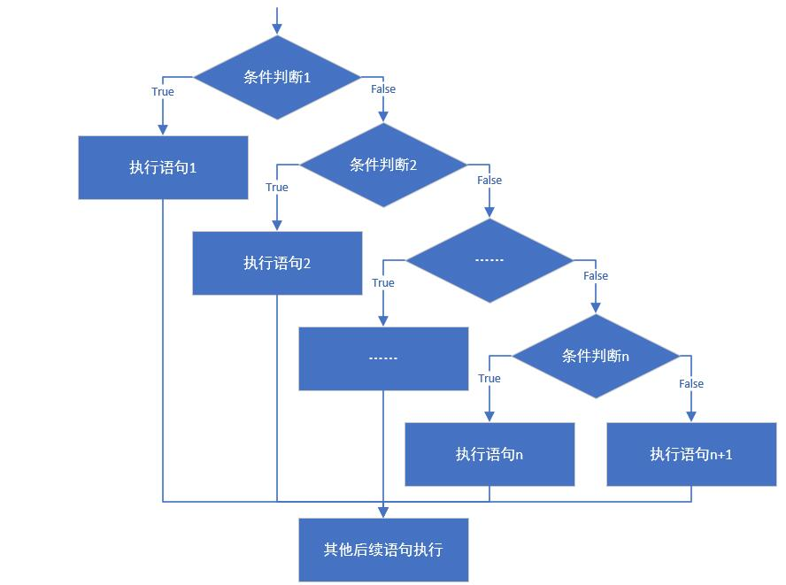

# day03

## 今日内容

- Scanner
- Random
- if语句
- for循环
- while循环
- do...while循环
- 跳出语句break，continue
- 猜数字小游戏案例

# 第一章 引用数据类型

## 1.1 键盘录入Scanner类 

我们要学的Scanner类是属于引用数据类型，我们先了解下引用数据类型。

**引用数据类型的使用**

​	与定义基本数据类型变量不同，引用数据类型的变量定义及赋值有一个相对固定的步骤或格式。

​	**数据类型  变量名  =  new 数据类型();**

​	每种引用数据类型都有其功能，我们可以调用该类型实例的功能。

​	**变量名.方法名();**

**Scanner类**

Scanner类是引用数据类型的一种，我们可以使用该类来完成用户键盘录入，获取到录入的数据。

Scanner使用步骤：

```java
导包：import java.util.Scanner;
创建对象实例：Scanner sc = new Scanner(System.in);
调用方法：
		int  i = sc.nextInt(); 用来接收控制台录入的数字
		String s = sc.next(); 用来接收控制台录入的字符串
```

示例

```java 
import java.util.Scanner;
public class ScannerDemo01 {
	public static void main(String[] args) {
		//创建Scanner引用类型的变量
		Scanner sc = new Scanner(System.in);
		//获取数字
		System.out.println("请输入一个数字");
		int n = sc.nextInt();
		System.out.println("n的值为" + n);
		//获取字符串
		System.out.println("请输入一个字符串");
		String str = sc.next();
		System.out.println("str的值为" + str);
	}
}
```


## 1.2 随机数Random

我们来学习下，用来产生随机数的类Random，它也属于引用数据类型。

这个Random类，它可以产生多种数据类型的随机数，在这里我们主要介绍生成整数与小数的方式。

方法简介

```java
public int nextInt(int maxValue)	产生[0,maxValue)范围的随机整数，包含0，不包含maxValue；
public double nextDouble() 	 		产生[0,1)范围的随机小数，包含0.0，不包含1.0。
```

引用数据类型的使用方式，在学习键盘录入Scanner时，我们已经学习过，在这里，再次回顾一下：

```java
Random使用方式:
import导包：所属包java.util.Random  
创建实例格式：Random 变量名 = new Random();
调用方法：变量名.nextInt(10)
```

 接下来，通过一段代码，一起学习下Random类的使用，RandomDemo.javac

```java
import java.util.Random;

public class RandomDemo {
	public static void main(String[] args) {
		// 创建Random类的实例
		Random r = new Random(); 
		// 得到0-100范围内的随机整数，将产生的随机整数赋值给i变量
		int i = r.nextInt(100); 
		//得到0.0-1.0范围内的随机小数，将产生的随机小数赋值给d变量
		double d = r.nextDouble(); 
		System.out.println(i); 
		System.out.println(d); 
	}
}
```

运行结果如下

​	

# 第二章 流程控制

## 2.1 概述

在一个程序执行的过程中，各条语句的执行顺序对程序的结果是有直接影响的。也就是说，程序的流程对运行结果有直接的影响。所以，我们必须清楚每条语句的执行流程。而且，很多时候我们要通过控制语句的执行顺序来实现我们要完成的功能。

## 2.2 顺序结构

```java
public static void main(String[] args){
    //顺序执行，根据编写的顺序，从上到下运行
    System.out.println(1);
    System.out.println(2);
    System.out.println(3);
}
```

# 第三章 判断语句

## 3.1 判断语句1--if

- **if语句第一种格式：** if


```java
if(关系表达式)｛
  	语句体;
｝
```

- **执行流程**

  - 首先判断关系表达式看其结果是true还是false

  - 如果是true就执行语句体

  - 如果是false就不执行语句体

    

```java
public static void main(String[] args){
    System.out.println("开始");
    // 定义两个变量
    int a = 10;
    int b = 20;
    //变量使用if判断
    if (a == b){
      	System.out.println("a等于b");
    }
    int c = 10;
    if(a == c){
      	System.out.println("a等于c");
    }
    System.out.println("结束");
｝
```

## 3.2 判断语句2--if...else

- **if语句第二种格式：** if...else


```java
if(关系表达式) { 
  	语句体1;
}else {
  	语句体2;
}
```

- 执行流程

  - 首先判断关系表达式看其结果是true还是false

  - 如果是true就执行语句体1

  - 如果是false就执行语句体2

    

```java
public static void main(String[] args){
    // 判断给定的数据是奇数还是偶数
    // 定义变量
    int a = 1;
    if(a % 2 == 0) {
      	System.out.println("a是偶数");
    } else{
      	System.out.println("a是奇数");
    }
    System.out.println("结束");
}
```

## 3.3 判断语句3--if..else if...else

- **if语句第三种格式：** if...else if ...else


```java
if (判断条件1) {
  	执行语句1;
} else if (判断条件2) {
  	执行语句2;
}
...
}else if (判断条件n) {
 	执行语句n;
} else {
  	执行语句n+1;
}
```

- **执行流程**
  - 首先判断关系表达式1看其结果是true还是false
  - 如果是true就执行语句体1
  - 如果是false就继续判断关系表达式2看其结果是true还是false
  - 如果是true就执行语句体2
  - 如果是false就继续判断关系表达式…看其结果是true还是false
  - …
  - 如果没有任何关系表达式为true，就执行语句体n+1。



- 指定考试成绩，判断学生等级
  - 90-100      优秀
  - 60-89        合格
  - 60以下    不合格


```java
public static void main(String[] args) {	
    int score = 100;
    if(score>=90 && score<=100){
      	System.out.println("你的成绩属于优秀");
    }else if(score>=60 && score<90){
      	System.out.println("你的成绩属于合格");
    }else if(score>=0 && score<60){
      	System.out.println("你的成绩属于不合格");
    }else {
      	System.out.println("成绩数据有误");
    }	
}
```


# 第四章 选择语句

## 4.1 选择语句--switch

- **switch语句格式：**


```java
switch(表达式) {
  case 常量值1:
    语句体1;
    break;
  case 常量值2:
    语句体2;
    break;
  ...
  default:
    语句体n+1;
    break;
}
```
- **执行流程**
  - 首先计算出表达式的值
  - 其次，和case依次比较，一旦有对应的值，就会执行相应的语句，在执行的过程中，遇到break就会结束。
  - 最后，如果所有的case都和表达式的值不匹配，就会执行default语句体部分，然后程序结束掉。


```java
public static void main(String[] args) {
    //定义月份变量，判断季节
    int month = 6;
    //switch语句实现选择
    switch(month) {
        case 1:
            System.out.println("冬季");
            break;
        case 2:
            System.out.println("冬季");
            break;
        case 3:
            System.out.println("春季");
            break;
        case 4:
            System.out.println("春季");
            break;
        case 5:
            System.out.println("春季");
            break;
        case 6:
            System.out.println("夏季");
            break;
        case 7:
            System.out.println("夏季");
            break;
        case 8:
            System.out.println("夏季");
            break;
        case 9:
            System.out.println("秋季");
            break;
        case 10:
            System.out.println("秋季");
            break;
        case 11:
            System.out.println("秋季");
            break;
        case 12:
            System.out.println("冬季");
            break;
        default:
            System.out.println("你输入的月份数字有误");
            break;
    }
}
```
switch语句中，表达式的数据类型，可以是byte，short，int，char，enum（枚举），JDK7后可以接收字符串。

## 4.2 case的穿透性

在switch语句中，如果case的后面不写break，将出现穿透现象，也就是不会在判断下一个case的值，直接向后运行，直到遇到break，或者整体switch结束。

```java
public static void main(String[] args) {
    //定义月份变量，判断季节
    int month = 6;
    //switch语句实现选择
    switch(month) {
        case 12:
        case 1:
        case 2:
            System.out.println("冬季");
            break;
        case 3:
        	
        case 4:
        	
        case 5:
            System.out.println("春季");
            break;
        case 6:
        case 7:
        case 8:
            System.out.println("夏季");
            break;
        case 9:
        case 10:
        case 11:
            System.out.println("秋季");
            break;
        default:
            System.out.println("你输入的月份数字有误");
            break;
    }
}
```

# 第五章 循环语句

## 5.1 循环概述

循环语句可以在满足循环条件的情况下，反复执行某一段代码，这段被重复执行的代码被称为循环体语句，当反复执行这个循环体时，需要在合适的时候把循环判断条件修改为false，从而结束循环，否则循环将一直执行下去，形成死循环。

## 5.2 循环语句1--for

- **for循环语句格式：**


```java
for(初始化表达式①; 布尔表达式②; 步进表达式④){
		循环体③
}
```

- **执行流程**
  - 执行顺序：①②③④>②③④>②③④…②不满足为止。
  - ①负责完成循环变量初始化
  - ②负责判断是否满足循环条件，不满足则跳出循环
  - ③具体执行的语句
  - ④循环后，循环条件所涉及变量的变化情况


```java
public static void main(String[] args) {
    //控制台输出10次HelloWorld，不使用循环
    System.out.println("HelloWorld");
    System.out.println("HelloWorld");
    System.out.println("HelloWorld");
    System.out.println("HelloWorld");
    System.out.println("HelloWorld");
    System.out.println("HelloWorld");
    System.out.println("HelloWorld");
    System.out.println("HelloWorld");
    System.out.println("HelloWorld");
    System.out.println("HelloWorld");
    System.out.println("-------------------------");

    //用循环改进，循环10次
    //定义变量从0开始，循环条件为<10
    for(int x = 0; x < 10; x++) {
      	System.out.println("HelloWorld"+x);
    }
}
```

* 循环练习：使用循环，计算1-100之间的偶数和

```java
public static void main(String[] args) {
  //1.定义一个初始化变量,记录累加求和,初始值为0
  int sum = 0;
  //2.利用for循环获取1-100之间的数字
  for (int i = 1; i <= 100; i++) {
      //3.判断获取的数组是奇数还是偶数
      if(i % 2==0){
        //4.如果是偶数就累加求和
        sum += i;
      }
  }
  	//5.循环结束之后,打印累加结果
  	System.out.println("sum:"+sum);
}
```

## 5.3 循环语句2--while

- **while循环语句格式：**


```java
初始化表达式①
  while(布尔表达式②){
    循环体③
    步进表达式④
}
```

- **执行流程**
  - 执行顺序：①②③④>②③④>②③④…②不满足为止。
  - ①负责完成循环变量初始化。
  - ②负责判断是否满足循环条件，不满足则跳出循环。
  - ③具体执行的语句。
  - ④循环后，循环变量的变化情况。


while循环输出10次HelloWorld

```java
public static void main(String[] args) {
    //while循环实现打印10次HelloWorld
    //定义初始化变量
    int i = 1;
    //循环条件<=10
    while(i<=10){
        System.out.println("HelloWorld");
        //步进
        i++;
    }
}
```

while循环计算1-100之间的和

```java
public static void main(String[] args) {
    //使用while循环实现
    //定义一个变量,记录累加求和
    int sum = 0;
    //定义初始化表达式
    int i = 1;
    //使用while循环让初始化表达式的值变化
    while(i<=100){
        //累加求和
        sum += i ;
        //步进表达式改变变量的值
        i++;
    }
    //打印求和的变量
    System.out.println("1-100的和是："+sum);
}
```

## 5.4 循环语句3--do...while

- **do...while循环格式**


```java
初始化表达式①
    do{
    循环体③
    步进表达式④
}while(布尔表达式②);
```

- **执行流程**
  - 执行顺序：①③④>②③④>②③④…②不满足为止。
  - ①负责完成循环变量初始化。
  - ②负责判断是否满足循环条件，不满足则跳出循环。
  - ③具体执行的语句
  - ④循环后，循环变量的变化情况


输出10次HelloWorld

```java
public static void main(String[] args) {
    int x=1;
    do {
      System.out.println("HelloWorld");
      x++;
    }while(x<=10);
}
```

do...while循环的特点：无条件执行一次循环体，即使我们将循环条件直接写成false，也依然会循环一次。这样的循环具有一定的风险性，因此初学者不建议使用do...while循环。

```java
public static void main(String[] args){
    do{
      	System.out.println("无条件执行一次");
    }while(false);
}
```

## 5.5 循环语句的区别

- `for` 和 `while` 的小区别：
  - 控制条件语句所控制的那个变量，在for循环结束后，就不能再被访问到了，而while循环结束还可以继续使用，如果你想继续使用，就用while，否则推荐使用for。原因是for循环结束，该变量就从内存中消失，能够提高内存的使用效率。

## 5.6  跳出语句

### break

- **使用场景：终止switch或者循环**
  -  在选择结构switch语句中
  -  在循环语句中
  -  离开使用场景的存在是没有意义的

### continue

- **使用场景：结束本次循环，继续下一次的循环**


案例：观察以下代码的执行结果，分析break与 continue的作用

```java
public static void main(String[] args) {
    for (int i = 1; i<=10; i++) {
       
        if(i % 3 == 0){
          //分别单独打开注释执行，看执行结果
          //break;  
          //continue; 
        }
        System.out.println("HelloWorld"+i);
    }
}
```

## 5.7 死循环

- **死循环：**也就是循环中的条件永远为true，死循环的是永不结束的循环。例如：while(true){}。

在后期的开发中，会出现使用死循环的场景，例如：我们需要读取用户输入的输入，但是用户输入多少数据我们并不清楚，也只能使用死循环，当用户不想输入数据了，就可以结束循环了，如何去结束一个死循环呢，就需要使用到跳出语句了。  ***

## 5.8 嵌套循环

- **所谓嵌套循环**，是指一个循环的循环体是另一个循环。比如for循环里面还有一个for循环，就是嵌套循环。总共的循环次数=外循环次数*内循环次数


- **嵌套循环格式：**	

```java
for(初始化表达式①; 循环条件②; 步进表达式⑦) {
 	 ......
    for(初始化表达式③; 循环条件④; 步进表达式⑥) {
      	执行语句⑤;
      	......
    }
 	 .....
}

```

```java
接下来通过一个练习，来实现使用“*”打印直角三角形，如下所示。ForForDemo.java
 1public class ForForDemo {
 2	public static void main(String[] args) {
 3		int i, j; // 定义两个循环变量
 4		for (i = 1; i <= 9; i++) { // 外层循环
 5			for (j = 1; j <= i; j++) { // 内层循环
 6				System.out.print("*"); // 打印*
 7			}
 8			System.out.print("\n"); // 换行
 9		}
 10	}
 11}
```

运行结果如下：


在上述代码中定义了两层for循环，分别为外层循环和内层循环，外层循环用于控制打印的行数，内层循环用于打印“*”，每一行的“*”个数逐行增加，最后输出一个直角三角形。由于嵌套循环程序比较复杂，下面分步骤进行详细地讲解，具体如下：

第一步，在第3行代码定义了两个循环变量i和j，其中i为外层循环变量，j为内层循环变量。

第二步，在第4行代码将i初始化为1，条件i <= 9为true，首次进入外层循环的循环体。

第三步，在第5行代码将j初始化为1，由于此时i的值为1，条件j <= i为true，首次进入内层循环的循环体，打印一个“*”。

第四步，执行第5行代码中内层循环的操作表达式j++，将j的值自增为2。

第五步，执行第5行代码中的判断条件j<=i，判断结果为false，内层循环结束。执行后面的代码，打印换行符。

第六步，执行第4行代码中外层循环的操作表达式i++，将i的值自增为2。

第七步，执行第4行代码中的判断条件i<=9，判断结果为true，进入外层循环的循环体，继续执行内层循环。

第八步，由于i的值为2，内层循环会执行两次，即在第2行打印两个“*”。在内层循环结束时会打印换行符。

第九步，以此类推，在第3行会打印3个“*”，逐行递增，直到i的值为10时，外层循环的判断条件i <= 9结果为false，外层循环结束，整个程序也就结束了。	

# 第六章  猜数字案例

## 6.1 案例介绍

我们在日常生活中，经常与朋友们玩猜数字的游戏，非常的有趣。现在我们通过java把这个猜数字游戏编写出来。

猜数字案例是要完成什么样的功能呢？顾名思义，这个游戏就是你出个数字、我来猜。

游戏操作如下：

```
后台预先生成一个1-100之间的随机数，用户键盘录入猜数字
如果猜对了，打印“恭喜您，答对了”
如果猜错了
猜大了：打印“sorry，您猜大了!”
猜小了：打印“sorry，您猜小了!”
直到数字猜到为止
```

## 6.2   需求分析

我们经过分析，得出如下的分析结果

```
- 通过Random类中方法nextInt（），生成一个1-100之间的随机数
- 输入猜的数字
- 通过while循环，进行猜数字对错判断
- 		猜对，跳出循环，游戏结束
- 		猜错了，根据结果，给出提示，接着猜数字，游戏继续
-    			如果大了，打印sorry，您猜大了！继续下一次循环
				如果小了，打印sorry，您猜小了！继续下一次循环
```

## 6.3   代码实现

分析完毕之后，在main()方法中，我们一起来完成代码的编写：GuessNumber.java

```java
public class GuessNumber {
	public static void main(String[] args) {
		//1.通过Random类中方法nextInt（），生成一个1-100之间的随机数
		int randomNumber = new Random().nextInt(100);
		System.out.println("随机数已生成！");
		//2.输入猜的数字
		System.out.println("----请输入您猜的数字：----");
		Scanner sc = new Scanner(System.in);
		int enterNumber = sc.nextInt();
		//3.通过while循环，进行猜数字对错判断
		//猜对，跳出循环，游戏结束
		while(enterNumber != randomNumber){
			//猜错了，根据结果，给出提示，接着猜数字，游戏继续
			if(enterNumber>randomNumber) { 
				//如果猜大了，打印sorry，您猜大了!继续下一次循环
				System.out.println("sorry，您猜大了!继续下一次循环");
			}else {
				//如果猜小了，打印sorry，您猜小了!继续下一次循环
				System.out.println("sorry，您猜小了!继续下一次循环");
			}
			//输入猜的数字
			System.out.println("----请输入您猜的数字：----");
			enterNumber = sc.nextInt();
		}
		System.out.println("恭喜您，答对了！");
	}
}
```

# 课后练习

### 1.减肥计划if版本

- 案例需求

  输入星期数，显示今天的减肥活动
  ​        周一：跑步
  ​        周二：游泳
  ​        周三：慢走
  ​        周四：动感单车
  ​        周五：拳击 
  ​        周六：爬山
  ​        周日：好好吃一顿

- 思路

  1:键盘录入一个星期数，用一个变量接收
  2:对星期数进行判断，这里用 if 语句实现
  3:在对应的语句控制中输出对应的减肥活动

  ```
  步骤:
     1.创建Scanner对象
     2.调用nextInt方法键盘录入一个星期数,week
     3.利用if判断
       if(week==1){
          System.out.println("跑步")
       }else if...
  ```


- 代码实现

```java
public class Test01 {
    public static void main(String[] args) {
        //键盘录入一个星期数，用一个变量接收
        Scanner sc = new Scanner(System.in);

        System.out.println("请输入一个星期数：");
        int week = sc.nextInt();

        //对星期数进行判断，这里用 if 语句实现
        if (week < 1 || week > 7) {
            System.out.println("你输入的星期数有误");
        } else if (week == 1) {
            System.out.println("跑步");
        } else if (week == 2) {
            System.out.println("游泳");
        } else if (week == 3) {
            System.out.println("慢走");
        } else if (week == 4) {
            System.out.println("动感单车");
        } else if (week == 5) {
            System.out.println("拳击");
        } else if (week == 6) {
            System.out.println("爬山");
        } else {
            System.out.println("好好吃一顿");
        }
    }
}
```

### 2.减肥计划switch版本

- 案例需求

  输入星期数，显示今天的减肥活动
  ​        周一：跑步
  ​        周二：游泳
  ​        周三：慢走
  ​        周四：动感单车
  ​        周五：拳击 
  ​        周六：爬山
  ​        周日：好好吃一顿

- 思路

  1:键盘录入一个星期数，用一个变量接收
  2:对星期数进行判断，这里用 switch 语句实现
  3:在对应的语句控制中输出对应的减肥活动

- 代码实现

```java
public class Test02 {
    public static void main(String[] args) {
        //键盘录入一个星期数，用一个变量接收
        Scanner sc = new Scanner(System.in);

        System.out.println("请输入一个星期数：");
        int week = sc.nextInt();

        //对星期数进行判断，这里用 switch 语句实现
        switch (week) {
            case 1:
                System.out.println("跑步");
                break;
            case 2:
                System.out.println("游泳");
                break;
            case 3:
                System.out.println("慢走");
                break;
            case 4:
                System.out.println("动感单车");
                break;
            case 5:
                System.out.println("拳击");
                break;
            case 6:
                System.out.println("爬山");
                break;
            case 7:
                System.out.println("好好吃一顿");
                break;
            default:
                System.out.println("你输入的星期数有误");
        }
    }
}
```

### 3.输出所有的水仙花数

所谓水仙花数是指一个数3位数，其每位数字立方和等于其本身，如153 = 1x1x1+5x5x5+3x3x3

153 % 10 = 3  //个位

153 / 10 % 10 = 5  //十位153 / 10 = 15,  15%10 = 5。

153 / 100 % 10 = 1 //百位

**题目分析**：

> ​	通过观察发现，本题目要实现打印符合要求的数字（即水仙花数）。
>
> 1. 明确什么样的数就是水仙花数。水仙花数是指一个3位数（100-999之间），其每位数字立方之和等于该3位数本身。如153 = 1*1*1 + 3*3*3 + 5*5*5，
>
>    ​        	即 3位数本身 = 百位数立方 + 十位数立方 + 个位数立方;
>
> 2. 获取水仙花范围内的所有3位数（100-999之间的每个3位数）
>
> 3. 判断该3位数是否满足水仙花数，满足，打印该3位数

**解题步骤**

1. 使用for循环，得到100-999之间的每个3位数
2. 获取3位数中百位数字、十位数字、个位数字
3. 使用if条件语句，判断该3位数是否满足水仙花数，满足，使用输出语句，打印该3位数

**代码如下**

```java
public class Test02 {
	public static void main(String[] args) {
      	//i为从 100开始 到 999 的每个3位数
		for (int i = 100; i < 1000; i++) {
          	 //获取百位
			int bai = i/100%10;
          	 //获取十位
			int shi = i/10%10;
          	 //获取个位
			int ge = i%10;
			//判断是否满足水仙花数
			if (i == bai*bai*bai + shi*shi*shi + ge*ge*ge) {
              	 //如果满足 直接打印
				System.out.println(i);
			}
		}
	}
}
```

### 4.循环打印字母

案例需求

​	利用for循环打印ABCDEFG...XYZ，26个大写字母与26个小写字母

题目分析

> ​	通过观察发现，本题目要实现打印26个大写字母、26个小写字母
>
> ​	1. 一共26个大小写字母，那么，可以考虑循环26次。在每次循环中，完成指定字母的大小写打印
>
> ​	2. 找出ABCDEFG…XYZ这些字母之间的变化规律
>
> ​		通过ASCII表发现，后面的字母比它前面的字母，ASCII值大1
>
> ​		下一个字母 = 上一个字母 + 1
>
> ​		如： A	B	C	D
>
> ​		65	66	67	68
>
> ​	 3. 在每次循环中打印上一个字母大小写，并指定下一个字母
>

**解题步骤：**

​	1. 定义初始化大写变量，值为’A’； 初始化小写变量，值为’a’

​	2. 使用for循环，进行26次循环

​	3. 在每次循环中，打印大写字母、小写字母。

​	    每次打印完成后，更新大写字母值、小写字母值

```java
public class Test04 {
	public static void main(String[] args) {
		char da = 'A';
		char xiao = 'a';
		for (int i = 0; i < 26; i++) {
			System.out.println("大写字母 "+da+" ,小写字母 "+xiao);
			da++; //更新大写字母值
			xiao++; //更新小写字母值
		}
	}
 
}
```

