# day04【 Idea、数组】

## 今日内容 

- 集成开发工具IDEA
- 数组及内存图
- 数组的常见问题
- 数组的练习

# 第一章 开发工具IntelliJ IDEA 

## 1.1 开发工具概述

IDEA是一个专门针对Java的集成开发工具(IDE)，由Java语言编写。所以，需要有JRE运行环境并配置好环境变量。它可以极大地提升我们的开发效率。可以自动编译，检查错误.在公司中，使用的就是IDEA进行开发。eclipse   myeclipse

## 1.2 IDEA软件安装

此软件集成了32位和64位，双击`ideaIU-2018.2.2` 进入安装。

1. 欢迎界面

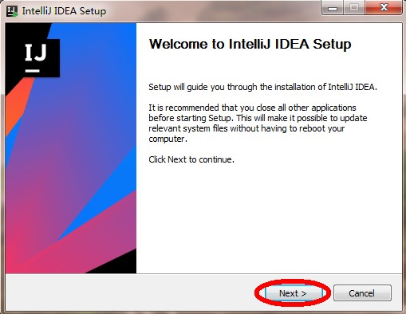

2. 选择安装路径

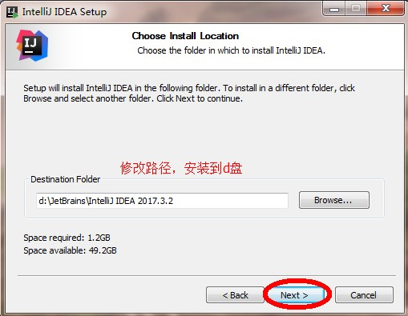

3. 配置安装选项

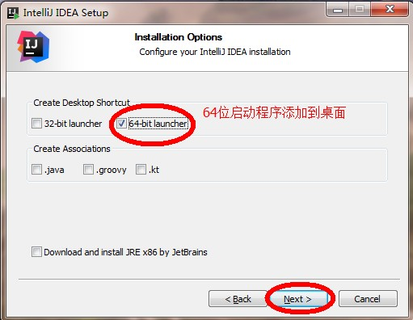

4. 开始菜单

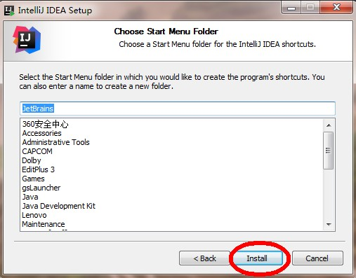

5. 安装完毕

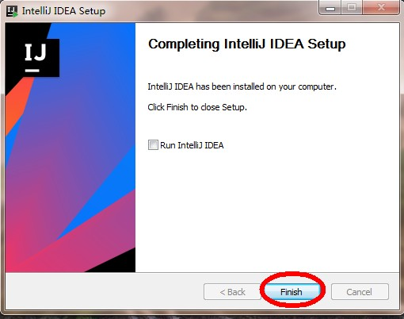

IDEA开发工具安装完成

## 1.3 IDEA首次驱动

1. 选择不导入任何设置，点击`OK` 

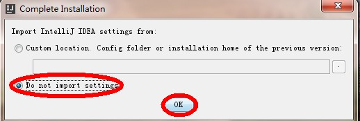

2. 选择 `Create New Project` 

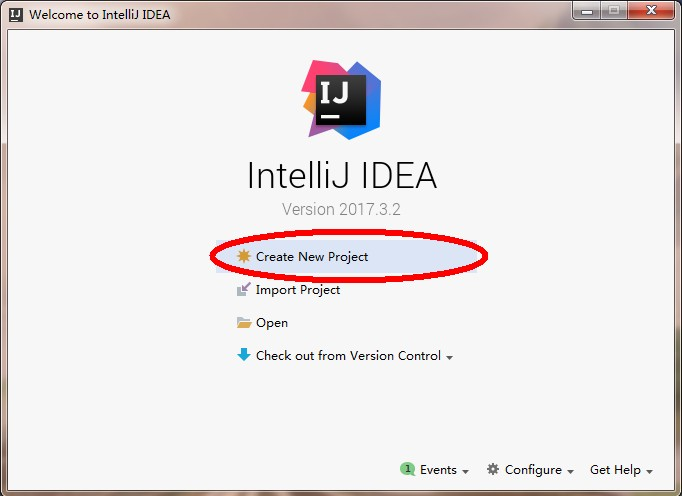

3. 点击`new` 按钮，配置安装的`JDK` 版本,以下图片仅供参考

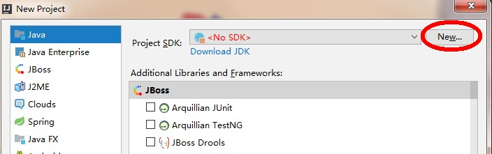

选择`  JDK` 安装目录，选择 `Empty Project` ，点击确定 , 以下图片仅供参考

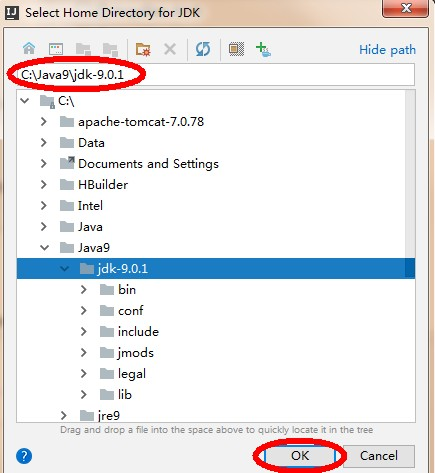

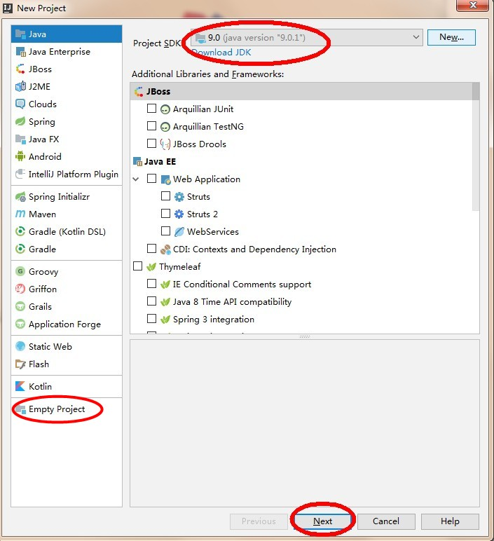

4. 不使用模板

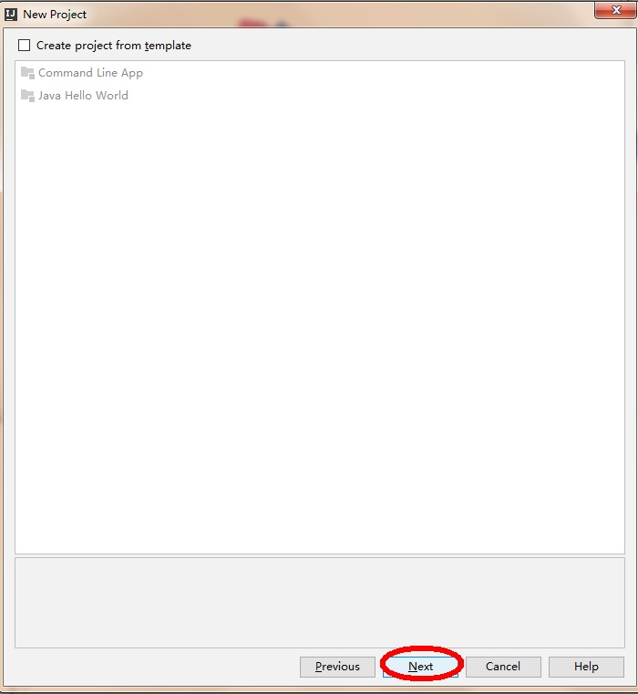

5. 为工程起名字 `demo` ，并存储到`d:\ideawork\demo` 目录下，如果d盘没有这个目录，会自动创建。

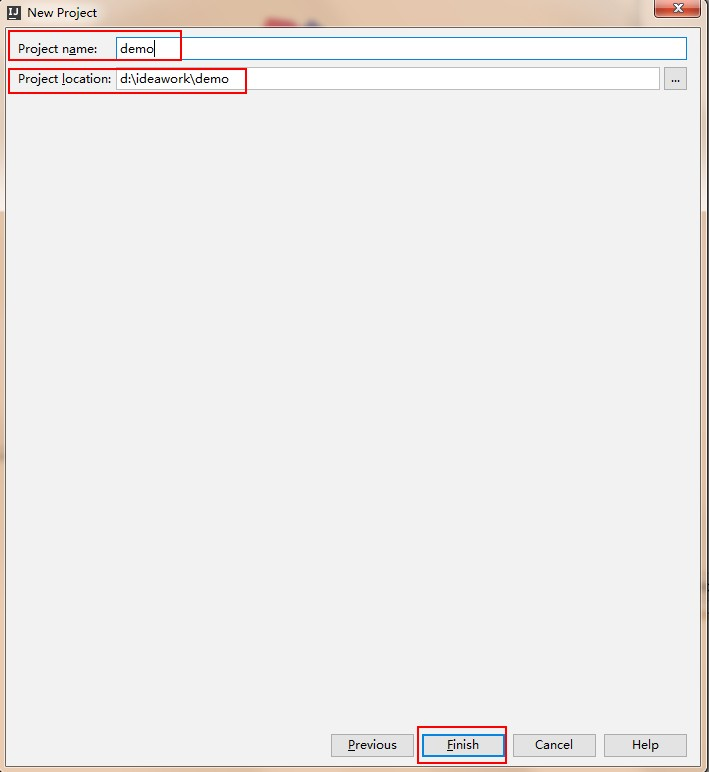

6. 打开一个每日一帖对话框，勾掉每次启动显示，点击`close` ,以下图片仅供参考

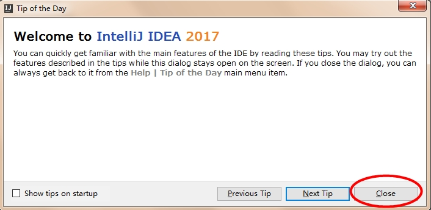

7. IDEA的工作界面，我们的项目已经创建好了，如果再新建项目，点击`File->new->Project` 

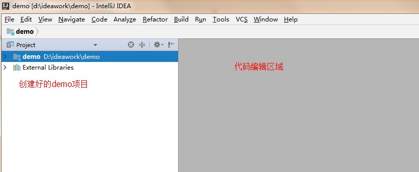

## 1.4 创建包和类

1. 展开创建的工程，在源代码目录`src` 上，鼠标右键，选择`new->package` ，键入包名`com.doit.demo` ，点击确定。

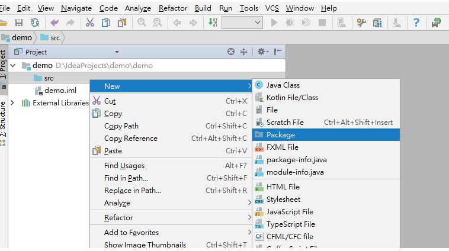

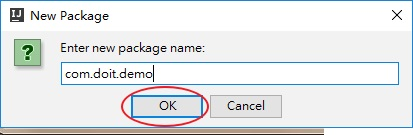

```java
右键点击`com.doit.demo` ，选择 `Show in Explorer` ，会发现创建包的目录结构。

```


```
可见`com.doit.demo` ，表示创建了多级的文件夹。
```


> 小贴士：所谓包，就是文件夹，用来对类文件进行管理。

2. 在创建好的包上，鼠标右键，选择 `new->class`  创建类，键入类名。

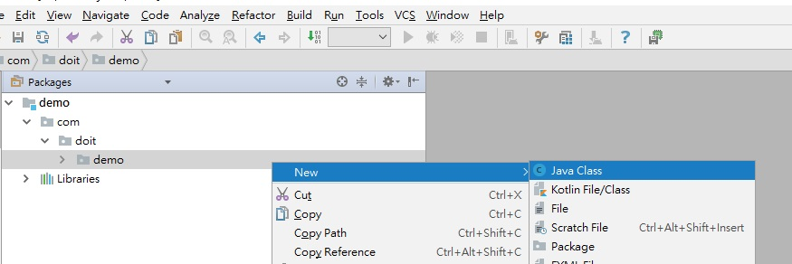

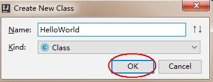

3. 在代码编辑区，键入主方法，并输出`HelloWorld` 。

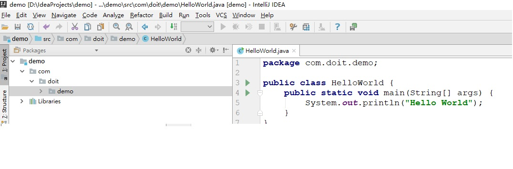

4. 运行程序，在代码编辑区鼠标右键，选择`Run HelloWorld` 即可，或在菜单中选择`Run->Run HelloWorld ` 。

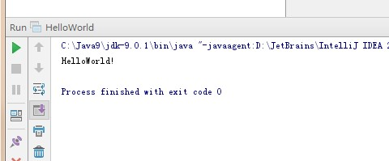

## 1.5 字体设置

IDEA工具的默认字体非常小，代码编辑器和控制台的输出字体都需要进行调整。

* 点击菜单栏上的`File->Settings->Editor->Font`修改字体。


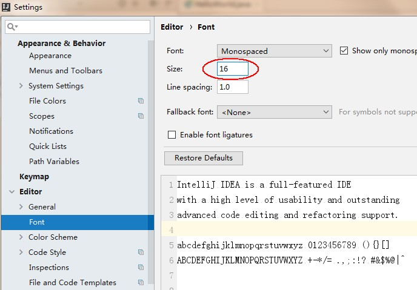

## 1.6 IDEA的项目目录

- 我们创建的项目，在d:\ideawork目录的demo下
  - `out`目录是存储编译后的.class文件
  - `src` 目录是存储我们编写的.java源文件

  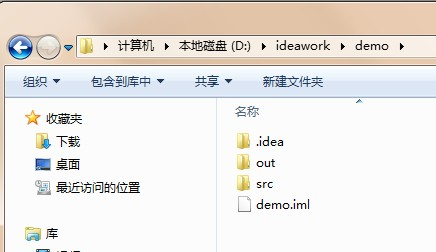

## 1.7 IDEA常用快捷键

| 快捷键              | 功能                  |
| ---------------- | ------------------- |
| `Alt+Enter`      | 导入包，自动修正代码          |
| `Ctrl+Y`         | 删除光标所在行             |
| `Ctrl+D`         | 复制光标所在行的内容，插入光标位置下面 |
| `Ctrl+Alt+L`     | 格式化代码               |
| `Ctrl+/`         | 单行注释                |
| `Ctrl+Shift+/`   | 选中代码注释，多行注释，再按取消注释  |
| `Alt+Shift+上下箭头` | 移动当前代码行             |

## 1.8 IDEA修改快捷键

在IDEA工具中，`Ctrl+空格`的快捷键，可以帮助我们补全代码，但是这个快捷键和Windows中的输入法切换快捷键冲突，需要修改IDEA中的快捷键。修改的步骤如下:

`File->Settings->keymap->Main menu->code->Completion->Basic`

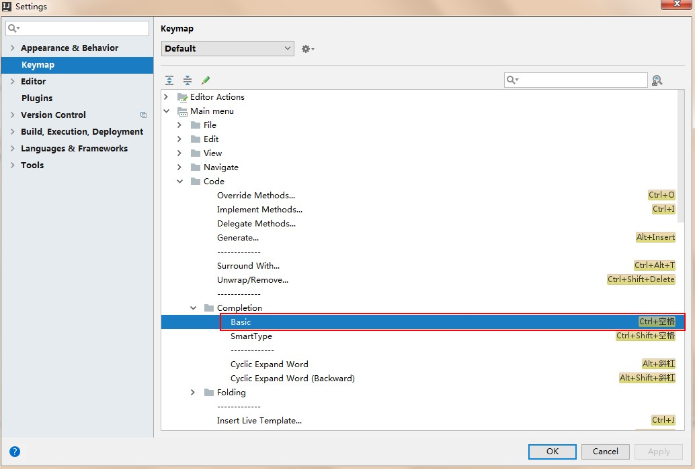

双击`Basic->remove->Ctrl+空格`

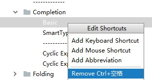

再次双击`Basic->Add Keyboard->键入 Alt+/->点击OK`

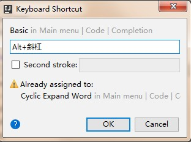

## 1.9 IDEA导入和关闭项目

关闭IDEA中已经存在的项目，`File->Close Project`

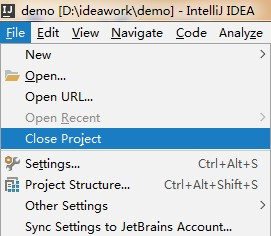

`File->Close Project `这时IDEA回到了刚启动界面，点击项目上的`X`，IDEA中就没有这个项目了

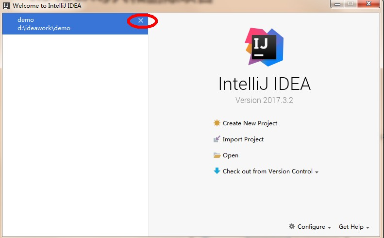

在IDEA的启动界面上，点击`OPEN` ，选择项目目录即可

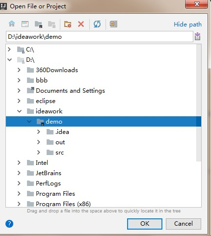

> 小贴士：
>
> 课后若想通过IDEA同时开启多个项目，点击OPEN打开项目时，点击New Window按钮

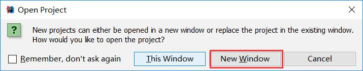


# 第二章 数组定义和访问

## 2.1 容器概述

### 案例分析

现在需要统计某公司员工的工资情况，例如计算平均工资、找到最高工资等。假设该公司有50名员工，用前面所学的知识，程序首先需要声明50个变量来分别记住每位员工的工资，然后在进行操作，这样做会显得很麻烦，而且错误率也会很高。因此我们可以使用容器进行操作。将所有的数据全部存储到一个容器中，统一操作。

### 容器概念

- **容器：**是将多个数据存储到一起，每个数据称为该容器的元素。
- **生活中的容器：**水杯，衣柜，教室

## 2.2 数组概念

- **数组概念：** 数组就是存储数据长度固定的容器，保证多个数据的数据类型要一致。

## 2.3 数组的定义

### 方式一

- **格式：**

```
数组存储的数据类型[] 数组名字;
```

### 方式二

- **格式：**

```
数组存储的数据类型 数组名字[];
```

## 2.4 数组的初始化

### 方式一

- **格式：**

```java
 数组存储的数据类型[] 数组名字 = new 数组存储的数据类型[长度];
```

- 数组定义格式详解：
  - 数组存储的数据类型： 创建的数组容器可以存储什么数据类型。
  - [] : 表示数组。
  - 数组名字：为定义的数组起个变量名，满足标识符规范，可以使用名字操作数组。
  - new：关键字，创建数组使用的关键字。
  - 数组存储的数据类型： 创建的数组容器可以存储什么数据类型。
  - [长度]：数组的长度，表示数组容器中可以存储多少个元素。
  - **注意：数组有定长特性，长度一旦指定，不可更改。**
    - 和水杯道理相同，买了一个2升的水杯，总容量就是2升，不能多也不能少。
- 举例：

定义可以存储3个整数的数组容器，代码如下：

```java
int[] arr = new int[3];
```

### 方式二

- **格式：**

```java
数据类型[] 数组名 = new 数据类型[]{元素1,元素2,元素3...};
```

- 举例：

定义存储1，2，3，4，5整数的数组容器。

```java
int[] arr = new int[]{1,2,3,4,5};
```

### 方式三

- **格式：**

```java
数据类型[] 数组名 = {元素1,元素2,元素3...};
```

- 举例：

定义存储1，2，3，4，5整数的数组容器

```java
int[] arr = {1,2,3,4,5};
```

## 2.5 数组的访问

- **索引：** 每一个存储到数组的元素，都会自动的拥有一个编号，从0开始，这个自动编号称为**数组索引(index)**，可以通过数组的索引访问到数组中的元素。
- **格式：**

```java
数组名[索引]
```

- **数组的长度属性：** 每个数组都具有长度，而且是固定的，Java中赋予了数组的一个属性，可以获取到数组的长度，语句为：`数组名.length` ，属性length的执行结果是数组的长度，int类型结果。由次可以推断出，数组的最大索引值为`数组名.length-1`。

```java
public static void main(String[] args) {
  	int[] arr = new int[]{1,2,3,4,5};
  	//打印数组的属性，输出结果是5
  	System.out.println(arr.length);
}

```

- **索引访问数组中的元素：**
  - 数组名[索引]=数值，为数组中的元素赋值
  - 变量=数组名[索引]，获取出数组中的元素

```java
public static void main(String[] args) {
    //定义存储int类型数组，赋值元素1，2，3，4，5
    int[] arr = {1,2,3,4,5};
    //为0索引元素赋值为6
    arr[0] = 6;
    //获取数组0索引上的元素
    int i = arr[0];
    System.out.println(i);
    //直接输出数组0索引元素
    System.out.println(arr[0]);
}

```

# 第三章 数组原理内存图

## 3.1 内存概述

内存是计算机中的重要原件，临时存储区域，作用是运行程序。我们编写的程序是存放在硬盘中的，在硬盘中的程序是不会运行的，必须放进内存中才能运行，运行完毕后会清空内存。

Java虚拟机要运行程序，必须要对内存进行空间的分配和管理。

## 3.2 Java虚拟机的内存划分

为了提高运算效率，就对空间进行了不同区域的划分，因为每一片区域都有特定的处理数据方式和内存管理方式。

- JVM的内存划分：

  | 区域名称  | 作用                              |
  | ----- | ------------------------------- |
  | 寄存器   | 给CPU使用，和我们开发无关。                 |
  | 本地方法栈 | JVM在使用操作系统功能的时候使用，和我们开发无关。      |
  | 方法区   | 存储可以运行的class文件。                 |
  | 堆内存   | 存储对象或者数组，new来创建的，都存储在堆内存。       |
  | 方法栈   | 方法运行时使用的内存，比如main方法运行，进入方法栈中执行。 |

## 3.3 数组在内存中的存储

### 一个数组内存图

```java
public static void main(String[] args) {
  	int[] arr = new int[3];
  	System.out.println(arr);//[I@5f150435
}

```

以上方法执行，输出的结果是[I@5f150435，这个是什么呢？是数组在内存中的地址。new出来的内容，都是在堆内存中存储的，而方法中的变量arr保存的是数组的地址。

**输出arr[0]，就会输出arr保存的内存地址中数组中0索引上的元素**


### 两个数组内存图

```java
public static void main(String[] args) {
    int[] arr = new int[3];
    int[] arr2 = new int[2];
    System.out.println(arr);
    System.out.println(arr2);
}

```


### 两个变量指向一个数组

```java
public static void main(String[] args) {
    // 定义数组，存储3个元素
    int[] arr = new int[3];
    //数组索引进行赋值
    arr[0] = 5;
    arr[1] = 6;
    arr[2] = 7;
    //输出3个索引上的元素值
    System.out.println(arr[0]);
    System.out.println(arr[1]);
    System.out.println(arr[2]);
    //定义数组变量arr2，将arr的地址赋值给arr2
    int[] arr2 = arr;
    arr2[1] = 9;
    System.out.println(arr[1]);
}

```

 

# 第四章 数组操作的常见问题

## 4.1 数组越界异常

观察一下代码，运行后会出现什么结果。

```java
public static void main(String[] args) {
    int[] arr = {1,2,3};
    System.out.println(arr[3]);
}

```

创建数组，赋值3个元素，数组的索引就是0，1，2，没有3索引，因此我们不能访问数组中不存在的索引，程序运行后，将会抛出 `ArrayIndexOutOfBoundsException`  数组越界异常。在开发中，数组的越界异常是**不能出现**的，一旦出现了，就必须要修改我们编写的代码。

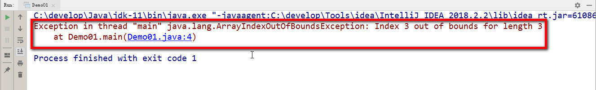

## 4.2 数组空指针异常

观察一下代码，运行后会出现什么结果。

```java
public static void main(String[] args) {
    int[] arr = {1,2,3};
    arr = null;
    System.out.println(arr[0]);
｝
    
```

`arr = null`这行代码，意味着变量arr将不会在保存数组的内存地址，也就不允许再操作数组了，因此运行的时候会抛出`NullPointerException` 空指针异常。在开发中，数组的越界异常是**不能出现**的，一旦出现了，就必须要修改我们编写的代码。


**空指针异常在内存图中的表现**

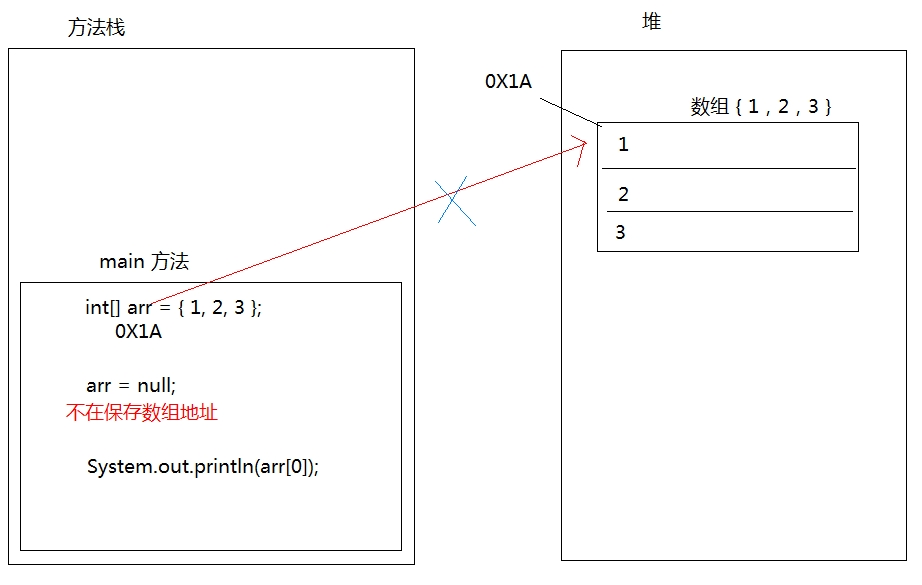

# 第五章 数组练习

## 5.1 数组遍历【重点】

- **数组遍历：** 就是将数组中的每个元素分别获取出来，就是遍历。遍历也是数组操作中的基石。

```java
public static void main(String[] args) {
    int[] arr = { 11, 22, 33, 44, 55 };
    System.out.println(arr[0]);
    System.out.println(arr[1]);
    System.out.println(arr[2]);
    System.out.println(arr[3]);
    System.out.println(arr[4]);
}

```

以上代码是可以将数组中每个元素全部遍历出来，但是如果数组元素非常多，这种写法肯定不行，因此我们需要改造成循环的写法。数组的索引是`0`到`lenght-1` ，可以作为循环的条件出现。 

```java
public static void main(String[] args) {
    int[] arr = { 11, 22, 33, 44, 55 };
    for (int i = 0; i < arr.length; i++) {
      System.out.println(arr[i]);
    }
}

```

## 5.2 数组获取最大值元素

- **最大值获取：**从数组的所有元素中找出最大值。
- **实现思路：**
  - 定义变量，保存数组0索引上的元素
  - 遍历数组，获取出数组中的每个元素
  - 将遍历到的元素和保存数组0索引上值的变量进行比较
  - 如果数组元素的值大于了变量的值，变量记录住新的值
  - 数组循环遍历结束，变量保存的就是数组中的最大值

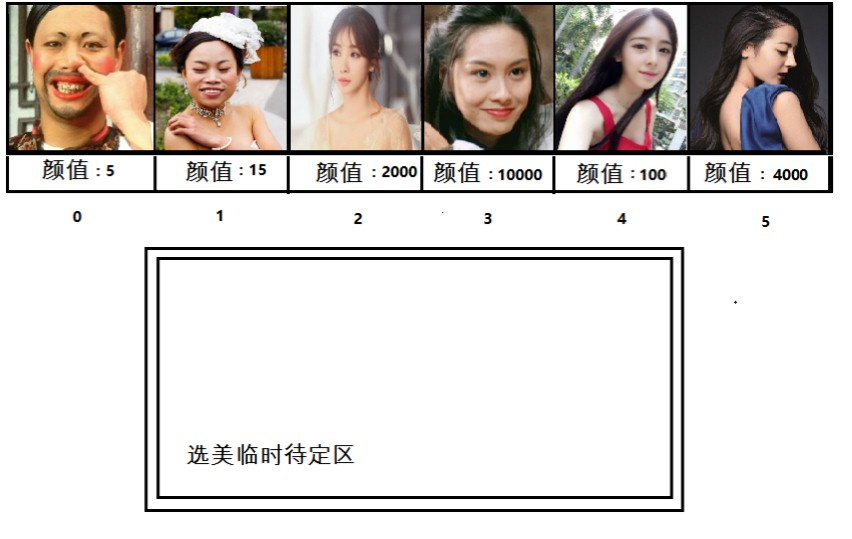

```java
public static void main(String[] args) {
    int[] arr = { 5, 15, 2000, 10000, 100, 4000 };
    //定义变量，保存数组中0索引的元素
    int max = arr[0];
    //遍历数组，取出每个元素
    for (int i = 0; i < arr.length; i++) {
      //遍历到的元素和变量max比较
      //如果数组元素大于max
      if (arr[i] > max) {
        //max记录住大值
        max = arr[i];
      }
    }
    System.out.println("数组最大值是： " + max);
}

```

