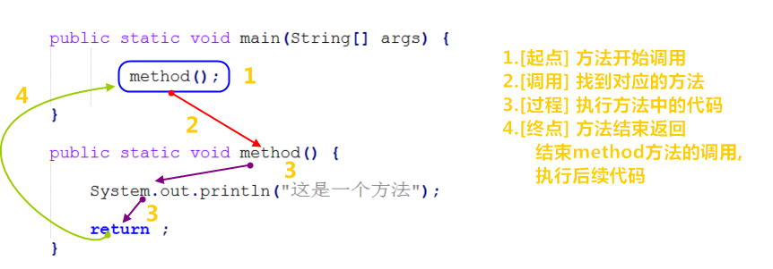
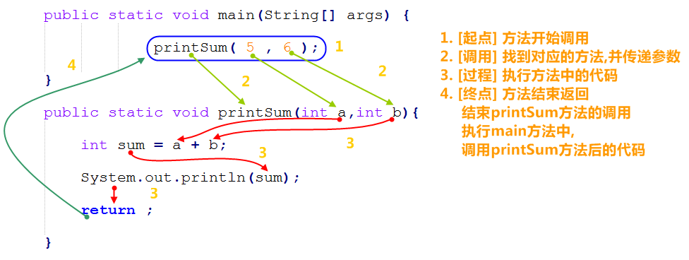
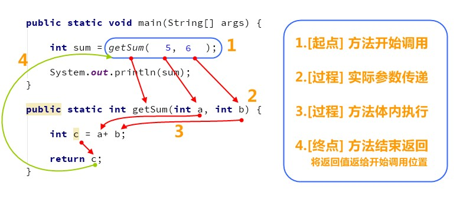

# day05【方法】

## 今日内容

- 方法的概念
- 方法的参数和返回值
- 方法的重载
- 方法的练习 

# 第一章 方法入门

## 1.1 概述

假如我们使用循环在一段程序中实现在控制台上打印3次helloworld、再打印5次helloworld , 我们会在main方法中编写两段for循环语句 , 若要再来3个打印多次呢 ? 这个时候我们会发现这样编写代码非常的繁琐且重复的代码过多。能否避免这些重复的代码呢，就需要使用方法来实现.

- **方法：**就是将具有**独立功能**的代码块组织成为一个整体，使其具有特殊功能的代码集。

当我们需要这个功能的时候，就可以去调用。这样即实现了代码的复用性，也解决了代码冗余的现象。

## 1.2 无参数无返回值的方法定义

- 方法完整的定义格式： 

```java
修饰符 返回值类型 方法名 （参数列表）｛
    	代码...	
   		return 结果;
｝
```

- 定义格式解释：
  - 修饰符： 目前固定写法 `public static` ,后面课程再详细讲解。
  - 返回值类型： 目前固定写法 `void` ，其他返回值类型在后面讲解。
  - 方法名：为我们定义的方法起名，满足标识符的规范，用来调用方法。
  - 参数列表： 目前无参数， 带有参数的方法在后面讲解。
  - return：方法结束。因为返回值类型是void，方法大括号内的return可以不写。
- 无参数无返回值的方法定义格式就简化为:

```java
修饰符 void 方法名 （）｛
    	代码...	
｝
```

- 举例： 

```java
public static void method() {
  	System.out.println("这是一个方法");
}
```

注意：方法必须先定义，后调用，否则程序将报错，而且方法不调用不执行

## 1.3 无参数无返回值的方法的调用

方法在定义完毕后，方法不会自己运行，必须被调用才能执行，我们可以在主方法main中来调用我们自己定义好的方法。在主方法中，直接写要调用的方法名字就可以调用了。

- 调用格式：

```
方法名();
```

- 举例：

```
method();
```

## 1.4 无参数无返回值的方法的调用图解

```java
public static void main(String[] args) {
    //调用定义的方法method
    method();
}
//定义方法，被main方法调用
public static void method() {
  	System.out.println("这是一个方法");
}
```




- 总结：每个方法在被调用执行的时候，都会进入栈内存，并且拥有自己独立的内存空间，方法内部代码调用完毕之后，会从栈内存中弹栈消失。

## 1.5 无参数无返回值的方法练习

- 需求1： 定义一个方法，打印输出该方法内部的数据(方法内部定义的变量)是否是偶数
- 思路：
  - ①定义一个方法，用于打印该方法内部的数字是否是偶数，例如isEvenNumber() 
  - ②方法中定义一个变量，用于保存一个数字 
  - ③使用if语句判断数字是否是偶数，并打印结果 
  - ④在main()方法中调用定义好的方法 
- 代码：

```java
public class MethodDemo {
    public static void main(String[] args) {
        //调用方法
        isEvenNumber();
    }

    //需求：定义一个方法，在方法中定义一个变量，判断该数据是否是偶数
    public static  void isEvenNumber() {
        //定义变量
        int number = 10;
        //number = 9;

        //判断该数据是否是偶数
        if(number%2 == 0) {
            System.out.println(true);
        } else {
            System.out.println(false);
        }
    }
}

```

- 需求2：定义一个方法，打印该方法内部的两个数据(方法内部定义的变量)的最大值
- 思路：
  - ①定义一个方法，用于打印两个数字中的较大数，例如getMax() 
  - ②方法中定义两个变量，用于保存两个数字 
  - ③使用分支语句分两种情况对两个数字的大小关系进行处理 
  - ④在main()方法中调用定义好的方法 
- 代码：

```java
public class MethodTest {
    public static void main(String[] args) {
        //在main()方法中调用定义好的方法
        getMax();
    }

    //定义一个方法，用于打印两个数字中的较大数，例如getMax()
    public static void getMax() {
        //方法中定义两个变量，用于保存两个数字
        int a = 10;
        int b = 20;

        //使用分支语句分两种情况对两个数字的大小关系进行处理
        if(a > b) {
            System.out.println(a);
        } else {
            System.out.println(b);
        }
    }
}
```


# 第二章 方法详解

## 2.1 定义方法的格式详解

```java
修饰符 返回值类型 方法名(参数列表){
        //代码省略...
        return 结果;
}
```

- 修饰符： 目前固定写法 `public static` ,后面课程再详细讲解。
- 返回值类型： 表示方法运行的结果的数据类型，方法执行后将结果返回到调用者
- 参数列表：方法在运算过程中的未知数据，调用者调用方法时传递
- return：将方法执行后的结果带给调用者，方法执行到`return` ，整体方法运行结束

> 小贴士：return **结果**;  这里的"结果"在开发中，我们正确的叫法成为**方法的返回值**

## 2.2 定义方法的三个明确

- **明确方法名称**：给方法起个名字，方便调用，只要符合标识符规则就可以，尽量做到见名知意
- **明确返回值类型**：例如方法计算的是整数的求和，结果也必然是个整数，返回值类型定义为int类型。
- **明确参数列表**：例如计算两个整数的和,具体计算哪两个整数的和并不清楚，但可以确定是整数，参数列表可以定义两个int类型的变量，由调用者调用方法时传递

## 2.3  带参数的方法定义

- 定义格式：

  参数： 数据类型 变量名

  参数范例：int a

```java
public static void 方法名 (参数1) {
	方法体;
}

public static void 方法名 (参数1, 参数2, 参数3...) {
	方法体;
}

```

- 范例：

```java
public static void printSum(int a,int b){
	int sum = a + b;
    System.out.println(sum);
}
```

- 注意：

  - 方法定义时，参数中的数据类型与变量名都不能缺少，缺少任意一个程序将报错
  - 方法定义时，多个参数之间使用逗号( ，)分隔


## 2.3 带参数的方法调用

- 调用格式：

```
方法名(参数)；
方法名(参数1,参数2);
```

- 范例：

```
printSum(5,6);
```

## 2.4 带参数的方法调用流程图解 

```java
public static void main(String[] args) {
    //调用定义的方法method
    printSum(5,6);
}
//定义方法，被main方法调用
public static void printSum(int a,int b){
	int sum = a + b;
    System.out.println(sum);
}
```

 

## 2.5 带参数的方法练习

- 需求1：定义一个方法，该方法接收一个参数，方法内部打印是输出该数据是否是偶数
- 思路：
  - ①定义一个方法，用于打印该方法内部的数字是否是偶数，例如isEvenNumber() 
  - ②为方法定义一个变量作为方法参数，用于接收一个数字 
  - ③方法内部使用if语句判断数字是否是偶数，并打印结果 
  - ④在main()方法中调用定义好的方法,传递方法需要的参数(常量/变量)
- 代码：

```java
public class MethodDemo {
    public static void main(String[] args) {
        //常量值的调用
        isEvenNumber(10);

        //变量的调用
        int number = 10;
        isEvenNumber(number);
    }

    //需求：定义一个方法，该方法接收一个参数，判断该数据是否是偶数
    public static void isEvenNumber(int number) {
        if(number%2 == 0) {
            System.out.println(true);
        } else {
            System.out.println(false);
        }
    }

}

```


- 需求2：定义一个方法用于打印两个数中的较大数，数据来自于方法参数
- 思路：
  - ①定义一个方法，用于打印两个数字中的较大数，例如getMax()
  - ②为方法定义两个参数，用于接收两个数字
  - ③使用分支语句分两种情况对两个数字的大小关系进行处理
  - ④在main()方法中调用定义好的方法（使用常量）
  - ⑤在main()方法中调用定义好的方法（使用变量） 
- 代码：

```java
public class MethodTest {
    public static void main(String[] args) {
        //在main()方法中调用定义好的方法（使用常量）
        getMax(10,20);
        //调用方法的时候，人家要几个，你就给几个，人家要什么类型的，你就给什么类型的
        //getMax(30);//错误
        //getMax(10.0,20.0);//错误

        //在main()方法中调用定义好的方法（使用变量）
        int a = 10;
        int b = 20;
        getMax(a, b);
    }

    //定义一个方法，用于打印两个数字中的较大数，例如getMax()
    //为方法定义两个参数，用于接收两个数字
    public static void getMax(int a, int b) {
        //使用分支语句分两种情况对两个数字的大小关系进行处理
        if(a > b) {
            System.out.println(a);
        } else {
            System.out.println(b);
        }
    }

}

```


## 2.6 带返回值的方法定义

- 定义格式

```java
public static 数据类型 方法名 ( 参数 ) { 
	return 数据 ;
}
```

- 范例

```java
public static int getSum(int a,int b){
	int sum = a + b;
    return sum;
}
```

- 注意

  方法定义时return后面的返回值与方法定义上的数据类型要匹配(目前暂时认为数据类型一致)，否则程序将报错

## 2.7 带返回值的方法调用

- 调用格式

```
方法名 ( 参数 ) ;
数据类型 变量名 = 方法名 ( 参数 ) ;
```

- 范例

```
getSum(5,6);
int result = getSum(5,6);
```

- 注意：

  方法的返回值通常会使用变量接收，否则该返回值将无意义

## 2.8 带返回值的方法调用流程图解



## 2.9 带返回值的方法练习

- 需求1：定义一个方法，该方法接收一个参数，判断该数据是否是偶数，并返回真假值
- 思路：
  - ①定义一个方法，用于获取一个数字是否是偶数 
  - ②使用分支语句对数字是否是偶数进行处理 
  - ③根据题设分别设置两种情况下对应的返回结果 
  - ④在main()方法中调用定义好的方法并使用变量保存 
  - ⑤在main()方法中调用定义好的方法并直接打印结果 
- 代码：

```java
public class MethodDemo {
    public static void main(String[] args) {
        //1:方法名(参数);
        //isEvenNumber(10);//返回值为true,但没有接收
        
        //2:数据类型 变量名 = 方法名(参数);
        boolean flag = isEvenNumber(10);
        //返回值为true,相当于 boolean flag = true;
        System.out.println(flag);
    }

    //需求：定义一个方法，该方法接收一个参数，判断该数据是否是偶数，并返回真假值
    public static boolean isEvenNumber(int number) {
        if(number%2 == 0) {
            return true;
        } else {
            return false;
        }
    }

}

```


- 需求2：设计一个方法可以获取两个数的较大值，数据来自于参数
- 思路：
  - ①定义一个方法，用于获取两个数字中的较大数 
  - ②可以使用分支语句对两个数字的大小关系进行处理 
  - ③根据题设可以分别设置两种情况下对应的返回结果 
  - ④在main()方法中调用定义好的方法并使用变量保存 
  - ⑤在main()方法中调用定义好的方法并直接打印结果 
- 代码：

```java
public class MethodTest {
    public static void main(String[] args) {
        //在main()方法中调用定义好的方法并使用变量保存
        int result = getMax(10,20);
        System.out.println(result);

        //在main()方法中调用定义好的方法并直接打印结果
        System.out.println(getMax(10,20));
    }

    //定义一个方法，用于获取两个数字中的较大数
    public static int getMax(int a, int b) {
        //使用分支语句分两种情况对两个数字的大小关系进行处理
        //根据题设分别设置两种情况下对应的返回结果
        if(a > b) {
            return a;
        } else {
            return b;
        }
    }
}
```


## 2.10 定义方法的注意事项

- 方法不能嵌套定义

```java
public class MethodDemo {
    public static void main(String[] args) {

    }

    public static void methodOne() {
		// 这里会引发编译错误!!!
        public static void methodTwo() {
       		
    	}
    }
}
```

- 返回值类型，必须要和`return`语句返回的类型相同，否则编译失败 。

```java
// 返回值类型要求是int
public static int getSum() {
    return 5;// 正确，int类型
    return 1.2;// 错误，类型不匹配
    return true;// 错误，类型不匹配
}
```

- 同一个逻辑中 , 不能在`return` 语句后面写代码，`return` 意味着方法结束，所有后面的代码永远不会执行，属于无效代码。

```java
public static int getSum(int a,int b) {
  	return a + b;
  	System.out.println("Hello");// 错误，return已经结束，这里不会执行，无效代码
}
```

- void表示无返回值，可以省略return，也可以单独的书写`return;`，后面不加数据

```java
public class MethodDemo {
    public static void main(String[] args) {

    }
    public static void methodTwo() {
        //return 100; 编译错误，因为没有具体返回值类型
        return;	
        //System.out.println(100); return语句后面不能跟数据或代码
    }
}
```


# 第三章 方法重载

## 3.1 概念

- **方法重载**：指在同一个类中，允许存在一个以上的同名方法，只要它们的参数列表不同即可，与修饰符和返回值类型无关。
  - 多个方法在同一个类中
  - 多个方法具有相同的方法名
  - 多个方法的参数不相同，类型不同或者数量不同
- 注意
  - 参数列表：个数不同，数据类型不同，顺序不同。
  - 重载方法调用：JVM通过方法的参数列表，调用不同的方法。

## 3.2 方法重载练习

- 需求1：使用方法重载的思想，设计比较两个两个数据是否相等的方法，兼容全整数类型byte,short,int,long 
- 思路：
  - ①定义比较两个数字的是否相同的方法compare()方法，参数选择两个int型参数
  - ②定义对应的重载方法，变更对应的参数类型，参数变更为两个long型参数
  - ③定义所有的重载方法，两个byte类型与两个short类型参数 
  - ④完成方法的调用，测试运行结果 
- 代码： 

```java
public class Method_Demo6 {
    public static void main(String[] args) {
        //定义不同数据类型的变量
        byte a = 10;
        byte b = 20;
        short c = 10;
        short d = 20;
        int e = 10;
        int f = 10;
        long g = 10;
        long h = 20;
        // 调用
        System.out.println(compare(a, b));
        System.out.println(compare(c, d));
        System.out.println(compare(e, f));
        System.out.println(compare(g, h));
    }

    // 两个byte类型的
    public static boolean compare(byte a, byte b) {
        System.out.println("byte");
        return a == b;
    }

    // 两个short类型的
    public static boolean compare(short a, short b) {
        System.out.println("short");
        return a == b;
    }

    // 两个int类型的
    public static boolean compare(int a, int b) {
        System.out.println("int");
        return a == b;
    }

    // 两个long类型的
    public static boolean compare(long a, long b) {
        System.out.println("long");
        return a == b;
    }
}

```

- 需求2：判断哪些方法是重载关系。

```java
public static void open(){}
public static void open(int a){}
static void open(int a,int b){}
public static void open(double a,int b){}
public static void open(int a,double b){}
public void open(int abc,double d){}
public static void OPEN(){}
public static void open(int i,int j){}
```

open(10,20.1);

# 第四章 方法的练习

## 4.1 练习一

- 需求1：设计一个方法用于数组遍历，要求遍历的结果是在一行上的。例如：[11, 22, 33, 44, 55] 

- 思路：

  - ①因为要求结果在一行上输出，所以这里需要在学习一个新的输出语句System.out.print(“内容”);

    System.out.println(“内容”); 输出内容并换行

    System.out.print(“内容”); 输出内容不换行

    System.out.println(); 起到换行的作用

  - ②定义一个数组，用静态初始化完成数组元素初始化

  - ③定义一个方法，用数组遍历通用格式对数组进行遍历

  - ④用新的输出语句修改遍历操作

  - ⑤调用遍历方法

- 代码：

  ```java
  public class MethodTest01 {
      public static void main(String[] args) {
          //定义一个数组，用静态初始化完成数组元素初始化
          int[] arr = {11, 22, 33, 44, 55};

          //调用方法
          printArray(arr);
      }

      //定义一个方法，用数组遍历通用格式对数组进行遍历
      /*
          两个明确：
              返回值类型：void
              参数：int[] arr
       */
      public static void printArray(int[] arr) {
          System.out.print("[");
          for(int x=0; x<arr.length; x++) {
              if(x == arr.length-1) {
                  System.out.print(arr[x]);
              } else {
                  System.out.print(arr[x]+", ");
              }
          }
          System.out.println("]");
      }
  }
  ```

## 4.2 练习二

- 需求2：设计一个方法用于获取数组中元素的最大值 

- 思路：

  - ①定义一个数组，完成数组元素初始化
  - ②定义一个方法，用来获取数组中的最大值，最值的认知和讲解我们在数组中已经讲解过了
  - ③调用获取最大值方法，用变量接收返回结果
  - ④把结果输出在控制台

- 代码：

  ```java
  public class MethodTest02 {
      public static void main(String[] args) {
          //定义一个数组，用静态初始化完成数组元素初始化
          int[] arr = {12, 45, 98, 73, 60};

          //调用获取最大值方法，用变量接收返回结果
          int number = getMax(arr);

          //把结果输出在控制台
          System.out.println("number:" + number);
      }

      //定义一个方法，用来获取数组中的最大值
      /*
          两个明确：
              返回值类型：int
              参数：int[] arr
       */
      public static int getMax(int[] arr) {
          int max = arr[0];

          for(int x=1; x<arr.length; x++) {
              if(arr[x] > max) {
                  max = arr[x];
              }
          }
          return max;
      }
  }
  ```

​    