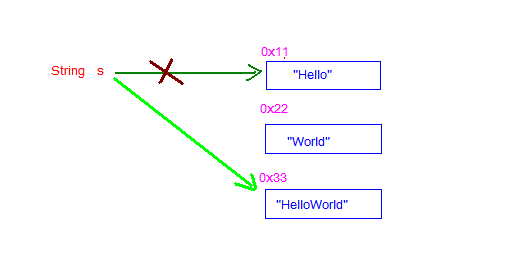
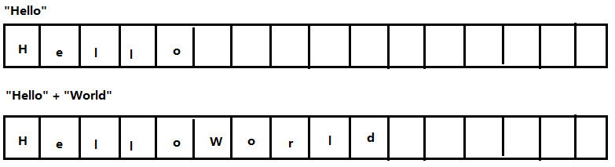

# day08【API、String类、StringBuilder类】

## 今日内容

*  String类


*  StringBuilder类


# 第一章 API

## 1.1 概述

API(Application Programming Interface)，应用程序编程接口。这些类将底层的代码实现封装了起来，我们不需要关心这些类是如何实现的，只需要学习这些类如何使用即可。所以我们可以通过查询API的方式，来学习Java提供的类，并得知如何使用它们.

## 1.2 API使用步骤

1. 打开帮助文档。
2. 点击显示，找到索引，看到输入框。
3. 你要找谁？在输入框里输入，然后回车。
4. 看包。java.lang下的类不需要导包，其他需要。
5. 看类的解释和说明。
6. 学习构造方法。
7. 使用成员方法。

## 1.3 API使用练习

了解了API的使用方式，我们通过Scanner类和Random类，熟悉一下查询API，并使用类的步骤。

- 练习1：获取键盘录入的字符串

  **查看类**

  - `java.util.Scanner` ：该类需要import导入后使用。 

  **查看构造方法**

  - `public Scanner(InputStream source)` : 构造一个新的 `Scanner`，它生成的值是从指定的输入流扫描的。

  **查看成员方法**

  - ` public int nextInt() `：获取下一个int数字。
  - ` public String nextLine() `：获取下一行完整字符串。

使用Scanner类，完成接收键盘录入数据的操作，代码如下：

```java
//1. 导包
import java.util.Scanner;
public class Demo01_Scanner {
  	public static void main(String[] args) {
    	//2. 创建键盘录入数据的对象
    	Scanner sc = new Scanner(System.in);

    	//3. 接收数据
    	System.out.println("请录入一个字符串：");
    	String line = sc.next();

    	//4. 输出数据
    	System.out.println("您输入的字符串:"+line);
  	}
}
```


- 练习2：获取一个1-33之间（包含1和33）的随机数字

  **查看类**

  - `java.util.Random` ：该类需要 import导入使后使用。 

  **查看构造方法**

  - `public Random()`：创建一个新的随机数生成器。

  **查看成员方法**

  - ` public int nextInt(int n) `：返回一个伪随机数，范围在 `0` （包括）和`指定值 n` （不包括）之间的 `int` 值。

```java
//1. 导包
import java.util.Random;
public class Demo01_Random {
  	public static void main(String[] args) {
        //2. 创建键盘录入数据的对象
        Random r = new Random();
        //3. 随机生成一个数据
        int number = r.nextInt(33)+1;
        //4. 输出数据
        System.out.println("number:"+ number);        
    }
}
```

> 备注：创建一个`Random`对象，每次调用`nextInt()`方法，都会生成一个随机数。

# 第二章 String类

## 2.1 String类概述

### 概述

`java.lang.String` 类代表字符串。Java程序中所有的字符串文字（例如`"abc"` ）都可以被看作是实现此类的实例。

类 `String` 中包括用于检查各个字符串的方法，比如用于**比较**字符串，**搜索**字符串，**提取**子字符串以及创建具有翻译为**大写**或**小写**的所有字符的字符串的副本。 

### 特点

1.  字符串不变：字符串的值在创建后不能被更改。

```java
String s1 = "abc";
s1 += "d";
System.out.println(s1); // "abcd" 
// 内存中有"abc"，"abcd"两个对象，s1从指向"abc"，改变指向，指向了"abcd"。
```

2. 因为String对象是不可变的，所以它们可以被共享。

```java
String s1 = "abc";
String s2 = "abc";
// 内存中只有一个"abc"对象被创建，同时被s1和s2共享。
```

3. `"abc"` 等效于 `char[] data={ 'a' , 'b' , 'c' }`，但是底层原理是字节数组( byte[] )

```java
例如： 
String str = "abc";
相当于： 
char data[] = {'a', 'b', 'c'};     
String str = new String(data);
// String底层是靠字符数组实现的。
```
## 2.2 构造方法

* 查看类

  * `java.lang.String` ：此类不需要导入。 

* 查看构造方法

  * `public String() ` ：初始化新创建的 String对象，以使其表示空字符序列。

  * `public String(char[] value) ` ：通过当前参数中的字符数组来构造新的String。

  * `public String(byte[] bytes) ` ：通过使用平台的默认字符集解码当前参数中的字节数组来构造新的String。

  * 直接赋值的方式创建字符串对象

    构造举例，代码如下：


```java
public class StringDemo01 {
    public static void main(String[] args) {
        //public String()：创建一个空白字符串对象，不含有任何内容
        String s1 = new String();
        System.out.println("s1:" + s1);

        //public String(char[] chs)：根据字符数组的内容，来创建字符串对象
        char[] chs = {'a', 'b', 'c'};
        String s2 = new String(chs);
        System.out.println("s2:" + s2);

        //public String(byte[] bys)：根据字节数组的内容，来创建字符串对象
        byte[] bys = {97, 98, 99};
        String s3 = new String(bys);
        System.out.println("s3:" + s3);

        //String s = “abc”;	直接赋值的方式创建字符串对象，内容就是abc
        String s4 = "abc";
        System.out.println("s4:" + s4);
    }
}
```


## 2.3 常用方法

### 判断功能的方法

* `public boolean equals (Object anObject) ` ：将此字符串与指定对象进行比较。

* ` public boolean equalsIgnoreCase (String anotherString) ` ：将此字符串与指定对象进行比较，忽略大小写。

  方法演示，代码如下：

  ```java
  /*
    判断功能的方法举例
     s1.equals(s2):比较s1和s2的内容是否一模一样,如果一样返回true,否则返回false
     s1.equalsIgnoreCase(s2):比较s1和s2的内容是否相同,但是不区分大小写
     s1.contains(s2): 判断s1中是否包含s2,包含则返回true,不包含则返回false
   */
  public class String_Demo01 {
    public static void main(String[] args) {
      // 创建字符串对象
      String s1 = "hello";
      String s2 = "hello";
      String s3 = "HELLO";
  
      // boolean equals(Object obj):比较字符串的内容是否相同
      System.out.println(s1.equals(s2)); // true
      System.out.println(s1.equals(s3)); // false
      System.out.println("-----------");
  
      //boolean equalsIgnoreCase(String str):比较字符串的内容是否相同,忽略大小写
      System.out.println(s1.equalsIgnoreCase(s2)); // true
      System.out.println(s1.equalsIgnoreCase(s3)); // true
      System.out.println("-----------");
    }
  }
  ```

> Object 是” 对象”的意思，也是一种引用类型。作为参数类型，表示任意对象都可以传递到方法中。

### 创建字符串对象两种方式的区别

- 通过构造方法创建

   **通过 new 创建的字符串对象，每一次 new 都会申请一个内存空间，虽然内容相同，但是地址值不同**

- 直接赋值方式创建

   **以“”方式给出的字符串，只要字符序列相同(顺序和大小写)，无论在程序代码中出现几次，JVM 都只会建立一个 String 对象，并在字符串池中维护**

### 字符串的比较：==号和equals的作用

- ==比较基本数据类型：比较的是具体的值
- ==比较引用数据类型：比较的是对象地址值
- equals比较String类型: 比较的是对象的内容是否相同

```java
/*
    使用 == 做比较：
        基本类型：比较的是数据值是否相同
        引用类型：比较的是地址值是否相同

     public boolean equals(Object anObject)：
        将此字符串与指定对象进行比较。由于我们比较的是字符串对象，所以参数直接传递一个字符串
 */
public class StringDemo02 {
    public static void main(String[] args) {
        //构造方法的方式得到对象
        char[] chs = {'a', 'b', 'c'};
        String s1 = new String(chs);
        String s2 = new String(chs);

        //直接赋值的方式得到对象
        String s3 = "abc";
        String s4 = "abc";

        //比较字符串对象地址是否相同
        System.out.println(s1 == s2);//false
        System.out.println(s1 == s3);//false
        System.out.println(s3 == s4);//true
        System.out.println("--------");

        //比较字符串内容是否相同
        System.out.println(s1.equals(s2));//true
        System.out.println(s1.equals(s3));//true
        System.out.println(s3.equals(s4));//true
    }
}

```


### 获取功能的方法

- `public int length () ` ：返回此字符串的长度。

- `public String concat (String str)` ：将指定的字符串连接到该字符串的末尾。

- ` public char charAt (int index) ` ：返回指定索引处的 char值。

- `public int indexOf (String str) ` ：返回指定子字符串第一次出现在该字符串内的索引。

- ` public String substring (int beginIndex) ` ：返回一个子字符串，从beginIndex开始截取字符串到字符串结尾。

- ` public String substring (int beginIndex, int endIndex) ` ：返回一个子字符串，从beginIndex到endIndex截取字符串。含beginIndex，不含endIndex。


方法演示，代码如下：

```java
/*
    获取功能的方法
    - public int length () ：返回此字符串的长度。
        举例:s.length() 获取s中的字符的数量

    - public String concat (String str) ：将指定的字符串连接到该字符串的末尾。
        举例:s1.cocat(s2) 把s2连接到s1的末尾

    - public char charAt (int index) ：返回指定索引处的 char值。
        举例:s1.charAt(5) 获取s1中索引为5的字符

    - public int indexOf (String str) ：返回指定子字符串第一次出现在该字符串内的索引。
         举例:s1.indexOf(s2) 查找s2在s1中第一次出现的位置,如果不存在,返回-1

    - public String substring (int beginIndex) ：返回一个子字符串，从beginIndex开始截取字符串到字符串结尾。
        举例:s1.substring(5) 截取s1字符串从索引5开始一直到最后的内容

    - public String substring (int beginIndex, int endIndex) ：
        返回一个子字符串，从beginIndex到endIndex截取字符串。含beginIndex，不含endIndex。
        举例:s1.substring(5,10) 截取s1字符串从索引5开始一直到索引10之间的内容(包含5,不包含10)
 */
public class String_Demo02 {
  public static void main(String[] args) {
    //创建字符串对象
    String s = "helloworld";

    // int length():获取字符串的长度，其实也就是字符个数
    System.out.println(s.length());
    System.out.println("--------");

    // String concat (String str):将将指定的字符串连接到该字符串的末尾.
    String s = "helloworld";
    String s2 = s.concat("**hello doit");
    System.out.println(s2);// helloworld**hello doit

    // char charAt(int index):获取指定索引处的字符
    System.out.println(s.charAt(0));
    System.out.println(s.charAt(1));
    System.out.println("--------");

    // int indexOf(String str):获取str在字符串对象中第一次出现的索引,没有返回-1
    System.out.println(s.indexOf("l"));
    System.out.println(s.indexOf("owo"));
    System.out.println(s.indexOf("ak"));
    System.out.println("--------");

    // String substring(int start):从start开始截取字符串到字符串结尾
    System.out.println(s.substring(0));
    System.out.println(s.substring(5));
    System.out.println("--------");

    // String substring(int start,int end):从start到end截取字符串。含start，不含end。
    System.out.println(s.substring(0, s.length()));
    System.out.println(s.substring(3,8));
  }
}
```

### 转换功能的方法

- `public char[] toCharArray () ` ：将此字符串转换为新的字符数组。 
- ` public byte[] getBytes () ` ：使用平台的默认字符集将该 String编码转换为新的字节数组。
- `public String replace (CharSequence target, CharSequence replacement) ` ：将与target匹配的字符串使用replacement字符串替换。

方法演示，代码如下：

```java
/*
    转换功能的方法

    - public char[] toCharArray () ：把字符串变成对应的字符数组。
        举例:s1.toCharArray() 把s1变成字符数组

    - public byte[] getBytes () ：把字符串变成对应的字节数组。
        举例:s1.getBytes() 把s1变成字节数组

    - public String replace (String oldStr, String newStr) ：把字符串中的所有的oldStr替换成newStr。
        举例:s1.replace("a","A") 把s1中的所有的"a"替换成"A"

 */
public class String_Demo03 {
  public static void main(String[] args) {
    //创建字符串对象
    String s = "abcde";

    // char[] toCharArray():把字符串转换为字符数组
    char[] chs = s.toCharArray();
    for(int x = 0; x < chs.length; x++) {
      System.out.println(chs[x]);
    }
    System.out.println("-----------");

    // byte[] getBytes ():把字符串转换为字节数组
    byte[] bytes = s.getBytes();
    for(int x = 0; x < bytes.length; x++) {
      System.out.println(bytes[x]);
    }
    System.out.println("-----------");

    // 替换字母it为大写IT
    String str = "doit doit";
    String replace = str.replace("it", "IT");
    System.out.println(replace); // doIT doIT
    System.out.println("-----------");
  }
}
```

> CharSequence 是一个接口，也是一种引用类型。作为参数类型，可以把String对象传递到方法中。

### 分割功能的方法

* `public String[] split(String regex)` ：将此字符串按照给定的regex（规则）拆分为字符串数组。

方法演示，代码如下：

  ```java
/*
    分割功能的方法
    - public String[] split(String regex) ：将此字符串按照给定的regex（规则）拆分为字符串数组
        举例: "a,b,c,d".split(",") 把"a,b,c,d"按照逗号切割,将切割后的子字符串存入String[]中
 */
public class String_Demo03 {
  public static void main(String[] args) {
    //创建字符串对象
    String s = "aa,bb,cc";
    String[] strArray = s.split(","); // ["aa","bb","cc"]
    for(int x = 0; x < strArray.length; x++) {
      System.out.println(strArray[x]); // aa bb cc
    }
  }
}
  ```

## 2.4 String类的练习

### 遍历字符串

键盘录入一个字符串，使用程序实现在控制台遍历该字符串

```java
/*
    思路：
        1:键盘录入一个字符串，用 Scanner 实现
        2:遍历字符串，首先要能够获取到字符串中的每一个字符
            public char charAt(int index)：返回指定索引处的char值，字符串的索引也是从0开始的
        3:遍历字符串，其次要能够获取到字符串的长度
            public int length()：返回此字符串的长度
            数组的长度：数组名.length
            字符串的长度：字符串对象.length()
        4:遍历字符串的通用格式
 */
public class StringTest02 {
    public static void main(String[] args) {
        //键盘录入一个字符串，用 Scanner 实现
        Scanner sc = new Scanner(System.in);

        System.out.println("请输入一个字符串：");
        String line = sc.nextLine();

        for(int i=0; i<line.length(); i++) {
            System.out.println(line.charAt(i));
        }
    }
}
```

### 统计字符次数

键盘录入一个字符串，统计该字符串中大写字母字符，小写字母字符，数字字符出现的次数(不考虑其他字符)

```java
/*
  思路：
        1:键盘录入一个字符串，用 Scanner 实现
        2:要统计三种类型的字符个数，需定义三个统计变量，初始值都为0
        3:遍历字符串，得到每一个字符
        4:判断该字符属于哪种类型，然后对应类型的统计变量+1
            假如ch是一个字符，我要判断它属于大写字母，小写字母，还是数字，直接判断该字符是否在对应的范围即可
            大写字母：ch>='A' && ch<='Z'
            小写字母： ch>='a' && ch<='z'
            数字： ch>='0' && ch<='9'
        5:输出三种类型的字符个数
 */
public class StringTest03 {
    public static void main(String[] args) {
        //键盘录入一个字符串，用 Scanner 实现
        Scanner sc = new Scanner(System.in);

        System.out.println("请输入一个字符串：");
        String line = sc.nextLine();

        //要统计三种类型的字符个数，需定义三个统计变量，初始值都为0
        int bigCount = 0;
        int smallCount = 0;
        int numberCount = 0;

        //遍历字符串，得到每一个字符
        for(int i=0; i<line.length(); i++) {
            char ch = line.charAt(i);

            //判断该字符属于哪种类型，然后对应类型的统计变量+1
            if(ch>='A' && ch<='Z') {
                bigCount++;
            } else if(ch>='a' && ch<='z') {
                smallCount++;
            } else if(ch>='0' && ch<='9') {
                numberCount++;
            }
        }

        //输出三种类型的字符个数
        System.out.println("大写字母：" + bigCount + "个");
        System.out.println("小写字母：" + smallCount + "个");
        System.out.println("数字：" + numberCount + "个");
    }
}
```

### 字符串反转

定义一个方法，实现字符串反转。键盘录入一个字符串，调用该方法后，在控制台输出结果

	例如，键盘录入 abc，输出结果 cba

```java
/*
    思路：
        1:键盘录入一个字符串，用 Scanner 实现
        2:定义一个方法，实现字符串反转。返回值类型 String，参数 String s
        3:在方法中把字符串倒着遍历，然后把每一个得到的字符拼接成一个字符串并返回
        4:调用方法，用一个变量接收结果
        5:输出结果
 */
public class StringTest05 {
    public static void main(String[] args) {
        //键盘录入一个字符串，用 Scanner 实现
        Scanner sc = new Scanner(System.in);

        System.out.println("请输入一个字符串：");
        String line = sc.nextLine();

        //调用方法，用一个变量接收结果
        String s = reverse(line);

        //输出结果
        System.out.println("s:" + s);
    }

    //定义一个方法，实现字符串反转
    /*
        两个明确：
            返回值类型：String
            参数：String s
     */
    public static String reverse(String s) {
        //在方法中把字符串倒着遍历，然后把每一个得到的字符拼接成一个字符串并返回
        String ss = "";

        for(int i=s.length()-1; i>=0; i--) {
            ss += s.charAt(i);
        }

        return ss;
    }
}
```

# 第三章 StringBuilder类

## 3.1 字符串拼接问题

由于String类的对象内容不可改变，所以每当进行字符串拼接时，总是会在内存中创建一个新的对象。例如：

```java
public class StringDemo {
    public static void main(String[] args) {
        String s = "Hello";
        s += "World";
        System.out.println(s);
    }
}
```

在API中对String类有这样的描述：**字符串是常量，它们的值在创建后不能被更改。**

根据这句话分析我们的代码，其实总共产生了三个字符串，即`"Hello"`、`"World"`和`"HelloWorld"`。引用变量s首先指向`Hello`对象，最终指向拼接出来的新字符串对象，即`HelloWord` 。



由此可知，如果对字符串进行拼接操作，每次拼接，都会构建一个新的String对象，既耗时，又浪费空间。为了解决这一问题，可以使用`java.lang.StringBuilder`类。

## 3.2 StringBuilder概述

查阅`java.lang.StringBuilder`的API，StringBuilder又称为可变字符序列，它是一个类似于 String 的字符串缓冲区，通过某些方法调用可以改变该序列的长度和内容。

原来StringBuilder是个字符串的缓冲区，即它是一个容器，容器中可以装很多字符串。并且能够对其中的字符串进行各种操作。

它的内部拥有一个数组用来存放字符串内容，进行字符串拼接时，直接在数组中加入新内容。StringBuilder会自动维护数组的扩容。原理如下图所示：(默认16字符空间，超过自动扩充)



## 3.3 StringBuilder类和String类的区别

- String类：内容是不可变的
- StringBuilder类：内容是可变的

## 3.4 构造方法

根据StringBuilder的API文档，常用构造方法有2个：

- `public StringBuilder()`：构造一个空的StringBuilder容器。

- `public StringBuilder(String str)`：构造一个StringBuilder容器，并将字符串添加进去

  ```java
  public class StringBuilderDemo01 {
      public static void main(String[] args) {
          //public StringBuilder()：创建一个空白可变字符串对象，不含有任何内容
          StringBuilder sb = new StringBuilder();
          System.out.println("sb:" + sb);
          System.out.println("sb.length():" + sb.length());
  
          //public StringBuilder(String str)：根据字符串的内容，来创建可变字符串对象
          StringBuilder sb2 = new StringBuilder("hello");
          System.out.println("sb2:" + sb2);
          System.out.println("sb2.length():" + sb2.length());
      }
  }
  ```


## 3.5 常用方法

StringBuilder常用的方法有3个：

- `public StringBuilder append(...)`：添加任意类型数据的字符串形式，并返回当前对象自身。
- `public StringBuilder reverse()`：返回反转的字符序列
- `public String toString()`：将当前StringBuilder对象转换为String对象。

代码简单演示

```java
public class StringBuilderDemo01 {
    public static void main(String[] args) {
        //创建对象
        StringBuilder sb = new StringBuilder();

        //public StringBuilder append(任意类型)：添加数据，并返回对象本身
//        StringBuilder sb2 = sb.append("hello");
//
//        System.out.println("sb:" + sb);
//        System.out.println("sb2:" + sb2);
//        System.out.println(sb == sb2);

//        sb.append("hello");
//        sb.append("world");
//        sb.append("java");
//        sb.append(100);

        //链式编程
        sb.append("hello").append("world").append("java").append(100);

        System.out.println("sb:" + sb);

        //public StringBuilder reverse()：返回相反的字符序列
        sb.reverse();
        System.out.println("sb:" + sb);
        String str = sb.toString();
        System.out.println("str: "+str);
    }
}
```

> 备注：StringBuilder已经覆盖重写了Object当中的toString方法。

### 3.6 StringBuilder和String相互转换

- StringBuilder转换为String

         public String toString()：通过 toString() 就可以实现把 StringBuilder 转换为 String

- String转换为StringBuilder

         public StringBuilder(String s)：通过构造方法就可以实现把 String 转换为 StringBuilder

- 示例代码

```java
public class StringBuilderDemo02 {
    public static void main(String[] args) {
        /*
        //StringBuilder 转换为 String
        StringBuilder sb = new StringBuilder();
        sb.append("hello");

        //String s = sb; //这个是错误的做法

        //public String toString()：通过 toString() 就可以实现把 StringBuilder 转换为 String
        String s = sb.toString();
        System.out.println(s);
        */

        //String 转换为 StringBuilder
        String s = "hello";

        //StringBuilder sb = s; //这个是错误的做法

        //public StringBuilder(String s)：通过构造方法就可以实现把 String 转换为 StringBuilder
        StringBuilder sb = new StringBuilder(s);

        System.out.println(sb);
    }
}
```

## 3.7 StringBuilder练习

- 字符串反转

定义一个方法，实现字符串反转。键盘录入一个字符串，调用该方法后，在控制台输出结果

	例如，键盘录入abc，输出结果 cba

```java
/*
    思路：
        1:键盘录入一个字符串，用 Scanner 实现
        2:定义一个方法，实现字符串反转。返回值类型 String，参数 String s
        3:在方法中用StringBuilder实现字符串的反转，并把结果转成String返回
        4:调用方法，用一个变量接收结果
        5:输出结果
 */
public class StringBuilderTest02 {
    public static void main(String[] args) {
        //键盘录入一个字符串，用 Scanner 实现
        Scanner sc = new Scanner(System.in);

        System.out.println("请输入一个字符串：");
        String line = sc.nextLine();

        //调用方法，用一个变量接收结果
        String s = myReverse(line);

        //输出结果
        System.out.println("s:" + s);
    }

    //定义一个方法，实现字符串反转。返回值类型 String，参数 String s
    /*
        两个明确：
            返回值类型：String
            参数：String s
     */
    public static String myReverse(String s) {
        //在方法中用StringBuilder实现字符串的反转，并把结果转成String返回
        //String --- StringBuilder --- reverse() --- String
//        StringBuilder sb = new StringBuilder(s);
//        sb.reverse();
//        String ss = sb.toString();
//        return ss;

       return new StringBuilder(s).reverse().toString();
    }
}
```

