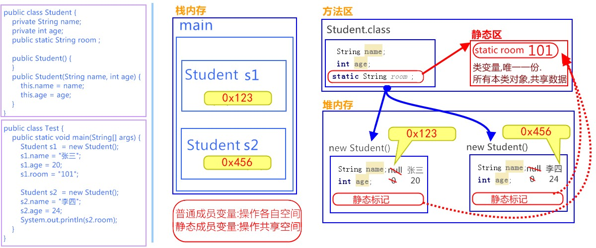

# day03 面向对象【修饰符，内部类，参数传递】

## 今日内容

- static
- 访问权限
- 内部类
- 引用类型参数

# 第一章 static关键字

## 1.1 概述

static是静态修饰符，一般修饰成员。被static修饰的成员属于类，不属于单个这个类的某个对象。static修饰的成员被多个对象共享。static修饰的成员属于类，但是会影响每一个对象。被static修饰的成员又叫类成员，不叫对象的成员。

## 1.2 static特点

- **被static修饰的成员变量属于类，不属于这个类的某个对象**。（也就是说，多个对象在访问或修改static修饰的成员变量时，其中一个对象将static成员变量值进行了修改，其他对象中的static成员变量值跟着改变，即多个对象共享同一个static成员变量)

```java
class Demo {
	public static int num = 100;
}

class Test {
	public static void main(String[] args) {
		Demo d1 = new Demo();
		Demo d2 = new Demo();
		d1.num = 200;
		System.out.println(d1.num); //结果为200
		System.out.println(d2.num); //结果为200
      	}
}
```

- 静态内容是优先于对象存在，只能访问静态，不能使用this/super。静态修饰的内容存于静态区。

```java
class Demo {
	//成员变量
	public int num = 100;
	//静态方法
	public static void method(){
		//this.num; 不能使用this/super。
		//System.out.println(this.num);//报错
	}
}
```

- 同一个类中，静态成员只能访问静态成员

```java
class Demo {
	//成员变量
	public int num = 100;
	//静态成员变量
	public static int count = 200;
	//静态方法
	public static void method(){
		//System.out.println(num); 静态方法中，只能访问静态成员变量或静态成员方法
		System.out.println(count);
	}
}
```


## 1.3 static使用格式

被static修饰的成员可以并且建议通过类名直接访问。

```java
类名.静态成员变量名
类名.静态成员方法名(参数)
对象名.静态成员变量名     	------不建议使用该方式，会出现警告
对象名.静态成员方法名(参数) 	------不建议使用该方式，会出现警告； 
```

举例：

```java
class Demo {
	//静态成员变量
	public static int num = 100;
	//静态方法
	public static void method(){
		System.out.println("静态方法");
	}
}
class Test {
	public static void main(String[] args) {
		System.out.println(Demo.num);
		Demo.method();
	}
}
```

## 2.4 静态原理图解

`static` 修饰的内容：

- 是随着类的加载而加载的，且只加载一次。
- 存储于一块固定的内存区域（静态区），所以，可以直接被类名调用。
- 它优先于对象存在，所以，可以被所有对象共享。



## 2.5 静态代码块

- **静态代码块**：定义在成员位置，使用static修饰的代码块{ }。
  - 位置：类中方法外。
  - 执行：随着类的加载而执行且执行一次，优先构造方法的执行。

格式：

```java
public class Person {
	private String name;
	private int age;
 //静态代码块
	static{
		System.out.println("静态代码块执行了");
	}
}
```

## 2.6 定义静态常量 

开发中，我们想在类中定义一个静态常量，通常使用public static final修饰的变量来完成定义。此时变量名用全部大写，多个单词使用下划线连接。

```java
定义格式：
public static final 数据类型 变量名 = 值;
```

如下演示：

```java
class Company {
     //比如公司名称公司地址 可能会很长很长 我们记不住 每次使用还容易打错
    //这时将其定义为静态常量 方便访问 还不容易出错
	public static final String COMPANY_NAME = "多易教育";
}
```

当我们想使用类的静态成员时，不需要创建对象，直接使用类名来访问即可。

```java
System.out.println(Company.COMPANY_NAME); //打印多易教育
```

**注意:**接口中的每个成员变量都默认使用public static final修饰。

所有接口中的成员变量已是静态常量，由于接口没有构造方法，所以必须显示赋值。可以直接用接口名访问。

```java
interface Inter {
	public static final int COUNT = 100;
}
```

访问接口中的静态变量

```java
Inter.COUNT
```

## 2.6 静态导入(了解)

 静态导入就是java包的静态导入，使用import static 静态导入包 , 这样可以直接使用方法名去调用静态的方法。

静态导入格式: 

```java
import static 包名.类名.方法名;
import static 包名.类名.*;
```

定义A类 如下, 含有两个静态方法 :  

```java
package com.doit; 
public class A {
    public static void print(Object s){
        System.out.println(s);
    }

    public static void print2(Object s){
        System.out.println(s);
    }
}
```

 静态导入一个类的某个静态方法 ,  使用static和类名A .方法名 , 表示导入A类中的指定方法 , 代码演示 :  

```java
import static com.doit.A.print;
public class Demo {
    public static void main(String[] args) {
        print("test string");
    }
}
```

如果有多个静态方法  , 使用static和类名A . * , 表示导入A类里的所有的静态方法, 代码演示 :

```java
import static com.doit.A.*;
public class Demo {
    public static void main(String[] args) {
        print("test string");
        print2("test2 string");
    }
}
```

#第二章 权限修饰符

## 2.1 概述

在Java中提供了四种访问权限，使用不同的访问权限修饰符修饰时，被修饰的内容会有不同的访问权限，

- public：公共的。
- protected：受保护的
- default：默认的
- private：私有的

## 2.2 不同权限的访问能力

|              | public | protected | default（空的） | private |
| ------------ | ------ | --------- | ----------- | ------- |
| 同一类中         | √      | √         | √           | √       |
| 同一包中(子类与无关类) | √      | √         | √           |         |
| 不同包的子类       | √      | √         |             |         |
| 不同包中的无关类     | √      |           |             |         |

可见，public具有最大权限。private则是最小权限。

编写代码时，如果没有特殊的考虑，建议这样使用权限：

- 成员变量使用`private` ，隐藏细节。
- 构造方法使用` public` ，方便创建对象。
- 成员方法使用`public` ，方便调用方法。

> 小贴士：不加权限修饰符，其访问能力与default修饰符相同

# 第三章 内部类

## 3.1 概述

### 什么是内部类

将一个类A定义在另一个类B里面，里面的那个类A就称为**内部类**，B则称为**外部类**。

## 3.2 成员内部类

* **成员内部类** ：定义在**类中方法外**的类。

定义格式：

```java
class 外部类 {
    class 内部类{

    }
}
```

在描述事物时，若一个事物内部还包含其他事物，就可以使用内部类这种结构。比如，汽车类`Car` 中包含发动机类`Engine` ，这时，`Engine `就可以使用内部类来描述，定义在成员位置。

代码举例：

```java
class Car { //外部类
    class Engine { //内部类

    }
}
```

###  访问特点

- 内部类可以直接访问外部类的成员，包括私有成员。

- 外部类要访问内部类的成员，必须要建立内部类的对象。

创建内部类对象格式：

```java
外部类名.内部类名 对象名 = new 外部类型().new 内部类型()；
```

访问演示，代码如下：

定义类：

```java
public class Person {
    private  boolean live = true;
    class Heart {
        public void jump() {
            // 直接访问外部类成员
            if (live) {
                System.out.println("心脏在跳动");
            } else {
                System.out.println("心脏不跳了");
            }
        }
    }

    public boolean isLive() {
        return live;
    }

    public void setLive(boolean live) {
        this.live = live;
    }

}
```

定义测试类：

```java
public class InnerDemo {
    public static void main(String[] args) {
        // 创建外部类对象 
        Person p  = new Person();
        // 创建内部类对象
        Person.Heart heart = p.new Heart();
        // 调用内部类方法
        heart.jump();
        // 调用外部类方法
        p.setLive(false);
        // 调用内部类方法
        heart.jump();
    }
}
输出结果:
心脏在跳动
心脏不跳了
```

> 内部类仍然是一个独立的类，在编译之后会内部类会被编译成独立的.class文件，但是前面冠以外部类的类名和$符号 。
>
> 比如，Person$Heart.class  

## 3.3 匿名内部类

* **匿名内部类** ：是内部类的简化写法。它的本质是一个`带具体实现的` `父类或者父接口的` `匿名的` **子类对象**。

开发中，最常用到的内部类就是匿名内部类了。以接口举例，当你使用一个接口时，似乎得做如下几步操作，

1. 定义子类
2. 重写接口中的方法
3. 创建子类对象
4. 调用重写后的方法

我们的目的，最终只是为了调用方法，那么能不能简化一下，把以上四步合成一步呢？匿名内部类就是做这样的快捷方式。

### 前提

存在一个**类或者接口**，这里的**类可以是具体类也可以是抽象类**。

### 格式

```java
new 父类名或者接口名(){
    // 方法重写
    @Override 
    public void method() {
        // 执行语句
    }
};

```

### 使用方式

以接口为例，匿名内部类的使用，代码如下：

定义接口：

```java
public abstract class FlyAble{
    public abstract void fly();
}
```

匿名内部类可以通过多态的形式接受

```java
public class InnerDemo01 {
    public static void main(String[] args) {
        /*
        	1.等号右边:定义并创建该接口的子类对象
        	2.等号左边:是多态,接口类型引用指向子类对象
       */
        FlyAble  f = new FlyAble(){
            public void fly() {
                System.out.println("我飞了~~~");
            }
        };
    }
}
```

匿名内部类直接调用方法

```java
public class InnerDemo02 {
    public static void main(String[] args) {
        /*
        	1.等号右边:定义并创建该接口的子类对象
        	2.等号左边:是多态,接口类型引用指向子类对象
       */
       	new FlyAble(){
            public void fly() {
                System.out.println("我飞了~~~");
            }
        }.fly();
    }
}
```

方法的形式参数是接口或者抽象类时，也可以将匿名内部类作为参数传递

```java
public class InnerDemo3 {
    public static void main(String[] args) {
        /*
        1.等号右边:定义并创建该接口的子类对象
        2.等号左边:是多态,接口类型引用指向子类对象
       */
        FlyAble  f = new FlyAble(){
            public void fly() {
                System.out.println("我飞了~~~");
            }
        };
        // 将f传递给showFly方法中
        showFly(f);
    }
    public static void showFly(FlyAble f) {
        f.fly();
    }
}
```

以上可以简化，代码如下：

```java
public class InnerDemo2 {
    public static void main(String[] args) {     	  
        /*
       	创建匿名内部类,直接传递给showFly(FlyAble f)
        */
        showFly( new FlyAble(){
            public void fly() {
                System.out.println("我飞了~~~");
            }
        });
    }

    public static void showFly(FlyAble f) {
        f.fly();
    }
}
```

# 第四章 引用类型的传递

## 4.1 类名作为方法参数和返回值

- 类名作为方法的形参

  方法的形参是类名，其实需要的是该类的对象

  实际传递的是该对象的【地址值】

- 类名作为方法的返回值

  方法的返回值是类名，其实返回的是该类的对象

  实际传递的，也是该对象的【地址值】

- 示例代码：

  ```java
  public class Person{
    public void eat(){
      System.out.println("人吃了");
    }
  }
  public class Test{
    public static void main(String[] args){
          method(new Person());
     		Person p = method2();
    }
    pubic static void method(Person p){
         p.eat();
    }
    public static Person method2(){
      	return new Person();
    }
  }
  
  ```


## 4.2 抽象类作为形参和返回值

- 抽象类作为形参和返回值

  - 方法的形参是抽象类名，其实需要的是该抽象类的子类对象
  - 方法的返回值是抽象类名，其实返回的是该抽象类的子类对象

- 示例代码：

  ```java
  public abstract class Animal{
    	public abstract void eat();
  }
  public class Cat extends Animal{
    public void eat(){
      System.out.println("猫吃鱼");
    }
  }
  public class Test{
    public static void main(String[] args){
        method(new Cat());
      
       Animal a = method2();
      
    }
    public static void method(Animal a){
         a.eat();
    }
    public static Animal method2(){
      	return new cat();
    }
  }
  
  ```

## 4.3 接口名作为形参和返回值

- 接口作为形参和返回值

  - 方法的形参是接口名，其实需要的是该接口的实现类对象
  - 方法的返回值是接口名，其实返回的是该接口的实现类对象

- 示例代码：

  ```java
   public interface Fly{
      public abstract void fly();
   }
  public class Bird implements Fly{
    public void fly(){
      System.out.println("我飞了");
    }
  }
  public class Test{
    public static void main(String[] args){
        method(new Bird());
      
       Fly f = method2();
      
    }
    public static void method(Fly f){
       	f.fly();
    }
    public static Fly method2(){
      	return new Bird();
    }
  }
  ```


# 第五章  综合练习

公司类

​	属性

​		总资产属性

​		所有员工属性

​	方法

​		发工资方法：从总资产中减去所有员工支出。

 

员工：

​	属性

​		姓名

​		工号

​		存款

​		工资

经理、厨师、服务员均为员工子类。经理在员工基础上添加奖金属性。发完工资后，请查看所有员工的存款情况.


公司类加入调整员工工资方法：

返回值为void	

参数为：被调整工资的员工与调整金额(涨工资为正数、降工资为负数)。

​		方法体逻辑为，在员工工资的基础上调整相应的金额

在上边需求基础上，添加评选幸运员工(随机抽取一名员工并返回)。

