# day15_Collections、树形结构、Set

## 主要内容

- Set集合
- 数据结构

# 第一章  Collections类

## 1.1 Collections常用功能

- `java.utils.Collections`是集合工具类，用来对集合进行操作。

  常用方法如下：


- `public static void shuffle(List<?> list) `:打乱集合顺序。
- `public static <T> void sort(List<T> list)`:根据元素的自然顺序 对指定列表按升序进行排序
- `public static <T> void sort(List<T> list，Comparator<? super T> )`:将集合中元素按照指定规则排序。

代码演示：

```java
public class CollectionsDemo {
    public static void main(String[] args) {
        ArrayList<Integer> list = new ArrayList<Integer>();
   
        list.add(100);
        list.add(300);
        list.add(200);
        list.add(50);
        //排序方法 
        Collections.sort(list);
        System.out.println(list);
    }
}
结果：
[50,100, 200, 300]
```

我们的集合存储的是java给我们提供的Integer类,进行排序,如果存储自定义类型会如何?

```java
public class Person{
  	private String name;
  	private int age;
  	.....
}


public class CollectionsDemo {
    public static void main(String[] args) {
        ArrayList<Person> list = new ArrayList<Person>();
         /*
         	我们发现当集合传入到sort方法时,sort方法报错 无法编译成功
         */
        //Collections.sort(list);
  
     
    }
}
```

为什么会报错?当我们到API中查询方法时发现

```java
public static <T extends Comparable<? super T>> void sort(List<T> list)  
```

注意泛型T,T为我们集合中存储数据的数据类型, 这是一个泛型方法, T extends Comparable 这是泛型的下限,说明T必须为Comparable的子类,Comparable是一个自然排序的接口,我们如果想要编译通过,必须让集合中存储的类型实现此接口,并重写compareTo方法.

```java
public class Person  implements Comparable<Person>{
  	private String name;
  	private int age;
  	.....
    
    /*
    	重写Comparable接口的compareTo的方法
    	那么这里面写什么?
    	写你的比较规则,多个Person对象做比较 
    	具体要比较什么,按照什么规则比较
    	比如可以按照年龄比较
    */
    @Override
    public int compareTo(Person other) {
      //调用方法的对象与 传入参数对象的比较 
      //this与other的比较 
      //如果this在前则升序排列,如果this在后则降序排列
      //this.age - other.age 为升序
      //other.age - this.age 为降序
        return this.age - other.age;  
    }            
}
public class Test {

    public static void main(String[] args) {
        List<Person> list = new ArrayList<>();

        list.add(new Person("柳岩",38));
        list.add(new Person("唐嫣",18));
        list.add(new Person("杨幂",138));
        list.add(new Person("金莲",8));

        Collections.sort(list);
        System.out.println(list);
    }
}
```

结果如下

​	

OK,这样我们就完成了比较,但是如果一个类实现了Comparable接口可以这样去比较,如果没有实现接口如何比较呢?

## 1.2 Comparator比较器

创建一个学生类，存储到ArrayList集合中完成指定排序操作。

Student 类

```java
public class Student{
    private String name;
    private int age;
	//构造方法
    //get/set
 	//toString
}
```

测试类：

```java
public class Demo {

    public static void main(String[] args) {
        // 创建四个学生对象 存储到集合中
        ArrayList<Student> list = new ArrayList<Student>();

        list.add(new Student("rose",18));
        list.add(new Student("jack",16));
        list.add(new Student("abc",20));
		Collections.sort(list, new Comparator<Student>() {
  		  @Override
    		public int compare(Student o1, Student o2) {
        	return o1.getAge()-o2.getAge();//以学生的年龄升序
   		 }
		});


        for (Student student : list) {
            System.out.println(student);
        }
    }
}
Student{name='jack', age=16}
Student{name='rose', age=18}
Student{name='abc', age=20}
```

# 第二章  数据结构--树

### 树基本结构介绍

树具有的特点：

1. 每一个节点有零个或者多个子节点 node
2. 没有父节点的节点称之为根节点
3. 每一个非根节点有且只有一个父节点
4. 除了根节点外，每个子节点可以分为多个不相交的子树


| 名词   | 含义                                   |
| ---- | ------------------------------------ |
| 节点   | 指树中的一个元素                             |
| 节点的度 | 节点拥有的子树的个数，二叉树的度不大于2                 |
| 叶子节点 | 度为0的节点，也称之为终端结点                      |
| 高度   | 叶子结点的高度为1，叶子结点的父节点高度为2，以此类推，根节点的高度最高 |
| 层    | 根节点在第一层，以此类推                         |
| 父节点  | 若一个节点含有子节点，则这个节点称之为其子节点的父节点          |
| 子节点  | 子节点是父节点的下一层节点                        |
| 兄弟节点 | 拥有共同父节点的节点互称为兄弟节点                    |

### 二叉查找树

二叉查找树的特点：

1. 左子树上所有的节点的值均小于等于他的根节点的值
2. 右子树上所有的节点值均大于或者等于他的根节点的值
3. 每一个子节点最多有两个子树

案例演示(20,18,23,22,17,24,19)数据的存储过程；

网站地址：https://www.cs.usfca.edu/~galles/visualization/Algorithms.html 

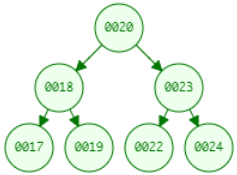

 

遍历获取元素的时候可以按照"左中右"的顺序进行遍历；

注意：二叉查找树存在的问题：会出现"瘸子"的现象，影响查询效率

### 平衡二叉树

#### 概述

为了避免出现"瘸子"的现象，减少树的高度，提高我们的搜素效率，又存在一种树的结构："平衡二叉树"

规则：**它的左右两个子树的高度差的绝对值不超过1，并且左右两个子树都是一棵平衡二叉树**

如下图所示：

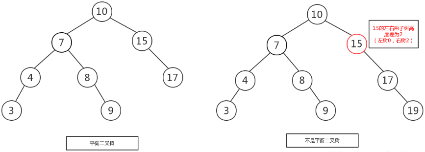 

如下图所示，左图是一棵平衡二叉树，根节点10，左右两子树的高度差是1，而右图，虽然根节点左右两子树高度差是0，但是右子树15的左右子树高度差为2，不符合定义，

所以右图不是一棵平衡二叉树。

#### 旋转

在构建一棵平衡二叉树的过程中，当有新的节点要插入时，检查是否因插入后而破坏了树的平衡，如果是，则需要做旋转去改变树的结构。

左旋：

**左旋就是将节点的右支往左拉，右子节点变成父节点，并把晋升之后多余的左子节点出让给降级节点的右子节点；**


右旋：

**将节点的左支往右拉，左子节点变成了父节点，并把晋升之后多余的右子节点出让给降级节点的左子节点**


举个例子，像上图是否平衡二叉树的图里面，左图在没插入前"19"节点前，该树还是平衡二叉树，但是在插入"19"后，导致了"15"的左右子树失去了"平衡"，

所以此时可以将"15"节点进行左旋，让"15"自身把节点出让给"17"作为"17"的左树，使得"17"节点左右子树平衡，而"15"节点没有子树，左右也平衡了。如下图，

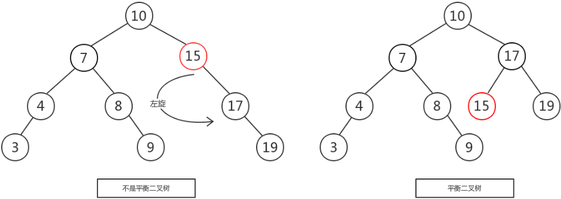 


由于在构建平衡二叉树的时候，当有**新节点插入**时，都会判断插入后时候平衡，这说明了插入新节点前，都是平衡的，也即高度差绝对值不会超过1。当新节点插入后，

有可能会有导致树不平衡，这时候就需要进行调整，而可能出现的情况就有4种，分别称作**左左，左右，右左，右右**。


#### 左左

左左即为在原来平衡的二叉树上，在节点的左子树的左子树下，有新节点插入，导致节点的左右子树的高度差为2，如下即为"10"节点的左子树"7"，的左子树"4"，插入了节点"5"或"3"导致失衡。

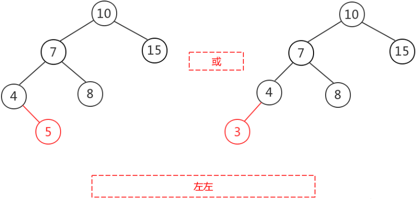 


左左调整其实比较简单，只需要对节点进行右旋即可，如下图，对节点"10"进行右旋，

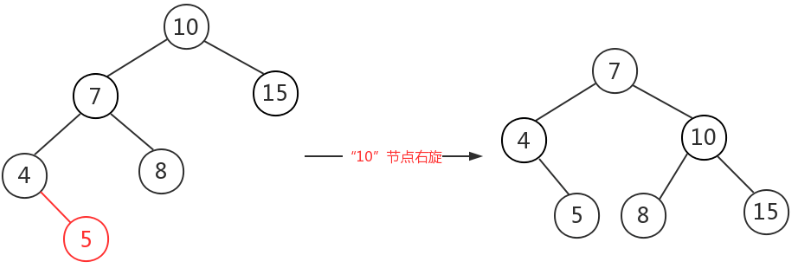 


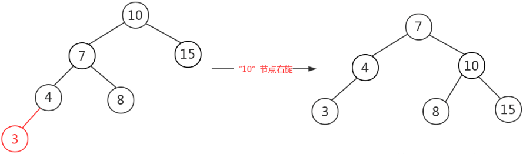 


#### 左右

左右即为在原来平衡的二叉树上，在节点的左子树的右子树下，有新节点插入，导致节点的左右子树的高度差为2，如上即为"11"节点的左子树"7"，的右子树"9"，

插入了节点"10"或"8"导致失衡。

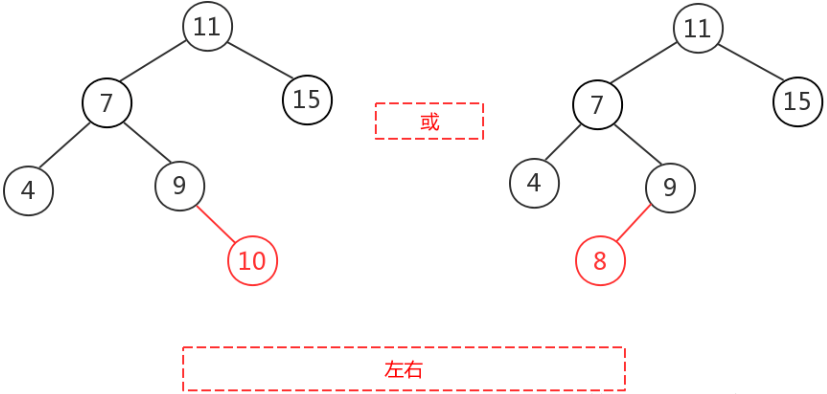 

左右的调整就不能像左左一样，进行一次旋转就完成调整。我们不妨先试着让左右像左左一样对"11"节点进行右旋，结果图如下，右图的二叉树依然不平衡，而右图就是接下来要

讲的右左，即左右跟右左互为镜像，左左跟右右也互为镜像。

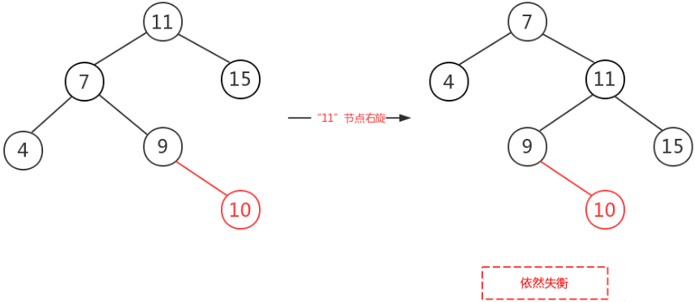 


左右这种情况，进行一次旋转是不能满足我们的条件的，正确的调整方式是，将左右进行第一次旋转，将左右先调整成左左，然后再对左左进行调整，从而使得二叉树平衡。

即先对上图的节点"7"进行左旋，使得二叉树变成了左左，之后再对"11"节点进行右旋，此时二叉树就调整完成，如下图:

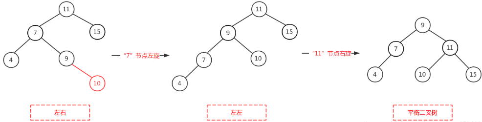 


#### 右左

右左即为在原来平衡的二叉树上，在节点的右子树的左子树下，有新节点插入，导致节点的左右子树的高度差为2，如上即为"11"节点的右子树"15"，的左子树"13"，

插入了节点"12"或"14"导致失衡。

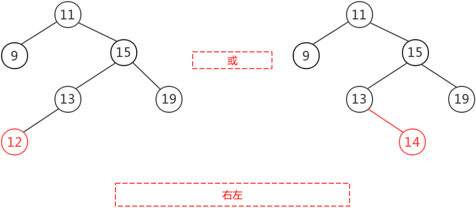 


前面也说了，右左跟左右其实互为镜像，所以调整过程就反过来，先对节点"15"进行右旋，使得二叉树变成右右，之后再对"11"节点进行左旋，此时二叉树就调整完成，如下图:

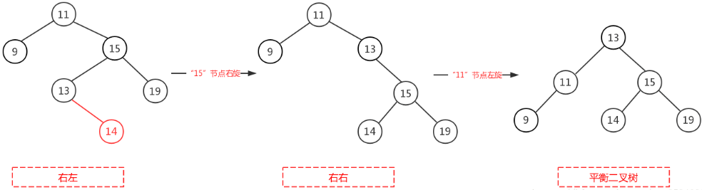 


#### 右右

右右即为在原来平衡的二叉树上，在节点的右子树的右子树下，有新节点插入，导致节点的左右子树的高度差为2，如下即为"11"节点的右子树"13"，的左子树"15"，插入了节点

"14"或"19"导致失衡。

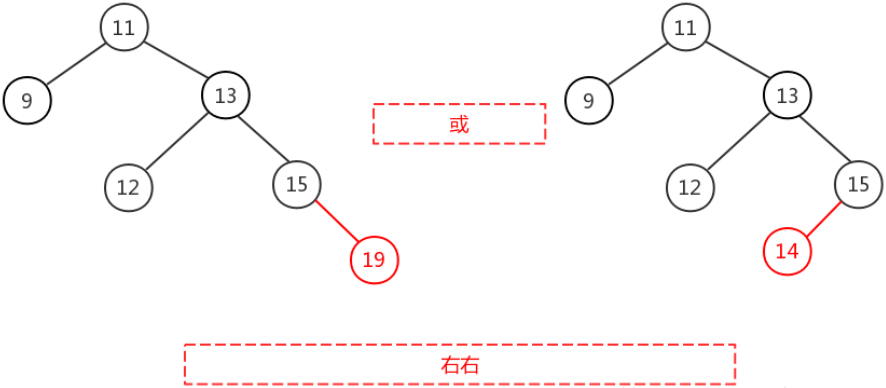 


右右只需对节点进行一次左旋即可调整平衡，如下图，对"11"节点进行左旋。

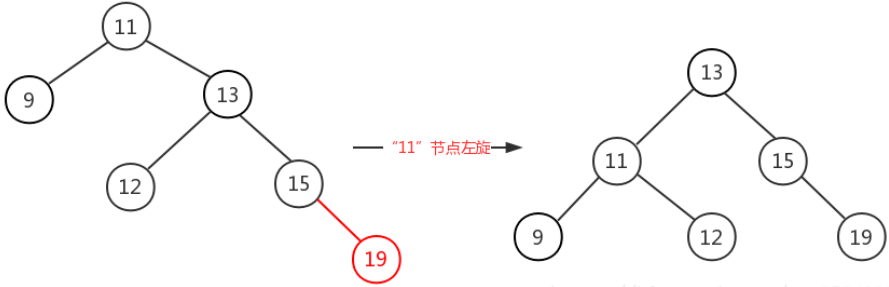 


平衡树是高度平衡的，频繁的插入会引起频繁的reblance，导致效率下降；

### 红黑树

#### 概述

红黑树是一种自平衡的二叉查找树，是计算机科学中用到的一种数据结构，它是在1972年由Rudolf Bayer发明的，当时被称之为平衡二叉B树，后来，在1978年被

Leoj.Guibas和Robert Sedgewick修改为如今的"红黑树"。它是一种特殊的二叉查找树，红黑树的每一个节点上都有存储位表示节点的颜色，可以是红或者黑；

红黑树不是高度平衡的，它的平衡是通过"红黑树的特性"进行实现的；

红黑树的特性：

1. 每一个节点或是红色的，或者是黑色的。
2. 根节点必须是黑色
3. 每个叶节点(Nil)是黑色的；（如果一个节点没有子节点或者父节点，则该节点相应的指针属性值为Nil，这些Nil视为叶节点）
4. 如果某一个节点是红色，那么它的子节点必须是黑色(不能出现两个红色节点相连的情况)
5. 对每一个节点，从该节点到其所有后代叶节点的简单路径上，均包含相同数目的黑色节点；

如下图所示就是一个

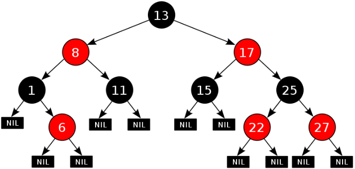 

在进行元素插入的时候，和之前一样； 每一次插入完毕以后，使用黑色规则进行校验，如果不满足红黑规则，就需要通过变色，左旋和右旋来调整树，使其满足红黑规则；

红黑树可以通过红色节点和黑色节点尽可能的保证二叉树的平衡，从而来提高效率。		

# 第三章 Set接口

`java.util.Set`接口和`java.util.List`接口一样，同样继承自`Collection`接口，它与`Collection`接口中的方法基本一致，并没有对`Collection`接口进行功能上的扩充，只是比`Collection`接口更加严格了。与`List`接口不同的是，`Set`接口中元素无序，并且都会以某种规则保证存入的元素不出现重复。

`Set`集合有多个子类，这里我们介绍其中的`java.util.TreeSet`、`java.util.HashSet`、`java.util.LinkedHashSet`这三个集合。

> tips:Set集合取出元素的方式可以采用：迭代器、增强for。

## 3.1 TreeSet集合介绍

使用元素的[自然顺序]对元素进行排序，或者根据创建 set 时提供的 [`Comparator`] 进行排序，具体取决于使用的构造方法。 这个集合的特点:可以对集合中存储的数据进行排序,并且保证元素的唯一.但是如果想要对集合存储的元素进行排序的话,要么存储的类型实现自然排序的接口Comparable,要么TreeSet集合在创建时,使用比较器Comparator,来指定比较的规则.

| 构造方法                                     | 描述                                |
| ---------------------------------------- | --------------------------------- |
| public TreeSet()                         | 构造一个新的空 set，该 set 根据其元素的自然顺序进行排序。 |
| public TreeSet(Comparator<? super E> comparator) | 构造一个新的空 TreeSet，它根据指定比较器进行排序。     |

代码演示:

```java
public class Test {

    public static void main(String[] args) {
      //Integer类实现了自然排序接口 所以可以直接使用
      TreeSet<Integer>  set = new TreeSet<>();

      set.add(20);
      set.add(40);
      set.add(30);
      set.add(10);
      set.add(10);

      System.out.println(set);
      
    }
}
```

结果如下:

​	

我们发现升序排列,并且去掉了重复元素.那么如果我们想降序排列怎么办呢?又不能修改Integer类,那么这时,可以在TreeSet的构造方法中传入比较器.

代码演示:

```java
public class Test {

    public static void main(String[] args) {
      TreeSet<Integer>  set = new TreeSet<>(new Comparator<Integer>() {
          @Override
          public int compare(Integer o1, Integer o2) {
              return Integer.compare(o2,o1);
          }
      });

      set.add(20);
      set.add(40);
      set.add(30);
      set.add(10);
      set.add(10);

      System.out.println(set);

    }
}
```

效果如下:

​	

OK!那么TreeSet集合是如何保证元素唯一,和进行排序的呢?我们来查看源码

```java
//TreeSet集合继承了AbstractSet实现了多个接口这里为了看起来方便 没有写出
public class TreeSet<E> {
    //因为TreeSet底层使用的是TreeMap集合的键 所以值就是一个常量 我们可以不管
	private static final Object PRESENT = new Object();
    
  	//底层调用的TreeMap的添加元素的方法  put方法 如果put方法返回值为null说明没有重复元素添加成功
    //如果put方法返回值不为null说明元素重复 添加失败
    public boolean add(E e) {
        return m.put(e, PRESENT)==null;
    }
}
public class TreeMap<K,V>  extends AbstractMap<K,V>{
    //在TreeMap中定义了一个比较器
     private final Comparator<? super K> comparator;
    //TreeMap底层用的是红黑树 Entry<K,V>就是节点 root代表是根节点
    //Entry中的K就是我们在Set中存储的数据
  	 private transient Entry<K,V> root;
     //集合长度
     private transient int size = 0;
    //定义一个变量 记录实际修改次数
     private transient int modCount = 0;
  
  
  	 public V put(K key, V value) {
       
       //创建一个节点t 记录root
        Entry<K,V> t = root;
       //如果 t==null说明没有根节点 第一次添加数据
       
        if (t == null) {
          	//比较传入过来的数据 为什么自己跟自己比较呢 这是在做检查
            //看看传入的元素能不能做比较 说白了就是是否实现了Comparable接口
            //如果传入的是null则抛空指针异常 .
            //如果不是null则进行比较 此时判断比较器是否是null 如果不是null用比较器比较
          // 如果比较器是null则用Comparable接口进行比较  如果在创建集合时没有传入比较器
          //那么比较器的值就是null 而类又没实现Comparable接口 这时就会抛异常
            compare(key, key); // type (and possibly null) check
			
            //使用传入过来的数据 创建一个新节点赋值给root
            root = new Entry<>(key, value, null);
            //设置长度为1
            size = 1; 
            //实际修改次数为+1
            modCount++;
          	//添加成功返回null
            return null;
        }
       
       //如果t!=null说明不是第一次添加数据 已经有了节点
        //定义一个变量 用来记录比较的结果
        int cmp;
        //定义一个父节点
        Entry<K,V> parent;
        //创建一个比较器对象 并使用传入的比较器为其赋值
        Comparator<? super K> cpr = comparator;
        //如果比较器不为null则使用比较器来进行判断
        if (cpr != null) {
           //使用do...whlie循环反复进行比较
            do {
                //将t节点赋值给父节点
                parent = t;
                //使用 传入过来的值 与 根节点的值进行比较
                cmp = cpr.compare(key, t.key);
                //如果比较后的值 小于0  说明传入过来的数值小于 t
                //则将t节点 设置为t左边的节点 也就是t右边的节点不需要再比较
                if (cmp < 0)
                    t = t.left;
                //如果比较后的值  大于0  说明传入过来的数值大于t
                //则将t节点 设置为t右边的节点 也就是t左边的节点不再需要比较了
                else if (cmp > 0)
                  
                    t = t.right;
                //如果比较后的数值 为0  如果值相同了 
                //在map集合中 会将之前的值覆盖掉 
                //但是我们是set集合 这里不考虑 就知道这种情况是相同了
                //但是返回的不是null 如果没有返回null则添加失败
                else
                    return t.setValue(value);
              
              //一直循环 直到t为null的时候 也就是下面没有节点的时候才跳出循环
            } while (t != null);
        }
       //如果比较器为null则使用自然排序判断 比较方式与比较器相同
        else {
            if (key == null)
                throw new NullPointerException();
            @SuppressWarnings("unchecked")
                Comparable<? super K> k = (Comparable<? super K>) key;
            do {
                parent = t;
                cmp = k.compareTo(t.key);
                if (cmp < 0)
                    t = t.left;
                else if (cmp > 0)
                    t = t.right;
                else
                    return t.setValue(value);
            } while (t != null);
        }
        //如果都判断完毕 说明没有重复元素 这时 t的位置就是新插入节点的父节点
       //那么使用传入过来的数据 创建一个新的Entry节点   
        Entry<K,V> e = new Entry<>(key, value, parent);
        //如果上面比较的小于0 将新的节点传入到左边 如果大于0将新的节点插入到右边
        if (cmp < 0)
            parent.left = e;
        else
            parent.right = e;
        //插入节点后 会进行调整红黑树
        fixAfterInsertion(e);
        //长度+1
        size++;
        //实际修改数+1
        modCount++;
        //返回null告知添加成功
        return null;
    }
     final int compare(Object k1, Object k2) {
        return comparator==null ? ((Comparable<? super K>)k1).compareTo((K)k2)
            : comparator.compare((K)k1, (K)k2);
    }

}
```

对于TreeSet集合的其他方法,这里就不再介绍了,和Set集合基本保持一致,没有索引,只能使用迭代器进行遍历

## 3.2 HashSet集合介绍

`java.util.HashSet`是`Set`接口的一个实现类，它所存储的元素是不可重复的，并且元素都是无序的(即存取顺序不能保证不一致)。`java.util.HashSet`底层的实现其实是一个`java.util.HashMap`支持，由于我们暂时还未学习，先做了解。

`HashSet`是根据对象的哈希值来确定元素在集合中的存储位置，因此具有良好的存储和查找性能。保证元素唯一性的方式依赖于：`hashCode`与`equals`方法。

我们先来使用一下Set集合存储，看下现象，再进行原理的讲解:

~~~java
public class HashSetDemo {
    public static void main(String[] args) {
        //创建 Set集合
        HashSet<String>  set = new HashSet<String>();

        //添加元素
        set.add(new String("cba"));
        set.add("abc");
        set.add("bac"); 
        set.add("cba");  
        //遍历
        for (String name : set) {
            System.out.println(name);
        }
    }
}
~~~

输出结果如下，说明集合中不能存储重复元素：

~~~
cba
abc
bac
~~~

> tips:根据结果我们发现字符串"cba"只存储了一个，也就是说重复的元素set集合不存储。

HashSet添加元素原理:

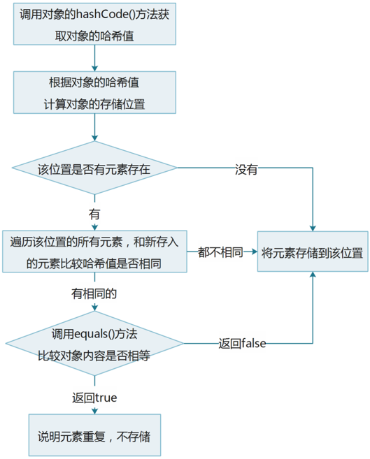

## 3.3 对象的哈希值

`java.lang.Object`类中定义了方法：`public int hashCode()`返回对象的哈希码值，任何类都继承Object，也都会拥有此方法。

定义Person类，不添加任何成员，直接调用Person对象的hashCode()方法，执行Object类的hashCode()：

```java
public class Person{}
```

测试类

```java
public static void main(String[] args){
	Person person = new Person();
	int code = person.hashCode();
}
```

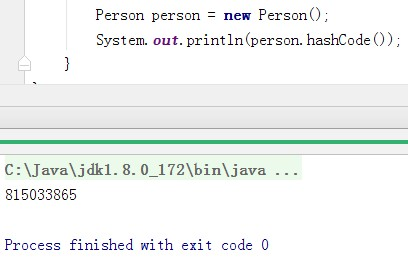

看到运行结果，就是一个int类型的整数，如果将这个整数转为十六进制就看到所谓的对象地址值，但是他不是地址值，我们将他称为对象的哈希值。

Person类重写hashCode()方法：直接返回0

```java
public int hashCode(){
	return 0;
}
```

运行后，方法将执行Person类的重写方法，结果为0，属于Person类自定义对象的哈希值，而没有使用父类Object类方法hashCode()。

## 3.3 String对象的哈希值

```java
public static void main(String[] args){
    String s1 = new String("abc");
    String s2 = new String("abc");
    System.out.println(s1.hashCode());
    System.out.println(s2.hashCode());
}
```

**程序分析**：两个字符串对象都是采用new关键字创建的，s1==s2的结果为false，但是s1，s2两个对象的哈希值却是相同的，均为96354，原因是String类继承Object，重写了父类方法hashCode()建立自己的哈希值。

**String类的hashCode方法源码分析**：

字符串底层实现是字符数组，被final修饰，一旦创建不能修改。

```java
private final char value[];
```

定义字符串“abc”或者是new String("abc")，都会转成char value[]数组存储，长度为3。

```java
/*
 *  String类重写方法hashCode()
 *  返回自定义的哈希值
 */
public int hashCode() {
    int h = hash;
    if (h == 0 && value.length > 0) {
    	char val[] = value;

        for (int i = 0; i < value.length; i++) {
            h = 31 * h + val[i];
        }
    	hash = h;
    }
    return h;
}
```

**String的哈希算法分析：**

- int h = hash，hash是成员变量，默认值0，int h = 0。
- 判断h==0为true && value.length>0，数组value的长度为3，保存三个字符abc，判断结果整体为true。
- char val[] = value，将value数组赋值给val数组。
- for循环3次，将value数组进行遍历，取出abc三个字符。
  - 第一次循环： h = 31 * h + val[0]，h = 31 * 0 + 97结果：h = 97。
  - 第二次循环： h = 31 * 97 + val[1]，h = 31 * 97 + 98结果：h = 3105。
  - 第三次循环： h = 31 * 3105 + val[2]，h = 31 * 3105 + 99结果：h =  96354。
- return 96354。
- 算法：31 * 上一次的哈希值+字符的ASCII码值，31属于质数，每次乘以31是为了降低字符串不同，但是计算出相同哈希值的概率。

那么我们发现String的哈希值是通过字符串的内容进行计算得到的,那么有没有一种可能性?**两个字符串的内容不同但是哈希值却相同?** 比如"重地"和"通话"这两个字符串内容不同但是hashCode值相同.虽然这种情况不多见,但是是真实存在的,所以要比较两个字符串是否相同,**光靠比较hashCode是不行的,还需要继续比较equals内容.**那么可能有人要问了,直接比较equals不好吗,为什么要比较hashCode值?大家注意如果说比较两个字符串的内容,这个比较是很慢的,而进行计算比较字符串的整体数值,这个计算就非常的快,所以为了提高速度,尽量先比较HashSet集合会先比较hashCode,如果hashCode不同说明存储的内容一定是不一样的,就不需要再比较equals了,只有hashCode相同时才比较equals是否相同,这样大大提高了效率.

## 3.4  HashSet集合存储数据的结构（哈希表）

#### 哈希表

什么是哈希表呢？

在**JDK1.8**之前，哈希表底层采用数组+链表实现，即使用数组处理冲突，同一hash值的链表都存储在一个数组里。但是当位于一个桶中的元素较多，即hash值相等的元素较多时，通过key值依次查找的效率较低。而JDK1.8中，哈希表存储采用数组+链表+红黑树实现，当链表长度超过阈值（8）时，将链表转换为红黑树，这样大大减少了查找时间。

- 哈希表的初始化容量，数组长度为16个。
  - 当数组容量不够时，扩容为原数组长度的2倍
- 加载因子为0.75。
  - 指示当数组的容量被使用到长度的75%时，进行扩容。

简单的来说，哈希表是由数组+链表+红黑树（JDK1.8增加了红黑树部分）实现的，如下图所示。

看到这张图就有人要问了，这个是怎么存储的呢？

为了方便大家的理解我们结合一个存储流程图来说明一下：


总而言之，**JDK1.8**引入红黑树大程度优化了HashMap的性能，那么对于我们来讲保证HashSet集合元素的唯一，其实就是根据对象的hashCode和equals方法来决定的。如果我们往集合中存放自定义的对象，那么保证其唯一，就必须复写hashCode和equals方法建立属于当前对象的比较方式。

## 3.5  HashSet存储自定义类型元素

给HashSet中存放自定义类型元素时，需要重写对象中的hashCode和equals方法，建立自己的比较方式，才能保证HashSet集合中的对象唯一.

创建自定义Student类:

~~~java
public class Student {
    private String name;
    private int age;

	//get/set
    @Override
    public boolean equals(Object o) {
        if (this == o)
            return true;
        if (o == null || getClass() != o.getClass())
            return false;
        Student student = (Student) o;
        return age == student.age &&
               Objects.equals(name, student.name);
    }

    @Override
    public int hashCode() {
        return Objects.hash(name, age);
    }
}
~~~

创建测试类:

~~~java
public class HashSetDemo2 {
    public static void main(String[] args) {
        //创建集合对象   该集合中存储 Student类型对象
        HashSet<Student> stuSet = new HashSet<Student>();
        //存储 
        Student stu = new Student("于谦", 43);
        stuSet.add(stu);
        stuSet.add(new Student("郭德纲", 44));
        stuSet.add(new Student("于谦", 43));
        stuSet.add(new Student("郭麒麟", 23));
        stuSet.add(stu);

        for (Student stu2 : stuSet) {
            System.out.println(stu2);
        }
    }
}
执行结果：
Student [name=郭德纲, age=44]
Student [name=于谦, age=43]
Student [name=郭麒麟, age=23]
~~~

## 3.6 LinkedHashSet

我们知道HashSet保证元素唯一，可是元素存放进去是没有顺序的，那么我们要保证有序，怎么办呢？

在HashSet下面有一个子类`java.util.LinkedHashSet`，它是链表和哈希表组合的一个数据存储结构。

此实现与 HashSet的不同之外在于，后者维护着一个运行于所有条目的双重链接列表。此链接列表定义了迭代顺序，即按照将元素插入到 set 中的顺序（*插入顺序*）进行迭代。

演示代码如下:

~~~java
public class LinkedHashSetDemo {
	public static void main(String[] args) {
		Set<String> set = new LinkedHashSet<String>();
		set.add("bbb");
		set.add("aaa");
		set.add("abc");
		set.add("bbc");
        Iterator<String> it = set.iterator();
		while (it.hasNext()) {
			System.out.println(it.next());
		}
	}
}
结果：
  bbb
  aaa
  abc
  bbc
~~~


