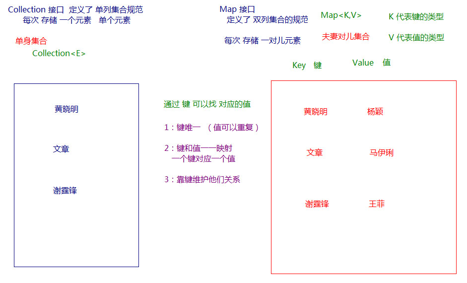
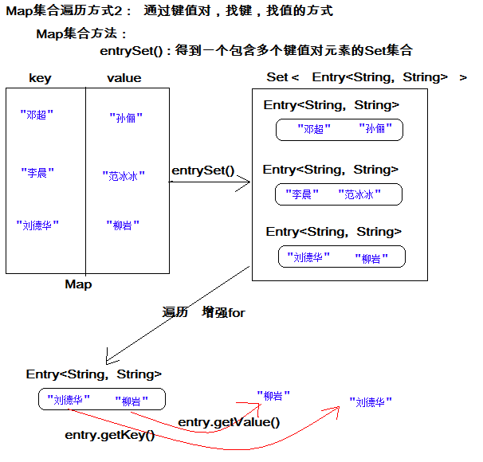
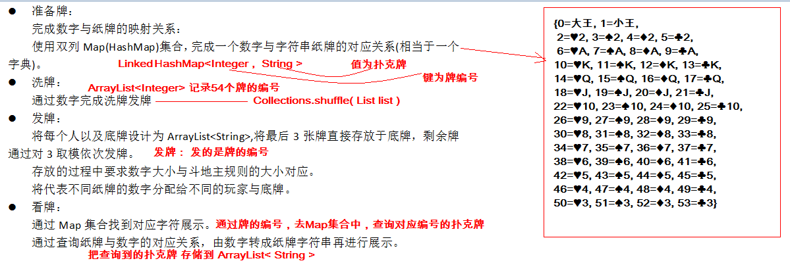

# day16 Map、可变参数、Cloneable、多线程

## 今日内容

- Map集合特点
- Map集合的遍历方式
- 方法可变参数
- 斗地主案例排序

# 第一章 Map集合  映射

### 1.1 概述

现实生活中，我们常会看到这样的一种集合：IP地址与主机名，身份证号与个人，系统用户名与系统用户对象等，这种一一对应的关系，就叫做映射。Java提供了专门的集合类用来存放这种对象关系的对象，即`java.util.Map`接口。

我们通过查看`Map`接口描述，发现`Map`接口下的集合与`Collection`接口下的集合，它们存储数据的形式不同，如下图。



- `Collection`中的集合，元素是孤立存在的（理解为单身），向集合中存储元素采用一个个元素的方式存储。
- `Map`中的集合，元素是成对存在的(理解为夫妻)。每个元素由键与值两部分组成，通过键可以找对所对应的值。
- `Collection`中的集合称为单列集合，`Map`中的集合称为双列集合。
- 需要注意的是，`Map`中的集合不能包含重复的键，值可以重复；每个键只能对应一个值。


### 1.2 Map接口中的常用方法

- `public V put(K key, V value)`:  把指定的键与指定的值添加到Map集合中。
- `public V remove(Object key)`: 把指定的键 所对应的键值对元素 在Map集合中删除，返回被删除元素的值。
- `public V get(Object key)` 根据指定的键，在Map集合中获取对应的值。
- `public Set<K> keySet()`: 获取Map集合中所有的键，存储到Set集合中。
- `public Set<Map.Entry<K,V>> entrySet()`: 获取到Map集合中所有的键值对对象的集合(Set集合)。
- `public boolean containKey(Object key)`:判断该集合中是否有此键。
- `public Collection<V> values()` 返回Map集合中的所有值到Collection集合。

```java
public static void main(String[] args) {
    //创建 map对象
    HashMap<String, String>  map = new HashMap<String, String>();

    //添加元素到集合
    map.put("黄晓明", "杨颖");
    map.put("文章", "马伊琍");
    map.put("邓超", "孙俪");
    System.out.println(map);

    //String remove(String key)
    System.out.println(map.remove("邓超"));
    System.out.println(map);

    // 想要查看 黄晓明的媳妇 是谁
    System.out.println(map.get("黄晓明"));
    System.out.println(map.get("邓超"));
    
    Collection<String> coll = map.values();
    for(String value : coll){
        System.out.println(value);
    }
}
```

**注意**：使用put方法时，若指定的键(key)在集合中没有，则没有这个键对应的值，返回null，并把指定的键值添加到集合中； 若指定的键(key)在集合中存在，则返回值为集合中键对应的值（该值为替换前的值），并把指定键所对应的值，替换成指定的新值。 

### 1.3 Map集合遍历

#### 方式1:键找值方式

通过元素中的键，获取键所对应的值

分析步骤：

1. 获取Map中所有的键，由于键是唯一的，所以返回一个Set集合存储所有的键。方法提示:`keyset()`
2. 遍历键的Set集合，得到每一个键。
3. 根据键，获取键所对应的值。方法提示:`get(K key)`

遍历图解：


#### 方式2:键值对方式

即通过集合中每个键值对(Entry)对象，获取键值对(Entry)对象中的键与值。

**Entry键值对对象:**

我们已经知道，`Map`中存放的是两种对象，一种称为**key**(键)，一种称为**value**(值)，它们在在`Map`中是一一对应关系，这一对对象又称做`Map`中的一个`Entry(项)`。`Entry`将键值对的对应关系封装成了对象。即键值对对象，这样我们在遍历`Map`集合时，就可以从每一个键值对（`Entry`）对象中获取对应的键与对应的值。

在Map集合中也提供了获取所有Entry对象的方法：

- `public Set<Map.Entry<K,V>> entrySet()`: 获取到Map集合中所有的键值对对象的集合(Set集合)。

 获取了Entry对象 , 表示获取了一对键和值，那么同样Entry中 , 分别提供了获取键和获取值的方法：

- `public K getKey()`：获取Entry对象中的键。
- `public V getValue()`：获取Entry对象中的值。

操作步骤与图解：

1. 获取Map集合中，所有的键值对(Entry)对象，以Set集合形式返回。方法提示:`entrySet()`。
2. 遍历包含键值对(Entry)对象的Set集合，得到每一个键值对(Entry)对象。
3. 通过键值对(Entry)对象，获取Entry对象中的键与值。  方法提示:`getkey() getValue()`     

遍历图解：



### 1.4 HashMap集合

Map接口实现类HashMap类特点：

- 底层哈希表结构。
- 不允许重复键。
  - 用作键的对象，应该重写hashCode()方法和equals()方法。
- 此集合可以使用null值和null键。
- 线程不安全，运行速度快。

### 1.5 HashMap存储自定义对象

练习：每位学生（姓名，年龄）都有自己的家庭住址。那么，既然有对应关系，则将学生对象和家庭住址存储到map集合中。学生作为键, 家庭住址作为值。

注意，学生姓名相同并且年龄相同视为同一名学生。

编写学生类：

```java
public class Student {
    private String name;
    private int age;

    //构造方法
    //get/set
    @Override
    public boolean equals(Object o) {
        if (this == o)
            return true;
        if (o == null || getClass() != o.getClass())
            return false;
        Student student = (Student) o;
        return age == student.age && Objects.equals(name, student.name);
    }

    @Override
    public int hashCode() {
        return Objects.hash(name, age);
    }
}
```

测试类：

```java
public static void main(String[] args) {
    //1,创建Hashmap集合对象。
    Map<Student,String> map = new HashMap<Student,String>();
    //2,添加元素。
    map.put(new Student("lisi",28), "上海");
    map.put(new Student("wangwu",22), "北京");
    map.put(new Student("wangwu",22), "南京");

    //3,取出元素。键找值方式
    Set<Student> keySet = map.keySet();
    for(Student key: keySet){
    String value = map.get(key);
    	System.out.println(key.toString()+"....."+value);
    }
}
```

- 当给HashMap中存放自定义对象时，如果自定义对象作为key存在，这时要保证对象唯一，必须复写对象的hashCode和equals方法(如果忘记，请回顾HashSet存放自定义对象)。
- 如果要保证map中存放的key和取出的顺序一致，可以使用`java.util.LinkedHashMap`集合来存放。

### 1.6 LinkedHashMap介绍

我们知道HashMap保证成对元素唯一，并且查询速度很快，可是成对元素存放进去是没有顺序的，那么我们要保证有序，还要速度快怎么办呢？

在HashMap下面有一个子类LinkedHashMap，底层是哈希表双向链表，保证迭代的顺序。

```java
public static void main(String[] args) {
    LinkedHashMap<String, String> map = new LinkedHashMap<String, String>();
    map.put("邓超", "孙俪");
    map.put("李晨", "范冰冰");
    map.put("刘德华", "朱丽倩");
    Set<Entry<String, String>> entrySet = map.entrySet();
    for (Entry<String, String> entry : entrySet) {
   		System.out.println(entry.getKey() + "  " + entry.getValue());
    }
}
```

### 1.7 Properties集合

Map接口实现类Hashtable的子类Properties类。Properties也是Map接口实现类，是存储键值对的双列集合，由于此类能和IO流结合使用，数据可以持久化，使用量很大。（IO部分后面课程详解）

Properties集合特点：

- 继承Hashtable，底层数据结构是哈希表。
- 线程安全，运行速度慢。
- 不允许null值，null键。
- 此集合存储键值对数据类型固定为String。
- 可以和IO流结合使用，从流中加载数据。

Properties集合特有方法：

- `Object setPropery(String key,String value)`，向集合中存储键值对。
- `String getProperty(String key)`，获取集合中键对应的值，无此键返回null。
- `Set<String> stringPropertyNames()`，集合中的所有键存储到Set集合。
- `void load(输入流对象)` ，IO部分讲解。

```java
public static void main(String[] args){
    Properties properties = new Properties();
    //存储键值对
    properties.setProperty("k1","v1");
    properties.setProperty("k2","v2");
    properties.setProperty("k3","v3");
    properties.setProperty("k4","v4");
    System.out.println(properties);
    //获取k2键对应的值
    String value = properties.getProperty("k2");
    System.out.println(value);
    //所有的键存储到Set集合
    Set<String> set = properties.stringPropertyNames();
    for(String key : set){
    	System.out.println(key+"=="+properties.getProperty(key));
    }
}
```

### 1.8 TreeMap集合

​	TreeMap集合基于红黑树实现,该映射根据其键的[自然顺序]进行排序，或者根据创建映射时提供Comparator
进行排序，具体取决于使用的构造方法。

| 构造方法                                     | 描述                                       |
| ---------------------------------------- | ---------------------------------------- |
| TreeMap()                                | 使用键的自然顺序构造一个新的、空的树映射。                    |
| TreeMap(Comparator<? super K> comparator) | 构造一个新的、空的树映射，该映射根据给定比较器进行排序。             |
| TreeMap(Map<? extends K,? extends V> m)  | 构造一个与给定映射具有相同映射关系的新的树映射，该映射根据其键的*自然顺序* 进行排序。 |

```java
public class Demo02_TreeMap {

    public static void main(String[] args) {
        HashMap<String,Integer> map = new HashMap<>();
        map.put("abc",123);
        map.put("xyz",12);
        map.put("yxx",13);
        map.put("css",23);
        map.put("baa",4123);

        TreeMap<String,Integer> map2 = new TreeMap<>(map);

        System.out.println(map2);
    }
}
```

- `public Map.Entry<K,V> ceilingEntry(K key)`:  返回一个键-值映射关系，它与大于等于给定键的最小键关联；如果不存在这样的键，则返回 null。 
- `public K ceilingKey(K key)`: 返回大于等于给定键的最小键；如果不存在这样的键，则返回 null。 
- `public Map.Entry<K,V> firstEntry()` 返回一个与此映射中的最小键关联的键-值映射关系；如果映射为空，则返回 null。 
- `public Map.Entry<K,V> lastEntry()`: 返回与此映射中的最大键关联的键-值映射关系；如果映射为空，则返回 null。 
- `public K firstKey()`: 返回此映射中当前第一个（最低）键。
- `public K lastKey()`:返回映射中当前最后一个（最高）键。 

```java
public class Demo02_TreeMap {

    public static void main(String[] args) {
       TreeMap<Integer,String> treeMap = new TreeMap<>();

       treeMap.put(40,"abc4");
       treeMap.put(10,"abc1");
       treeMap.put(20,"abc2");
       treeMap.put(30,"abc3");


       //public Map.Entry<K,V> ceilingEntry(K key): 返回大于等于给定键的最小键值对 类似向上取整
        //给的11 返回的是20
        Map.Entry<Integer, String> entry = treeMap.ceilingEntry(11);
        System.out.println(entry);//20 abc2

       // public Map.Entry<K,V> firstEntry() 返回一个与此映射中的最小键关联的键-值映射关系；如果映射为空，则返回 null。
        //获取最小键值对
        Map.Entry<Integer, String> entry1 = treeMap.firstEntry();
        System.out.println(entry1);// 10 abc1

        //public Map.Entry<K,V> lastEntry(): 返回与此映射中的最大键关联的键-值映射关系；如果映射为空，则返回 null。
        Map.Entry<Integer, String> entry2 = treeMap.lastEntry();
        System.out.println(entry2);//40 abc4

        //截取map集合 [fromKey,toKey)
        SortedMap<Integer, String> map2 = treeMap.subMap(10, 30);
        System.out.println(map2);//[10=abc1,20=abc2]


    }
```


### 1.8 Map集合练习

**需求：**

计算一个字符串中每个字符出现次数。

**分析：**

1. 获取一个字符串对象
2. 创建一个Map集合，键代表字符，值代表次数。
3. 遍历字符串得到每个字符。
4. 判断Map中是否有该键。
5. 如果没有，第一次出现，存储次数为1；如果有，则说明已经出现过，获取到对应的值进行++，再次存储。     
6. 打印最终结果

**方法介绍**

`public boolean containKey(Object key)`:判断该集合中是否有此键。

```java
public static void main(String[] args) {
    //友情提示
    System.out.println("请录入一个字符串:");
    String line = new Scanner(System.in).nextLine();
    // 定义 每个字符出现次数的方法
    findChar(line);
}
private static void findChar(String line) {
    //1:创建一个集合 存储  字符 以及其出现的次数
    HashMap<Character, Integer> map = new HashMap<Character, Integer>();
    //2:遍历字符串
    for (int i = 0; i < line.length(); i++) {
        char c = line.charAt(i);
        //判断 该字符 是否在键集中
        if (!map.containsKey(c)) {//说明这个字符没有出现过
        	//那就是第一次
        	map.put(c, 1);
        } else {
       	 	//先获取之前的次数
        	Integer count = map.get(c);
        	//count++;
        	//再次存入  更新
        	map.put(c, ++count);
        }
    }
    System.out.println(map);
}
```

# 第二章 可变参数

### 2.1 可变参数

在**JDK1.5**之后，如果我们定义一个方法需要接受多个参数，并且多个参数类型一致，我们可以对其简化.

**格式：**

```java
修饰符 返回值类型 方法名(参数类型... 形参名){  }
```

**代码演示**：

```
public static void main(String[] args) {
    int sum = getSum(6, 7, 2, 12, 2121);
    System.out.println(sum);
}
public static int getSum(int... arr) {
    int sum = 0;
    for (int a : arr) {
    	sum += a;
    }
    return sum;
}
```

**注意：**

- 可变参数的本质是数组。
  - 不传递参数，数组的长度是0.
  - 传递几个参数，数组的长度就是几。
- 一个方法中只能有一个可变参数。
- 如果方法中有多个参数，可变参数只能写在最后一位。

### 2.2 可变参数应用

在Collections中也提供了添加一些元素方法：

`public static <T> boolean addAll(Collection<T> c, T... elements)  `:往集合中添加一些元素。

```java
public static void main(String[] args) {
      ArrayList<Integer> list = new ArrayList<Integer>();
      //原来写法
      //list.add(12);
      //list.add(14);
      //list.add(15);
      //list.add(1000);
      //采用工具类 完成 往集合中添加元素  
      Collections.addAll(list, 5, 222, 1，2);
      System.out.println(list);
}
```

# 第三章 斗地主案例排序

### 3.1 案例介绍

按照斗地主的规则，完成洗牌发牌的动作。


具体规则：

1. 组装54张扑克牌将。
2. 54张牌顺序打乱。
3. 三个玩家参与游戏，三人交替摸牌，每人17张牌，最后三张留作底牌。
4. 查看三人各自手中的牌（按照牌的大小排序）、底牌。

**规则**：手中扑克牌从大到小的摆放顺序：大王,小王,2,A,K,Q,J,10,9,8,7,6,5,4,3。

### 3.2 案例需求分析

1. 准备牌：

完成数字与纸牌的映射关系：

使用双列Map(HashMap)集合，完成一个数字与字符串纸牌的对应关系(相当于一个字典)。

2. 洗牌：

通过数字完成洗牌发牌

3. 发牌：

将每个人以及底牌设计为ArrayList<String>,将最后3张牌直接存放于底牌，剩余牌通过对3取模依次发牌。

存放的过程中要求数字大小与斗地主规则的大小对应。

将代表不同纸牌的数字分配给不同的玩家与底牌。

4. 看牌：

通过Map集合找到对应字符展示。

通过查询纸牌与数字的对应关系，由数字转成纸牌字符串再进行展示。



### 3.3 代码实现

```java
public static void main(String[] args) {
    // 定义一个Map集合用来存储牌号  和 牌 
    HashMap<Integer, String> pookerMap = new HashMap<Integer, String>();
    //定义一个List集合用来存储牌号
    ArrayList<Integer> pookerList = new ArrayList<Integer>();

    String[] colors = "♥-♠-♦-♣".split("-");
    String[] nums = "2-A-K-Q-J-10-9-8-7-6-5-4-3".split("-");


    int index = 2;
    for(String num : nums){
    	for(String color : colors){
    		String thisPooker = color+num;
   
    		//将扑克牌放入Map集合
   			pookerMap.put(index, thisPooker);
    		//将牌号放入到pookerList集合中
   		 pookerList.add(index);
    	 index++;
    	}
    }

    //将大王小王添加到集合
    pookerMap.put(0, "大王");
    pookerMap.put(1, "小王");
    pookerList.add(0);
    pookerList.add(1);

    //洗牌
    Collections.shuffle(pookerList);

    //发牌
    ArrayList<Integer> player1 = new ArrayList<Integer>();
    ArrayList<Integer> player2 = new ArrayList<Integer>();
    ArrayList<Integer> player3 = new ArrayList<Integer>();
    ArrayList<Integer> diPai = new ArrayList<Integer>();

    //遍历牌号的集合 判断索引发牌号
    for(int i = 0 ;i < pookerList.size() ;i++){
        Integer pookerNum = pookerList.get(i);
        if(i>=51)
            diPai.add(pookerNum);
        }else if(i % 3 == 0){
            player1.add(psookerNum);
        }else if(i % 3 == 1){
            player2.add(pookerNum);
        }else if(i % 3 == 2){
            player3.add(pookerNum);
        }
    }
    //		排序
    Collections.sort(player1);
    Collections.sort(player2);
    Collections.sort(player3);
    Collections.sort(diPai);

    show("柳岩",player1,pookerMap);
    show("唐嫣",player2,pookerMap);
    show("金莲",player3,pookerMap);
    show("底牌",diPai,pookerMap);

    }
    //定义方法 看牌
    public static void show(String name,ArrayList<Integer> player,HashMap<Integer, String> pookerMap ){
    System.out.print(name+":");
    for(Integer pookerNum : player){
        String thisPooker = pookerMap.get(pookerNum);
        System.out.print(thisPooker+" ");
    }
    System.out.println();
}
```

# 第四章 Cloneable标记接口(扩展)

此类实现了 `Cloneable` 接口，以指示 Object.clone 方法可以合法地对该类实例进行按字段复制。 如果在没有实现 `Cloneable` 接口的实例上调用 Object 的 clone 方法，则会导致抛出 `CloneNotSupportedException` 异常。 按照惯例，实现此接口的类应该使用公共方法重写 `Object.clone`（它是受保护的）。

 **Cloneable源码**:

```java
public interface Cloneable {
}
```

**克隆的前提条件:**

- 被克隆的对象必须实现Cloneable接口
- 必须重写clone方法

**clone的基本使用**

```java
//将ArrayList集合的数据clone到另外一个集合
public class ArrayList_Clone {
    public static void main(String[] args) {
        ArrayList<String> list = new ArrayList<String>();
        list.add("柳岩");
        list.add("唐嫣");
        list.add("杨幂");
        list.add("高圆圆");

        //调用方法进行克隆
        Object o = list.clone();
        System.out.println(o == list);
        System.out.println(o);
        System.out.println(list);
    }
}
```

**clone源码分析**

```java
public class ArrayList<E>{
      public Object clone() {
        try {
            ArrayList<?> v = (ArrayList<?>) super.clone();
            v.elementData = Arrays.copyOf(elementData, size);
            v.modCount = 0;
            return v;
        } catch (CloneNotSupportedException e) {
            // this shouldn't happen, since we are Cloneable
            throw new InternalError(e);
        }
    }
}
```

**Clone案例:**将一个学生的数据复制到另一个学生对象中,并且两个对象不受任何的影响.

**传统方式:**

```java
package com.doit.cloneDemo.demo;

/**
 * @author 多易教育
 **/
public class Student {
    private String name;
    private int age;
	//空参构造
    //带参构造 
    //get/set...
    //toString
}

```

```java
package com.doit.cloneDemo.demo;

/**
 * @author 多易教育
 * @since JDK 1.8
 *
 * 案例:将一个学生的数据复制到另一个学生对象中,并且两个对象不受任何的影响
 */

public class CloneTest01 {
    public static void main(String[] args) {
        //传统方式:
        //创建学生对象
        Student stu1 = new Student("柳岩",38);
        //再次创建一个新的学生对象
        Student stu2 = new Student();
        //把stu1对象name的值取出来赋值给stu2对象的name
        stu2.setName(stu1.getName());
        //把stu1对象age的值取出来赋值给stu2对象的age
        stu2.setAge(stu1.getAge());

        System.out.println(stu1 == stu2);
        System.out.println(stu1);
        System.out.println(stu2);

        System.out.println("--------修改对象1的姓名与对象2的姓名无关--------------");
        stu1.setName("唐嫣");
        System.out.println(stu1);
        System.out.println(stu2);
        
    }
}

```

**克隆方式(浅拷贝):**

```java
/*
	实现Cloneable接口
	重写clone方法 将访问权限改为public 并将返回值类型改为Student
	
*/
public class Student implements Cloneable{
    private String name;
    private int age;


    @Override
    public Student clone() throws CloneNotSupportedException {
        return (Student) super.clone();
    }
}
```

```java
package com.doit.cloneDemo.demo;

/**
 * @author 多易教育
 * @since JDK 1.8
 *
 * 案例:将一个学生的数据复制到另一个学生对象中,并且两个对象不受任何的影响
 */

public class CloneTest01 {
    public static void main(String[] args) throws CloneNotSupportedException {
        //克隆方式
        //创建学生对象
        Student stu1 = new Student("柳岩",38);
        //通过克隆获得一个student对象
        Student stu2 = stu1.clone();


        System.out.println(stu1 == stu2);
        System.out.println(stu1);
        System.out.println(stu2);

        System.out.println("--------修改对象1的姓名与对象2的姓名无关--------------");
        stu1.setName("唐嫣");
        System.out.println(stu1);
        System.out.println(stu2);

    }
}
```

**浅拷贝的局限性:**基本数据类型(包括String)可以达到完全复制，引用数据类型则不可以;

```java
/*
	假如说我的学生都很富有,每个学生都有车.那么在学生的属性中加入一个Car类型的成员变量
*/
public class Student implements Cloneable{
    private String name;
    private int age;
    private Car car;
     //空参带参
	//get/set

    @Override
    public Student clone() throws CloneNotSupportedException {
        return (Student) super.clone();
    }
}

public class Car {
    private String brand;//品牌

    public Car() {
    }

    public Car(String brand) {
        this.brand = brand;
    }

   //get/set...
}

public class CloneTest01 {
    public static void main(String[] args) throws CloneNotSupportedException {
        //克隆方式
        //创建学生对象
        Student stu1 = new Student("柳岩",38,new Car("宝马"));
        //通过克隆获得一个student对象
        Student stu2 = stu1.clone();


        System.out.println(stu1 == stu2);
        System.out.println(stu1);
        System.out.println(stu2);

        System.out.println("--------修改对象1的姓名与对象2的姓名无关,但是修改Car的品牌时发现都修改了--------------");
        stu1.setName("唐嫣");
        //stu1获得了Car修改Car的品牌
        stu1.getCar().setBrand("奔驰");
        //浅拷贝的局限性 引用类型只是拷贝了地址值 修改一个对象的的属性 另一个也改变了
        System.out.println(stu1);
        System.out.println(stu2);

    }
}
```

结果如下:


**如何解决?使用深拷贝**

```java
//首先 Car类实现克隆接口 重写clone方法
public class Car implements Cloneable{
    private String brand;//品牌

    public Car() {
    }

    public Car(String brand) {
        this.brand = brand;
    }

   //get/set... 
   @Override
   public Car clone() throws CloneNotSupportedException {
     return (Car) super.clone();
   }
  
}
```

```java
//修改Student的clone方法
public class Student implements Cloneable{
    private String name;
    private int age;
    private Car car;
     //空参带参
	//get/set

    @Override
    public Student clone() throws CloneNotSupportedException {
       //调用克隆方法 获取到学生
        Student clone = (Student) super.clone();
        //将当前的car克隆 并设置到克隆后的学生中
        Car car = this.car.clone();
        clone.setCar(car);
        return clone;
    }
}
```

```java
public class CloneTest01 {
    public static void main(String[] args) throws CloneNotSupportedException {
        //克隆方式
        //创建学生对象
        Student stu1 = new Student("柳岩",38,new Car("宝马"));
        //通过克隆获得一个student对象
        Student stu2 = stu1.clone();


        System.out.println(stu1 == stu2);
        System.out.println(stu1);
        System.out.println(stu2);

        System.out.println("--------修改对象1的姓名与对象2的姓名无关,修改Car的品牌Stu2没有被修改--------------");
        stu1.setName("唐嫣");
        //stu1获得了Car修改Car的品牌
        stu1.getCar().setBrand("奔驰");
        //浅拷贝的局限性 引用类型只是拷贝了地址值 修改一个对象的的属性 另一个也改变了
        System.out.println(stu1);
        System.out.println(stu2);

    }
}
```

结果如下:


# 第五章 RandomAccess标记接口(扩展)

`List` 实现所使用的标记接口，用来表明其支持快速（通常是固定时间）随机访问。此接口的主要目的是允许一般的算法更改其行为，从而在将其应用到随机或连续访问列表时能提供良好的性能。 

将操作随机访问列表的最佳算法（如 `ArrayList`）应用到连续访问列表（如 `LinkedList`）时，可产生二次项的行为。如果将某个算法应用到连续访问列表，那么在应用可能提供较差性能的算法前，鼓励使用一般的列表算法检查给定列表是否为此接口的一个 `instanceof`，如果需要保证可接受的性能，还可以更改其行为。 

现在已经认识到，随机和连续访问之间的区别通常是模糊的。例如，如果列表很大时，某些 `List` 实现提供渐进的线性访问时间，但实际上是固定的访问时间。这样的 `List` 实现通常应该实现此接口。实际经验证明，如果是下列情况，则 `List `实现应该实现此接口，即对于典型的类实例而言，此循环： 

```java
     for (int i=0, n=list.size(); i < n; i++)
         	list.get(i); 
```

的运行速度要快于以下循环：

```java
  for (Iterator i=list.iterator(); i.hasNext(); )
         i.next();
```

**简单的来说,如果实现了这个接口,普通for循环的速度要优于迭代器的速度.**

测试

```java
public class ArrayList_Demo01 {
    public static void main(String[] args) {
        //创建ArrayList集合
        List<String> list = new ArrayList<String>();
        //添加100W条数据
        for (int i = 0; i < 1000000; i++) {
            list.add(i+"a");
        }

        //测试普通循环
        long startTime = System.currentTimeMillis();
        for (int i = 0; i < list.size(); i++) {
            //取出集合的每一个元素
            list.get(i);
        }
        long endTime = System.currentTimeMillis();
        System.out.println("普通循环遍历: "+(endTime-startTime));

        //测试迭代器遍历
        startTime = System.currentTimeMillis();
        //获取迭代器
        Iterator<String> it = list.iterator();
        while (it.hasNext()){
            //取出集合的元素
            it.next();
        }
        endTime = System.currentTimeMillis();
        System.out.println("迭代器遍历: "+(endTime-startTime));
    }
}
```

结果如下:


LinkedList没有实现此接口,测试:

```java
ublic class LinkedList_Demo01 {
    public static void main(String[] args) {
        //创建LinkedList集合
        List<String> list = new LinkedList<String>();
        //添加10W条数据
        for (int i = 0; i < 100000; i++) {
            list.add(i+"b");
        }

        //测试普通遍历时间
        long startTime = System.currentTimeMillis();
        for (int i = 0; i < list.size(); i++) {
            //取出集合的每一个元素
            list.get(i);
        }
        long endTime = System.currentTimeMillis();
        System.out.println("普通遍历时间: "+(endTime-startTime));

        //测试迭代器
        startTime = System.currentTimeMillis();
        //获取迭代器
        Iterator<String> it = list.iterator();
        while (it.hasNext()){
            //取出集合的每一个元素
            it.next();
        }
        endTime = System.currentTimeMillis();
        System.out.println("顺序迭代器访问时间: "+(endTime-startTime));
    }
}

```

结果如下:


**实际应用**

```java
public class Test {
    public static void main(String[] args) {
        //我们今后可能有的集合不是直接创建的 可能是别人传递的
        //我们看到的就是一个List接口
        //至于具体的实现类可能不清楚
        List<String>  list = new ArrayList<>();

        //list = new LinkedList<>();
        //我们可以判断以下 这个list集合是否实现了RandomAccess接口
        //如果实现了 可以使用随机访问的方式来进行遍历
        //如果没实现 可以使用迭代器的方式来进行遍历 这样可以提高效率
        if(list instanceof  RandomAccess){
            for (int i = 0; i < list.size(); i++) {
		
            }

        }else {
            for (String s : list) {
                
            }
        }
    }
}

```


# 第五章 多线程

我们在之前，学习的程序在没有跳转语句的前提下，都是由上至下依次执行，那现在想要设计一个程序，边打游戏边听歌，怎么设计？

要解决上述问题,咱们得使用多进程或者多线程来解决.

## 5.1 并发与并行

- **并行**：指两个或多个事件在**同一时刻**发生（同时发生）。
- **并发**：指两个或多个事件在**同一个时间段内**发生。


在操作系统中，安装了多个程序，并发指的是在一段时间内宏观上有多个程序同时运行，这在单 CPU 系统中，每一时刻只能有一道程序执行，即微观上这些程序是分时的交替运行，只不过是给人的感觉是同时运行，那是因为分时交替运行的时间是非常短的。

而在多个 CPU 系统中，则这些可以并发执行的程序便可以分配到多个处理器上（CPU），实现多任务并行执行，即利用每个处理器来处理一个可以并发执行的程序，这样多个程序便可以同时执行。目前电脑市场上说的多核 CPU，便是多核处理器，核越多，并行处理的程序越多，能大大的提高电脑运行的效率。

> 注意：单核处理器的计算机肯定是不能并行的处理多个任务的，只能是多个任务在单个CPU上并发运行。同理,线程也是一样的，从宏观角度上理解线程是并行运行的，但是从微观角度上分析却是串行运行的，即一个线程一个线程的去运行，当系统只有一个CPU时，线程会以某种顺序执行多个线程，我们把这种情况称之为线程调度。

## 5.2 线程与进程

- **进程**：是指一个内存中运行的应用程序，每个进程都有一个独立的内存空间，一个应用程序可以同时运行多个进程；进程也是程序的一次执行过程，是系统运行程序的基本单位；系统运行一个程序即是一个进程从创建、运行到消亡的过程。
- **线程**：进程中的一个执行单元，负责当前进程中程序的执行，一个进程中至少有一个线程。一个进程中是可以有多个线程的，这个应用程序也可以称之为多线程程序。

**进程**


**线程**


**进程与线程的区别**

- 进程：有独立的内存空间，进程中的数据存放空间（堆空间和栈空间）是独立的，至少有一个线程。
- 线程：堆空间是共享的，栈空间是独立的，线程消耗的资源比进程小的多。

> **注意：**下面内容为了解知识点
>
> 1:因为一个进程中的多个线程是并发运行的，那么从微观角度看也是有先后顺序的，哪个线程执行完全取决于 CPU 的调度，程序员是干涉不了的。而这也就造成的多线程的随机性。
>
> 2:Java 程序的进程里面至少包含两个线程，主进程也就是 main()方法线程，另外一个是垃圾回收机制线程。每当使用 java 命令执行一个类时，实际上都会启动一个 JVM，每一个 JVM 实际上就是在操作系统中启动了一个线程，java 本身具备了垃圾的收集机制，所以在 Java 运行时至少会启动两个线程。
>
> 3:由于创建一个线程的开销比创建一个进程的开销小的多，那么我们在开发多任务运行的时候，通常考虑创建多线程，而不是创建多进程。

**线程调度:**

计算机通常只有一个CPU时,在任意时刻只能执行一条计算机指令,每一个进程只有获得CPU的使用权才能执行指令。所谓多进程并发运行,从宏观上看,其实是各个进程轮流获得CPU的使用权,分别执行各自的任务。那么,在可运行池中,会有多个线程处于就绪状态等到CPU,JVM就负责了线程的调度。JVM采用的是**抢占式调度**,没有采用分时调度,因此可以能造成多线程执行结果的的随机性。

## 5.3 创建线程类

Java使用`java.lang.Thread`类代表**线程**，所有的线程对象都必须是Thread类或其子类的实例。每个线程的作用是完成一定的任务，实际上就是执行一段程序流即一段顺序执行的代码。Java使用线程执行体来代表这段程序流。Java中通过继承Thread类来**创建**并**启动多线程**的步骤如下：

1. 定义Thread类的子类，并重写该类的run()方法，该run()方法的方法体就代表了线程需要完成的任务,因此把run()方法称为线程执行体。
2. 创建Thread子类的实例，即创建了线程对象
3. 调用线程对象的start()方法来启动该线程

代码如下：

测试类：

```java
public class Demo01 {
	public static void main(String[] args) {
		//创建自定义线程对象
		MyThread mt = new MyThread("新的线程！");
		//开启新线程
		mt.start();
		//在主方法中执行for循环
		for (int i = 0; i < 200; i++) {
			System.out.println("main线程！"+i);
		}
	}
}
```

自定义线程类：

```java
public class MyThread extends Thread {
	//定义指定线程名称的构造方法
	public MyThread(String name) {
		//调用父类的String参数的构造方法，指定线程的名称
		super(name);
	}
	/**
	 * 重写run方法，完成该线程执行的逻辑
	 */
	@Override
	public void run() {
		for (int i = 0; i < 200; i++) {
			System.out.println(getName()+"：正在执行！"+i);
		}
	}
}
```

OK 相信我们都看到多线程的现象了，那么接下来几天我们就进入多线程的世界！