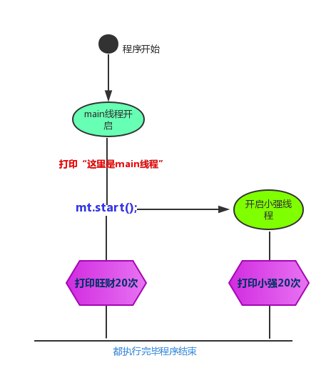
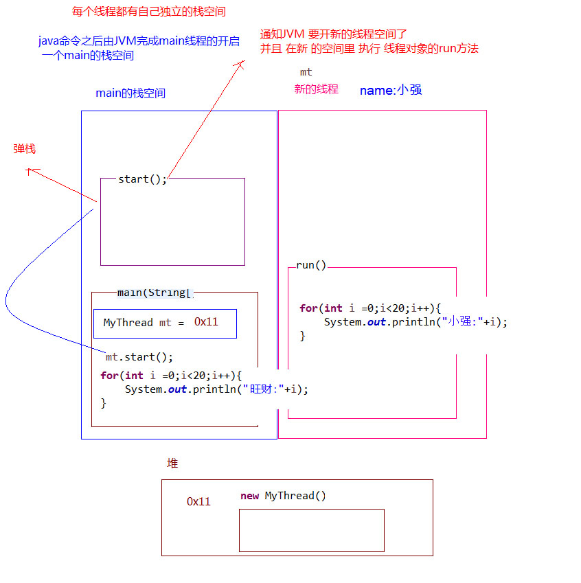
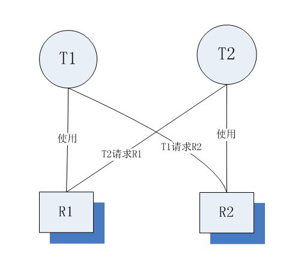

# day17 线程创建、线程同步、线程状态

## 今日内容

- 进程概念
- 线程概念
- 线程的创建方式
- 线程名字设置获取
- 线程安全问题引发
- 同步代码块
- 同步方法
- 死锁

# 第一章 多线程的概念

### 1.1 概述

我们在之前，学习的程序在没有跳转语句的前提下，都是由上至下依次执行，那现在想要设计一个程序，边打游戏边听歌，怎么设计？

要解决上述问题,咱们得使用多进程或者多线程来解决。

### 1.2 线程与进程

- **进程**：是指一个内存中运行的应用程序，每个进程都有一个独立的内存空间，一个应用程序可以同时运行多个进程；进程也是程序的一次执行过程，是系统运行程序的基本单位；系统运行一个程序即是一个进程从创建、运行到消亡的过程。
- **线程**：是进程中的一个执行单元，负责当前进程中程序的执行，一个进程中至少有一个线程。一个进程中是可以有多个线程的，这个应用程序也可以称之为多线程程序。


### 1.3 线程


**进程与线程的区别**

- 进程：有独立的内存空间，进程中的数据存放空间（堆空间和栈空间）是独立的，至少有一个线程。
- 线程：堆空间是共享的，栈空间是独立的，线程消耗的资源比进程小的多。

**注意：**下面内容为了解知识点

1. 因为一个进程中的多个线程是并发运行的，那么从微观角度看也是有先后顺序的，哪个线程执行完全取决于 CPU 的调度，程序员是干涉不了的。而这也就造成的多线程的随机性。
2. Java 程序的进程里面至少包含两个线程，主进程也就是 main()方法线程，另外一个是垃圾回收机制线程。每当使用 java 命令执行一个类时，实际上都会启动一个 JVM，每一个 JVM 实际上就是在操作系统中启动了一个线程，java 本身具备了垃圾的收集机制，所以在 Java 运行时至少会启动两个线程。
3. 由于创建一个线程的开销比创建一个进程的开销小的多，那么我们在开发多任务运行的时候，通常考虑创建多线程，而不是创建多进程。

# 第二章 线程的创建-继承方式

### 2.1 继承Thread类方式

Java使用`java.lang.Thread`类代表**线程**，所有的线程对象都必须是Thread类或其子类的实例。每个线程的作用是完成一定的任务，实际上就是执行一段程序流即一段顺序执行的代码。Java使用线程执行体来代表这段程序流。Java中通过继承Thread类来**创建**并**启动多线程**的步骤如下：

1. 定义Thread类的子类，并重写该类的run()方法，该run()方法的方法体就代表了线程需要完成的任务,因此把run()方法称为线程执行体。
2. 创建Thread子类的实例，即创建了线程对象
3. 调用线程对象的start()方法来启动该线程

自定义线程类：

```java
public class MyThread extends Thread {
	/**
	 * 重写run方法，完成该线程执行的逻辑
	 */
	@Override
	public void run() {
		for (int i = 0; i < 200; i++) {
			System.out.println("自定义线程正在执行！"+i);
		}
	}
}
```

测试类：

```java

public static void main(String[] args) {
    //创建自定义线程对象
    MyThread mt = new MyThread();
    //开启新线程
    mt.start();
    //在主方法中执行for循环
    for (int i = 0; i < 200; i++) {
    	System.out.println("main线程！"+i);
    }
}
```

### 2.2 线程的执行流程



程序启动运行main时候，java虚拟机启动一个进程，主线程main在main()调用时候被创建。随着调用mt的对象的start方法，另外一个新的线程也启动了，这样，整个应用就在多线程下运行。

通过这张图我们可以很清晰的看到多线程的执行流程，那么为什么可以完成并发执行呢？我们再来讲一讲原理。

多线程执行时，到底在内存中是如何运行的呢？以上个程序为例，进行图解说明：

多线程执行时，在栈内存中，其实**每一个执行线程都有一片自己所属的栈内存空间**。进行方法的压栈和弹栈。

### 2.3 线程内存图



当执行线程的任务结束了，线程自动在栈内存中释放了。但是当所有的执行线程都结束了，那么进程就结束了。

### 2.4 run()方法和start()方法

- run()方法，是线程执行的任务方法，每个线程都会调用run()方法执行，我们将线程要执行的任务代码都写在run()方法中就可以被线程调用执行。
- start()方法，开启线程，线程调用run()方法。start()方法源代码中会调用本地方法start0()来启动线程：`private native void start0()`，本地方法都是和操作系统交互的，因此可以看出每次开启一个线程的线程都会和操作系统进行交互。
  - **注意**：一个线程只能被启动一次！！

### 2.5 线程名字的设置和获取

- Thread类的方法`String getName()`可以获取到线程的名字。
- Thread类的方法`setName(String name)`设置线程的名字。

- 通过Thread类的构造方法`Thread(String name)`也可以设置线程的名字。

```java
public class MyThread  extends Thread{
    public void run(){
        System.out.println("线程名字:"+super.getName());
    }
}
```

测试类：

```java
public class Demo {
    public static void main(String[] args) {
        //创建自定义线程对象
        MyThread mt = new MyThread();
        //设置线程名字
        mt.setName("旺财");
        //开启新线程
        mt.start();
    }
}
```

**注意**：线程是有默认名字的，如果我们不设置线程的名字，JVM会赋予线程默认名字Thread-0,Thread-1。

### 2.6 获取运行main方法线程的名字

- Demo类不是Thread的子类，因此不能使用getName()方法获取。

- Thread类定义了静态方法`static Thread currentThread()`获取到当前正在执行的线程对象。
- main方法也是被线程调用了，也是具有线程名字的。

```java
public static void main(String[] args){
	Thread t = Thread.currentThread();
	System.out.println(t.getName());
} 
```

# 第三章 线程的创建-实现方式

### 3.1 实现Runnable接口方式

采用`java.lang.Runnable`也是非常常见的一种，我们只需要重写run方法即可。

步骤如下：

1. 定义Runnable接口的实现类，并重写该接口的run()方法，该run()方法的方法体同样是该线程的线程执行体。
2. 创建Runnable实现类的实例，并以此实例作为Thread的target来创建Thread对象，该Thread对象才是真正的线程对象。
3. 调用线程对象的start()方法来启动线程。

```java
public class MyRunnable implements Runnable{
	public void run() {
		for (int i = 0; i < 20; i++) {
			System.out.println(Thread.currentThread().getName()+" "+i);
		}
	}
}
```

```java
public class Demo {
    public static void main(String[] args) {
        //创建自定义类对象  线程任务对象
        MyRunnable mr = new MyRunnable();
        //创建线程对象
        Thread t = new Thread(mr);
        t.start();
        for (int i = 0; i < 20; i++) {
            System.out.println("main " + i);
        }
    }
}
```

通过实现Runnable接口，使得该类有了多线程类的特征。run()方法是多线程程序的一个执行目标。所有的多线程代码都在run方法里面。Thread类实际上也是实现了Runnable接口的类。

在启动的多线程的时候，需要先通过Thread类的构造方法Thread(Runnable target) 构造出对象，然后调用Thread对象的start()方法来运行多线程代码。

实际上所有的多线程代码都是通过运行Thread的start()方法来运行的。因此，不管是继承Thread类还是实现Runnable接口来实现多线程，最终还是通过Thread的对象的API来控制线程的，熟悉Thread类的API是进行多线程编程的基础。

### 3.2 Thread和Runnable的区别

如果一个类继承Thread，则不适合资源共享。但是如果实现了Runable接口的话，则很容易的实现资源共享。

**总结：**

**实现Runnable接口比继承Thread类所具有的优势：**

1. 适合多个相同的程序代码的线程去共享同一个资源。
2. 可以避免java中的单继承的局限性。
3. 增加程序的健壮性，实现解耦操作，代码可以被多个线程共享，代码和线程独立。

### 3.3 匿名内部类方式创建线程

使用线程的内匿名内部类方式，可以方便的实现每个线程执行不同的线程任务操作。

使用匿名内部类的方式实现Runnable接口，重新Runnable接口中的run方法：

```java
public class NoNameInnerClassThread {
   	public static void main(String[] args) {	   	
//		new Runnable(){
//			public void run(){
//				for (int i = 0; i < 20; i++) {
//					System.out.println("张宇:"+i);
//				}
//			}  
//	   	}; //---这个整体  相当于new MyRunnable()
        Runnable r = new Runnable(){
            public void run(){
                for (int i = 0; i < 20; i++) {
                  	System.out.println("张宇:"+i);
                }
            }  
        };
        new Thread(r).start();

        for (int i = 0; i < 20; i++) {
          	System.out.println("费玉清:"+i);
        }
   	}
}
```

# 第四章 Thread类API

Thread类就是线程类,构造方法就不再多说了,这里主要讲解其他几个方法.

### 4.1 睡眠sleep方法

`public static void  sleep(long time)`  让当前线程进入到睡眠状态，到毫秒后自动醒来继续执行

```java
public class Test{
  public static void main(String[] args){
    for(int i = 1;i<=5;i++){
      	Thread.sleep(1000);
        System.out.println(i)   
    } 
  }
}
```

这时我们发现主线程执行到sleep方法会休眠1秒后再继续执行。

### 4.2 设置线程优先级(了解)

线程的切换是由线程调度控制的,我们无法通过代码来干涉,但是我们通过提高线程的优先级最大程度的改善线程获取时间片的几率

线程的优先级被划分为10级,值分别为1-10,其中1最低,10最高.线程提高了3个常量来表示最低,最高,以及默认优先级:

```java
public static final int MIN_PRIORITY   //1 最低优先级
public static final int NORM_PRIORITY  //5 默认优先级
public static final int MAX_PRIORITY   //10 最大优先级
```

`public final void setPriority(int newPriority`更改线程的优先级。 

```java
public class Test02 {
    public static void main(String[] args)  {
        Thread t1 = new Thread(new Runnable() {
            @Override
            public void run() {
                for (int i = 0; i < 10000; i++) {
                    System.out.println("t1   "+i);
                }
            }
        });

        Thread t2 = new Thread(new Runnable() {
            @Override
            public void run() {
                for (int i = 0; i < 10000; i++) {
                    System.out.println("t2 "+i);
                }
            }
        });

        //如果不设置优先级 谁先执行完是随机的
        //但是即使设置了优先级 也没办法绝对保证谁先执行 谁后执行
        t1.setPriority(Thread.MIN_PRIORITY);//优先级设置为最低
        t2.setPriority(Thread.MAX_PRIORITY);//优先级设置为最高


        t1.start();
        t2.start();
    }
}

```

### 4.3 用户线程与守护线程(了解)

java分为两种线程:用户线程和守护线程

所谓守护线程是指程序运行的时候在后台提供一种通用的服务的线程,比如垃圾回收器就是一个很称职的守护者,并且这种线程不属于程序中不可或缺的部分.因此,当所有非守护线程结束时,程序也就终止了,同时会杀死进程中所有守护线程.反过来说,只有任何非守护线程还在运行,程序就不会终止.

守护线程和用户线程没有本质的区别:唯一不同之处就在于虚拟机的离开:如果用户线程已经全部退出运行了,只剩下守护线程存在,虚拟机会直接退出.但是只要有用户线程运行,虚拟机就不会退出.

`public final void setDaemon(boolean on)`   on的值为true将线程设置为守护线程,注意一定要在开启线程之前设置

```java
public class Test02 {
    public static void main(String[] args)  {
        Thread t1 = new Thread(new Runnable() {
            @Override
            public void run() {
                for (int i = 0; i < 100; i++) {
                    try {
                        Thread.sleep(200);
                    } catch (InterruptedException e) {
                        e.printStackTrace();
                    }


                    System.out.println("t1   "+i);
                }
            }
        });
        //如果不设置t1为守护线程 由于t1睡眠时间比t2睡眠时间长
        //t1一定是后执行完 ,当t2全部执行结束后,t1再慢慢将剩下的执行完
        //但是如果将t1设置为守护线程 当t2执行完毕后,t1也不再执行了 直接退出jvm
        //t1.setDaemon(true);//设置t1为守护线程
        t1.start();
        Thread t2 = new Thread(new Runnable() {
            @Override
            public void run() {
                for (int i = 0; i < 100; i++) {
                    try {
                        Thread.sleep(50);
                    } catch (InterruptedException e) {
                        e.printStackTrace();
                    }
                    System.out.println("t2 "+i);
                }
            }
        });
        t2.start();
    }
}
```

### 4.4 join方法

join方法是让 当前线程等待,调用方法的线程进行插队先执行,执行完毕后,在让当前线程执行.对其他线程没有任何影响.注意 此处的当前线程不是调用方法的线程 而是Thread.currentThread().

```java
public class Test {
    public static void main(String[] args) throws InterruptedException {
        Thread t1 = new Thread(new Runnable() {
            @Override
            public void run() {
                for (int i = 0; i < 10; i++) {
                    System.out.println("t1   "+i);
                }
            }
        });
        Thread t2 = new Thread(new Runnable() {
            @Override
            public void run() {
                for (int i = 0; i < 10; i++) {
                    System.out.println("t2   "+i);
                }
            }
        });
        t1.start();
        //注意 此时当前线程是main线程
        //main线程进入等待,让t1线程执行. 由于此时main等待 所以t2还没有执行
        //t1执行完毕后 main和t2抢夺cpu资源 执行
       // t1.join();
        t2.start();
        //如果t1.join放在这里 那么main进入到等待 t2已经开启了
        //t1 t2互相抢夺资源
        //main一定是在 t1执行完毕后 才会执行
        //那么就会有两种情况  t1执行完毕  t2没执行完 main和 t2进行抢夺
        //t1执行完毕  t2也执行完毕了  main自己执行
        //t1.join();
        for (int i = 0; i < 10; i++) {
            System.out.println("main "+i);
        }

    }
}
```

面试题:

现在有T1,T2,T3 三条线程,如何保证T2在T1执行完毕后执行,T3在T2执行完毕后执行?

```java
public class Test02 {
    public static void main(String[] args) throws InterruptedException {
        Thread t1 = new Thread(new Runnable() {
            @Override
            public void run() {
                for (int i = 0; i < 10; i++) {
                    System.out.println("t1   "+i);
                }
            }
        });
        Thread t2 = new Thread(new Runnable() {
            @Override
            public void run() {
                try {
                    //如果t2抢到,等待 让t1先执行
                    t1.join();
                } catch (InterruptedException e) {
                    e.printStackTrace();
                }
                for (int i = 0; i < 10; i++) {
                    System.out.println("t2   "+i);
                }
            }
        });
        Thread t3 = new Thread(new Runnable() {
            @Override
            public void run() {
                try {
                    //如果t3抢到,等待 让t2先执行
                    t2.join();
                } catch (InterruptedException e) {
                    e.printStackTrace();
                }


                for (int i = 0; i < 10; i++) {
                    System.out.println("t3   "+i);
                }
            }
        });
        t1.start();
//        t1.join();
        t2.start();
//        t2.join();
        t3.start();
    }
}
```

### 4.5 线程停止(了解)

```
public final void stop()  直接中断线程 此方法已过时 不安全
public boolean isInterrupted() 获取线程是否中断的状态 如果中断返回true 没中断返回false
public void interrupt()  中断线程 此时调用interrupted方法 会返回true
```

代码演示:

```java
public class Test02 {
    public static void main(String[] args)  {
        Thread t1 = new Thread(new Runnable() {
            @Override
            public void run() {

                for (int i = 0; i <1000000 ; i++) {
                    System.out.println(i);
                    //是否有人要中断线程 如果有返回true 如果没有返回false
                    //让线程中断更为平滑 可以使用代码来控制中断
                    boolean b = Thread.currentThread().isInterrupted();
                    if(b){
                        break;
                    }
                }
            }
        });

        t1.start();

        try {
            Thread.sleep(2000);

//            t1.stop(); //方法已经过时 不安全
            t1.interrupt();


        } catch (InterruptedException e) {
            e.printStackTrace();
        }
    }
}
```

# 第五章 线程安全

### 5.1 线程安全问题

如果有多个线程在同时运行，而这些线程可能会同时运行这段代码。程序每次运行结果和单线程运行的结果是一样的，而且其他的变量的值也和预期的是一样的，就是线程安全的。

我们通过一个案例，演示线程的安全问题：

电影院要卖票，我们模拟电影院的卖票过程。假设要播放的电影是 “葫芦娃大战奥特曼”，本次电影的座位共100个(本场电影只能卖100张票)。

我们来模拟电影院的售票窗口，实现多个窗口同时卖 “葫芦娃大战奥特曼”这场电影票(多个窗口一起卖这100张票)

需要窗口，采用线程对象来模拟；需要票，Runnable接口子类来模拟

模拟票：

```java
public class Ticket implements Runnable {
    private int ticket = 100;
    /*
     * 执行卖票操作
     */
    @Override
    public void run() {
        //每个窗口卖票的操作 
        //窗口 永远开启 
        while (true) {
            if (ticket > 0) {//有票 可以卖
                //出票操作
                //使用sleep模拟一下出票时间 
                try {
                    Thread.sleep(100);
                } catch (InterruptedException e) {
                    // TODO Auto-generated catch block
                    e.printStackTrace();
                }
                //获取当前线程对象的名字 
                String name = Thread.currentThread().getName();
                System.out.println(name + "正在卖:" + ticket--);
            }
        }
    }
}
```

测试类：

```java
public static void main(String[] args) {
    //创建线程任务对象
    Ticket ticket = new Ticket();
    //创建三个窗口对象
    Thread t1 = new Thread(ticket, "窗口1");
    Thread t2 = new Thread(ticket, "窗口2");
    Thread t3 = new Thread(ticket, "窗口3");

    //同时卖票
    t1.start();
    t2.start();
    t3.start();
}
```

结果中有一部分这样现象：


发现程序出现了两个问题：

1. 相同的票数,比如5这张票被卖了两回。
2. 不存在的票，比如0票与-1票，是不存在的。

这种问题，几个窗口(线程)票数不同步了，这种问题称为线程不安全。

**线程安全问题引发**：线程安全问题都是由全局变量及静态变量引起的。若每个线程中对全局变量、静态变量只有读操作，而无写操作，一般来说，这个全局变量是线程安全的；若有多个线程同时执行写操作，一般都需要考虑线程同步，否则的话就可能影响线程安全。

### 5.2 线程同步

当我们使用多个线程访问同一资源的时候，且多个线程中对资源有写的操作，就容易出现线程安全问题。

要解决上述多线程并发访问一个资源的安全性问题:也就是解决重复票与不存在票问题，Java中提供了同步机制(**synchronized**)来解决。

根据案例简述：

```properties
窗口1线程进入操作的时候，窗口2和窗口3线程只能在外等着，窗口1操作结束，窗口1和窗口2和窗口3才有机会进入代码去执行。也就是说在某个线程修改共享资源的时候，其他线程不能修改该资源，等待修改完毕同步之后，才能去抢夺CPU资源，完成对应的操作，保证了数据的同步性，解决了线程不安全的现象。
```

为了保证每个线程都能正常执行原子操作,Java引入了线程同步机制。

那么怎么去使用呢？有三种方式完成同步操作：

1. 同步代码块。
2. 同步方法。
3. 锁机制。

### 5.3 同步代码块

**同步代码块**：线程操作的共享数据进行同步。`synchronized`关键字可以用于方法中的某个区块中，表示只对这个区块的资源实行互斥访问。

格式：

```java
synchronized(同步锁){
     需要同步操作的代码
}
```

**同步锁**:

同步锁又称为对象监视器。同步锁只是一个概念,可以想象为在对象上标记了一个锁.

1. 锁对象 可以是任意类型。
2. 多个线程对象  要使用同一把锁。

**注意**：在任何时候,最多允许一个线程拥有同步锁,谁拿到锁就进入代码块,其他的线程只能在外等着(BLOCKED)。

使用同步代码块解决代码：

```java
public class Ticket implements Runnable{
	private int ticket = 100;
	private Object lock = new Object();
	/*
	 * 执行卖票操作
	 */
	@Override
	public void run() {
		//每个窗口卖票的操作 
		//窗口 永远开启 
		while(true){
			synchronized (lock) {
				if(ticket>0){//有票 可以卖
					//出票操作
					//使用sleep模拟一下出票时间 
					try {
						Thread.sleep(50);
					} catch (InterruptedException e) {
						// TODO Auto-generated catch block
						e.printStackTrace();
					}
					//获取当前线程对象的名字 
					String name = Thread.currentThread().getName();
					System.out.println(name+"正在卖:"+ticket--);
				}
			}
		}
	}
}
```

**注意**：线程运行至同步代码块的时候，需要判断锁，获取锁，出去同步代码块后要释放锁，增加了很多操作，因此线程安全，程序的运行速度慢！

### 5.4 同步方法

**同步方法**:当一个方法中的所有代码，全部是线程操作的共享数据的时候，可以将整个方法进行同步。使用synchronized修饰的方法,就叫做同步方法,保证A线程执行该方法的时候,其他线程只能在方法外等着。

格式：

```java
public synchronized void method(){
   	可能会产生线程安全问题的代码
}
```

使用同步方法代码如下：

```java
public class Ticket implements Runnable{
	private int ticket = 100;
	/*
	 * 执行卖票操作
	 */
	@Override
	public void run() {
		//每个窗口卖票的操作 
		//窗口 永远开启 
		while(true){
			sellTicket();
		}
	}
	
	/*
	 * 锁对象 是 谁调用这个方法 就是谁 
	 *   隐含 锁对象 就是  this
	 *    
	 */
	public synchronized void sellTicket(){
        if(ticket>0){//有票 可以卖	
            //出票操作
            //使用sleep模拟一下出票时间 
            try {
              	Thread.sleep(100);
            } catch (InterruptedException e) {
              	e.printStackTrace();
            }
            //获取当前线程对象的名字 
            String name = Thread.currentThread().getName();
            System.out.println(name+"正在卖:"+ticket--);
        }
	}
}
```

**同步锁是谁?**

​      对于非static方法,同步锁就是this。  

​      对于static方法,我们使用当前方法所在类的字节码对象(类名.class)。

### 5.5 Lock锁介绍

`java.util.concurrent.locks.Lock`机制提供了比**synchronized**代码块和**synchronized**方法更广泛的锁定操作,同步代码块/同步方法具有的功能Lock都有,除此之外更强大,更体现面向对象。

Lock锁也称同步锁，加锁与释放锁方法化了，如下：

- `public void lock() `:加锁。
- `public void unlock()`:释放锁。

使用如下：

```java
public class Ticket implements Runnable{
	private int ticket = 100;
	
	Lock lock = new ReentrantLock();
	/*
	 * 执行卖票操作
	 */
	@Override
	public void run() {
		//每个窗口卖票的操作 
		//窗口 永远开启 
		while(true){
			lock.lock();
			if(ticket>0){//有票 可以卖
				//出票操作 
				//使用sleep模拟一下出票时间 
				try {
					Thread.sleep(50);
				} catch (InterruptedException e) {
					// TODO Auto-generated catch block
					e.printStackTrace();
				}
				//获取当前线程对象的名字 
				String name = Thread.currentThread().getName();
				System.out.println(name+"正在卖:"+ticket--);
			}
			lock.unlock();
		}
	}
}
```

# 第六章 线程状态

### 6.1 线程状态概述

当线程被创建并启动以后，它既不是一启动就进入了执行状态，也不是一直处于执行状态。在线程的生命周期中，有几种状态呢？在API中`java.lang.Thread.State`这个枚举中给出了六种线程状态：

这里先列出各个线程状态发生的条件，下面将会对每种状态进行详细解析。

| 线程状态                | 导致状态发生条件                                 |
| ------------------- | ---------------------------------------- |
| NEW(新建)             | 线程刚被创建，但是并未启动。还没调用start方法。               |
| Runnable(可运行)       | 线程可以在java虚拟机中运行的状态，可能正在运行自己代码，也可能没有，这取决于操作系统处理器。 |
| Blocked(锁阻塞)        | 当一个线程试图获取一个对象锁，而该对象锁被其他的线程持有，则该线程进入Blocked状态；当该线程持有锁时，该线程将变成Runnable状态。 |
| Waiting(无限等待)       | 一个线程在等待另一个线程执行一个（唤醒）动作时，该线程进入Waiting状态。进入这个状态后是不能自动唤醒的，必须等待另一个线程调用notify或者notifyAll方法才能够唤醒。 |
| Timed Waiting(计时等待) | 同waiting状态，有几个方法有超时参数，调用他们将进入Timed Waiting状态。这一状态将一直保持到超时期满或者接收到唤醒通知。带有超时参数的常用方法有Thread.sleep 、Object.wait。 |
| Teminated(被终止)      | 因为run方法正常退出而死亡，或者因为没有捕获的异常终止了run方法而死亡。   |

### 6.2 线程状态图


我们不需要去研究这几种状态的实现原理，我们只需知道在做线程操作中存在这样的状态。那我们怎么去理解这几个状态呢，新建与被终止还是很容易理解的，我们就研究一下线程从Runnable（可运行）状态与非运行状态之间的转换问题。

### 6.3等待和唤醒

Object类的方法

`public void wait()` : 让当前线程进入到等待状态 此方法必须锁对象调用.

```java
public class Demo1_wait {
    public static void main(String[] args) throws InterruptedException {
	   // 步骤1 : 子线程开启,进入无限等待状态, 没有被唤醒,无法继续运行.
       new Thread(new Runnable() {
           @Override
           public void run() {
               try {

                   System.out.println("begin wait ....");
                   synchronized ("") {
                       "".wait();
                   }
                   System.out.println("over");
               } catch (Exception e) {
               }
           }
       }).start();
    }
```

`public void notify()` : 唤醒当前锁对象上等待状态的线程  此方法必须锁对象调用.

```java
public class Demo2_notify {
    public static void main(String[] args) throws InterruptedException {
        // 步骤1 : 子线程开启,进入无限等待状态, 没有被唤醒,无法继续运行.
       new Thread(new Runnable() {
           @Override
           public void run() {
               try {

                   System.out.println("begin wait ....");
                   synchronized ("") {
                       "".wait();
                   }
                   System.out.println("over");
               } catch (Exception e) {
               }
           }
       }).start();
       //步骤2:  加入如下代码后, 3秒后,会执行notify方法, 唤醒wait中线程.
        Thread.sleep(3000);
       new Thread(new Runnable() {
           @Override
           public void run() {
               try {
                   synchronized ("") {
                       System.out.println("唤醒");
                       "".notify();
                   }
               } catch (Exception e) {
               }
           }
       }).start();
    }
}
```

# 第七章 死锁（扩展）

死锁是指两个或两个以上的线程在执行过程中，由于竞争同步锁而产生的一种阻塞的现象，若无外力作用，它们都将无法推进下去。此时称系统处于死锁状态或系统产生了死锁，这些永远在互相等待的线程称为死锁。



根据图中所示：线程T1正在持有R1锁，但是T1线程必须要再获取到R2锁才能继续执行，而线程T2正在持有R2锁，但是T2线程必须再获取到R1锁后才能继续执行，两个线程就会处于无限的等待中，即死锁。在程序中的死锁将出现在同步代码块的嵌套中。

创建锁对象：

```java
public class Lock {
    public static final Lock lockA = new Lock();
    public static final  Lock lockB = new Lock();
}

```

测试类：

```java
public class Test_DeadLock {
    public static void main(String[] args) {
        while(true){
            new Thread(new Runnable() {
                @Override
                public void run() {
                    synchronized (Lock.lockA){
                        System.out.println("if....lockA");
                        synchronized (Lock.lockB){
                            System.out.println("if....lockB");
                        }
                    }
                }
            }).start();
            new Thread(new Runnable() {
                @Override
                public void run() {
                    synchronized (Lock.lockB){
                        System.out.println("else...lockB");
                        synchronized (Lock.lockA){
                            System.out.println("else...lockA");
                        }
                    }
                }
            }).start();
        }
    }
}
```
