# day18 等待唤醒、JMM、并发编程特性、volatile

## 第一章 生产者与消费者

### 1.1 案例需求 


```properties
定义一个变量，包子铺线程完成生产包子，包子进行++操作；吃货线程完成购买包子，包子变量打印出来。
1. 当包子没有时（包子状态为false），吃货线程等待。
2. 包子铺线程生产包子（即包子状态为true），并通知吃货线程（解除吃货的等待状态）。
3. 保证线程安全，必须生产一个消费一个，不能同时生产或者消费多个。
```

### 1.2 线程等待唤醒方法

线程等待和唤醒的方法定义在`java.lang.Object`类中。

| 方法含义                   | 方法声明                          |
| ---------------------- | ----------------------------- |
| 当前线程等待，当前线程必须拥有此对象监视器。 | public final void wait()      |
| 唤醒在此对象监视器上等待的单个线程。     | public final void notify()    |
| 唤醒在此对象监视器上等待的所有线程。     | public final void notifyAll() |

### 1.3案例实现

包子铺类：

```java
public class BaoZiPu extends Thread{
    private List<String> list ;
    public BaoZiPu(String name,ArrayList<String> list){
        super(name);
        this.list = list;
    }
    @Override
    public void run() {
        	int i = 0; 
            while(true){
                    //list作为锁对象
                    synchronized (list){
                        if(list.size()>0){
                            //存元素的线程进入到等待状态
                            try {
                                list.wait();
                            } catch (InterruptedException e) {
                                e.printStackTrace();
                            }
                        }

                        //如果线程没进入到等待状态 说明集合中没有元素
                        //向集合中添加元素
                        list.add("包子");
                        System.out.println(list);
                        //集合中已经有元素了 唤醒获取元素的线程
                        list.notify();
                    }
                }
            }
    }
}
```

吃货类：

```java
public class ChiHuo extends Thread {

    private List<String> list ;
    public ChiHuo(String name,ArrayList<String> list){
        super(name);
        this.list = list;
    }

    @Override
    public void run() {
 			//为了能看到效果 写个死循环
                while(true){
                    //由于使用的同一个集合 list作为锁对象
                    synchronized (list){
                        //如果集合中没有元素 获取元素的线程进入到等待状态
                        if(list.size()==0){
                            try {
                                list.wait();
                            } catch (InterruptedException e) {
                                e.printStackTrace();
                            }
                        }
                        //如果集合中有元素 则获取元素的线程获取元素(删除)
                        list.remove(0);
                        //打印集合 集合中没有元素了
                        System.out.println(list);
                        //集合中已经没有元素 则唤醒添加元素的线程 向集合中添加元素
                        list.notify();
                    }
                }
            }
    }
}
```

测试类：

```java
  public class Demo {
    public static void main(String[] args) {
        //等待唤醒案例
        List<String> list = new ArrayList<>();
        // 创建线程对象        
         BaoZiPu bzp = new BaoZiPu("包子铺",list);
        ChiHuo ch = new ChiHuo("吃货",list);
        // 开启线程
        bzp.start();
        ch.start();
    }
}
```

### 1.4 sleep()和wait()方法的区别

- sleep()是Thread类静态方法，不需要对象锁。
- wait()方法是Object类的方法，被锁对象调用，而且只能出现在同步中。
- 执行sleep()方法的线程不会释放同步锁。
- 执行wait()方法的线程要释放同步锁，被唤醒后还需获取锁才能执行。

## 第二章 Condition接口

### 2.2 Condition接口介绍

`Condition` 将 `Object` 监视器方法（`wait`、`notify` 和 `notifyAll`）分解成截然不同的对象，以便通过将这些对象与任意 `Lock`实现组合使用，为每个对象提供多个等待 set（wait-set）。其中，`Lock` 替代了`synchronized` 方法和语句的使用，`Condition` 替代了` Object` 监视器方法的使用。

### 2.3 Condition接口常用方法

Lock接口的方法newCondition()获取

- `public Condition newCondition()`

常用方法：

| 方法声明                    | 方法含义      |
| ----------------------- | --------- |
| public void await()     | 线程等待      |
| public void signal()    | 唤醒一个等待的线程 |
| public void singalAll() | 唤醒所有等待的线程 |

### 2.4 Condition接口方法和Object类方法比较

- Condition可以和任意的Lock组合，也就是实现了线程的分组管理。
  - 一个线程的案例中，可以使用多个Lock锁，每个Lock锁上可以结合Condition对象
  - synchronized同步中做不到线程分组管理
- Object类wait()和notify()都要和操作系统交互，并通知CPU挂起线程，唤醒线程，效率低。
- Condition接口方法await()不和操作系统交互，而是让线程释放锁，并存放到线程队列容器中，当被signal()唤醒后，从队列中出来，从新获取锁后在执行。
- 因此使用Lock和Condition的效率比Object要快很多。

### 2.5 生产者和消费者案例改进

```java
public class Test {

    public static void main(String[] args) {

        //定义一个集合用来装包子 数据
        List<String> list = new ArrayList<>();

        Lock l = new ReentrantLock();

        Condition product = l.newCondition();
        Condition customer = l.newCondition();


        //生产的线程
        new Thread(new Runnable() {
            @Override
            public void run() {
                while(true){

                    try {
                        Thread.sleep(2000);
                    } catch (InterruptedException e) {
                        e.printStackTrace();
                    }
                    l.lock();

                        if(list.size()>0){
                            try {
                                //生产的线程等待
                               product.await();
                            } catch (InterruptedException e) {
                                e.printStackTrace();
                            }
                        }

                        list.add("肉包子");
                        System.out.println("包子铺生产了一个肉包子-->"+list);
                        //唤醒消费线程
                         customer.signal();
                        l.unlock();

                    }

            }
        }).start();

        //消费的线程
        new Thread(new Runnable() {
            @Override
            public void run() {
                while(true){
                    l.lock();

                        if(list.size()==0){
                            try {
                                //消费线程等待
                                customer.await();
                            } catch (InterruptedException e) {
                                e.printStackTrace();
                            }
                        }
                        list.remove(0);
                        System.out.println("吃货吃掉了一个包子-->"+list);
                        //唤醒生产线程
                         product.signal();
                        l.unlock();
                }
            }
        }).start();
    }
}

```

## 第三章 JMM模型

### 3.1 CPU多核并发缓存架构 

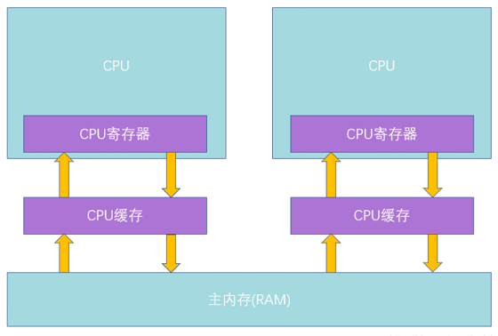

主内存（RAM）：也就是所谓的内存条，一般当数据写入电脑磁盘的时候需要先写入主内存，然后再写入磁盘。

系统主线：连接系统cpu和主内存的系统主线，就比如台式电脑连接主板上连接cpu和内存条的主线。

**CPU工作原理**

- 首先CPU工作的时候，由控制单元充当大脑，负责协调。
- 让运算单元做运算的时候，会首先从最靠近CPU的寄存器（其实是和CPU一体的）上读取数据，在寄存器上有CPU运行的常用指令
- 如果寄存器上没有想要的数据，则就从三级缓存的L1级缓存中获取，如果L1取到数据了，会加载到寄存器中，再转输给CPU运算单元。
- 如果L1中没有，则从L2级缓存中读取，同理，如果没有，则从L3中取。
- 如果L3中也没有，这个时候，就比较麻烦了。要从主内存中取。
- 而**从主内存中取的时候，会经过系统总线及内存总线,这时因受到总线的限制，速度会大大降低。而且会存在众多问题。**

**为什么要加入缓存**

再计算机最开始的时候，cpu直接于主内存交换数据，由于cpu性能日新月异的增长，远高于主内存读写，而需要等待主内存，这样发挥不了多核cpu高性能的优势，于是便增加了cpu多级缓存.读入缓存,下次用时从缓存读取,效率会大大提高

基于高速缓存的存储交互很好地解决了处理器与内存的速度矛盾，但是引入了一个新的问题：**缓存一致性（Cache Coherence）**。在多处理器系统中，每个处理器都有自己的高速缓存，而他们又共享同一主存，如下图所示：多个处理器运算任务都涉及同一块主存.

如果cpu1改变了从主内存中读取的一个数据,而cpu2也刚好访问同一块区域也需要读取这个数据,那么读到的就会是未改变的值,造成缓存不一致

那么为了解决一致性的问题，需要各个处理器访问缓存时都 遵循一些协议，在读写时要根据协议来进行操作。常用的方法是总线加锁或是缓存一致性协议-`MESI`

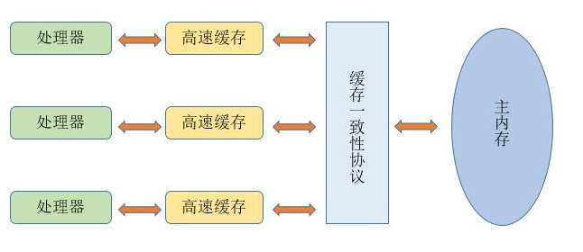

java的多线程内存模型是基于CPU缓存模型建立的,java线程内存模型是标准化的,屏蔽掉了底层不同计算机的区别

注意java多线程内存模型 与 JVM内存模型并不是一回事.

### 3.2 回顾JVM内存模型


Java虚拟机在运行程序时会把其自动管理的内存划分为以上几个区域，每个区域都有的用途以及创建销毁的时机，其中蓝色部分代表的是所有线程共享的数据区域，而绿色部分代表的是每个线程的私有数据区域。

- 方法区（Method Area）：

  方法区属于线程共享的内存区域，又称Non-Heap（非堆），主要用于存储已被虚拟机加载的类信息、常量、静态变量、即时编译器编译后的代码等数据，根据Java 虚拟机规范的规定，当方法区无法满足内存分配需求时，将抛出OutOfMemoryError 异常。值得注意的是在方法区中存在一个叫运行时常量池(Runtime Constant Pool）的区域，它主要用于存放编译器生成的各种字面量和符号引用，这些内容将在类加载后存放到运行时常量池中，以便后续使用。

- JVM堆（Java Heap）：

  Java 堆也是属于线程共享的内存区域，它在虚拟机启动时创建，是Java 虚拟机所管理的内存中最大的一块，主要用于存放对象实例，几乎所有的对象实例都在这里分配内存，注意Java 堆是垃圾收集器管理的主要区域，因此很多时候也被称做GC 堆，如果在堆中没有内存完成实例分配，并且堆也无法再扩展时，将会抛出OutOfMemoryError 异常。

- 程序计数器(Program Counter Register)：

  属于线程私有的数据区域，是一小块内存空间，主要代表当前线程所执行的字节码行号指示器。字节码解释器工作时，通过改变这个计数器的值来选取下一条需要执行的字节码指令，分支、循环、跳转、异常处理、线程恢复等基础功能都需要依赖这个计数器来完成。

- 虚拟机栈(Java Virtual Machine Stacks)：

  属于线程私有的数据区域，与线程同时创建，总数与线程关联，代表Java方法执行的内存模型。每个方法执行时都会创建一个栈桢来存储方法的的变量表、操作数栈、动态链接方法、返回值、返回地址等信息.

- 本地方法栈(Native Method Stacks)：

  本地方法栈属于线程私有的数据区域，这部分主要与虚拟机用到的 Native 方法相关，一般情况下，我们无需关心此区域。

这里之所以简要说明这部分内容，注意是为了区别Java内存模型与Java内存区域的划分，毕竟这两种划分是属于不同层次的概念。

### 3.3 Java多线程内存模型概述

Java内存模型(即Java Memory Model，简称JMM)本身是一种抽象的概念，并不真实存在，它描述的是一组规则或规范，通过这组规范定义了程序中各个变量（包括实例字段，静态字段和构成数组对象的元素）的访问方式。由于JVM运行程序的实体是线程，而每个线程创建时JVM都会为其创建一个工作内存(有些地方称为栈空间)，用于存储线程私有的数据，而Java内存模型中规定所有变量都存储在主内存，主内存是共享内存区域，所有线程都可以访问，但线程对变量的操作(读取赋值等)必须在工作内存中进行，首先要将变量从主内存拷贝的自己的工作内存空间，然后对变量进行操作，操作完成后再将变量写回主内存，不能直接操作主内存中的变量，工作内存中存储着主内存中的变量副本拷贝，前面说过，工作内存是每个线程的私有数据区域，因此不同的线程间无法访问对方的工作内存，线程间的通信(传值)必须通过主内存来完成，其简要访问过程如下图


**具体访问的细节图**


```
read 读取，作用于主内存把变量从主内存中读取到本本地内存。
load 加载，主要作用本地内存，把从主内存中读取的变量加载到本地内存的变量副本中
use 使用，主要作用本地内存，把工作内存中的一个变量值传递给执行引擎，每当虚拟机遇到一个需要使用变量的值的字节码指令时将会执行这个操作。、
assign 赋值 作用于工作内存的变量，它把一个从执行引擎接收到的值赋值给工作内存的变量，每当虚拟机遇到一个给变量赋值的字节码指令时执行这个操作。
store 存储 作用于工作内存的变量，把工作内存中的一个变量的值传送到主内存中，以便随后的write的操作。
write 写入 作用于主内存的变量，它把store操作从工作内存中一个变量的值传送到主内存的变量中。
lock 锁定 ：作用于主内存的变量，把一个变量标识为一条线程独占状态。
unlock 解锁：作用于主内存变量，把一个处于锁定状态的变量释放出来，释放后的变量才可以被其他线程锁定。
```

## 第四章 java并发编程的三大特性

在JAVA并发编程，如果要保证程序的线程安全，就要保证代码的原子性、可见性、有序性。

### 4.1 原子性

原子性，即一个操作或多个操作，要么全部执行并且在执行的过程中不被打断，要么全部不执行。（提供了互斥访问，在同一时刻只有一个线程进行访问.

**JAVA本身的原子性**

由JAVA内存模型来直接保证具有原子性变量操作 的有read/load/use/assign/store/write，也就是说对于基本数据类型的赋值，读取操作时具有原子性的。

**下面具有原子性的操作有？**

```
x=1;
y=x;
x++;
x=x+1;
第一条 x =1,是一个单纯的赋值操作，满足原子性。
第二条 y=x ,实际是两个操作，分别是 读取x变量 ，将x赋值给y，这两个操作分别来看都是原子性的，但是合起来就不是了。
第三条 x++,实际是三个操作 ，先读取变量 ，在进行+1操作 ，再赋值给x,不满足原子性
第四条 x=x+1 同上，不满足原子性
```

**JAVA提供了原子性的技术保障有如下：**

1、synchronized （互斥锁）
2、Lock（互斥锁）
3、原子类(CAS)

上面两个都是通过互斥锁实现，即同一时刻只允许一个线程操作该变量，保障了原子性,这里不再过多介绍.

#### 4.1.1 原子类AtomicInteger

```java
/*
    java.util.concurrent.atomic.AtomicInteger
    构造方法
        public AtomicInteger()创建具有初始值 0 的新 AtomicInteger。
        public AtomicInteger(int initialValue) 创建具有给定初始值的新 AtomicInteger。
      方法
        int incrementAndGet()  以原子方式将当前值加 1。
        int getAndIncrement()  以原子方式将当前值加 1。

        int decrementAndGet()  以原子方式将当前值减 1。
        int getAndIncrement()  以原子方式将当前值减 1。


        int getAndAdd(int delta)  以原子方式将给定值与当前值相加。
        int addAndGet(int delta)  以原子方式将给定值与当前值相加。
        int get() 获取当前值。
 */
public class Test02 {
    public static void main(String[] args) {
        AtomicInteger  ai = new AtomicInteger(1);

        ai.incrementAndGet(); //++ai    2
        ai.getAndIncrement(); //ai++    3


        System.out.println(ai.get());// 3
        System.out.println(ai.getAndIncrement()); // 3
        System.out.println(ai.get()); // 4
        System.out.println(ai.incrementAndGet()); // 5
        System.out.println(ai.get()); //5     
    }
}
```

**AtomicInteger原子性测试:**

```java
public class Test {
    static  int num = 0;
    static  AtomicInteger ai = new AtomicInteger(0);
    public static void main(String[] args) throws InterruptedException {

        Thread t1 = new Thread(new Runnable() {
            @Override
            public void run() {
                for (int i = 0; i < 10000; i++) {
                    num++;
                    ai.incrementAndGet();
                }
            }
        });
        Thread t2 = new Thread(new Runnable() {
            @Override
            public void run() {
                for (int i = 0; i < 10000; i++) {
                    num++;
                    ai.incrementAndGet();
                }
            }
        });

        t1.start();
        t2.start();
        t1.join();
        t2.join();

        System.out.println(num);
        System.out.println(ai);
    }
}

```

运行结果:


OK!我们发现AtomicInteger的结果是没有问题的,那么AtomicInteger保证原子性的原理是什么呢?

#### 4.1.2 CAS无锁机制

​	CAS是英文单词Compare And Swap的缩写，翻译过来就是比较并替换。当多条线程尝试使用CAS同时更新同一个变量时,只有其中一条线程能更新变量的值,而其他线程都失败,失败的线程并不会被挂起,而是告知这次竞争失败,并可以再次尝试.

CAS机制当中使用了3个基本操作数：一个当前内存值V、旧的预期值A、即将更新的值B,当且仅当预期值A和内存值V相同时,将内存值修改为B,如果不相等,cas失败,返回当前内存值V.

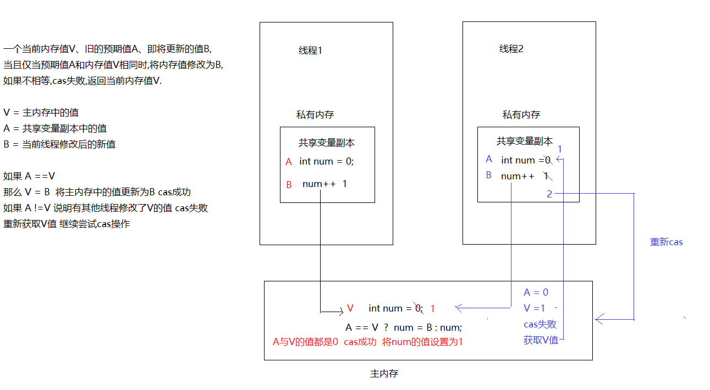

AtomicInteger源码:

```java
public class AtomicInteger extends Number implements java.io.Serializable {
  	 public final int incrementAndGet() {
        return unsafe.getAndAddInt(this, valueOffset, 1) + 1;
    }
  
}
public final class Unsafe {
  	public final int getAndAddInt(Object var1, long var2, int var4) {
        int var5;
        do {
            var5 = this.getIntVolatile(var1, var2);
        } while(!this.compareAndSwapInt(var1, var2, var5, var5 + var4));
        return var5;
    }
  	/*
  		此方法是Java的native方法，并不由Java语言实现。
        方法的作用是，读取传入对象o在内存中偏移量为offset位置的值与期望值expected作比较。
        相等就把x值赋值给offset位置的值。方法返回true。
        不相等，就取消赋值，方法返回false。
        CAS的思想，比较并交换。用于保证并发时的无锁并发的安全性。
  	*/
  	public final native boolean compareAndSwapInt(Object o, long offset,
                                              int expected,
                                              int x);

 
}
```

**CAS的缺点：**

CAS虽然很高效的解决了原子操作问题，但是CAS仍然存在三大问题。

1. 循环时间长开销很大。	

   ```
   CAS 通常是配合无限循环一起使用的，如果 CAS 失败，会一直进行尝试。如果 CAS 长时间一直不成功，可能会给 CPU 带来很大的开销。
   ```

2. 只能保证一个变量的原子操作。

   ```java
   当对一个变量执行操作时，我们可以使用循环 CAS 的方式来保证原子操作，但是对多个变量操作时，CAS 目前无法直接保证操作的原子性。
   ```

3. ABA问题。

   ```
   第一条线程获取到V位置的值  假设是 1
   第二条线程获取到V位置的值  也是1
   第一条线程cas成功 将值改为 0
   第一条线程又cas成功 将值改回 1
   这时第二条线程cas 发现值没变 还是1 cas成功   
   实际上当第二条线程cas时 V位置的值已经从 1-0-1
   这就是ABA问题 
   如何解决 每次获取V位置的值时,带上一个版本号.这样就可以避免ABA问题 java中AtomicStampedReference这个类在cas时就是通过版本号来解决的
   ```

**悲观锁和乐观锁:**

无论是悲观锁还是乐观锁，都是人们定义出来的概念，可以认为是一种思想.

悲观锁:简单来说操作系统会悲观的认为如果不严格同步线程调用那么一定会产生异常.所以互斥锁将会锁定资源,只供一个线程调用.而阻塞其他线程.因此这种同步机制也叫做悲观锁..

乐观锁:比如CAS不会对资源进行锁定,而且当线程需要修改共享资源时,总是会乐观的认为值没有被其他线程修改过,而自己主动尝试修改对应的值.相较于悲观锁,这种同步机制称为乐观锁.

### 4.2 可见性

当多个线程访问同一个变量时,一个线程修改了这个变量的值,其他线程应该能够立即看得到修改的值.

我们现在多线程操作数据,对变量的修改都是在自己的本地内存(私有内存)中,再写回到主内存,一条线程将数据写回到主内存,其他线程用的还是自己本地内存(私有内存)中的共享副本,没有保证可见性.那么如何保证可见性呢?

```java
public class Test {
    public static  boolean flag = true;
    public static void main(String[] args) throws InterruptedException {
        new Thread(new Runnable() {
            @Override
            public void run() {
                System.out.println("1号线程启动....执行while循环");

                long num = 0;
                while(flag){
                    num++;
                }

                System.out.println(num);
            }
        }).start();

        Thread.sleep(2000);

        new Thread(new Runnable() {
            @Override
            public void run() {
                System.out.println("2号线程启动....修改flag的值为false,停止循环");
                flag = false;
            }
        }).start();

    }
}
```

效果如下:

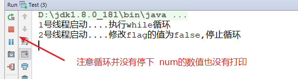

这是为什么呢?通过内存模型给大家解释!

​	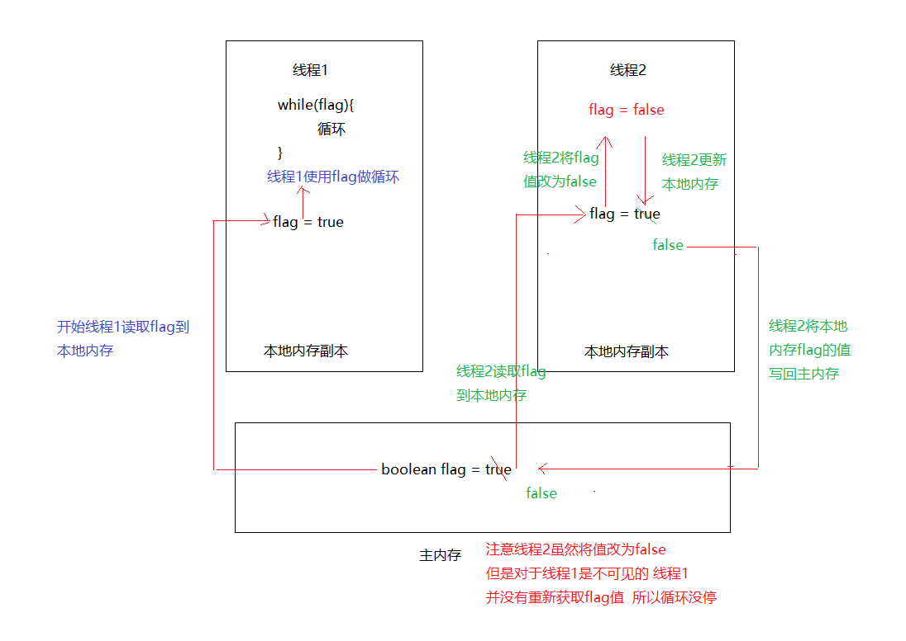

**那么如何保证可见性?**

**1.加锁,比如使用synchronized.**

```
JMM关于synchronized的两条规定：
　　1）线程解锁前，必须把共享变量的最新值刷新到主内存中
　　2）线程加锁时，将清空工作内存中共享变量的值，从而使用共享变量时需要从主内存中重新获取最新的值
```

```java
public class Test {

    //使用同步方法获取flag的值
    public static synchronized boolean getFlag(){
        return flag;
    }

    public static  boolean flag = true;
    public static void main(String[] args) throws InterruptedException {

        new Thread(new Runnable() {
            @Override
            public void run() {
                System.out.println("1号线程启动....执行while循环");
                long num = 0;
                    /*
                        线程调用getFlag方法时 先获取锁 也就是加锁
                        这时会先清空本地内存中共享副本的值,那么在使用值就需要从
                        主内存中重新获取 ,线程释放锁时,也就是解锁,会把共享变量flag
                        的值重新更新到主内存中
                     */
                    while(getFlag()){
                        num++;
                    }
                System.out.println(num);
            }
        }).start();

        Thread.sleep(2000);

        new Thread(new Runnable() {
            @Override
            public void run() {

                System.out.println("2号线程启动....修改flag的值为false,停止循环");
                flag = false;
            }
        }).start();
    }
}
```

效果如下:

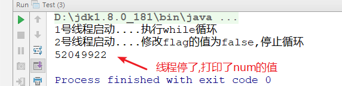

我们发现使用同步的确解决了可见性的问题,但是每次循环都要走同步方法,加锁,解锁,效率低下,有没有更好的办法?

**2.使用volatile关键字保证可见性**

```java
public class Test {
    public static volatile boolean flag = true;
    public static void main(String[] args) throws InterruptedException {

        new Thread(new Runnable() {
            @Override
            public void run() {
                System.out.println("1号线程启动....执行while循环");
                long num = 0;

                    while(flag){
                        num++;
                    }
                System.out.println(num);
            }
        }).start();
        Thread.sleep(2000);
        new Thread(new Runnable() {
            @Override
            public void run() {

                System.out.println("2号线程启动....修改flag的值为false,停止循环");
                flag = false;
            }
        }).start();
    }
}

```

效果如下

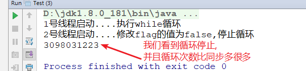

那么volatile是如何保障可见性的呢?

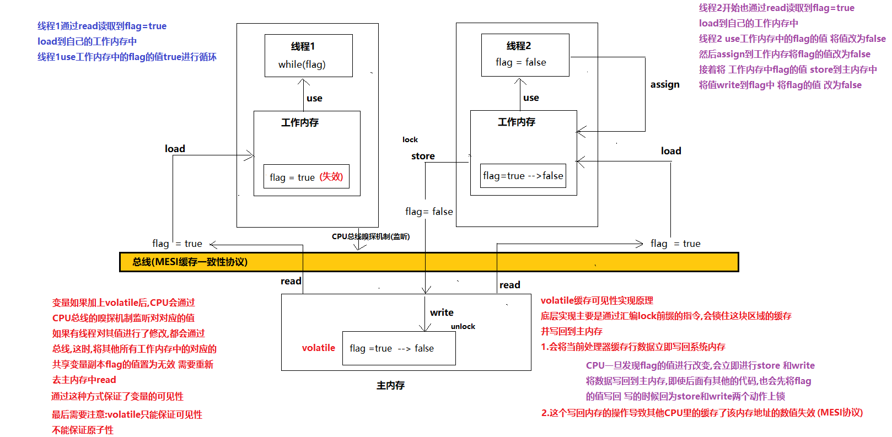

**volatile缓存可见性实现原理**

底层实现主要是通过汇编lock前缀指令,会锁住这块区域的缓存,并写回主内存.

1.会将当前处理器缓存的行数据立即写回系统内存

2.这个写回内存的操作导致CPU的缓存该内存地址的数值失效(MESI协议)

**注意:**volatile只能保证可见性,但是不能保证原子性,如果要保证原子性,请使用锁

看下面代码:

```java
public class Test {
    static volatile  int num = 0;
    public static void main(String[] args) throws InterruptedException {

        Thread t1 = new Thread(new Runnable() {
            @Override
            public void run() {
                for (int i = 0; i < 10000; i++) {
                    num++;
                }
            }
        });
        Thread t2 = new Thread(new Runnable() {
            @Override
            public void run() {
                for (int i = 0; i < 10000; i++) {
                    num++;
                }
            }
        });

        t1.start();
        t2.start();
        t1.join();
        t2.join();

        System.out.println(num);
    }
}
```

运行结果:


我们发现即使加入了volatile关键字 结果也是错误的,为什么呢?

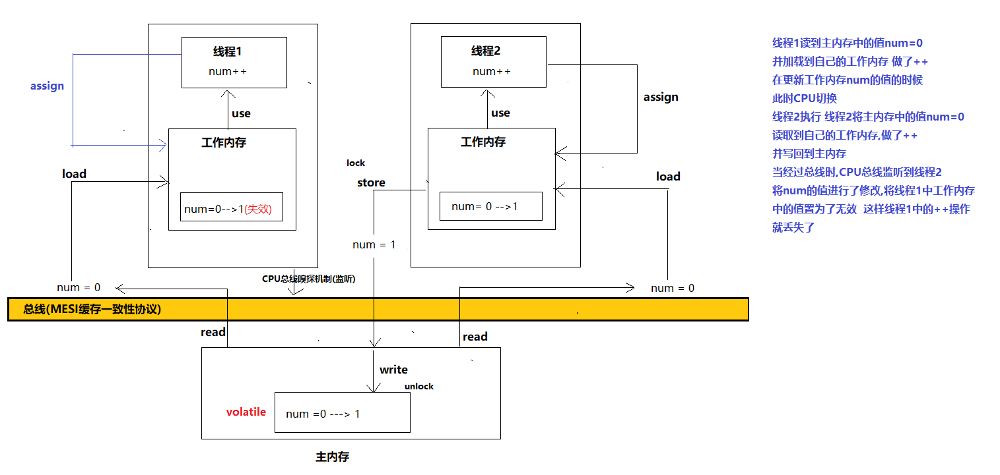

通过这张图给大家解释了volatile是不保证原子性的.

### 4.3 有序性

一般来说,程序的执行顺序按照代码的先后顺序执行.但是处理器为了提高程序的效率,可能会对代码的执行顺序进行优化,它不保证程序中各个语句的执行先后顺序一致,但是保证程序的最终结果和代码顺序执行的结果一致.

```
int a = 10; 	//语句1
int b = 20;     //语句2
int c = 20;     //语句3
c= a + b;  //语句4
```

CPU可能会对没有依赖关系的语句进行重排,比如 2134,3124 但是不会对有依赖关系的数据进行重排比如 3和4 改为4和3 这样就会对结果造成影响.这种重排对单线程是没有任何影响的,但是如果是多线程就可能会出现问题.

验证CPU是否会进行指令重排:

```java
public class Test {

    public static void main(String[] args) throws InterruptedException {

        for (int i = 0; i < 500000; i++) {
            Test.State state = new Test.State();

            ThreadA t1 = new ThreadA(state);
            ThreadB t2 = new ThreadB(state);

            t1.start();
            t2.start();

        }

    }


    static class ThreadA extends Thread{
        private final Test.State  state;
        ThreadA(Test.State state){
            this.state =state;
        }


        public void run(){
            state.a=1;
            state.b=1;
            state.c=1;
            state.d=1;


        }

    }
    static class ThreadB extends Thread{
        private final Test.State  state;
        ThreadB(Test.State state){
            this.state =state;
        }


        public void run(){
//            System.out.println(""+state.a+state.b+state.c+state.d);
            if( state.b== 1 && state.a ==0){
                System.out.println("b= " + state.b);
            }

            if(state.c == 1 &&(state.b==0|| state.a ==0)){
                System.out.println("c = " + state.c);
            }

            if(state.d==1 &&(state.a==0||state.b==0||state.c==0)){
                System.out.println("d " + state.d);
            }
        }

    }

    static  class  State{
        int a = 0;
        int b = 0;
        int c = 0;
        int d = 0;
    }
}
```

结果如下

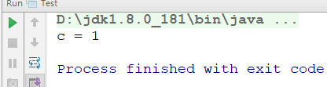


正常来说控制台是不能有任何结果打印的,但是打印了c=1说明,CPU进行了重排,让c在b或者a前面进行了赋值.

改变顺序可能导致执行结果不同，因此需要禁止重排序。如何禁止重排序呢?可以使用volatile关键字

```
static  class  State{
        volatile int  a = 0;
        volatile int b = 0;
        volatile int c = 0;
        volatile int d = 0;
 }
```

这样后就不会出现刚才的情况,运行了两次控制台没有任何的结果打印.

**由此可见:volatile关键字有两个作用1.保证可见性.2禁止重排序**

**注意:锁也可以保证有序性,因为在代码块中,一次只有一个线程执行,系统重排对单线程执行是没有任何影响的.**

**面试题:DCL单例是否需要使用volatile关键字?**

**单例设计模式**

单例代表单个实例,保证一个类的对象永远只有一个!

**饿汉式:**

```java

public class Singleton {

    // 将自身实例化对象设置为一个属性，并用static、final修饰
    private static final Singleton instance = new Singleton();
    
    // 构造方法私有化
    private Singleton() {}
    
    // 静态方法返回该实例
    public static Singleton getInstance() {
        return instance;
    }
}
```

“饿汉模式”的优缺点：

优点：实现起来简单，没有多线程同步问题。

缺点：当类SingletonTest被加载的时候，会初始化static的instance，静态变量被创建并分配内存空间，从这以后，这个static的instance对象便一直占着这段内存（即便你还没有用到这个实例），当类被卸载时，静态变量被摧毁，并释放所占有的内存，因此在某些特定条件下会耗费内存。

**懒汉式(延迟加载):**

延迟加载就是调用get()方法时实例才被创建（先不急着实例化出对象，等要用的时候才给你创建出来。不着急，故又称为“懒汉模式”），常见的实现方法就是在get方法中进行new实例化。

```java
public class Singleton {

    // 将自身实例化对象设置为一个属性，并用static修饰
    private static Singleton instance;
    
    // 构造方法私有化
    private Singleton() {}
    
    // 静态方法返回该实例
    public static Singleton getInstance() {
        if(instance == null) {
            instance = new Singleton();
        }
        return instance;
    }
}
```

“懒汉模式”的优缺点：

优点：实现起来比较简单，当类SingletonTest被加载的时候，静态变量static的instance没有创建对象，当getInstance方法第一次被调用时，才创建对象为其赋值，因此在某些特定条件下会节约了内存。

缺点：在多线程环境中，这种实现方法是完全错误的，根本不能保证单例的状态。

**线程安全的“懒汉模式”**

```java
public class Singleton {

    // 将自身实例化对象设置为一个属性，并用static修饰
    private static Singleton instance;
    
    // 构造方法私有化
    private Singleton() {}
    
    // 静态方法返回该实例，加synchronized关键字实现同步
    public static synchronized Singleton getInstance() {
        if(instance == null) {
            instance = new Singleton();
        }
        return instance;
    }
}
```

优点：在多线程情形下，保证了“懒汉模式”的线程安全。

缺点：众所周知在多线程情形下，synchronized方法通常效率低，显然这不是最佳的实现方案。

**DCL双检查锁机制单例（DCL：double checked locking）**

```java
public class Singleton {

    // 将自身实例化对象设置为一个属性，并用static修饰
    private static /*volatile*/ Singleton instance;
    
    // 构造方法私有化
    private Singleton() {}
    
    // 静态方法返回该实例
    public static Singleton getInstance() {
        // 第一次检查instance是否被实例化出来，如果没有进入if块
        if(instance == null) {
            synchronized (Singleton.class) {
                // 某个线程取得了类锁，实例化对象前第二次检查instance是否已经被实例化出来，如果没有，才				最终实例出对象
                if (instance == null) {
                    instance = new Singleton();
                }
            }
        }
        return instance;
    }
}

```

DCL双检查锁机制单例,效率高，线程安全，多线程操作原子性。

OK!那么明白了什么是DCL单例,回到我们的面试题:DCL单例是否需要使用volatile关键字?

这个问题是问 private static Singleton instance; 这段代码是否需要加上volatile关键字.需不需要呢?这个我们需要重头来研究.首先大家要知道一个问题就是创建对象的过程.

```java
public class A {
    int m = 10;
}
public class Test {
    public static void main(String[] args) {
       A a = new A();
    }
}
```

很简单的一段代码!但是我们看到的是一行创建A对象的代码,但是在java字节码中的指令是有好几条的,这里找到我们需要的3个字节码中的指令

```
 	NEW com/doit/demo11/A    //在内存中申请一块空间  此时m的值为0
    INVOKESPECIAL com/doit/demo11/A.<init> ()V  //调用init方法为A初始化  此时m的值为8 
    ASTORE 1        //将引用赋值给a
```

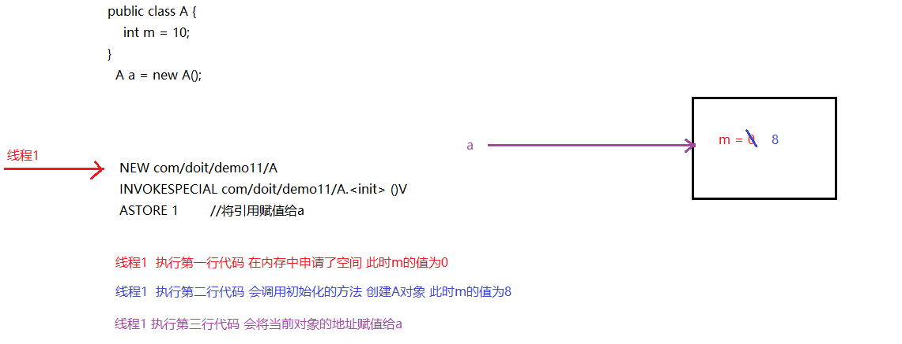

那么这就是对象的创建过程,但是总共是3行代码,如果在执行中出现了指令重排,会是什么样的?

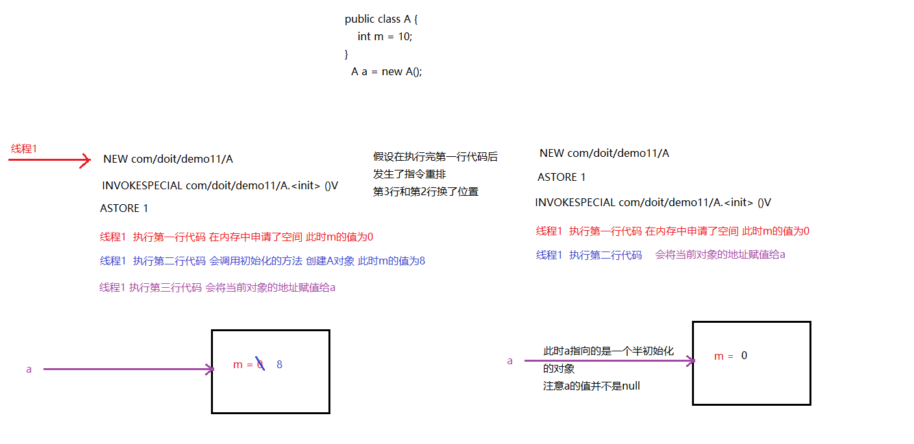

好了!了解完对象的创建过程,回过头来看我们的DCL单例!

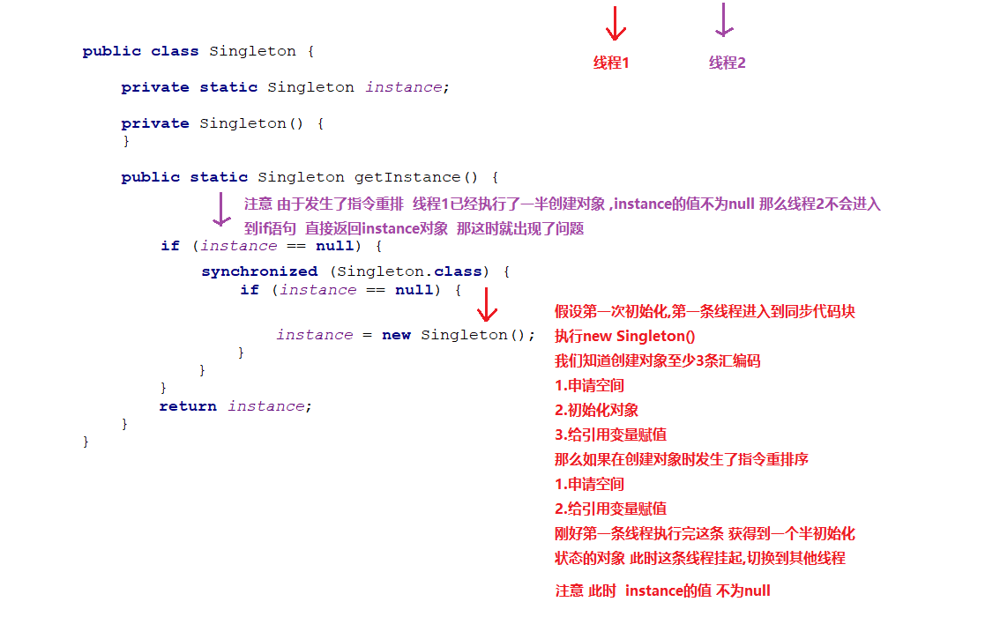
现在我们可以回答这道面试题DCL单例需要加上volatile关键字,虽然理论上需要,但是实际上这种情况几乎不可能出现.

## 第五章 Callable接口

我们知道创建线程的两种方式,一种是直接继承Thread，另外一种就是实现Runnable接口。

这2种方式都有一个缺陷就是：在执行完任务之后无法获取执行结果。如果需要获取执行结果，就必须通过共享变量或者使用线程通信的方式来达到效果，这样使用起来就比较麻烦。而自从Java 1.5开始，就提供了Callable接口。

先说一下java.lang.Runnable吧，它是一个接口，在它里面只声明了一个run()方法：

```java
public interface Runnable {
    public abstract void run();
}
```

由于run()方法返回值为void类型，所以在执行完任务之后无法返回任何结果。并且由于run方法并没有抛出异常,所以实现类在实现的时候也无法抛出异常,有异常只能捕获.

Callable位于java.util.concurrent包下，它也是一个接口，在它里面也只声明了一个方法，只不过这个方法叫做call()：

```java
public interface Callable<V> {
    /**
     * Computes a result, or throws an exception if unable to do so.
     *
     * @return computed result
     * @throws Exception if unable to compute a result
     */
    V call() throws Exception;
}
```

可以看到，这是一个泛型接口，call()函数返回的类型就是传递进来的V类型。

那么如何使用Callable接口呢?

1.定义类实现Callable接口 

2.重写call方法 

3.开启线程   

```java
public class MyCall implements Callable<Integer> {

    private int n;

    public MyCall(int n){
        this.n = n;
    }

    @Override
    public Integer call() throws Exception {

        int sum = 0;
        for (int i = 0; i < n; i++) {
            sum += i;
        }
        return sum;
    }
}

```

```java
public class Test {
    public static void main(String[] args) throws ExecutionException, InterruptedException {

        MyCall myCall = new MyCall(100);
        FutureTask<Integer> ft = new FutureTask<>(myCall);
      // 需要注意Thread类并没有接收Callable接口的构造方法
      //所以需要使用FutureTask包装一下 再传入到Thread类中
        Thread t = new Thread(ft);

        t.start();


        System.out.println(ft.get());

    }
}
```

## 第六章 Timer定时器

### 6.1 概述

Java中的定时器，可以根据指定的时间来运行程序。

`java.util.Timer`一种工具，线程用其安排以后在后台线程中执行的任务。可安排任务执行一次，或者定期重复执行。定时器是使用新建的线程来执行，这样即使主线程main结束了，定时器也依然会继续工作。

### 6.2 Timer类的方法

- 构造方法：无参数。
- 定时方法：public void schedule(TimerTask task,Date firstTime,long period)
  - TimerTask是定时器要执行的任务，一个抽象类，我们需要继承并重写方法run()
  - firstTime定时器开始执行的时间
  - period时间间隔，毫秒值

### 6.3 定时器案例

```java
public static void main(String[] args) throws Exception {
        Timer timer = new Timer();
        timer.schedule(new TimerTask() {
            @Override
            public void run() {
                System.out.println("线程定时任务");
            };
        },new Date(),3000);
    }
```


