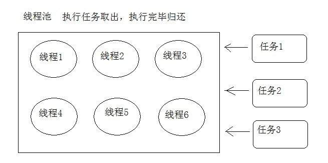

# day19 阻塞队列、线程池、File类、递归

## 第一章 阻塞队列

阻塞队列（BlockingQueue）是一个支持两个附加操作的队列。这两个附加的操作是：在队列为空时，获取元素的线程会等待队列变为非空。当队列满时，存储元素的线程会等待队列可用。阻塞队列常用于生产者和消费者的场景，生产者是往队列里添加元素的线程，消费者是从队列里拿元素的线程。阻塞队列就是生产者存放元素的容器，而消费者也只从容器里拿元素。

| 队列                  | 有界性                | 锁    | 数据结构       |
| ------------------- | ------------------ | ---- | ---------- |
| ArrayBlockingQueue  | bounded(有界)        | 加锁   | arrayList  |
| LinkedBlockingQueue | optionally-bounded | 加锁   | linkedList |
| SynchronousQueue    | bounded            | 加锁   | 无          |

- ArrayBlockingQueue：是一个用数组实现的有界阻塞队列，此队列按照先进先出（FIFO）的原则对元素进行排序。支持公平锁和非公平锁。【注：每一个线程在获取锁的时候可能都会排队等待，如果在等待时间上，先获取锁的线程的请求一定先被满足，那么这个锁就是公平的。反之，这个锁就是不公平的。公平的获取锁，也就是当前等待时间最长的线程先获取锁】
- LinkedBlockingQueue：一个由链表结构组成的有界队列，此队列的长度为Integer.MAX_VALUE。此队列按照先进先出的顺序进行排序。
- SynchronousQueue： 一个不存储元素的阻塞队列，每一个put操作必须等待take操作，否则不能添加元素。支持公平锁和非公平锁。

**常用方法**

```java
public void put(E e)将指定的元素插入此队列的尾部，如果该队列已满，则等待可用的空间。 
public E take()  获取并移除此队列的头部，在元素变得可用之前一直等待（如果有必要）。 
```

代码演示

```java
public class Test {
    public static void main(String[] args) throws ExecutionException, InterruptedException {

//        BlockingQueue<Integer>  blockingQueue = new ArrayBlockingQueue<>(5);
//        BlockingQueue<Integer>  blockingQueue = new LinkedBlockingQueue<>();
        BlockingQueue<Integer>  blockingQueue = new SynchronousQueue<>();


        new Thread(new Runnable() {
            @Override
            public void run() {
                for (int i = 0; i < 20; i++) {
                    try {
                        blockingQueue.put(i);
                        System.out.println("存入数据-->"+i);

                    } catch (InterruptedException e) {
                        e.printStackTrace();
                    }
                }
            }
        }).start();

        new Thread(new Runnable() {
            @Override
            public void run() {
                while(true){

                    try {
                        Thread.sleep(1000);
                        System.out.println("取出数据-->"+blockingQueue.take());

                    } catch (InterruptedException e) {
                        e.printStackTrace();
                    }
                }

            }
        }).start();
    }
}
```


## 第二章 线程池Thread Pool

### 2.1 概述

创建线程每次都要和操作系统进行交互，线程执行完任务后就会销毁，如果频繁的大量去创建线程肯定会造成系统资源开销很大，降低程序的运行效率。

线程池思想就很好的解决了频繁创建线程的问题，我们可以预先创建好一些线程，把他们放在一个容器中，需要线程执行任务的时候，从容器中取出线程，任务执行完毕后将线程在放回容器。



**使用线程池好处:**	

1. 降低资源消耗。通过重复利用已创建的线程降低线程创建、销毁线程造成的消耗。
2. 提高响应速度。当任务到达时，任务可以不需要等到线程创建就能立即执行。
3. 提高线程的可管理性。线程是稀缺资源，如果无限制的创建，不仅会消耗系统资源，还会降低系统的稳定性，使用线程池可以进行统一的分配、调优和监控

### 2.2 JDK线程池

`java.util.concurrent `包中定义了线程池相关的类和接口

#### Executors类

创建线程池对象的工厂方法，使用此类可以创建线程池对象。

| 方法声明                                     | 方法含义                           |
| ---------------------------------------- | ------------------------------ |
| static ExecutorService newFixedThreadPool(int nThreads) | 创建一个可重用固定线程数的线程池。              |
| static ExecutorService newCachedThreadPool() | 创建一个可根据需要创建新线程的线程池             |
| static ExecutorService newSingleThreadExecutor() | 创建一个使用单个 worker 线程的 Executor   |
| static ScheduledExecutorService newScheduledThreadPool(int corePoolSize) | 创建一个线程池，它可安排在给定延迟后运行命令或者定期地执行。 |

#### ExecutorService接口

线程池对象的管理接口，提交线程任务，关闭线程池等功能。

| 方法声明                                 | 方法含义                                 |
| ------------------------------------ | ------------------------------------ |
| Future<?> submit(Runnable task)      | 提交线程执行的任务，方法将返回null，因为run()(方法没有返回值。 |
| <T>Future<T>submit(Callable<T> task) | 提交线程执行的任务，返回Future接口对象。              |
| void shutdown()                      | 关闭线程池，但是要等所有线程都完成任务后再关闭，但是不接收新任务。    |

#### **线程池工具类简单使用**

```java
public class MyRun implements Runnable {
    @Override
    public void run() {

        System.out.println(Thread.currentThread().getName());
    }
}
public class Test {
    public static void main(String[] args) {

        ExecutorService pool = Executors.newFixedThreadPool(2);

        pool.submit(new MyRun());
        pool.submit(new MyRun());
        pool.submit(new MyRun());
        pool.submit(new MyRun());
        pool.submit(new MyRun());
        pool.submit(new MyRun());
        pool.submit(new MyRun());

        pool.shutdown();
        
    }
}

```

#### **使用Callable完成异步计算**

**Callable接口**

线程执行的任务接口，类似于Runnable接口。

- 接口方法`public V call()throw Exception`
  - 线程要执行的任务方法
  - 比起run()方法，call()方法具有返回值，可以获取到线程执行的结果。

**Future接口**

异步计算结果，就是线程执行完成后的结果。

- 接口方法`public V get()`获取线程执行的结果，就是获取call()方法返回值。

### 2.3 实现线程池程序

需求：创建有2个线程的线程池，分别提交线程执行的任务，一个线程执行字符串切割，一个执行1+100的和。

实现Callable接口，字符串切割功能：

```java
public class MyStringCallable implements Callable<String[]> {

    private  String str;

    public MyStringCallable(String str ){
        this.str = str;
    }

    @Override
    public String[] call() throws Exception {
        return str.split(" +");
    }
}
```

实现Callable接口，1+100求和：

```java
public class MySumCallable implements Callable<Integer> {
    @Override
    public Integer call() throws Exception {
        int sum = 0;
        for(int x = 1 ; x<= 100; x++){
            sum+=x;
        }
        return sum;
    }
}
```

测试类：

```java
 public static void main(String[] args) throws Exception {
     //创建有2个线程的线程池
     ExecutorService executorService = Executors.newFixedThreadPool(2);
     //提交执行字符串切割任务
     Future<String[]> futureString = executorService.submit(new MyStringCallable("aa bbb   cc    d       e"));
     System.out.println(Arrays.toString(futureString.get()));
     //提交执行求和任务
     Future<Integer> futureSum =  executorService.submit(new MySumCallable());
     System.out.println(futureSum.get());
     executorService.shutdown();
    }
```

### 2.4 ThreadPoolExecutor

刚才我们是通过Executors中的静态方法去创建线程池的，通过查看源代码我们发现，其底层都是通过构造ThreadPoolExecutor实现的。

那么也可以使用ThreadPoolExecutor去创建线程池。

ThreadPoolExecutor最完整的构造方法：

```java
public ThreadPoolExecutor(int corePoolSize,
                              int maximumPoolSize,
                              long keepAliveTime,
                              TimeUnit unit,
                              BlockingQueue<Runnable> workQueue,
                              ThreadFactory threadFactory,
                              RejectedExecutionHandler handler)
```

| 参数              | 说明                                       |
| --------------- | ---------------------------------------- |
| corePoolSize    | 核心线程数量，线程池维护线程的最少数量                      |
| maximumPoolSize | 线程池维护线程的最大数量                             |
| keepAliveTime   | 线程池除核心线程外的其他线程的最长空闲时间，超过该时间的空闲线程会被销毁     |
| unit            | keepAliveTime的单位，TimeUnit中的几个静态属性：NANOSECONDS、MICROSECONDS、MILLISECONDS、SECONDS |
| workQueue       | 线程池所使用的任务缓冲队列                            |
| threadFactory   | 线程工厂，用于创建线程，一般用默认的即可                     |
| handler         | 线程池对拒绝任务的处理策略                            |

当线程池任务处理不过来的时候（什么时候认为处理不过来后面描述），可以通过handler指定的策略进行处理，ThreadPoolExecutor提供了四种策略：

1. ThreadPoolExecutor.AbortPolicy:丢弃任务并抛出RejectedExecutionException异常；也是默认的处理方式。
2. ThreadPoolExecutor.DiscardPolicy：丢弃任务，但是不抛出异常。
3. ThreadPoolExecutor.DiscardOldestPolicy：丢弃队列最前面的任务，然后重新尝试执行任务（重复此过程）
4. ThreadPoolExecutor.CallerRunsPolicy：由调用线程处理该任务

可以通过实现RejectedExecutionHandler接口自定义处理方式。

**参数详解:**


**线程池执行流程:**

**代码演示**

```java
public class Test {

    private static volatile boolean flag = true;

    public static void main(String[] args) throws InterruptedException {

        //此线程仅用于演示效果 可以让线程池中的线程任务快速执行完毕
        new Thread(new Runnable() {
            @Override
            public void run() {
                Scanner sc = new Scanner(System.in);
                while (sc.hasNext()) {
                    String s = sc.nextLine();
                    if ("stop".equals(s)) {
                        flag = false;
                        break;
                    }
                }
            }
        }).start();

        //创建线程池
        ThreadPoolExecutor pool = new ThreadPoolExecutor(2,
                3,
                10,
                TimeUnit.SECONDS,
                new ArrayBlockingQueue<Runnable>(5),
                // Executors.defaultThreadFactory(),
                new ThreadPoolExecutor.AbortPolicy());
        //创建10个线程任务执行
        for (int i = 0; i < 10; i++) {
            Thread.sleep(1000);
            pool.execute(new MyRunnable((i + 1) + ""));

        }
    }

    static class MyRunnable implements Runnable {
        private String name;

        public MyRunnable(String name) {
            this.name = name;
        }

        @Override
        public void run() {
            System.out.println(Thread.currentThread().getName() + "执行任务" + name);

            while (flag) {

            }
        }
    }
}

```

**【附】阿里巴巴Java开发手册中对线程池的使用规范**

1. 【强制】创建线程或线程池时请指定有意义的线程名称，方便出错时回溯。
   正例：

   ```java
   public class TimerTaskThread extends Thread {
       public TimerTaskThread(){
           super.setName("TimerTaskThread"); 
           ...
       }
   }
   ```

2. 【强制】线程资源必须通过线程池提供，不允许在应用中自行显式创建线程。
   说明： 使用线程池的好处是减少在创建和销毁线程上所花的时间以及系统资源的开销，解决资
   源不足的问题。如果不使用线程池，有可能造成系统创建大量同类线程而导致消耗完内存或者
   “过度切换”的问题。

3. 【强制】线程池不允许使用 Executors 去创建，而是通过 ThreadPoolExecutor 的方式，这样
   的处理方式让写的同学更加明确线程池的运行规则，规避资源耗尽的风险。
   说明： Executors 返回的线程池对象的弊端如下：
   1） FixedThreadPool 和 SingleThreadPool:
   允许的请求队列长度为 Integer.MAX_VALUE，可能会堆积大量的请求，从而导致 OOM。
   2） CachedThreadPool 和 ScheduledThreadPool:
   允许的创建线程数量为 Integer.MAX_VALUE， 可能会创建大量的线程，从而导致 OOM。


## 第三章 File类

### 3.1 概述

`java.io.File` 类是文件和目录路径名的抽象表示，主要用于文件和目录的创建、查找和删除等操作。File类将文件，文件夹和路径封装成了对象，提供大量的方法来操作这些对象。

### 3.2 File类的静态成员变量

- `static String pathSeparator` 与系统有关的路径分隔符。
  - Window操作系统，分隔符是分号。
  - Linux操作系统，分隔符是冒号。
- `static String separator` 与系统有关的默认名称分隔符。
  - Window操作系统，名称分割符号为 \。
  - Linux操作系统，名称分隔符号为 /。

### 3.3 绝对路径和相对路径

- **绝对路径**：从盘符开始的路径，这是一个完整的路径，绝对路径具有唯一性。
- **相对路径**：相对于项目目录的路径，这是一个便捷的路径，开发中经常使用。

```java
String path = "d:\\aaa\bbb\ccc\a.txt";//带盘符 绝对路径
String path2 = "a.txt"; //相对路径
```

### 3.4 File类构造方法

- `public File(String pathname) ` ：通过将给定的**路径名字符串**转换为抽象路径名来创建新的 File实例。  
- `public File(String parent, String child) ` ：从**父路径名字符串和子路径名字符串**创建新的 File实例。
- `public File(File parent, String child)` ：从**父抽象路径名和子路径名字符串**创建新的 File实例。  

```java
public static void main(String[] args){
    // 文件路径名
    String pathname = "D:\\aaa.txt";
    File file1 = new File(pathname); 
    System.out.println(file1);

    // 通过父路径和子路径字符串
    String parent = "d:\\aaa";
    String child = "bbb.txt";
    File file2 = new File(parent, child);
    System.out.println(file2);
    
    // 通过父级File对象和子路径字符串
    File parentDir = new File("d:\\aaa");
    String child = "bbb.txt";
    File file3 = new File(parentDir, child);
    System.out.println(file3);
}
```

**注意**：

1. 一个File对象代表硬盘中实际存在的一个文件或者目录。
2. 无论该路径下是否存在文件或者目录，都不影响File对象的创建。

### 3.5 File类的获取方法 

- `public String getAbsolutePath() ` ：返回此File的绝对路径名字符串。
- ` public String getPath() ` ：将此File转换为路径名字符串。 
- `public String getName()`  ：返回由此File表示的文件或目录的名称。  
- `public long length()`  ：返回由此File表示的文件的长度。 
- `public File getParentFile()`返回由此File表示的文件或目录的父目录，如果没有父目录，返回null。

```java
public static void main(String[] args) {
    File f = new File("d:/aaa/bbb.java");     
    System.out.println("文件绝对路径:"+f.getAbsolutePath());
    System.out.println("文件构造路径:"+f.getPath());
    System.out.println("文件名称:"+f.getName());
    System.out.println("文件长度:"+f.length()+"字节");
    System.out.ptintln("文件路径的父路径"+f.getParentFile());

    File f2 = new File("d:/aaa");     
    System.out.println("目录绝对路径:"+f2.getAbsolutePath());
    System.out.println("目录构造路径:"+f2.getPath());
    System.out.println("目录名称:"+f2.getName());
    System.out.println("目录长度:"+f2.length());
    System.out.ptintln("目录父路径"+f2.getParentFile());
}
```

### 3.6 File类判断方法

- `public boolean exists()` ：此File表示的文件或目录是否实际存在。
- `public boolean isDirectory()` ：此File表示的是否为目录。
- `public boolean isFile()` ：此File表示的是否为文件。

```java
public static void main(String[] args) {
    File f = new File("d:\\aaa\\bbb.java");
    File f2 = new File("d:\\aaa");
    // 判断是否存在
    System.out.println("d:\\aaa\\bbb.java 是否存在:"+f.exists());
    System.out.println("d:\\aaa 是否存在:"+f2.exists());
    // 判断是文件还是目录
    System.out.println("d:\\aaa 文件?:"+f2.isFile());
    System.out.println("d:\\aaa 目录?:"+f2.isDirectory());
}
```

### 3.7 File类创建删除功能的方法

- `public boolean createNewFile()` ：当且仅当具有该名称的文件尚不存在时，创建一个新的空文件。 
- `public boolean delete()` ：删除由此File表示的文件或目录。  不进回收站，直接删除。
- `public boolean mkdirs()` ：创建由此File表示的目录，包括任何必需但不存在的父目录。

```java
public static void main(String[] args) throws IOException {
    // 文件的创建
    File f = new File("aaa.txt");
    System.out.println("是否存在:"+f.exists()); // false
    System.out.println("是否创建:"+f.createNewFile()); // true
    System.out.println("是否存在:"+f.exists()); // true

    // 目录的创建
    File f2= new File("newDir");	
    System.out.println("是否存在:"+f2.exists());// false
    System.out.println("是否创建:"+f2.mkdirs());// true
    System.out.println("是否存在:"+f2.exists());// true

    // 文件的删除
    System.out.println(f.delete());// true

    // 目录的删除
    System.out.println(f2.delete());// true
    }
```

### 3.8 File类目录遍历方法

- `public File[] listFiles()`返回一个File数组，表示该File目录中的所有的子文件或目录、
- `public File[] listFiles(FileFilter filter)`返回一个File数组，表示该File目录中的所有的子文件或目录，filter是文件过滤器，可以过滤不需要的文件。

```java
public static void main(String[] args) {
    File dir = new File("d:\\java_code");
    //获取当前目录下的文件以及文件夹对象，只要拿到了文件对象，那么就可以获取更多信息
    File[] files = dir.listFiles();
    for (File file : files) {
    	System.out.println(file);
    }
}
```

#### FileFilter接口

文件过滤器接口，此接口的实现类可以传递给方法listFiles()，实现文件的过滤功能

FileFilter接口方法：

`public boolean accept(File path)`：方法参数就是listFiles()方法获取到的文件或者目录的路径。如果方法返回true，表示需要此路径，否则此路径将被忽略。

#### 遍历目录，获取所有的Java文件

```java
public static void main(String[] args){
    File dir = new File("d:\\demo");
    File[] files = dir.listFiles(new FileFilter() {
    @Override
    public boolean accept(File pathname) {
        //判断如果获取到的是目录，直接放行
        if(pathname.isDirectory())
        return true;
        //获取路径中的文件名，判断是否java结尾，是就返回true
        return pathname.getName().toLowerCase().endsWith("java");
      }
    });
    for(File file : files){
    	System.out.println(file);
    }
}
```

## 第四章 方法递归

### 4.1 概述

- **递归**：指在当前方法内调用自己的这种现象。

```java
public static void a(){
    a();
}
```

### 4.2 递归求和

#### 计算1 ~ n的和

**分析**：num的累和 = num + (num-1)的累和，所以可以把累和的操作定义成一个方法，递归调用。

实现代码：

```java
public static void main(String[] args) {
    //计算1~num的和，使用递归完成
    int num = 5;
    // 调用求和的方法
    int sum = getSum(num);
    // 输出结果
    System.out.println(sum);

}
/*
通过递归算法实现.
参数列表:int 
返回值类型: int 
*/
public static int getSum(int num) {
    /* 
    num为1时,方法返回1,
    相当于是方法的出口,num总有是1的情况
    */
    if(num == 1){
    	return 1;
    }
    /*
    num不为1时,方法返回 num +(num-1)的累和
    递归调用getSum方法
    */
    return num + getSum(num-1);
}
```

代码执行图解：


**注意**：递归一定要有条件限定，保证递归能够停止下来，否则就是四递归。递归次数不要太多，否则会发生栈内存溢出，会抛出StackOverflowError错误。

### 4.3 递归求阶乘

#### **阶乘**：所有小于及等于该数的正整数的积。

分析：n的阶乘：n! = n * (n-1) *...* 3 * 2 * 1 

```java
//计算n的阶乘，使用递归完成
public static void main(String[] args) {
    int n = 3;
    // 调用求阶乘的方法
    int value = getValue(n);
    // 输出结果
    System.out.println("阶乘为:"+ value);
}
    /*
    通过递归算法实现.
    参数列表:int 
    返回值类型: int 
    */
public static int getValue(int n) {
    // 1的阶乘为1
    if (n == 1) {
    	return 1;
}
    /*
    n不为1时,方法返回 n! = n*(n-1)!
    递归调用getValue方法
    */
    return n * getValue(n - 1);
}
```

### 4.4 目录遍历

遍历`D:\aaa` 目录下的所有文件和所有的子目录。

**分析**：目录遍历，无法判断多少级目录，所以在遍历需要进行判断，如果遍历到的还是目录，就要使用递归，遍历所有目录。

```java
public static void main(String[] args){
    // 创建File对象
    File dir  = new File("D:\\aaa");
    // 调用打印目录方法
    printDir(dir);
}

public static void printDir(File dir) {
    System.out.println(dir);
    // 获取子文件和目录
    File[] files = dir.listFiles();
    // 循环打印
    for (File file : files) {
        //判断是文件，直接输出
        if (file.isFile()) {
       	 	System.out.println(file);
        } else {
        	// 是目录，继续遍历,形成递归
        	printDir(file);	
        }
    }
}
```


## 