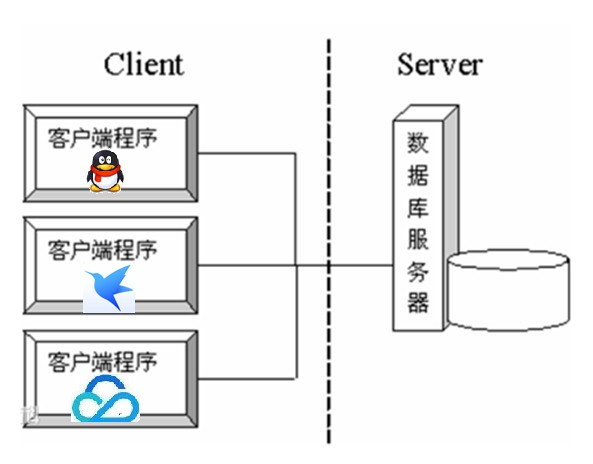
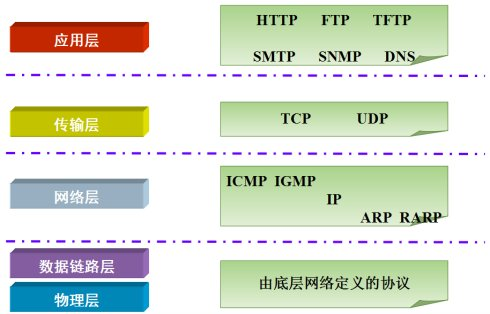

# day23 【网络编程】

## 今日内容

- 软件架构CS／BS
- 网络通信三要素
- TCP通信
- Socket套接字
- ServerSocket
- 文件上传
- 自定义服务器

## 第一章 网络编程入门

## 1.1软件结构

- **C/S结构** ：全称为Client/Server结构，是指客户端和服务器结构。常见程序有ＱＱ、迅雷等软件。



- **B/S结构** ：全称为Browser/Server结构，是指浏览器和服务器结构。常见浏览器有谷歌、火狐等。


两种架构各有优势，但是无论哪种架构，都离不开网络的支持。**网络编程**，就是在一定的协议下，实现两台计算机的通信的程序。

## 1.2 网络通信协议

- **网络通信协议：**通信协议是对计算机必须遵守的规则，只有遵守这些规则，计算机之间才能进行通信。这就好比在道路中行驶的汽车一定要遵守交通规则一样，协议中对数据的传输格式、传输速率、传输步骤等做了统一规定，通信双方必须同时遵守，最终完成数据交换。

- **TCP/IP协议：** 传输控制协议/因特网互联协议( Transmission Control Protocol/Internet Protocol)，是Internet最基本、最广泛的协议。它定义了计算机如何连入因特网，以及数据如何在它们之间传输的标准。它的内部包含一系列的用于处理数据通信的协议，并采用了4层的分层模型，每一层都呼叫它的下一层所提供的协议来完成自己的需求




## 1.4 网络编程三要素

#### 协议

- **协议：**计算机网络通信必须遵守的规则.

#### IP地址

- **IP地址：指互联网协议地址（Internet Protocol Address）**，俗称IP。要想使网络中的计算机能够进行通信，必须为每台计算机指定一个标识号，通过这个标识号来指定接受数据的计算机或者发送数据的计算机。

  在TCP/IP协议中，这个标识号就是IP地址，它可以唯一标识一台计算机，目前，IP地址广泛使用的版本是IPv4，它是由4个字节大小的二进制数来表示，如：00001010000000000000000000000001。由于二进制形式表示的IP地址非常不便记忆和处理，因此通常会将IP地址写成十进制的形式，每个字节用一个十进制数字(0-255)表示，数字间用符号“.”分开，如 “192.168.1.100”。

  随着计算机网络规模的不断扩大，对IP地址的需求也越来越多，IPV4这种用4个字节表示的IP地址面临枯竭，因此IPv6 便应运而生了，IPv6使用16个字节表示IP地址，它所拥有的地址容量约是IPv4的8×1028倍，达到2128个（算上全零的），这样就解决了网络地址资源数量不够的问题。

**IP地址分类**

- IPv4：是一个32位的二进制数，通常被分为4个字节，表示成`a.b.c.d` 的形式，例如`192.168.65.100` 。其中a、b、c、d都是0~255之间的十进制整数，那么最多可以表示42亿个。

- IPv6：由于互联网的蓬勃发展，IP地址的需求量愈来愈大，但是网络地址资源有限，使得IP的分配越发紧张。有资料显示，全球IPv4地址在2011年2月分配完毕。

  为了扩大地址空间，拟通过IPv6重新定义地址空间，采用128位地址长度，每16个字节一组，分成8组十六进制数，表示成`ABCD:EF01:2345:6789:ABCD:EF01:2345:6789`，号称可以为全世界的每一粒沙子编上一个网址，这样就解决了网络地址资源数量不够的问题。

**常用命令**

- 查看本机IP地址，在控制台输入：

```
ipconfig
```

- 检查网络是否连通，在控制台输入：

```
ping 空格 IP地址
ping 220.181.57.216
ping www.baidu.com
```

**特殊的IP地址**

- 本机IP地址：`127.0.0.1`、`localhost` 。

#### 端口号

网络的通信，本质上是两个进程（应用程序）的通信。每台计算机都有很多的进程，那么在网络通信时，如何区分这些进程呢？

如果说**IP地址**可以唯一标识网络中的设备，那么**端口号**就可以唯一标识设备中的进程（应用程序）了。

- **端口号：用两个字节表示的整数，它的取值范围是0~65535**。其中，0~1023之间的端口号用于一些知名的网络服务和应用，普通的应用程序需要使用1024以上的端口号。如果端口号被另外一个服务或应用所占用，会导致当前程序启动失败。

利用`协议`+`IP地址`+`端口号` 三元组合，就可以标识网络中的进程了，那么进程间的通信就可以利用这个标识与其它进程进行交互。


从上图中可以清楚地看到，位于网络中一台计算机可以通过IP地址去访问另一台计算机，并通过端口号访问目标计算机中的某个应用程序。

## 1.5  InetAddress

了解了IP地址的作用，我们看学习下JDK中提供了一个InetAdderss类，该类用于封装一个IP地址，并提供了一系列与IP地址相关的方法，下表中列出了InetAddress类的一些常用方法.

| 方法                                       | 描述                     |
| ---------------------------------------- | ---------------------- |
| static InetAddress getByName(String host) | 在给定主机名的情况下确定主机的 IP 地址。 |
| static InetAddress getLocalHost()        | 返回本地主机                 |
| public String getHostName()              | 获取此 IP 地址的主机名。         |
| public String getHostAddress()           | 返回 IP 地址字符串（以文本表现形式）。  |

上图中，列举了InetAddress的四个常用方法。其中，前两个方法用于获得该类的实例对象，第一个方法用于获得表示指定主机的InetAddress对象，第二个方法用于获得表示本地的InetAddress对象。通过InetAddress对象便可获取指定主机名，IP地址等，接下来通过一个案例来演示InetAddress的常用方法，如下所示。

```java
public class Test {
    public static void main(String[] args) throws UnknownHostException {
        InetAddress local = InetAddress.getLocalHost();
        InetAddress remote = InetAddress.getByName("www.baidu.com");
        System.out.println("本机的IP地址：" + local.getHostAddress());
        System.out.println("百度的IP地址：" + remote.getHostAddress());
        System.out.println("百度的主机名为：" + remote.getHostName());
    }
}
```

## 第二章 通信协议

在介绍TCP/IP结构时，提到传输层的两个重要的高级协议，分别是UDP和TCP，其中UDP是User Datagram Protocol的简称，称为用户数据报协议，TCP是Transmission Control Protocol的简称，称为传输控制协议。

### 2.1 UDP协议

UDP是无连接通信协议，即在数据传输时，数据的发送端和接收端不建立逻辑连接。简单来说，当一台计算机向另外一台计算机发送数据时，发送端不会确认接收端是否存在，就会发出数据，同样接收端在收到数据时，也不会向发送端反馈是否收到数据。

由于使用UDP协议消耗资源小，通信效率高，所以通常都会用于音频、视频和普通数据的传输例如视频会议都使用UDP协议，因为这种情况即使偶尔丢失一两个数据包，也不会对接收结果产生太大影响。

但是在使用UDP协议传送数据时，由于UDP的面向无连接性，不能保证数据的完整性，因此在传输重要数据时不建议使用UDP协议。UDP的交换过程如下图所示。


### 2.2 TCP协议

TCP传输控制协议 (Transmission Control Protocol)。TCP协议是**面向连接**的通信协议，即传输数据之前，在发送端和接收端建立逻辑连接，然后再传输数据，它提供了两台计算机之间可靠无差错的数据传输。

- 三次握手：TCP协议中，在发送数据的准备阶段，客户端与服务器之间的三次交互，以保证连接的可靠。
  - 第一次握手，客户端向服务器端发出连接请求，等待服务器确认。
  - 第二次握手，服务器端向客户端回送一个响应，通知客户端收到了连接请求。
  - 第三次握手，客户端再次向服务器端发送确认信息，确认连接。整个交互过程如下图所示


由于TCP协议的面向连接特性，它可以保证传输数据的安全性，所以是一个被广泛采用的协议，例如在下载文件时，如果数据接收不完整，将会导致文件数据丢失而不能被打开，因此，下载文件时必须采用TCP协议.

## 第三章 UDP通信

### 3.1 DatagramPacket

​	前面介绍了UDP是一种面向无连接的协议，因此，在通信时发送端和接收端不用建立连接。UDP通信的过程就像是货运公司在两个码头间发送货物一样。在码头发送和接收货物时都需要使用集装箱来装载货物，UDP通信也是一样，发送和接收的数据也需要使用“集装箱”进行打包，为此JDK中提供了一个DatagramPacket类，该类的实例对象就相当于一个集装箱，用于封装UDP通信中发送或者接收的数据。

想要创建一个DatagramPacket对象，首先需要了解一下它的构造方法。在创建发送端和接收端的DatagramPacket对象时，使用的构造方法有所不同，接收端的构造方法只需要接收一个字节数组来存放接收到的数据，而发送端的构造方法不但要接收存放了发送数据的字节数组，还需要指定发送端IP地址和端口号。

接下来根据API文档的内容，对DatagramPacket的构造方法进行逐一详细地讲解。

```
DatagramPacket(byte[] buf, int length)  构造 DatagramPacket，用来接收长度为 length 的数据包。
```

使用该构造方法在创建DatagramPacket对象时，指定了封装数据的字节数组和数据的大小，没有指定IP地址和端口号。很明显，这样的对象只能用于接收端，不能用于发送端。因为发送端一定要明确指出数据的目的地(ip地址和端口号)，而接收端不需要明确知道数据的来源，只需要接收到数据即可。

```java
DatagramPacket(byte[] buf, int length, InetAddress address, int port) 
构造数据报包，用来将长度为 length 的包发送到指定主机上的指定端口号。
```

使用该构造方法在创建DatagramPacket对象时，不仅指定了封装数据的字节数组和数据的大小，还指定了数据包的目标IP地址（addr）和端口号（port）。该对象通常用于发送端，因为在发送数据时必须指定接收端的IP地址和端口号，就好像发送货物的集装箱上面必须标明接收人的地址一样。

上面我们讲解了DatagramPacket的构造方法，接下来对DatagramPacket类中的常用方法进行详细地讲解，如下表所示。

| 方法                              | 描述                |
| ------------------------------- | ----------------- |
| public InetAddress getAddress() | 返回某台机器的 IP 地址     |
| public int getPort()            | 返回某台远程主机的端口号      |
| public byte[] getData()         | 返回数据缓冲区           |
| public int getLength()          | 返回将要发送或接收到的数据的长度。 |

### 3.2 DatagramSocket

DatagramPacket数据包的作用就如同是“集装箱”，可以将发送端或者接收端的数据封装起来。然而运输货物只有“集装箱”是不够的，还需要有码头。在程序中需要实现通信只有DatagramPacket数据包也同样不行，为此JDK中提供的一个DatagramSocket类。DatagramSocket类的作用就类似于码头，使用这个类的实例对象就可以发送和接收DatagramPacket数据包，发送数据的过程如下图所示。


在创建发送端和接收端的DatagramSocket对象时，使用的构造方法也有所不同，下面对DatagramSocket类中常用的构造方法进行讲解。

```java
DatagramSocket()  构造数据报套接字并将其绑定到本地主机上任何可用的端口。
```

该构造方法用于创建**发送端的DatagramSocket对象**，在创建DatagramSocket对象时，并没有指定端口号，此时，系统会分配一个没有被其它网络程序所使用的端口号。

```java
DatagramSocket(int port) 创建数据报套接字并将其绑定到本地主机上的指定端口。
```

该构造方法既可用于**创建接收端的DatagramSocket对象，又可以创建发送端的DatagramSocket对象**，在创建接收端的DatagramSocket对象时，必须要指定一个端口号，这样就可以监听指定的端口。

上面我们讲解了DatagramSocket的构造方法，接下来对DatagramSocket类中的常用方法进行详细地讲解。

```java
public void send(DatagramPacket p) 发送数据报包
```

```java
public void receive(DatagramPacket p) 接收数据报包
```

### 3.3 UDP网络程序

讲解了DatagramPacket和DatagramSocket的作用，接下来通过一个案例来学习一下它们在程序中的具体用法。

下图为UDP发送端与接收端交互图解:


要实现UDP通信需要创建一个发送端程序和一个接收端程序，很明显，在通信时只有接收端程序先运行，才能避免因发送端发送的数据无法接收，而造成数据丢失。因此，首先需要来完成接收端程序的编写。

**UDP完成数据的发送**

```java
/*
 * 发送端
 * 1,创建DatagramSocket对象
 * 2，创建DatagramPacket对象，并封装数据
 * 3，发送数据
 * 4，释放流资源
 */
public class UDPSend {
    public static void main(String[] args) throws IOException {
        //1,创建DatagramSocket对象
        DatagramSocket sendSocket = new DatagramSocket();
        //2，创建DatagramPacket对象，并封装数据
        //public DatagramPacket(byte[] buf, int length, InetAddress address,  int port)
        //构造数据报包，用来将长度为 length 的包发送到指定主机上的指定端口号。
        byte[] buffer = "hello,UDP".getBytes();
        DatagramPacket dp = new DatagramPacket(buffer, buffer.length, InetAddress.getByName("192.168.75.58"), 12306);
        //3，发送数据
        //public void send(DatagramPacket p) 从此套接字发送数据报包
        sendSocket.send(dp);
        //4，释放流资源
        sendSocket.close();
    }
}

```

**UDP接收端**

```java
/*
 * UDP接收端
 *
 * 1,创建DatagramSocket对象
 * 2,创建DatagramPacket对象
 * 3,接收数据存储到DatagramPacket对象中
 * 4,获取DatagramPacket对象的内容
 * 5,释放流资源
 */
public class UDPReceive {
    public static void main(String[] args) throws IOException {
        //1,创建DatagramSocket对象,并指定端口号
        DatagramSocket receiveSocket = new DatagramSocket(12306);
        //2,创建DatagramPacket对象, 创建一个空的仓库
        byte[] buffer = new byte[1024];
        DatagramPacket dp = new DatagramPacket(buffer, 1024);
        //3,接收数据存储到DatagramPacket对象中
        receiveSocket.receive(dp);
        //4,获取DatagramPacket对象的内容
        //谁发来的数据  getAddress()
        InetAddress ipAddress = dp.getAddress();
        String ip = ipAddress.getHostAddress();//获取到了IP地址
        //发来了什么数据  getData()
        byte[] data = dp.getData();
        //发来了多少数据 getLenth()
        int length = dp.getLength();
        //显示收到的数据
        String dataStr = new String(data,0,length);
        System.out.println("IP地址："+ip+ "数据是"+ dataStr);
        //5,释放流资源
        receiveSocket.close();
    }
}
```

## 第四章 TCP通信协议

### 4.1 概述

TCP通信能实现两台计算机之间的数据交互，通信的两端，要严格区分为客户端（Client）与服务端（Server）。

**两端通信时步骤：**

1. 服务端程序，需要事先启动，等待客户端的连接。
2. 客户端主动连接服务器端，连接成功才能通信。服务端不可以主动连接客户端。

**在Java中，提供了两个类用于实现TCP通信程序：**

- 客户端：`java.net.Socket` 类表示。创建`Socket`对象，向服务端发出连接请求，服务端响应请求，两者建立连接开始通信。
- 服务端：`java.net.ServerSocket` 类表示。创建`ServerSocket`对象，相当于开启一个服务，并等待客户端的连接。

### 4.2 Socket类  

`Socket` 类：该类实现客户端套接字，套接字指的是两台设备之间通讯的端点。

#### 构造方法

- `public Socket(String host, int port)` :创建套接字对象并将其连接到指定主机上的指定端口号。如果指定的host是null ，则相当于指定地址为回送地址。 

```java
Socket client = new Socket("127.0.0.1", 6666);
```

#### 成员方法

- `public InputStream getInputStream()` ： 返回此套接字的输入流。
  - 如果此Scoket具有相关联的通道，则生成的InputStream 的所有操作也关联该通道。
  - 关闭生成的InputStream也将关闭相关的Socket。
- `public OutputStream getOutputStream()` ： 返回此套接字的输出流。
  - 如果此Scoket具有相关联的通道，则生成的OutputStream 的所有操作也关联该通道。
  - 关闭生成的OutputStream也将关闭相关的Socket。
- `public void close()` ：关闭此套接字。
  - 一旦一个socket被关闭，它不可再使用。
  - 关闭此socket也将关闭相关的InputStream和OutputStream 。 
- `public void shutdownOutput()` ： 禁用此套接字的输出流。   
  - 任何先前写出的数据将被发送，随后终止输出流。 

### 4.3 ServerSocket类

`ServerSocket`类：这个类实现了服务器套接字，该对象等待通过网络的请求。

#### 构造方法

- `public ServerSocket(int port)` ：使用该构造方法在创建ServerSocket对象时，就可以将其绑定到一个指定的端口号上，参数port就是端口号。

```
ServerSocket server = new ServerSocket(6666);
```

#### 成员方法

- `public Socket accept()` ：侦听并接受连接，返回一个新的Socket对象，用于和客户端实现通信。该方法会一直阻塞直到建立连接。

### 4.4 简单的TCP网络程序

**TCP通信分析图解**

1. 【服务端】启动,创建ServerSocket对象，等待连接。
2. 【客户端】启动,创建Socket对象，请求连接。
3. 【服务端】接收连接,调用accept方法，并返回一个Socket对象。
4. 【客户端】Socket对象，获取OutputStream，向服务端写出数据。
5. 【服务端】Scoket对象，获取InputStream，读取客户端发送的数据。
6. 【服务端】Socket对象，获取OutputStream，向客户端回写数据。
7. 【客户端】Scoket对象，获取InputStream，解析回写数据。
8. 【客户端】释放资源，断开连接。


### 4.5 简单的TCP通信案例

**客户端向服务器发送数据--客户端程序**

```java
public class ClientTCP {
	public static void main(String[] args) throws Exception {
		System.out.println("客户端 发送数据");
		// 1.创建 Socket ( ip , port ) , 确定连接到哪里.
		Socket client = new Socket("localhost", 6666);
		// 2.获取流对象 . 输出流
		OutputStream os = client.getOutputStream();
		// 3.写出数据.
		os.write("你好么? tcp ,我来了".getBytes());
		// 4. 关闭资源 .
		os.close();
		client.close();
	}
}
```

**客户端向服务器发送数据--服务器端程序**

```java
public class ServerTCP {
    public static void main(String[] args) throws IOException {
        System.out.println("服务端启动 , 等待连接 .... ");
        // 1.创建 ServerSocket对象，绑定端口，开始等待连接
        ServerSocket ss = new ServerSocket(6666);
        // 2.接收连接 accept 方法, 返回 socket 对象.
        Socket server = ss.accept();
        // 3.通过socket 获取输入流
        InputStream is = server.getInputStream();
        // 4.一次性读取数据
      	// 4.1 创建字节数组
        byte[] b = new byte[1024];
      	// 4.2 据读取到字节数组中.
        int len = is.read(b)；
        // 4.3 解析数组,打印字符串信息
        String msg = new String(b, 0, len);
        System.out.println(msg);
        //5.关闭资源.
        is.close();
        server.close();
    }
}
```

**服务器向客户端回写数据--服务器端程序**

```java
public class ClientTCP {
	public static void main(String[] args) throws Exception {
		System.out.println("客户端 发送数据");
		// 1.创建 Socket ( ip , port ) , 确定连接到哪里.
		Socket client = new Socket("localhost", 6666);
		// 2.通过Scoket,获取输出流对象 
		OutputStream os = client.getOutputStream();
		// 3.写出数据.
		os.write("你好么? tcp ,我来了".getBytes());
      	// ==============解析回写=========================
      	// 4. 通过Scoket,获取 输入流对象
      	InputStream in = client.getInputStream();
      	// 5. 读取数据数据
      	byte[] b = new byte[100];
      	int len = in.read(b);
      	System.out.println(new String(b, 0, len));
		// 6. 关闭资源 .
      	in.close();
		os.close();
		client.close();
	}
}
```

**服务器向客户端回写数据--客户端程序**

```java
public class ServerTCP {
    public static void main(String[] args) throws IOException {
        System.out.println("服务端启动 , 等待连接 .... ");
        // 1.创建 ServerSocket对象，绑定端口，开始等待连接
        ServerSocket ss = new ServerSocket(6666);
        // 2.接收连接 accept 方法, 返回 socket 对象.
        Socket server = ss.accept();
        // 3.通过socket 获取输入流
        InputStream is = server.getInputStream();
        // 4.一次性读取数据
      	// 4.1 创建字节数组
        byte[] b = new byte[1024];
      	// 4.2 据读取到字节数组中.
        int len = is.read(b)；
        // 4.3 解析数组,打印字符串信息
        String msg = new String(b, 0, len);
        System.out.println(msg);
      	// =================回写数据=======================
      	// 5. 通过 socket 获取输出流
      	 OutputStream out = server.getOutputStream();
      	// 6. 回写数据
      	 out.write("我很好,谢谢你".getBytes());
      	// 7.关闭资源.
      	out.close();
        is.close();
        server.close();
    }
}
```

## 第五章 文件上传案例

### 5.1 文件上传案例

**文件上传分析图解**

1. 【客户端】输入流，从硬盘读取文件数据到程序中。
2. 【客户端】输出流，写出文件数据到服务端。
3. 【服务端】输入流，读取文件数据到服务端程序。
4. 【服务端】输出流，写出文件数据到服务器硬盘中。

5. 【服务端】获取输出流，回写数据。
6. 【客户端】获取输入流，解析回写数据。


### 5.2 文件上传客户端实现

```java
public static void main(String[] args) throws IOException {
    // 1.创建流对象
    // 1.1 创建输入流,读取本地文件
    BufferedInputStream bis = new BufferedInputStream(new FileInputStream("test.jpg"));
    // 1.2 创建输出流,写到服务端
    Socket socket = new Socket("localhost", 6666);
    BufferedOutputStream bos = new BufferedOutputStream(socket.getOutputStream());

    //2.写出数据.
    byte[] b  = new byte[1024 * 8 ];
    int len ;
    while (( len  = bis.read(b))!=-1) {
    	bos.write(b, 0, len);
    }
    // 关闭输出流,通知服务端,写出数据完毕
    socket.shutdownOutput();
    System.out.println("文件发送完毕");
    // 3. =====解析回写============
    InputStream in = socket.getInputStream();
    byte[] back = new byte[20];
    in.read(back);
    System.out.println(new String(back));
    in.close();
    
    // 4.释放资源
    socket.close();
    bis.close();
}
```

### 5.3 文件上传单线程服务器实现

```java
public static void main(String[] args) throws IOException {
        System.out.println("服务器 启动.....  ");
        // 1. 创建服务端ServerSocket
        ServerSocket serverSocket = new ServerSocket(6666);
        // 2. 循环接收,建立连接
        Socket accept = serverSocket.accept();
            /*
             *3. socket对象进行读写操作  
             */
        try {
                //3.1 获取输入流对象
                BufferedInputStream bis = new BufferedInputStream(accept.getInputStream());
                //3.2 创建输出流对象, 保存到本地 .
                FileOutputStream fis = new FileOutputStream(System.currentTimeMillis() + ".jpg");
                BufferedOutputStream bos = new BufferedOutputStream(fis);
                // 3.3 读写数据
                byte[] b = new byte[1024 * 8];
                int len;
                while ((len = bis.read(b)) != -1) {
                    bos.write(b, 0, len);
                }

                // 4.=======信息回写===========================
                System.out.println("back ........");
                OutputStream out = accept.getOutputStream();
                out.write("上传成功".getBytes());
                out.close();
                //================================

                //5. 关闭 资源
                bos.close();
                bis.close();
                accept.close();
                System.out.println("文件上传已保存");
        } catch (IOException e) {
            e.printStackTrace();
        }
    }
}
```

### 5.4 文件上传单线程服务器实现

文件上传的案例中，服务器只能为客户端服务器一次，之后服务器端程序就会结束。而我们必须做到让服务器程序不能结束，时时刻刻都要为客户端服务。而且同时可以为多个客户端提供服务器，做到一个客户端就要开启一个信新的线程。

```java
public static void main(String[] args) throws IOException{
    System.out.println("服务器 启动.....  ");
    // 1. 创建服务端ServerSocket
    ServerSocket serverSocket = new ServerSocket(6666);
    // 2. 循环接收,建立连接
    while (true) {
        Socket accept = serverSocket.accept();
        /*
        3. socket对象交给子线程处理,进行读写操作
        Runnable接口中,只有一个run方法,使用lambda表达式简化格式
        */
        new Thread(() -> {
            try{
            //3.1 获取输入流对象
            BufferedInputStream bis = new BufferedInputStream(accept.getInputStream());
            //3.2 创建输出流对象, 保存到本地 .
            FileOutputStream fis = new FileOutputStream(System.currentTimeMillis() + ".jpg");
            BufferedOutputStream bos = new BufferedOutputStream(fis);
            // 3.3 读写数据
            byte[] b = new byte[1024 * 8];
            int len;
            while ((len = bis.read(b)) != -1) {
            bos.write(b, 0, len);
            }

            // 4.=======信息回写===========================
            System.out.println("back ........");
            OutputStream out = accept.getOutputStream();
            out.write("上传成功".getBytes());
            out.close();
            //================================

            //5. 关闭 资源
            bos.close();
            bis.close();
            accept.close();
            System.out.println("文件上传已保存");
            } catch (IOException e) {
            e.printStackTrace();
            }
        }).start();
    }
}
```

### 5.5 文件上传服务器实现优化

频繁的创建线程会增加系统资源的开销，可以利用线程池进行再次优化。

```java
public static void main(String[] args)  throws IOException{
    System.out.println("服务器 启动.....  ");
    ServerSocket serverSocket = new ServerSocket(6666);
	//创建10个线程的线程池
    ExecutorService executorService = Executors.newFixedThreadPool(10);
    
    while (true) {
        Socket accept = serverSocket.accept();
        //提交线程执行的任务
        executorService.submit(()->{
            try{

            BufferedInputStream bis = new BufferedInputStream(accept.getInputStream());
            FileOutputStream fis = new FileOutputStream(System.currentTimeMillis() + ".jpg");
            BufferedOutputStream bos = new BufferedOutputStream(fis);
            byte[] b = new byte[1024 * 8];
            int len;
            while ((len = bis.read(b)) != -1) {
            bos.write(b, 0, len);
            }
            System.out.println("back ........");
            OutputStream out = accept.getOutputStream();
            out.write("上传成功".getBytes());
            out.close();
            bos.close();
            bis.close();
            accept.close();
            System.out.println("文件上传已保存");
            } catch (IOException e) {
            	e.printStackTrace();
            }
        });
    }
}
```

## 第六章 模拟B/S服务器

模拟网站服务器，使用浏览器访问自己编写的服务端程序，查看网页效果。

### 6.1 案例分析

- 准备页面数据，web文件夹。
  - 包含网页html文件
  - 包含图片
  - 包含css样式表
- 我们模拟服务器端，ServerSocket类监听端口，使用浏览器访问，查看网页效果

### 6.2 HTTP协议（

案例中需使用浏览器查看效果，浏览器和服务器之间是遵循HTTP协议的，我们先对HTTP协议进行简单的介绍，在后期课程JavaWeb中在详解解释。

- HTTP协议，称为超文本传输协议。
- 规定了客户端浏览器和服务器之间的协议。
- HTTP协议是TCP网络通信模型中应用层的协议。
- 客户端浏览器主动向服务器发起请求，服务器收到后进行响应。
- 客户端请求
  - 客户端在请求的信息的第一行中，携带了客户端想要请求的资源路径。


- 服务器端响应
  - 响应中必须告知客户端响应的结果。
  - 200状态码表示响应成功。
  - Content-Type:text/html 告知浏览器响应的内容是文本/网页内容。


### 6.3 实现HTTP协议中的服务器

**注意**：浏览器工作原理是遇到图片会开启一个线程进行单独的访问,因此在服务器端加入线程技术。

```java
public class ServerDemo {
    public static void main(String[] args) throws IOException {
        ServerSocket server = new ServerSocket(8888);
        while(true){
            Socket socket = server.accept();
            new Thread(new Web(socket)).start();
        }
    }
}  
```

```java
class Web implements Runnable{
    private Socket socket;

    public Web(Socket socket){
        this.socket=socket;
    }

    public void run() {
        try{
            //转换流,读取浏览器请求第一行
            BufferedReader readWb = new
                    BufferedReader(new InputStreamReader(socket.getInputStream()));
            String requst = readWb.readLine();
            //取出请求资源的路径
            String[] strArr = requst.split(" ");
            System.out.println(Arrays.toString(strArr));
            String path = strArr[1].substring(1);
            System.out.println(path);

            FileInputStream fis = new FileInputStream(path);
            System.out.println(fis);
            byte[] bytes= new byte[1024];
            int len = 0 ;

            //向浏览器 回写数据
            OutputStream out = socket.getOutputStream();
            out.write("HTTP/1.1 200 OK\r\n".getBytes());
            out.write("Content-Type:text/html\r\n".getBytes());
            out.write("\r\n".getBytes());
            while((len = fis.read(bytes))!=-1){
                out.write(bytes,0,len);
            }
            fis.close();
            out.close();
            readWb.close();
            socket.close();
        }catch(Exception ex){
			ex.printStackTrace();
        }
    }
}
```

