# day24【枚举、注解、反射、单元测试、lombok】

## 今日内容

- 枚举
- 类加载器
- 反射概念
- 反射构造方法
- 反射成员方法
- Junit单元测试
- 注解
- 注解的解析
- lombok的使用

## 第一章 枚举

### 1.1 枚举概述

枚举是JDK1.5新增的引用数据类型，和类，接口是一个级别的，定义枚举的关键字为`enum`。

`java.lang.Enum`类，是所有枚举的父类。

枚举的本质就是一个类的多个对象。

### 1.2 枚举的定义

- 格式：`public enmu 枚举名{}`
- 枚举常量定义：
  - 枚举中的常量名字大写，多个常量之间逗号分开，最后一个常量可以写分号，也可以不写。每一个常量，都表示这个类的对象。修饰符为`public static final`。
  - 枚举中有默认的无参数的private修饰的构造方法，如果手写构造方法，也必须是私有修饰的。而且构造方法必须写在常量的后面，这时最后一个常量就必须要写分号。

```java
public enum  Color {
    //枚举的静态常量
    RED,GREEN,YELLOW
}
```

```java
public enum Color{
	//枚举静态常量，直接为变量color赋值
	RED("红色"),GREEN("绿色"),YELLOW("黄色");
	private String color;
	priate Color(String color){
		this.color = color ;
	}
    //省略get/set
}
```

### 1.3 枚举的使用

由于枚举的常量为静态修饰可以直接枚举名.调用

```java
public static void main(String[] args){
    MyEnum myEnum = MyEnum.GREEN;
    System.out.println(myEnum);
    System.out.println(myEnum.getName());
}
```

## 第二章 单元测试

### 1.1 测试分类：

- 黑盒测试：不需要写代码，给输入值，看程序是否能够输出期望的值。
- 白盒测试：需要写代码的。关注程序具体的执行流程。

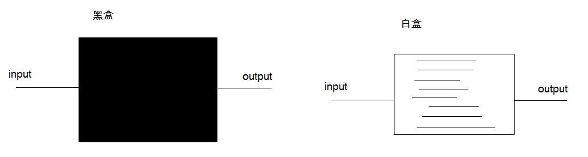

### 1.2 Junit介绍

Junit是一个Java语言的单元测试框架，属于白盒测试，简单理解为可以用于取代java的main方法。Junit属于第三方工具，需要导入jar包后使用。

### 1.3 Junit的使用

1. 编写测试类，简单理解Junit可以用于取代java的main方法。
2. 在测试类方法上添加注解 @Test。
3. @Test修饰的方法要求：public void 方法名() {…} ，方法名自定义建议test开头，没有参数。
4. 添加Junit库到lib文件夹中，然后进行jar包关联。

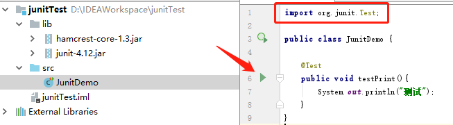

使用：点击方法左侧绿色箭头，执行当前方法（方法必须标记@Test）。执行结果红色：代表失败；执行结果绿色：代表成功。

```properties
/*
    哪个方法想使用单元测试,就在方法上,添加注解: @Test
    注意:
        该方法的返回值类型,必须写为void
        该方法必须没有参数列表

     运行:
        方法上右键运行,运行的是含有@Test注解的方法
        类上右键运行,运行的是类当中含有@Test注解的所有方法
        绿条: 正常运行
        红条: 出现问题,异常了
 */
```

### 1.3 常用注解

- @Test，用于修饰需要执行的测试方法。
- @Before，修饰的方法会在测试方法之前被自动执行。
- @After，修饰的方法会在测试方法执行之后自动被执行。

## 第三章 类的加载器

### 3.1 类的加载器时机

1. 创建类的实例。
2. 类的静态变量，或者为静态变量赋值。
3. 类的静态方法。
4. 使用反射方式来强制创建某个类或接口对应的java.lang.Class对象。
5. 初始化某个类的子类。
6. 直接使用java.exe命令来运行某个主类。

以上6个情况，只要有1个出现，那么类的加载器就会将这个类的class文件加载到内存中，我们就可以使用这个类了。`java.lang.ClassLoader`：是类的加载器的父类。

### 3.2 引导类加载器

引导类加载器Bootstrap：是C++语言编写，负责加载JDK核心类库，核心类库位置\jdk\jre\lib\下的jar包。

由于引导类加载器器在JVM内部，开发人员是不能直接操作的。

```java
ClassLoader loader = String.class.getClassLoader();
```

程序的输出结果是null，C++编写的加载器，根本就不是Java中的类。

### 3.3 扩展类加载器

扩展类加载器ExtClassLoader：Java语言编写的类加载器，负责加载JDK扩展类库，类库位置\jdk\lib\ext\下的jar包。

```java
ClassLoader loader = DNSNameService.class.getClassLoader();
System.out.println(loader);
```

程序的输出结果是：sun.misc.Launcher$ExtClassLoader@45ee12a7，ExtClassLoader类继承URLClassLoader，URLClassLoader继承SecureClassLoader，SecureClassLoader继承ClassLoader。

### 3.4 应用类加载器

应用类加载器AppClassLoader：Java语言编写的类加载器，负责加载我们定义的类和第三方jar包中的类。

```java
ClassLoader loader = Test.class.getClassLoader();
System.out.println(loader);
```

程序的输出结果是：sun.misc.Launcher$AppClassLoader@18b4aac2，AppClassLoader继承URLClassLoader，URLClassLoader继承SecureClassLoader，SecureClassLoader继承ClassLoader。

### 3.5 类加载器的双亲委派

ClassLoader类定义了方法 `ClassLoader getParent()`：返回父类加载器。

```java
//获取自己定义类的加载器，结果为AppClassLoader
ClassLoader loader = Test.class.getClassLoader();
//获取AppClassLoader的父类加载器，结果为ExtClassLoader
System.out.println(loader.getParent());
//获取ExtClassLoader的父类加载器，结果为null
System.out.println(loader.getParent().getParent());
```

结论： AppClassLoader的父类加载器是ExtClassLoader，ExtClassLoader的父类加载器是Bootstrap。

**注意**：ExtClassLoader是AppClassLoader的父加载器，并不是父类，他们没有继承关系。

**双亲委派机制**：当AppClassLoader收到一个加载类的请求时，会先让他的父类加载器ExtClassLoader尝试加载，ExtClassLoader也会让他的父类加载器Bootstrap尝试加载，如果Bootstrap能加载，就加载该类。如果Bootstrap不能加载，则ExtClassLoader会进行加载，如果也不能加载，AppClassLoader会进行加载。

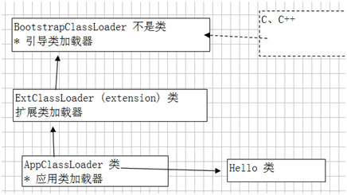

### 3.6 Class对象创建

当一个类的class文件被类加载器加载到内存后，类的加载器会创建出此class文件的对象。class文件的对象是Class类的对象，是反射技术的基石。

## 第四章 反射

### 4.1 反射概念

- 框架：半成品软件。可以在框架的基础上进行软件开发，简化编码
- 反射：将java代码的各个组成部分封装为其他对象，可以在程序运行过程中操作这些对象，这就是java的反射机制，如下图。
- 反射的好处：
  1. 可以在程序运行过程中，操作这些对象。
  2. 可以解耦，提高程序的可扩展性。

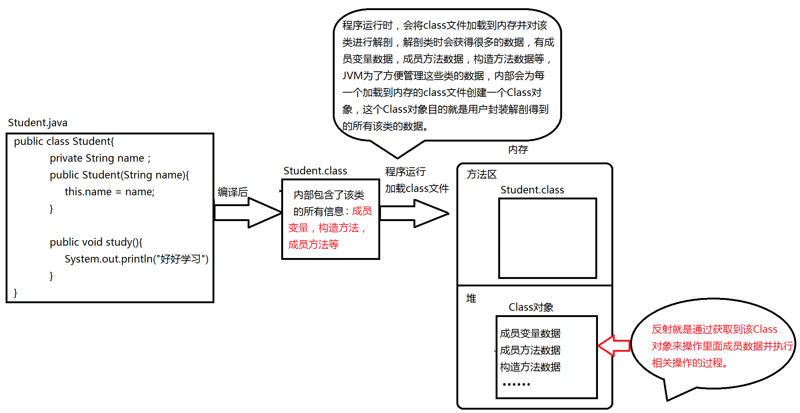

### 4.2 获取Class对象的方式

| 获取class对象方式          | 作用                  | 应用场景                         |
| -------------------- | ------------------- | ---------------------------- |
| Class.forName("全类名") | 通过指定的字符串路径获取        | 多用于配置文件，将类名定义在配置文件中。读取文件，加载类 |
| 类名.class             | 通过类名的属性class获取      | 多用于参数的传递                     |
| 对象.getClass()        | 通过对象的getClass()方法获取 | 多用于对象的获取字节码的方式               |

Student类：

```java
public class Student {
    private String name;
    private int age;
    public Student(){
    }
    public Student(String name,int age) {
        this.name = name;
        this.age = age;
    }
    public void study(){
        System.out.println("学生在学习");
    }

    public void eat(String s,double d){
        System.out.println("带参数方法:"+s+"::"+d);
    }
    public String toString() {
        return "Student{" +
                "name='" + name + '\'' +
                ", age=" + age +
                '}';
    }
}
```

获取Student类的class文件对象：

```java
public static void main(String[] args)throws Exception{
    Student student = new Student(); 
    Class c1 = student.getClass();
    System.out.println(c1);
    Class c2 = Student.class;
    System.out.println(c2);
    Class c3 = Class.forName("com.doit.communication.Student");
    System.out.println(c3);
}
```

### 4.3 反射获取构造方法

#### Class类中与Constructor相关方法

```java
1. Constructor[] getConstructors() 
   	获取所有的public修饰的构造方法

2. Constructor getConstructor(Class... parameterTypes) 
    根据参数类型获取构造方法对象，只能获得public修饰的构造方法。
	如果不存在对应的构造方法，则会抛出 java.lang.NoSuchMethodException 异常。
	参数是可变参数,调用此方法时,可以不写参数,获取的空参构造
                可以写参数,给定的参数必须是Class对象
                    比如:
						参数 String name,int age
                        调用此方法: String.class,int.class 
```

#### Constructor类中常用方法

```java
1. T newInstance(Object... initargs) 
  	根据指定参数创建对象。
2. T newInstance()
  	空参构造方法创建对象。
```

#### 获取无参数构造方法

```java
public static void main(String[] args)throws Exception{
    Class cla = Class.forName("com.doit.communication.Student");
    //获取无参数构造方法
    Constructor constructor = cla.getConstructor();
    //运行构造方法
    Object object =  constructor.newInstance();
    System.out.println(object);
}
```

#### 获取有参数构造方法

```java
public static void main(String[] args)throws Throwable{
    Class cla = Class.forName("com.doit.communication.Student");
    //获取有参数构造方法
    Constructor constructor = cla.getConstructor(String.class, int.class);
    //运行构造方法，传递实际参数
    Object object = constructor.newInstance("张三",20);
    System.out.println(object);

}
```

### 4.4 反射获取构造方法的简单方式

Class类中定义了方法 `T newInstance()`，可以直接运行获取到的构造方法。

**要求**：被反射的类中必须有public权限的无参数构造方法。

```java
public static void main(String[] args)throws Throwable{
    Class cla = Class.forName("com.doit.communication.Student");
    Object object = cla.newInstance();
    System.out.println(object);
}
```

### 4.5 反射成员方法执行

#### Class类中与Method相关方法

```java
1. Method[] getMethods()
  	获取所有的public修饰的成员方法，包括父类中。

2. Method getMethod("方法名", 方法的参数类型... 类型) 
	根据方法名和参数类型获得一个方法对象，只能是获取public修饰的	
```

#### Method类中常用方法

```java
Object invoke(Object obj, Object... args) 
    返回值Object，表示调用方法后，该方法的返回值
  	根据参数args调用对象obj的该成员方法	
  	如果obj=null，则表示该方法是静态方法
```

#### 反射获取无参数方法

```java
public static void main(String[] args)throws Throwable{
    Class cla = Class.forName("com.doit.communication.Student");
    Object object = cla.newInstance();
    //获取study方法
    Method method = cla.getMethod("study");
    //执行方法，传递对象
    method.invoke(object);
}
```

#### 反射获取有参数方法

```java
public static void main(String[] args)throws Throwable{
    Class cla = Class.forName("com.doit.communication.Student");
    Object object = cla.newInstance();
    //获取有参数的方法eat
    Method method = cla.getMethod("eat",String.class,double.class);
    //调用eat方法，传递实际参数
    method.invoke(object,"吃饭",9.9);
}
```

### 4.6 反射案例

需求：写一个"框架"，不能改变该类的任何代码的前提下，可以帮我们创建任意类的对象，并且执行其中任意方法

实现：

1. 配置文件
2. 反射

步骤：

1. 将需要创建的对象的全类名和需要执行的方法定义在配置文件中
2. 在程序中加载读取配置文件
3. 使用反射技术来加载类文件进内存
4. 创建对象
5. 执行方法

注意：需要将配置文件放在src目录下，放在src目录下的任何文件，都会被编译到classes目录下，这样做的目的是为了让配置文件跟随编译后的class文件一起，因为交付用户使用的是class文件，而不是源代码。

如何读取src目录下的文件：使用类的加载器ClassLoader类的方法 :

- `InputStream getResourceAsStream(String name)`
  - 此方法返回输入流，该流从类目录下读取文件
  - 参数传递文件名

properties文件：

```properties
className=com.doit.domain.Student
methodName=sleep
```

Student类：

```java
package com.doit.domain;

public class Student {
    public void sleep(){
        System.out.println("sleep...");
    }
}
```

RefectTest测试类：

```java
public static void main(String[] args)throws Throwable{
    //获取RefectTest类的加载器
    ClassLoader classLoader = RefectTest.class.getClassLoader();
    //加载器获取输入流，读取pro.properties文件
    InputStream inputStream = classLoader.getResourceAsStream("pro.properties");
    Properties properties = new Properties();
    //集合IO关联
    properties.load(inputStream);
    //获取集合中的键值对，类名
    String className = properties.getProperty("className");
    //获取集合中的键值对，方法名
    String methodName = properties.getProperty("methodName");
    //反射获取指定类的class文件对象
    Class cla = Class.forName(className);
    Object object = cla.newInstance();
    //获取指定的方法
    Method method = cla.getMethod(methodName);
    //运行方法
    method.invoke(object);
}
```

## 第五章 注解

### 5.1 注解概述

**定义**：注解（Annotation），也叫元数据。一种代码级别的说明。它是JDK1.5及以后版本引入的一个特性，与类、接口、枚举是在同一个层次。它可以声明在包、类、字段、方法、局部变量、方法参数等的前面，用来对这些元素进行说明，注释。

**作用分类**：

- 编写文档：通过代码里标识的注解生成文档【例如，生成文档doc文档】
- 代码分析：通过代码里标识的注解对代码进行分析【例如，注解的反射】
- 编译检查：通过代码里标识的注解让编译器能够实现基本的编译检查【例如，Override】

**常见注解**

1. **@author**：用来标识作者名
2. **@version**：用于标识对象的版本号，适用范围：文件、类、方法。
3. **@Override** ：用来修饰方法声明，告诉编译器该方法是重写父类中的方法，如果父类不存在该方法，则编译失败。

### 5.2 自定义注解

#### 定义格式

```java
元注解
public @interface 注解名称{
	属性列表;
}
```

注解本质上就是一个接口，该接口默认继承Annotation接口。

```java
public @interface MyAnno extends java.lang.annotation.Annotation {}
```

任何一个注解，都默认的继承Annotation接口。

#### 注解的属性

1. **属性的作用**

   - 可以让用户在使用注解时传递参数，让注解的功能更加强大。

2. **属性的格式**

   - **格式1：数据类型 属性名();**
   - **格式2：数据类型 属性名() default 默认值;**

3. **属性定义示例**

   ```java
   public @interface Student {
     String name(); // 姓名
     int age() default 18; // 年龄
     String gender() default "男"; // 性别
   } 
   // 该注解就有了三个属性：name，age，gender
   ```

4. **属性适用的数据类型**

   - 八种基本数据类型（**int,float,boolean,byte,double,char,long,short**)。
   - String类型，Class类型，枚举类型，注解类型。
   - 以上所有类型的一维数组。

### 5.3 使用自定义注解

在程序中使用(解析)注解的步骤（获取注解中定义的属性值）：

1. 获取注解定义的位置的对象  （Class，Method,Field）
2. 获取指定的注解 `getAnnotation(Class)`
3. 调用注解中的抽象方法获取配置的属性值

使用格式:

​	@注解名(属性名=属性值,属性名=属性值,属性名=属性值...)

#### 定义注解

1. **定义一个注解：Book**
   - 包含属性：String value()   书名
   - 包含属性：double price()  价格，默认值为 100
   - 包含属性：String[] authors() 多位作者    
2. **代码实现**

```java
public @interface Book {
    // 书名
    String value();
    // 价格
    double price() default 100;
    // 多位作者
    String[] authors();
}
```

#### 使用注解

```java

public class BookShelf {
  
    @Book(value = "西游记",price = 998,authors = {"吴承恩","白求恩"})
    public void showBook(){

    }
}
```

**使用注意事项**

- 如果属性有默认值，则使用注解的时候，这个属性可以不用赋值。
- 如果属性没有默认值，那么在使用注解时一定要给属性赋值。 

#### 特殊属性value

1. **当注解中只有一个属性且名称是value，在使用注解时给value属性赋值可以直接给属性值，无论value是单值元素还是数组类型。**

   ```java
   // 定义注解Book
   public @interface Book {
       // 书名
       String value();
   }

   // 使用注解Book
   public class BookShelf {
       @Book("西游记")
       public void showBook(){

       }
   }
   或
   public class BookShelf {
       @Book(value="西游记")
       public void showBook(){

       }
   }
   ```

2. **如果注解中除了value属性还有其他属性，且至少有一个属性没有默认值，则在使用注解给属性赋值时，value属性名不能省略。**

   ```java
   // 定义注解Book
   public @interface Book {
       // 书名
       String value();
       // 价格
       double price() default 100;
       // 多位作者
       String[] authors();
   }
   // 使用Book注解：正确方式
   @Book(value="红楼梦",authors = "曹雪芹")
   public class BookShelf {
     // 使用Book注解：正确方式
       @Book(value="西游记",authors = {"吴承恩","白求恩"})
       public void showBook(){

       }
   }

   // 使用Book注解：错误方式
   public class BookShelf {
       @Book("西游记",authors = {"吴承恩","白求恩"})
       public void showBook(){

       }
   }
   // 此时value属性名不能省略了。
   ```

### 5.4 注解之元注解

默认情况下，注解可以用在任何地方，比如类，成员方法，构造方法，成员变量等地方。如果要限制注解的使用位置怎么办？那就要学习一个新的知识点**：元注解**。

- **@Target**
- **@Retention**

#### 元注解之@Target

- **作用：指明此注解用在哪个位置，如果不写默认是任何地方都可以使用。**
  - 可选的参数值在枚举类**ElemenetType**中包括：

```properties
 TYPE： 用在类,接口上
 FIELD：用在成员变量上
 METHOD： 用在方法上
 PARAMETER：用在参数上
 CONSTRUCTOR：用在构造方法上
 LOCAL_VARIABLE：用在局部变量上
```

#### 元注解之@Retention

- **作用：定义该注解的生命周期(有效范围)。**
  - 可选的参数值在枚举类型RetentionPolicy中包括

```properties
SOURCE：注解只存在于Java源代码中，编译生成的字节码文件中就不存在了。
CLASS：注解存在于Java源代码、编译以后的字节码文件中，运行的时候内存中没有，默认值。
RUNTIME：注解存在于Java源代码中、编译以后的字节码文件中、运行时内存中，程序可以通过反射获取该注解。
```

### 5.5 注解解析

通过Java技术获取注解数据的过程则称为注解解析。

#### 与注解解析相关的接口

- **Anontation**：所有注解类型的公共接口，类似所有类的父类是Object。
- **AnnotatedElement**：定义了与注解解析相关的方法，常用方法以下四个：

```java
boolean isAnnotationPresent(Class annotationClass); 判断当前对象是否有指定的注解，有则返回true，否则返回false。
T getAnnotation(Class<T> annotationClass);  获得当前对象上指定的注解对象。
Annotation[] getAnnotations(); 获得当前对象及其从父类上继承的所有的注解对象。
Annotation[] getDeclaredAnnotations();获得当前对象上所有的注解对象，不包括父类的。
```

#### 获取注解数据的原理

```
注解作用在那个成员上，就通过反射获得该成员的对象来得到它的注解。
```

- 如注解作用在方法上，就通过方法(Method)对象得到它的注解。

  ```java
   // 得到方法对象
   Method method = clazz.getDeclaredMethod("方法名"); 
   // 根据注解名得到方法上的注解对象
   Book book = method.getAnnotation(Book.class); 
  ```

- 如注解作用在类上，就通过Class对象得到它的注解。

  ```
  // 获得Class对象
  Class c = 类名.class;
  // 根据注解的Class获得使用在类上的注解对象
  Book book = c.getAnnotation(Book.class);
  ```

#### 使用反射获取注解的数据

#### 需求说明

1. 定义注解Book，要求如下：
   - 包含属性：String value()   书名
   - 包含属性：double price()  价格，默认值为 100
   - 包含属性：String[] authors() 多位作者  
   - 限制注解使用的位置：类和成员方法上
   - 指定注解的有效范围：RUNTIME
2. 定义BookStore类，在类和成员方法上使用Book注解
3. 定义TestAnnotation测试类获取Book注解上的数据

#### 代码实现

**注解Book**

```java
@Target({ElementType.METHOD,ElementType.TYPE})
@Retention(RetentionPolicy.RUNTIME)
public @interface Book {
    // 书名
    String value();
    // 价格
    double price() default 100;
    // 作者
    String[] authors();
}
```

**BookStore类**

```java
@Book(value = "红楼梦",authors = "曹雪芹",price = 998)
public class BookStore {
}
```

**TestAnnotation类**

```java
public class TestAnnotation {
    public static void main(String[] args)  throws Exception{
        System.out.println("---------获取类上注解的数据----------");
        test();
    }

    /**
     * 获取BookStore类上使用的Book注解数据
     */
    public static void test(){
        // 获得BookStore类对应的Class对象
        Class c = BookStore.class;
        // 判断BookStore类是否使用了Book注解
        if(c.isAnnotationPresent(Book.class)) {
            // 根据注解Class对象获取注解对象
            Book book = (Book) c.getAnnotation(Book.class);
            // 输出book注解属性值
            System.out.println("书名：" + book.value());
            System.out.println("价格：" + book.price());
            System.out.println("作者：" + Arrays.toString(book.authors()));
        }
}
```

### 5.6 模拟Junit

#### 案例分析

1. 模拟Junit测试的注释@Test，首先需要编写自定义注解@MyTest，并添加元注解，保证自定义注解只能修饰方法，且在运行时可以获得。
2. 然后编写目标类（测试类），然后给目标方法（测试方法）使用 @MyTest注解，编写三个方法，其中两个加上@MyTest注解。
3. 最后编写调用类，使用main方法调用目标类，模拟Junit的运行，只要有@MyTest注释的方法都会运行。

#### 注解MyTest

```java
@Target(ElementType.METHOD)
@Retention(RetentionPolicy.RUNTIME)
public @interface MyTest {
}
```

**目标类MyTestDemo**

```java
public class MyTestDemo {
    @MyTest
    public void test01(){
        System.out.println("test01");
    }

    public void test02(){
        System.out.println("test02");
    }

    @MyTest
    public void test03(){
        System.out.println("test03");
    }
}
```

**调用类TestMyTest**

```java
public class TestMyTest {
    public static void main(String[] args) throws  Exception{
        // 获得MyTestDemo类Class对象
        Class c = MyTestDemo.class;
        // 获得所有的成员方法对象
        Method[] methods = c.getMethods();
        // 创建MyTestDemo类对象
        Object obj = c.newInstance();
        // 遍历数组
        for (Method m:methods) {
            // 判断方法m上是否使用注解MyTest
            if(m.isAnnotationPresent(MyTest.class)){
                // 执行方法m
                m.invoke(obj);
            }
        }
    }
}
```

## 第六章 lombok

### 6.1 lombok介绍

Lombok通过增加一些“处理程序”，可以让java变得简洁、快速。

Lombok能以注解形式来简化java代码，提高开发效率。开发中经常需要写的javabean，都需要花时间去添加相应的getter/setter，也许还要去写构造器、equals等方法，而且需要维护。

Lombok能通过注解的方式，在编译时自动为属性生成构造器、getter/setter、equals、hashcode、toString方法。出现的神奇就是在源码中没有getter和setter方法，但是在编译生成的字节码文件中有getter和setter方法。这样就省去了手动重建这些代码的麻烦，使代码看起来更简洁些。

### 6.2 lombok使用

- 添加lombox的jar包：lombok-1.18.8.jar。

- 为IDEA添加lombok插件（连接网络使用）

- 安装完毕后，重启IDEA。

  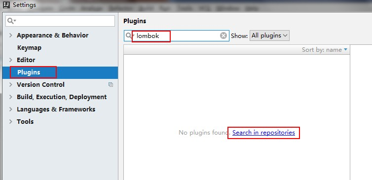


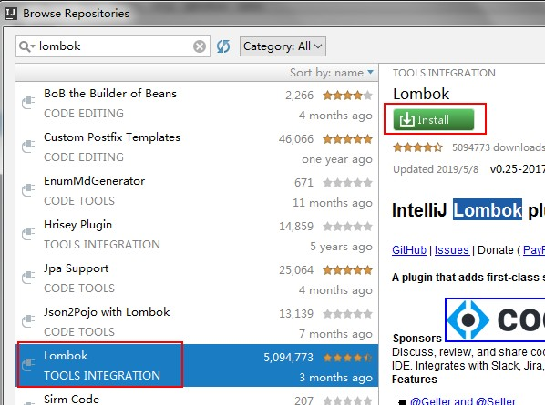

### 6.3 lombok常用注解

#### @Getter和@Setter

- 作用：生成成员变量的get和set方法。
- 写在成员变量上，指对当前成员变量有效。
- 写在类上，对所有成员变量有效。
- 注意：静态成员变量无效。

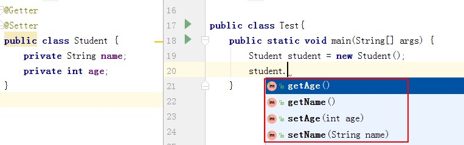

#### @ToString

- 作用：生成toString()方法。
- 注解只能写在类上。

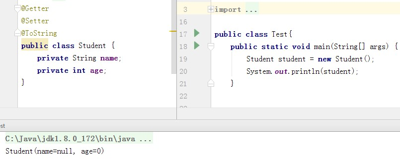

#### @NoArgsConstructor和@AllArgsConstructor

- @NoArgsConstructor：无参数构造方法。
- @AllArgsConstructor：满参数构造方法。
- 注解只能写在类上。

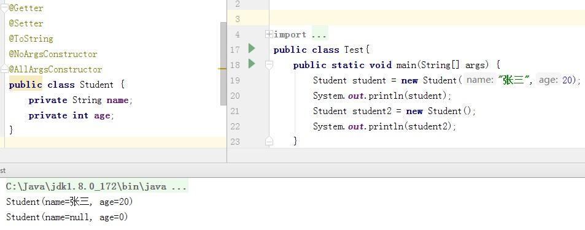

#### @EqualsAndHashCode

- 作用：生成hashCode()和equals()方法。
- 注解只能写在类上。

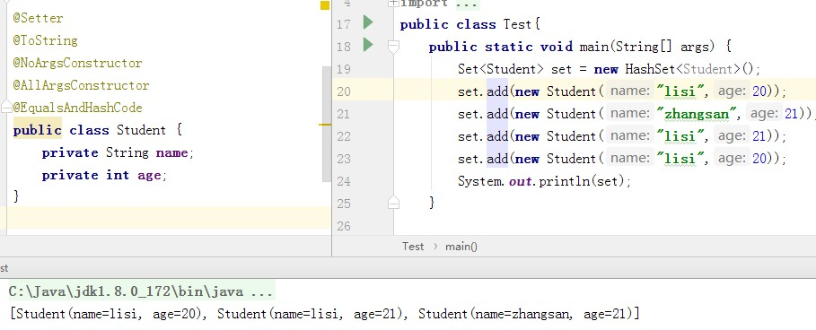

#### @Data

- 作用：生成get/set，toString，hashCode，equals，无参构造方法
- 注解只能写在类上。

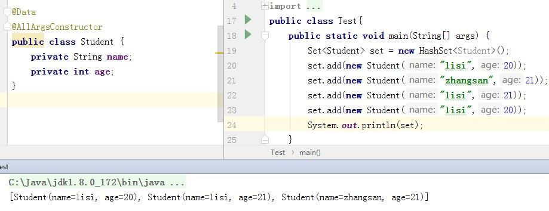

