# day01-mysql数据库&mysql语句

# 第1章 数据库介绍

## 1.1 数据库概述

* 什么是数据库

数据库就是存储数据的仓库，其本质是一个文件系统，数据按照特定的格式将数据存储起来，用户可以对数据库中的数据进行增加，修改，删除及查询操作。

* 什么是数据库管理系统

数据库管理系统（DataBase Management System，DBMS）：指一种操作和管理数据库的大型软件，用于建立、使用和维护数据库，对数据库进行统一管理和控制，以保证数据库的安全性和完整性。用户通过数据库管理系统访问数据库中表内的数据。

* 数据库与数据库管理系统的关系

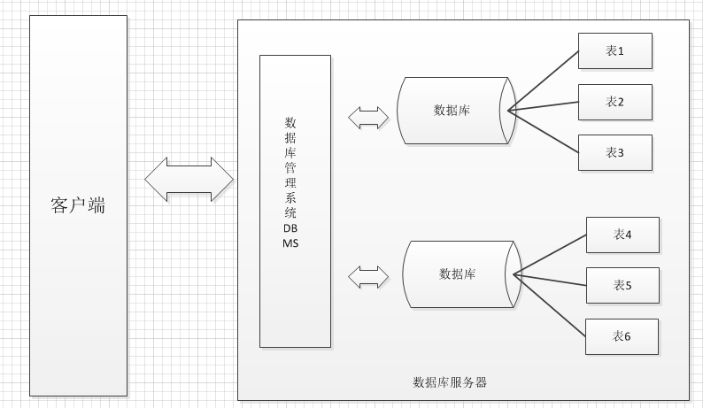

## 1.2 数据库表

数据库中以表为组织单位存储数据。

表类似我们的Java类，每个字段都有对应的数据类型。

         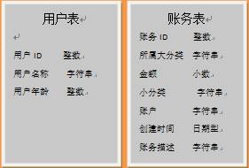

那么用我们熟悉的java程序来与关系型数据对比，就会发现以下对应关系。

类----------表

类中属性----------表中字段

对象----------记录

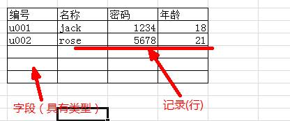

## 1.3 表数据

根据表字段所规定的数据类型，我们可以向其中填入一条条的数据，而表中的每条数据类似类的实例对象。表中的一行一行的信息我们称之为记录。

* 表记录与java类对象的对应关系

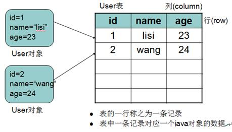

## 1.4 常见数据库

* 常见的数据库管理系统

**MYSQL**：开源免费的数据库，小型的数据库.已经被Oracle收购了.MySQL6.x版本也开始收费。

**Oracle**：收费的大型数据库，Oracle公司的产品。Oracle收购SUN公司，收购MYSQL。

**DB2** ：IBM公司的数据库产品,收费的。常应用在银行系统中.

**SQLServer**：MicroSoft 公司收费的中型的数据库。C#、.net等语言常使用。

**SyBase**：已经淡出历史舞台。提供了一个非常专业数据建模的工具PowerDesigner。

**SQLite**：嵌入式的小型数据库，应用在手机端。

常用数据库：**MYSQL，Oracle**．

这里使用MySQL数据库。MySQL中可以有多个数据库，数据库是真正存储数据的地方。

 

# 第2章 MySql数据库

## 2.1 MySql安装

* 安装

参考MySQL安装图解.doc

安装后，MySQL会以windows服务的方式为我们提供数据存储功能。开启和关闭服务的操作：右键点击我的电脑→管理→服务→可以找到MySQL服务开启或停止。

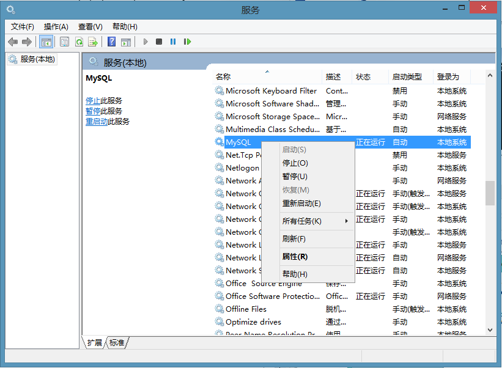

也可以在DOS窗口，通过命令完成MySQL服务的启动和停止（必须以管理员身份运行cmd命令窗口）

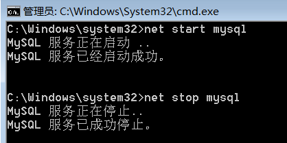

## 2.2 登录MySQL数据库

MySQL是一个需要账户名密码登录的数据库，登陆后使用，它提供了一个默认的root账号，使用安装时设置的密码即可登录。

```mysql
格式1：cmd>  mysql –u用户名 –p密码
例如：mysql -uroot –proot
```

```mysql
格式2：cmd>  mysql --host=ip地址 --user=用户名 --password=密码
例如：mysql --host=127.0.0.1  --user=root --password=root
```

## 2.3 SQLyog（MySQL图形化开发工具）

- 安装：

提供的SQLyog软件为免安装版，可直接使用

- 使用：

输入用户名、密码，点击连接按钮，进行访问MySQL数据库进行操作

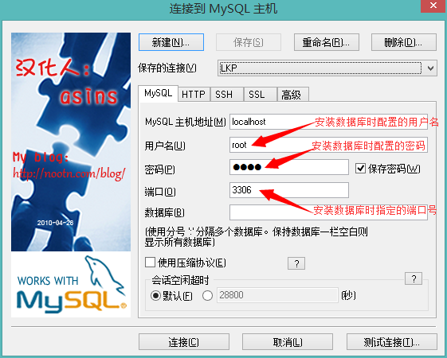

 

在Query窗口中，输入SQL代码，选中要执行的SQL代码，按F8键运行，或按执行按钮运行。

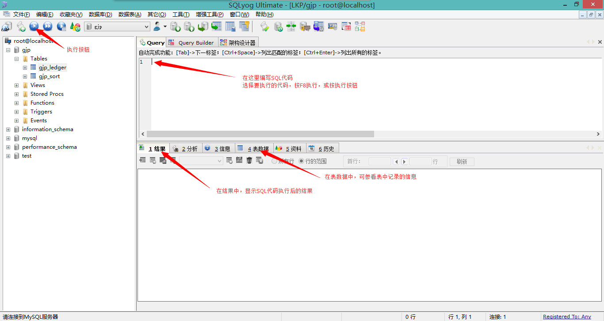

# 第3章 SQL语句

## 3.1 SQL概述

### SQL语句介绍

数据库是不认识JAVA语言的，但是我们同样要与数据库交互，这时需要使用到数据库认识的语言SQL语句，它是数据库的代码。
结构化查询语言(Structured Query Language)简称SQL，是关系型数据库管理系统都需要遵循的规范。不同的数据库生产厂商都支持SQL语句，但都有特有内容。

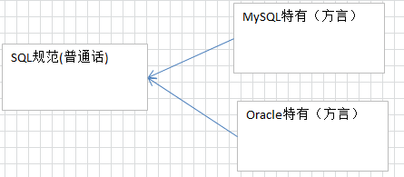

### SQL语句分类

* SQL分类：
  * 数据定义语言：简称DDL(Data Definition Language)，用来定义数据库对象：数据库，表，列等。关键字：create，alter，drop等 
  * 数据操作语言：简称DML(Data Manipulation Language)，用来对数据库中表的记录进行更新。关键字：insert，delete，update等
  * 数据控制语言：简称DCL(Data Control Language)，用来定义数据库的访问权限和安全级别，及创建用户。
  * 数据查询语言：简称DQL(Data Query Language)，用来查询数据库中表的记录。关键字：select，from，where等

### SQL通用语法

* SQL语句可以单行或多行书写，以分号结尾
* 可使用空格和缩进来增强语句的可读性
* MySQL数据库的SQL语句不区分大小写，关键字建议使用大写
  * 例如：SELECT * FROM user。
* 同样可以使用/**/的方式完成注释
* MySQL中的我们常使用的数据类型如下

| **类型名称 **    | 说明                                    |
| ------------ | ------------------------------------- |
| int（integer） | 整数类型                                  |
| double       | 小数类型                                  |
| decimal（m,d） | 指定整数位与小数位长度的小数类型                      |
| date         | 日期类型，格式为yyyy-MM-dd，包含年月日，不包含时分秒       |
| datetime     | 日期类型，格式为 YYYY-MM-DD HH:MM:SS，包含年月日时分秒 |
| timestamp    | 日期类型，时间戳                              |
| varchar（M）   | 文本类型， M为0~65535之间的整数                  |

## 3.2 DDL之数据库操作：database

### 创建数据库

格式：

```mysql
create database 数据库名;
create database 数据库名 character set 字符集;
```

例如：

```mysql
#创建数据库 数据库中数据的编码采用的是安装数据库时指定的默认编码 utf8
CREATE DATABASE webdb_1; 
#创建数据库 并指定数据库中数据的编码
CREATE DATABASE webdb_2 CHARACTER SET utf8;
```

### 查看数据库

查看数据库MySQL服务器中的所有的数据库:

```mysql
  show databases;
```

查看某个数据库的定义的信息:

```mysql
show create database 数据库名;
```

例如：

```mysql
show create database webdb_1;
```

### 删除数据库

```mysql
drop database 数据库名称;
```

例如：

```mysql
drop database webdb_2;
```

### 使用数据库

* 查看正在使用的数据库:

```mysql
select database();
```

* 其他的数据库操作命令

  切换数据库：

```mysql
use 数据库名;
```

	例如：

```mysql
use webdb_1;
```

## 3.3 DDL之表操作：table

### 创建表

* 格式：

```mysql
create table 表名(
   字段名 类型(长度) [约束],
   字段名 类型(长度) [约束],
   ...
);

类型：
	varchar(n)	字符串
	int			整形
	double		浮点
	date		时间
	timestamp	时间戳
约束：(详情查看第四章)
	primary key	主键，被主键修饰字段中的数据，不能重复、不能为null。
```

* 例如：创建分类表

```mysql
CREATE TABLE category (
  cid INT primary key, #分类ID 
  cname VARCHAR(100) #分类名称
);
```

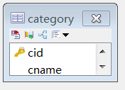

### 查看表

* 查看数据库中的所有表：

```mysql
格式：show tables;
```

* 查看表结构：

```mysql
格式：desc 表名;
例如：desc category;
```

### 删除表

* 格式：drop table 表名;

```mysql
例如：drop table category;
```

### 修改表结构格式

* alter table 表名 add 列名 类型(长度) [约束];

  作用：修改表添加列. 

```mysql
例如：#1，为分类表添加一个新的字段为 分类描述 varchar(20)
ALTER TABLE category ADD `desc` VARCHAR(20);
```

* alter table 表名 modify 列名 类型(长度) 约束;

  作用：修改表修改列的类型长度及约束.

```mysql
例如：#2, 为分类表的描述字段进行修改，类型varchar(50) 添加约束 not null
ALTER TABLE category MODIFY `desc` VARCHAR(50) NOT NULL;
```

* alter table 表名 change 旧列名 新列名 类型(长度) 约束; 
  作用：修改表修改列名.

```mysql
例如：#3, 为分类表的分类名称字段进行更换 更换为 description varchar(30)
ALTER TABLE category CHANGE `desc` description VARCHAR(30);
```

* alter table 表名 drop 列名; 

  作用：修改表删除列.

```mysql
例如：#4, 删除分类表中description这列
ALTER TABLE category DROP description;
```

* rename table 表名 to 新表名; 

  作用：修改表名

```mysql
例如：#5, 为分类表category 改名成 category2
RENAME TABLE category TO category2;
```

* alter table 表名 character set 字符集(了解);

  作用：修改表的字符集

```mysql
例如：#6, 为分类表 category 的编码表进行修改，修改成 gbk
ALTER TABLE category CHARACTER SET gbk;
```

## 3.4 DML数据操作语言

### 插入表记录：insert

* 语法：

```mysql
-- 向表中插入某些字段
insert into 表 (字段1,字段2,字段3..) values  (值1,值2,值3..); 
-- 向表中插入所有字段,字段的顺序为创建表时的顺序
insert into 表 values (值1,值2,值3..);
```

* 注意：
  * 值与字段必须对应，个数相同，类型相同
  * 值的数据大小必须在字段的长度范围内
  * 除了数值类型外，其它的字段类型的值必须使用引号引起。（建议单引号）
  * 如果要插入空值，可以不写字段，或者插入null。
* 例如：

```mysql
INSERT INTO category(cid,cname) VALUES('c001','电器');
INSERT INTO category(cid,cname) VALUES('c002','服饰');
INSERT INTO category(cid,cname) VALUES('c003','化妆品');
INSERT INTO category(cid,cname) VALUES('c004','书籍');

INSERT INTO category(cid) VALUES('c005');
INSERT INTO category(cname,cid) VALUES('耗材','c006');
```

### 更新表记录：update

用来修改指定条件的数据，将满足条件的记录指定列修改为指定值

* 语法：

  * 更新所有记录的指定字段

  ```mysql
  update 表名 set 字段名=值,字段名=值,...;
  ```

  * 更新符合条件记录的指定字段

  ```mysql
  update 表名 set 字段名=值,字段名=值,... where 条件;
  ```

* 注意：

  * 列名的类型与修改的值要一致.
  * 修改值得时候不能超过最大长度.
  * 除了数值类型外，其它的字段类型的值必须使用引号引起

### 删除记录：delete

* 语法：

```mysql
delete from 表名 [where 条件];
```

## 3.5 DOS操作数据乱码解决

我们在dos命令行操作中文时，会报错

```mysql
insert into category(cid,cname) values(‘c010’,’中文’);		
ERROR 1366 (HY000): Incorrect string value: '\xB7\xFE\xD7\xB0' for column 'cname' at row 1
```

错误原因:因为mysql的客户端设置编码是utf8,而系统的cmd窗口编码是gbk

1. 查看MySQL内部设置的编码

```mysql
show variables like 'character%'; 查看所有mysql的编码
```

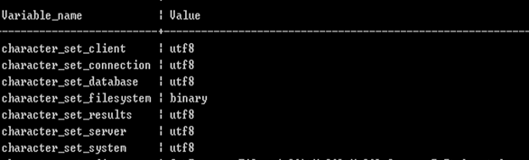

2. 需要修改client、connection、results的编码一致（GBK编码）

   解决方案1：在cmd命令窗口中输入命令，此操作当前窗口有效，为临时方案。

```mysql
set names gbk;
```

	解决方案2：安装目录下修改my.ini文件，重启服务所有地方生效。

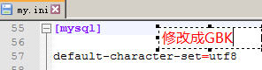


# 第4章 SQL约束

## 4.1 主键约束

PRIMARY KEY 约束唯一标识数据库表中的每条记录。

* 主键必须包含唯一的值。
* 主键列不能包含 NULL 值。
* 每个表都应该有一个主键，并且每个表只能有一个主键。

### 添加主键约束

* 方式一：创建表时，在字段描述处，声明指定字段为主键：

```mysql
CREATE TABLE persons
(
  id_p int PRIMARY KEY,
  lastname varchar(255),
  firstname varchar(255),
  address varchar(255),
  city varchar(255)
)
```

* 方式二：创建表时，在constraint约束区域，声明指定字段为主键：
  * 格式：`[constraint 名称] primary key (字段列表)`
  * 关键字constraint可以省略，如果需要为主键命名，constraint不能省略，主键名称一般没用。
  * 字段列表需要使用小括号括住，如果有多字段需要使用逗号分隔。声明两个以上字段为主键，我们称为联合主键。

```mysql
CREATE TABLE persons
(
firstname varchar(255),
lastname varchar(255),
address varchar(255),
city varchar(255),
CONSTRAINT pk_personID PRIMARY KEY (firstname,lastname)
)
```

* 方式三：创建表之后，通过修改表结构，声明指定字段为主键：
  * 格式：`ALTER TABLE persons ADD [CONSTRAINT 名称] PRIMARY KEY (字段列表)`

```mysql
CREATE TABLE persons
(
firstname varchar(255),
lastname varchar(255),
address varchar(255),
city varchar(255)
)
ALTER TABLE persons ADD PRIMARY KEY (firstname,lastname)
```

### 删除主键约束

如需撤销 PRIMARY KEY 约束，请使用下面的 SQL：

```mysql
ALTER TABLE persons DROP PRIMARY KEY
```

## 4.2 自动增长列

我们通常希望在每次插入新记录时，数据库自动生成字段的值。

我们可以在表中使用 auto_increment（自动增长列）关键字，自动增长列类型必须是整形，自动增长列必须为键(一般是主键)。

* 下列 SQL 语句把 "persons" 表中的 "p_id" 列定义为 auto_increment 主键

```mysql
CREATE TABLE persons
(
p_id int PRIMARY KEY AUTO_INCREMENT,
lastname varchar(255),
firstname varchar(255),
address varchar(255),
city varchar(255)
)
```

* 向persons添加数据时，可以不为p_id字段设置值，也可以设置成null，数据库将自动维护主键值：

```mysql
INSERT INTO persons (firstname,lastname) VALUES ('Bill','Gates')
INSERT INTO persons (p_id,firstname,lastname) VALUES (NULL,'Bill','Gates')
```

* 扩展：默认AUTO_INCREMENT 的开始值是 1，如果希望修改起始值，请使用下列 SQL 语法：

```mysql
ALTER TABLE persons AUTO_INCREMENT=100
```

* 面试题

问：针对auto_increment ，删除表中所有记录使用 delete from 表名 或使用 truncate table 表名，二者有什么区别？

```mysql
删除方式：
	delete 一条一条删除，不清空auto_increment记录数。
	truncate 直接将表删除，重新建表，auto_increment将置为零，从新开始。
```

## 4.3 非空约束

NOT NULL 约束强制列不接受 NULL 值。

NOT NULL 约束强制字段始终包含值。这意味着，如果不向字段添加值，就无法插入新记录或者更新记录。

* 下面的 SQL 语句强制 "id_p" 列和 "lastname" 列不接受 NULL 值：

```mysql
CREATE TABLE persons
(
id_p int NOT NULL,
lastname varchar(255) NOT NULL,
firstname varchar(255),
address varchar(255),
city varchar(255)
)
```

## 4.4 唯一约束

UNIQUE 约束唯一标识数据库表中的每条记录。
UNIQUE 和 PRIMARY KEY 约束均为列或列集合提供了唯一性的保证。
PRIMARY KEY 拥有自动定义的 UNIQUE 约束。
请注意，每个表可以有多个 UNIQUE 约束，但是每个表只能有一个 PRIMARY KEY 约束。

### 添加唯一约束

与主键添加方式相同，共有3种

* 方式一：创建表时，在字段描述处，声明唯一：

```mysql
CREATE TABLE persons
(
id_p int UNIQUE,
lastname varchar(255) NOT NULL,
firstname varchar(255),
address varchar(255),
city varchar(255)
)
```

* 方式二：创建表时，在约束区域，声明唯一：

```mysql
CREATE TABLE persons
(
id_p int,
lastname varchar(255) NOT NULL,
firstname varchar(255),
address varchar(255),
city varchar(255),
CONSTRAINT 名称UNIQUE (Id_P)
)
```

* 方式三：创建表后，修改表结构，声明字段唯一：

```mysql
ALTER TABLE persons ADD [CONSTRAINT 名称] UNIQUE (Id_P)
```

### 删除唯一约束

* 如需撤销 UNIQUE 约束，请使用下面的 SQL：

```mysql
ALTER TABLE persons DROP INDEX 名称
```

* 如果添加唯一约束时，没有设置约束名称，默认是当前字段的字段名。

## 4.5 默认约束

default 约束 用于指定字段默认值。当向表中插入记录时，如果没有明确的为字段赋值，则自动赋予默认值。

* 添加默认约束，在创建表时候添加

```mysql
CREATE TABLE t_user(user_id INT(10) DEFAULT 3);
```

* 删除默认约束

```mysql
ALTER TABLE t_user MODIFY user_id INT(10);
```

## **4.6 约束总结**

```mysql
#常见约束
/*
含义：一种限制，用于限制表中的数据，为了保证表中的数据的准确和可靠性


分类：
	NOT NULL：非空，用于保证该字段的值不能为空
	DEFAULT:默认，用于保证该字段有默认值
	PRIMARY KEY:主键，用于保证该字段的值具有唯一性，并且非空
	UNIQUE:唯一，用于保证该字段的值具有唯一性，可以为空
添加约束的时机：
	1.创建表时
	2.修改表时
	
约束的添加分类：
	列级约束：
		约束语法上都支持		
	表级约束：
		主键、唯一
*/

CREATE TABLE 表名(
	字段名 字段类型 列级约束,
	字段名 字段类型,
	表级约束
)
#一、创建表时添加约束
#1.添加列级约束
/*
语法：
直接在字段名和类型后面追加 约束类型即可。
支持：默认、非空、主键、唯一

*/
CREATE TABLE student(
	id INT PRIMARY KEY,#主键
	name VARCHAR(20) NOT NULL UNIQUE,#非空
	seat INT UNIQUE,#唯一
	age INT DEFAULT  18,#默认约束
);

#查看student中的所有索引，包括主键、外键、唯一
SHOW INDEX FROM student;

#2.添加表级约束
/*

语法：在各个字段的最下面
 【constraint 约束名】 约束类型(字段名) 
*/

DROP TABLE IF EXISTS student;
CREATE TABLE student(
	id INT,
	name VARCHAR(20),
	seat INT,
	age INT,
	CONSTRAINT pk PRIMARY KEY(id),#主键
	CONSTRAINT uq UNIQUE(seat),#唯一键
);

#二、修改表时添加约束
/*
1、添加列级约束
alter table 表名 modify column 字段名 字段类型 新约束;

2、添加表级约束
alter table 表名 add 【constraint 约束名】 约束类型(字段名) 【外键的引用】;
*/
DROP TABLE IF EXISTS student;
CREATE TABLE student(
	id INT,
	name VARCHAR(20),
	seat INT,
	age INT,
)
DESC student;
#1.添加非空约束
ALTER TABLE student MODIFY  name VARCHAR(20)  NOT NULL;
#2.添加默认约束
ALTER TABLE student MODIFY  age INT DEFAULT 18;
#3.添加主键
#①列级约束
ALTER TABLE student MODIFY  id INT PRIMARY KEY;
#②表级约束
ALTER TABLE student ADD PRIMARY KEY(id);

#4.添加唯一
#①列级约束
ALTER TABLE student MODIFY  seat INT UNIQUE;
#②表级约束
ALTER TABLE student ADD UNIQUE(seat);

#三、修改表时删除约束

#1.删除非空约束
ALTER TABLE student MODIFY name VARCHAR(20);

#2.删除默认约束
ALTER TABLE student MODIFY  age INT ;

#3.删除主键
ALTER TABLE student DROP PRIMARY KEY;

#4.删除唯一
ALTER TABLE student DROP INDEX seat;


```


# 第五章 SQL语句(DQL)

## 5.1 DQL准备工作和语法

### 准备工作

```mysql
#创建商品表：
create table product(
	pid int primary key,
	pname varchar(20),
	price double,
	category_id varchar(32)
);
INSERT INTO product(pid,pname,price,category_id) VALUES(1,'联想',5000,'c001');
INSERT INTO product(pid,pname,price,category_id) VALUES(2,'海尔',3000,'c001');
INSERT INTO product(pid,pname,price,category_id) VALUES(3,'雷神',5000,'c001');
INSERT INTO product(pid,pname,price,category_id) VALUES(4,'JACK JONES',800,'c002');
INSERT INTO product(pid,pname,price,category_id) VALUES(5,'真维斯',200,'c002');
INSERT INTO product(pid,pname,price,category_id) VALUES(6,'花花公子',440,'c002');
INSERT INTO product(pid,pname,price,category_id) VALUES(7,'劲霸',2000,'c002');
INSERT INTO product(pid,pname,price,category_id) VALUES(8,'香奈儿',800,'c003');
INSERT INTO product(pid,pname,price,category_id) VALUES(9,'相宜本草',200,'c003');
INSERT INTO product(pid,pname,price,category_id) VALUES(10,'面霸',5,'c003');
INSERT INTO product(pid,pname,price,category_id) VALUES(11,'好想你枣',56,'c004');
INSERT INTO product(pid,pname,price,category_id) VALUES(12,'香飘飘奶茶',1,'c005');
INSERT INTO product(pid,pname,price,category_id) VALUES(13,'果9',1,NULL);
```

### 语法

```mysql
select [distinct] 
* | 列名,列名 
from 表 
where 条件
```

## 5.2 简单查询

- 练习

```mysql
 #.查询常量值
 SELECT 100;
 SELECT 'hello';
 #.查询表达式
 SELECT 100%98;
 #.查询函数
 SELECT NOW();
 SELECT VERSION();
 #两个操作数都为数值型，则做加法运算
 SELECT 100+90; 
 #只要其中一方为字符型，试图将字符型数值转换成数值型 如果转换成功，则继续做加  法运算
 SELECT '123'+90;
 #如果转换失败，则将字符型数值转换成0
 SELECT 'hello'+90;	
 #只要其中一方为NULL，则结果肯定为NULL
 SELECT NULL+10; 
 #连接字符串
 SELECT CONCAT('a','b','c')
```

```mysql
#查询所有的商品.	
select * from product;
```

```mysql
#查询商品名和商品价格.
select pname,price from product;
```

```mysql
#别名查询.使用的关键字是as（as可以省略的）.表别名:
select * from product as p;
```

```mysql
#别名查询.使用的关键字是as（as可以省略的）.列别名:
select pname as pn from product;
```

```mysql
#去掉重复值.
select distinct price from product;
```

```mysql
#查询结果是表达式（运算查询）：将所有商品的价格+10元进行显示. 
select pname,price+10 from product;
```

## 5.3 条件查询

| **比较运算符** | <  <=  =   =  <>   | 大于、小于、大于(小于)等于、不等于                       |
| --------- | ------------------ | ---------------------------------------- |
|           | BETWEEN  ...AND... | 显示在某一区间的值(含头含尾)                          |
|           | IN(set)            | 显示在in列表中的值，例：in(100,200)                 |
|           | LIKE ‘张pattern’    | 模糊查询，Like语句中，% 代表零个或多个任意字符，_ 代表一个字符， 例如：`first_name like '_a%';` |
|           | IS NULL            | 判断是否为空                                   |
| **逻辑运行符** | and                | 多个条件同时成立                                 |
|           | or                 | 多个条件任一成立                                 |
|           | not                | 不成立，例：`where not(salary>100);`           |

- 练习

```mysql
#查询商品名称为“花花公子”的商品所有信息：
SELECT * FROM product WHERE pname = '花花公子'
```

```mysql
#查询价格为800商品
SELECT * FROM product WHERE price = 800
```

```mysql
#查询价格不是800的所有商品
SELECT * FROM product WHERE price != 800
SELECT * FROM product WHERE price <> 800
SELECT * FROM product WHERE NOT(price = 800)
```

```mysql
#查询商品价格大于60元的所有商品信息
SELECT * FROM product WHERE price > 60;
```

```mysql
#查询商品价格在200到1000之间所有商品
SELECT * FROM product WHERE price >= 200 AND price <=1000;
SELECT * FROM product WHERE price BETWEEN 200 AND 1000;
```

```mysql
#查询商品价格是200或800的所有商品
SELECT * FROM product WHERE price = 200 OR price = 800;
SELECT * FROM product WHERE price IN (200,800);
```

```mysql
#查询含有'霸'字的所有商品
SELECT * FROM product WHERE pname LIKE '%霸%';

#查询以'香'开头的所有商品
SELECT * FROM product WHERE pname LIKE '香%';

#查询第二个字为'想'的所有商品
SELECT * FROM product WHERE pname LIKE '_想%';
```

```mysql
#商品没有分类的商品
SELECT * FROM product WHERE category_id IS NULL

#查询有分类的商品
SELECT * FROM product WHERE category_id IS NOT NULL
```

## 5.4 排序查询

通过order by语句，可以将查询出的结果进行排序。暂时放置在select语句的最后。

- 格式:

```mysql
SELECT * FROM 表名 ORDER BY 排序字段 ASC|DESC;
#ASC 升序 (默认)
#DESC 降序
```

- 练习：

```mysql
#使用价格排序(降序)
SELECT * FROM product ORDER BY price DESC;
```

```mysql
#在价格排序(降序)的基础上，以分类排序(降序)
SELECT * FROM product ORDER BY price DESC,category_id DESC;
```

```mysql
#显示商品的价格(去重复)，并排序(降序)
SELECT DISTINCT price FROM product ORDER BY price DESC;
```

## **5.5 聚合查询**

之前我们做的查询都是横向查询，它们都是根据条件一行一行的进行判断，而使用聚合函数查询是纵向查询，它是对一列的值进行计算，然后返回一个单一的值；另外聚合函数会忽略空值。

今天我们学习如下五个聚合函数：

- count：统计指定列不为NULL的记录行数；

- sum：计算指定列的数值和，如果指定列类型不是数值类型，那么计算结果为0；

- max：计算指定列的最大值，如果指定列是字符串类型，那么使用字符串排序运算；

- min：计算指定列的最小值，如果指定列是字符串类型，那么使用字符串排序运算；

- avg：计算指定列的平均值，如果指定列类型不是数值类型，那么计算结果为0；

练习：

```mysql
#查询商品的总条数
SELECT COUNT(*) FROM product; 
```

```mysql
#查询价格大于200商品的总条数
SELECT COUNT(*) FROM product WHERE price > 200;
```

```mysql
#查询分类为'c001'的所有商品的总和
SELECT SUM(price) FROM product WHERE category_id = 'c001';
```

```mysql
#查询分类为'c002'所有商品的平均价格
SELECT AVG(price) FROM product WHERE category_id = 'c002';
```

```mysql
#查询商品的最大价格和最小价格
SELECT MAX(price),MIN(price) FROM product;
```

## **5.6 分组查询**

分组查询是指使用group by字句对查询信息进行分组。

- 格式：

```mysql
SELECT 字段1,字段2… FROM 表名 GROUP BY分组字段 HAVING 分组条件;
```

分组操作中的having子语句，是用于在分组后对数据进行过滤的，作用类似于where条件。

- having与where的区别:

  - having是在分组后对数据进行过滤.

    where是在分组前对数据进行过滤

  - having后面可以使用分组函数(统计函数)

    where后面不可以使用分组函数。

练习：

```mysql
#统计各个分类商品的个数
SELECT category_id ,COUNT(*) FROM product GROUP BY category_id ;
```

```mysql
#统计各个分类商品的个数,且只显示个数大于1的信息
SELECT category_id ,COUNT(*) FROM product GROUP BY category_id HAVING COUNT(*) > 1;
```