# day02-多表关系&多表查询

# **第一章 SQL备份、恢复、数据库密码重置**

## 1.1 SQL备份

数据库的备份是指将数据库转换成对应的sql文件

### MySQL命令备份

数据库导出sql脚本的格式：

```mysql
mysqldump  -u用户名 -p密码 数据库名>生成的脚本文件路径
```

例如:

```mysql
mysqldump  -uroot  -proot day04>d:\day03.sql
```

以上备份数据库的命令中需要用户名和密码，即表明该命令要在用户没有登录的情况下使用

### 可视化工具备份

选中数据库，右键 ”备份/导出” ， 指定导出路径，保存成.sql文件即可。

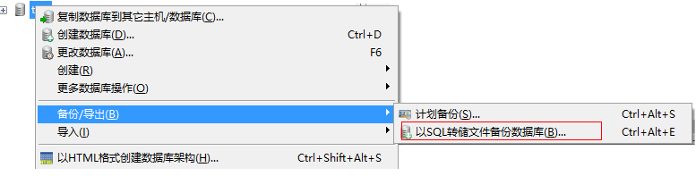

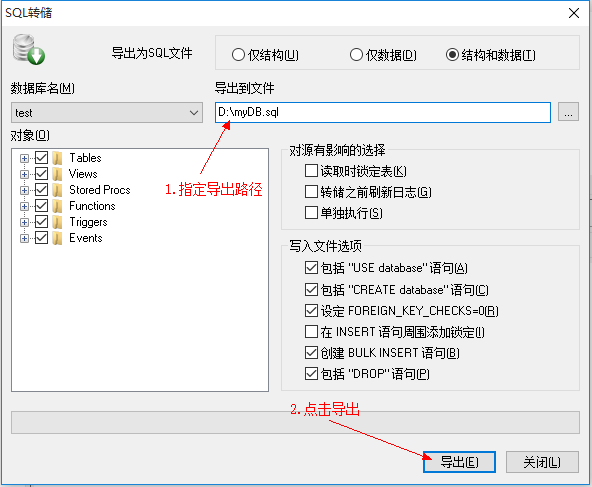

## 1.2 SQL恢复

数据库的恢复指的是使用备份产生的sql文件恢复数据库，即将sql文件中的sql语句执行就可以恢复数据库内容。

### MySQL命令恢复

使用数据库命令备份的时候只是备份了数据库内容，产生的sql文件中没有创建数据库的sql语句，在恢复数据库之前需要自己动手创建数据库。

* 在数据库外恢复                       
  * **格式:**`mysql  -uroot  -p密码 数据库名 < 文件路径`
  * 例如:`mysql  -uroot  -proot day03<d:\day03.sql`       
* 在数据库内恢复                       
  * **格式:**`source SQL脚本路径`
  * 例如:`source d:\day03.sql`
  * 注意:使用这种方式恢复数据，首先要登录数据库.

### 可视化工具恢复

数据库列表区域右键“从SQL转储文件导入数据库”， 指定要执行的SQL文件，执行即可。

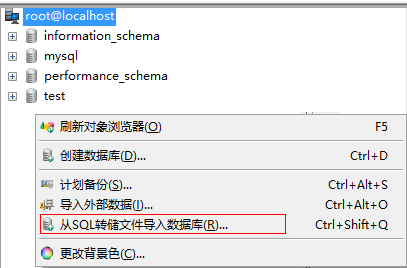

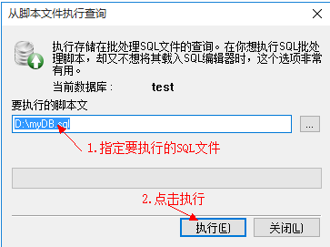

## 1.3 MySQL数据库密码重置

1. 停止mysql服务器运行输入services.msc 停止mysql服务
2. 在cmd下,输入mysqld   --console --skip-grant-tables 启动服务器,出现一下页面,不要关闭该窗口


1. 新打开cmd,输入mysql -uroot  不需要密码

```mysql
use mysql;
update user set password=password('abc') WHERE user='root';
```

1. 关闭两个cmd窗口

# 第二章 多表操作

实际开发中，一个项目通常需要很多张表才能完成。例如：一个商城项目就需要分类表(category)、商品表(products)、订单表(orders)等多张表。且这些表的数据之间存在一定的关系，接下来我们将在单表的基础上，一起学习多表方面的知识。

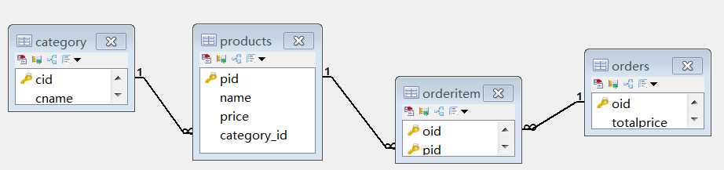

## 2.1 表与表之间的关系

* 一对多关系：
  * 常见实例：客户和订单，分类和商品，部门和员工.
  * 一对多建表原则：在从表(多方)创建一个字段，字段作为外键指向主表(一方)的主键.

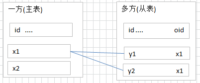

* 多对多关系：
  * 常见实例：学生和课程、用户和角色
  * 多对多关系建表原则：需要创建第三张表,中间表中至少两个字段，这两个字段分别作为外键指向各自一方的主键.

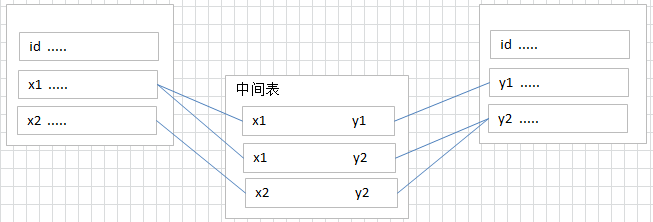

* 一对一关系：(了解)
  * 在实际的开发中应用不多.因为一对一可以创建成一张表.
  * 两种建表原则：
    * 外键唯一：主表的主键和从表的外键（唯一），形成主外键关系，外键唯一unique。
    * 外键是主键：主表的主键和从表的主键，形成主外键关系。

## 2.2 外键约束

现在我们有两张表“分类表”和“商品表”，为了表明商品属于哪个分类，通常情况下，我们将在商品表上添加一列，用于存放分类cid的信息，此列称为：外键

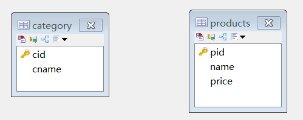

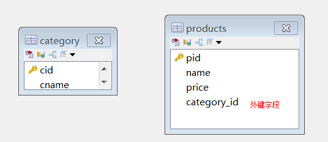

         此时“分类表category”称为：主表，“cid”我们称为主键。“商品表products”称为：从表，category_id称为外键。我们通过主表的主键和从表的外键来描述主外键关系，呈现就是一对多关系。

* 外键特点：
  * 从表外键的值是对主表主键的引用。
  * 从表外键类型，必须与主表主键类型一致。


* 声明外键约束         

```mysql
语法：
alter table 从表 add [constraint][外键名称] foreign key (从表外键字段名) references 主表 (主表的主键);

[外键名称]用于删除外键约束的，一般建议“_fk”结尾
alter table 从表 drop foreign key 外键名称
```

* 使用外键目的：
  * 保证数据完整性

## 2.3 一对多操作

### 分析

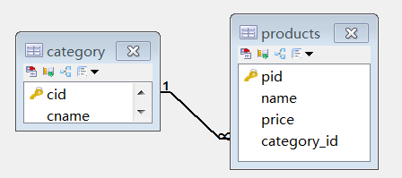

* category分类表，为一方，也就是主表，必须提供主键cid
* products商品表，为多方，也就是从表，必须提供外键category_id

### 实现：分类和商品

```mysql
#创建分类表
create table category(
  cid varchar(32) PRIMARY KEY ,
  cname varchar(100) -- 分类名称
);

# 商品表
CREATE TABLE `products` (
  `pid` varchar(32) PRIMARY KEY  ,
  `name` VARCHAR(40) ,
  `price` DOUBLE 
);

#添加外键字段
alter table products add column category_id varchar(32);

#添加约束
alter table products add constraint product_fk foreign key (category_id) references category (cid);
```

### 操作

```mysql
#1 向分类表中添加数据
INSERT INTO category (cid ,cname) VALUES('c001','服装');

#2 向商品表添加普通数据,没有外键数据，默认为null
INSERT INTO products (pid,pname) VALUES('p001','商品名称');

#3 向商品表添加普通数据，含有外键信息(category表中存在这条数据)
INSERT INTO products (pid ,pname ,category_id) VALUES('p002','商品名称2','c001');

#4 向商品表添加普通数据，含有外键信息(category表中不存在这条数据) -- 失败,异常
INSERT INTO products (pid ,pname ,category_id) VALUES('p003','商品名称2','c999');

#5 删除指定分类(分类被商品使用) -- 执行异常
DELETE FROM category WHERE cid = 'c001';
```

## 2.4 多对多

### 分析

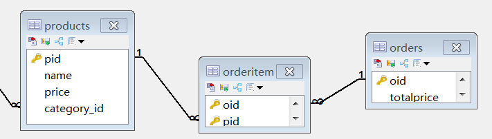

* 商品和订单多对多关系，将拆分成两个一对多。
* products商品表，为其中一个一对多的主表，需要提供主键pid
* orders 订单表，为另一个一对多的主表，需要提供主键oid
* orderitem中间表，为另外添加的第三张表，需要提供两个外键oid和pid

### 实现：订单和商品

```mysql
#商品表[已存在]

#订单表
create table `orders`(
  `oid` varchar(32) PRIMARY KEY ,
  `totalprice` double 	#总计
);

#订单项表
create table orderitem(
  oid varchar(50),-- 订单id
  pid varchar(50)-- 商品id
);

#订单表和订单项表的主外键关系
alter table `orderitem` add constraint orderitem_orders_fk foreign key (oid) references orders(oid);

#商品表和订单项表的主外键关系
alter table `orderitem` add constraint orderitem_product_fk foreign key (pid) references products(pid);

#联合主键（可省略）
alter table `orderitem` add primary key (oid,pid);
```

### 操作

```mysql
#1 向商品表中添加数据
INSERT INTO products (pid,pname) VALUES('p003','商品名称');

#2 向订单表中添加数据
INSERT INTO orders (oid ,totalprice) VALUES('x001','998');
INSERT INTO orders (oid ,totalprice) VALUES('x002','100');

#3向中间表添加数据(数据存在)
INSERT INTO orderitem(pid,oid) VALUES('p001','x001');
INSERT INTO orderitem(pid,oid) VALUES('p001','x002');
INSERT INTO orderitem(pid,oid) VALUES('p002','x002');

#4删除中间表的数据
DELETE FROM orderitem WHERE pid='p002' AND oid = 'x002';

#5向中间表添加数据(数据不存在) -- 执行异常
INSERT INTO orderitem(pid,oid) VALUES('p002','x003');

#6删除商品表的数据 -- 执行异常
DELETE FROM products WHERE pid = 'p001';
```

# 第三章 多表关系实战

## 3.1 实战1：省和市

- 方案1：多张表，一对多

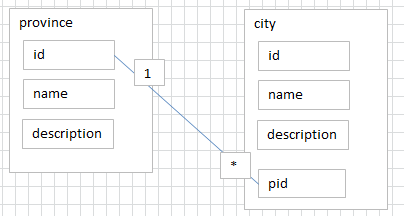


## 3.2 实战2：用户和角色

- 多对多关系

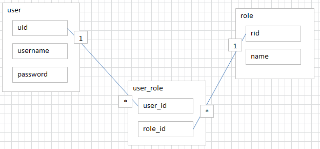


# 第四章 多表查询

**提供表结构如下：**

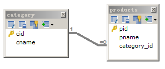

```mysql
CREATE DATABASE day02;
USE day02;

# 分类表
CREATE TABLE category (
  cid VARCHAR(32) PRIMARY KEY ,
  cname VARCHAR(50)
);

#商品表
CREATE TABLE products(
  pid  INT PRIMARY KEY AUTO_INCREMENT ,
  pname VARCHAR(50),
  price DOUBLE,
  flag VARCHAR(2), #是否上架标记为：1表示上架、0表示下架
  cid VARCHAR(32),
  CONSTRAINT products_fk FOREIGN KEY (cid) REFERENCES category (cid)
);
```

## 4.1 初始化数据

```mysql
#分类
INSERT INTO category(cid,cname) VALUES('c001','家电');
INSERT INTO category(cid,cname) VALUES('c002','服饰');
INSERT INTO category(cid,cname) VALUES('c003','化妆品');
#商品
INSERT INTO products(pid, pname,price,flag,category_id) VALUES(1,'联想',5000,'1','c001');
INSERT INTO products(pid, pname,price,flag,category_id) VALUES(2,'海尔',3000,'1','c001');
INSERT INTO products(pid, pname,price,flag,category_id) VALUES(3,'雷神',5000,'1','c001');

INSERT INTO products (pid, pname,price,flag,category_id) VALUES(4,'JACK JONES',800,'1','c002');
INSERT INTO products (pid, pname,price,flag,category_id) VALUES(5,'真维斯',200,'1','c002');
INSERT INTO products (pid, pname,price,flag,category_id) VALUES(6,'花花公子',440,'1','c002');
INSERT INTO products (pid, pname,price,flag,category_id) VALUES(7,'劲霸',2000,'1','c002');

INSERT INTO products (pid, pname,price,flag,category_id) VALUES(8,'香奈儿',800,'1','c003');
INSERT INTO products (pid, pname,price,flag,category_id) VALUES(9,'相宜本草',200,'1','c003');
```

## 4.2 多表查询

1. 交叉连接查询(基本不会使用-得到的是两个表的乘积) [了解]

- 语法：`select * from A,B;`

1. 内连接查询(使用的关键字 inner join  -- inner可以省略)

- 隐式内连接：`select * from A,B where 条件;`

- 显示内连接：`select * from A inner join B on 条件;`

```mysql
#1.查询哪些分类的商品已经上架
#隐式内连接
SELECT DISTINCT c.cname 
FROM category c , products p 
WHERE c.cid = p.category_id AND p.flag = '1';

#内连接
SELECT DISTINCT c.cname 
FROM category c INNER JOIN products p 
ON c.cid = p.category_id 
WHERE p.flag = '1';
```


1. 外连接查询(使用的关键字 outer join -- outer可以省略)

- 左外连接：left outer join
  - `select * from A left outer join B on 条件;`
- 右外连接：right outer join
  - `select * from A right outer join B on 条件;`

```mysql
#2.查询所有分类商品的个数
#左外连接
INSERT INTO category(cid,cname) VALUES('c004','奢侈品');

SELECT cname,COUNT(category_id) 
FROM category c LEFT OUTER JOIN products p 
ON c.cid = p.category_id 
GROUP BY cname;
```

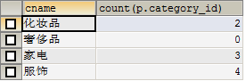

下面通过一张图说明连接的区别:

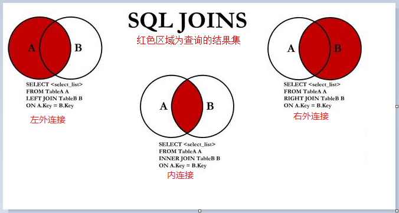

## 4.3 子查询

**子查询**：一条select语句结果作为另一条select语法一部分（查询条件，查询结果，表等）。
**语法**：`select ....查询字段 ... from ... 表.. where ... 查询条件`

```mysql
#3 子查询, 查询“化妆品”分类上架商品详情
#隐式内连接
SELECT p.* 
FROM products p , category c 
WHERE p.category_id=c.cid AND c.cname = '化妆品';

#子查询
##作为查询条件
SELECT * 
FROM products p 
WHERE p.category_id = 
	( 
		SELECT c.cid FROM category c 
			WHERE c.cname='化妆品'
	);
	
##作为另一张表
SELECT * 
FROM products p , 
	 (SELECT * FROM category WHERE cname='化妆品') c 
WHERE p.category_id = c.cid;
```

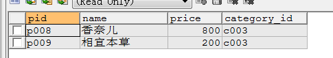

**子查询练习：**

```mysql
#查询“化妆品”和“家电”两个分类上架商品详情
SELECT * 
FROM products p 
WHERE p.category_id in 
	(SELECT c.cid 
     FROM category c 
	 WHERE c.cname='化妆品' or c.name='家电'
	);
```

# 第五章  MySQL高级入门

## 5.1 MySQL的内部组件结构


大体来说，MySQL 可以分为 Server 层和存储引擎层两部分。
**Server层**
主要包括连接器、查询缓存、分析器、优化器、执行器等，涵盖 MySQL 的大多数核心服务功能，以及所有的内置函数（如日期、时间、数学和加密函数等），所有跨存储引擎的功能都在这一层实现，比如存储过程、触发器、视图等。
**Store层**
存储引擎层负责数据的存储和提取。其架构模式是插件式的，支持 InnoDB、MyISAM、Memory 等多个存储引擎。现在最常用的存储引擎是 InnoDB，它从 MySQL 5.5.5 版本开始成为了默认存储引擎。也就是说如果我们在create table时不指定表的存储引擎类型,默认会给你设置存储引擎为InnoDB。

**下面我们重点来分析连接器、查询缓存、分析器、优化器、执行器分别主要干了哪些事情。**

### **5.1.1 连接器**

我们知道由于MySQL是开源的，他有非常多种类的客户端：navicat,mysql front,jdbc,SQLyog等非常丰富的客户端,这些客户端要向mysql发起通信都必须先跟Server端建立通信连接，而建立连接的工作就是有连接器完成的。
第一步，你会先连接到这个数据库上，这时候接待你的就是连接器。连接器负责跟客户端建立连接、获取权限、维持和管理连接。连接命令一般是这么写的：

```mysql
mysql -h host[数据库地址] -uroot[用户] -proot[密码] -P 3306
```

连接命令中的 mysql 是客户端工具，用来跟服务端建立连接。在完成经典的 TCP 握手后，连接器就要开始认证你的身份，这个时候用的就是你输入的用户名和密码。

> 1、如果用户名或密码不对，你就会收到一个"Access denied for user"的错误，然后客户端程序结束执行。
> 2、如果用户名密码认证通过，连接器会到权限表里面查出你拥有的权限。之后，这个连接里面的权限判断逻辑，都将依赖于此时读到的权限。

这就意味着，一个用户成功建立连接后，即使你用管理员账号对这个用户的权限做了修改，也不会影响已经存在连接的权限。修改完成后，只有再新建的连接才会使用新的权限设置。用户的权限表在系统表空间的mysql的user表中。

```mysql
#创建新用户
CREATE USER '用户名'@'%' IDENTIFIED BY '密码'; 
# 赋权限,%表示所有(host)
GRANT ALL PRIVILEGES ON *.* TO '用户名'@'%';
# 刷新数据库
flush privileges
#查看用户权限
show grants for 用户名@"%";
#显示表mysql数据库中user表的列信息
DESCRIBE USER;
```

连接完成后，如果你没有后续的动作，这个连接就处于空闲状态，你可以在 show processlist 命令中看到它。文本中这个图是 show processlist 的结果，其中的 Command 列显示为“Sleep”的这一行，就表示现在系统里面有一个空闲连接。


客户端如果长时间不发送command到Server端，连接器就会自动将它断开。这个时间是由参数 wait_timeout 控制的，默认值是 8 小时。

```mysql
#查看wait_timeout
show global variables like "%timeout";
#设置
set global wait_timeout=28800; 
SET GLOBAL interactive_timeout=28800; 
```


如果在连接被断开之后，客户端再次发送请求的话，就会收到一个错误提醒： Lost connection to MySQL server duringquery。这时候如果你要继续，就需要重连，然后再执行请求了。

数据库里面，长连接是指连接成功后，如果客户端持续有请求，则一直使用同一个连接。短连接则是指每次执行完很少的几次查询就断开连接，下次查询再重新建立一个。开发当中我们大多数时候用的都是长连接,把连接放在Pool内进行管理，但是长连接有些时候会导致 MySQL 占用内存涨得特别快，这是因为 MySQL 在执行过程中临时使用的内存是管理在连接对象里面的。这些资源会在连接断开的时候才释放。所以如果长连接累积下来，可能导致内存占用太大，被系统强行杀掉（OOM），从现象看就是 MySQL 异常重启了。怎么解决这类问题呢？

> 定期断开长连接。使用一段时间，或者程序里面判断执行过一个占用内存的大查询后，断开连接，之后要查询再重连。

### **5.1.2 查询缓存**

连接建立完成后，就可以执行 select 语句了。执行逻辑就会来到第二步：查询缓存。

MySQL 拿到一个查询请求后，会先到查询缓存看看，之前是不是执行过这条语句。之前执行过的语句及其结果可能会以key-value 对的形式，被直接缓存在内存中。key 是查询的语句，value 是查询的结果。如果你的查询能够直接在这个缓存中找到 key，那么这个 value 就会被直接返回给客户端。如果语句不在查询缓存中，就会继续后面的执行阶段。执行完成后，执行结果会被存入查询缓存中。你可以看到，如果查询命中缓存，MySQL 不需要执行后面的复杂操作，就可以直接返回结果，这个效率会很高。

**大多数情况查询缓存就是个鸡肋，为什么呢？**

因为查询缓存往往弊大于利。查询缓存的失效非常频繁，只要有对一个表的更新，这个表上所有的查询缓存都会被清空。因此很可能你费劲地把结果存起来，还没使用呢，就被一个更新全清空了。对于更新压力大的数据库来说，查询缓存的命中率会非常低。一般建议大家在静态表里使用查询缓存，什么叫静态表呢？就是一般我们极少更新的表。比如，一个系统配置表、字典表，那这张表上的查询才适合使用查询缓存。好在 MySQL 也提供了这种“按需使用”的方式。你可以将my.ini参数query_cache_type 设置成 DEMAND

```properties
#my.ini文件  mysql配置文件 在mysql的根目录

#在里面添加一行 query_cache_type有3个值 0代表关闭查询缓存OFF，1代表开启ON，2（DEMAND）代表当sql语句中有SQL_CACHE关键词时才缓存
query_cache_type=2
```

这样对于默认的  SQL  语句都不使用查询缓存。而对于你确定要使用查询缓存的语句，可以用  SQL_CACHE  显式指定，像下 面这个语句一样：

```mysql

#查看当前mysql实例是否开启缓存机制
SHOW GLOBAL VARIABLES LIKE "%query_cache_type%";
#监控查询缓存的命中率:查看运行的缓存信息
show status like'%Qcache%';
#查询并指定缓存
select SQL_CACHE * from test where id = 1;
```


Qcache_free_blocks:表示查询缓存中目前还有多少剩余的blocks，如果该值显示较大，则说明查询缓存中的内存碎片过多了，可能在一定的时间进行整理。
Qcache_free_memory:查询缓存的内存大小，通过这个参数可以很清晰的知道当前系统的查询内存是否够用，是多了，还是不够用，DBA可以根据实际情况做出调整。
**Qcache_hits:**表示有多少次命中缓存。我们主要可以通过该值来验证我们的查询缓存的效果。数字越大，缓存效果越理想。
Qcache_inserts: 表示多少次未命中然后插入，意思是新来的SQL请求在缓存中未找到，不得不执行查询处理，执行查询处理后把结果insert到查询缓存中。这样的情况的次数，次数越多，表示查询缓存应用到的比较少，效果也就不理想。当然系统刚启动后，查询缓存是空的，这很正常。
Qcache_lowmem_prunes:该参数记录有多少条查询因为内存不足而被移除出查询缓存。通过这个值，用户可以适当的调整缓存大小。
Qcache_not_cached: 表示因为query_cache_type的设置而没有被缓存的查询数量。
Qcache_queries_in_cache:当前缓存中缓存的查询数量。
Qcache_total_blocks:当前缓存的block数量。

**注意:mysql8.0已经移除了查询缓存功能**

### 5.1.3 分析器

如果没有命中查询缓存，就要开始真正执行语句了。首先，MySQL 需要知道你要做什么，因此需要对 SQL 语句做解析。分析器先会做“词法分析”。你输入的是由多个字符串和空格组成的一条 SQL 语句，MySQL 需要识别出里面的字符串分别是什么，代表什么。
MySQL 从你输入的"select"这个关键字识别出来，这是一个查询语句。它也要把字符串“T”识别成“表名 T”，把字符
串“ID”识别成“列 ID”。做完了这些识别以后，就要做“语法分析”。根据词法分析的结果，语法分析器会根据语法规则，判断你输入的这个 SQL 语句是否满足 MySQL 语法。如果你的语句不对，就会收到“You have an error in your SQL syntax”的错误提醒，比如下面这个语句 from 写成了"form".


分词器原理


至此我们分析器的工作任务也基本圆满了。接下来进入到优化器

### 5.1.4 优化器

经过了分析器，MySQL  就知道你要做什么了。在开始执行之前，还要先经过优化器的处理。 
优化器是在表里面有多个索引的时候，决定使用哪个索引,或者在一个语句有多表关联（join）的时候，决定各个表的连接 顺序。比如你执行下面这样的语句，这个语句是执行两个表的  join：

```mysql
select * from test1 join test2 using(ID) where test1.name=zhangsan and test2.name=lisi;
```

既可以先从表 test1 里面取出 name=zhangsan的记录的 ID 值，再根据 ID 值关联到表 test2，再判断 test2 里面 name的值是否等于 lisi。
也可以先从表 test2 里面取出 name=lisi的记录的 ID 值，再根据 ID 值关联到 test1，再判断 test1 里面 name的值是否等于 zhangsan。
这两种执行方法的逻辑结果是一样的，但是执行的效率会有不同，而优化器的作用就是决定选择使用哪一个方案。优化器阶段完成后，这个语句的执行方案就确定下来了，然后进入执行器阶段。

### 5.1.5 执行器

开始执行的时候，要先判断一下你对这个表 T 有没有执行查询的权限，如果没有，就会返回没有权限的错误，如下所示 (在工程实现上，如果命中查询缓存，会在查询缓存返回结果的时候，做权限验证)。

```mysql
select * from test where id=10;
```

如果有权限，就打开表继续执行。打开表的时候，执行器就会根据表的引擎定义，去使用这个引擎提供的接口。
比如我们这个例子中的表 test 中，ID 字段没有索引，那么执行器的执行流程是这样的：

> 1. 调用 InnoDB 引擎接口取这个表的第一行，判断 ID 值是不是 10，如果不是则跳过，如果是则将这行存在结果集中；
> 2. 调用引擎接口取“下一行”，重复相同的判断逻辑，直到取到这个表的最后一行。
> 3. 执行器将上述遍历过程中所有满足条件的行组成的记录集作为结果集返回给客户端。
>   至此，这个语句就执行完成了。对于有索引的表，执行的逻辑也差不多。第一次调用的是“取满足条件的第一行”这个接口，之后循环取“满足条件的下一行”这个接口，这些接口都是引擎中已经定义好的。

## 5.2 bin-log归档

删库是不需要跑路的，因为我们的SQL执行时，会将sql语句的执行逻辑记录在我们的bin-log当中，什么是bin-log呢？
binlog是Server层实现的二进制日志,他会记录我们的cud操作。Binlog有以下几个特点：
1、Binlog在MySQL的Server层实现（引擎共用）
2、Binlog为逻辑日志,记录的是一条语句的原始逻辑
3、Binlog不限大小,追加写入,不会覆盖以前的日志
如果，我们误删了数据库,可以使用binlog进行归档!要使用binlog归档，首先我们得记录binlog，因此需要先开启MySQL的binlog功能。

**配置my.ini**

```mysql
#配置开启binlog
log-bin=d:\\mysql\\binlog\\mysql-bin
#注意5.7以及更高版本需要配置本项： （自定义,保证唯一性）;  
server-id=123454
#binlog格式，有3种statement,row,mixed
/*
	Statement：每一条会修改数据的sql都会记录在binlog中。
	ROW:不记录sql语句上下文相关信息，仅保存哪条记录被修改。
	mixed: 是以上两种level的混合使用.
*/
binlog-format=ROW
#表示每1次执行写入就与硬盘同步，会影响性能，为0时表示，事务提交时mysql不做刷盘操作，由系统决定
sync-binlog=1
```

**bin-log命令**

```mysql
 #查看bin‐log是否开启
 show variables like '%log_bin%'; 
 #会多一个最新的bin‐log日志
 flush logs;
 #清空所有的bin‐log日志
  reset master;
 #bin-log列表
 show binary logs;
 

```

**使用mysqlbinlog命令查看文件内容**

找到binlog所在文件夹d:\\mysql\\binlog,使用DOS命令框,输入mysqlbinlog '想要查看的文件名'

```
 mysqlbinlog --no-defaults mysql-bin.000001
```


```
position: 位于文件中的位置，即第一行的（# at 4）,说明该事件记录从文件第4个字节开始
timestamp: 事件发生的时间戳，即第二行的（#210702 20:39:34）
server id: 服务器标识（1）
end_log_pos 表示下一个事件开始的位置（即当前事件的结束位置+1）
thread_id: 执行该事件的线程id （thread_id=113）
exec_time: 事件执行的花费时间
error_code: 错误码，0意味着没有发生错误
type:事件类型Query
```

**假如需要将某一个binlog完全恢复，只需要执行以下命令：**

```
mysqlbinlog --no-defaults mysql-bin.000001 | mysql -uroot -p
```

**根据时间点来进行恢复**

```mysql
mysqlbinlog --no-defaults  mysql-bin.000001 --start-datetime="2021-07-07 17:35:26" --stop-datetime="2021-07-07 17:36:00"  | mysql -uroot -proot
```

**根据定位来恢复**

```mysql
mysqlbinlog --no-defaults mysql-bin.000001 --start-position=306 --stop-position=1260 | mysql -uroot -proot
```

## 5.3 MySQL索引入门

​	MySQL索引的建立对于MySQL的高效运行是很重要的，索引可以大大提高MySQL的检索速度。打个比方，如果合理的设计且使用索引的MySQL是一辆兰博基尼的话，那么没有设计和使用索引的MySQL就是一个人力三车。拿汉语字典的目录页（索引）打比方，我们可以按拼音、笔画、偏旁部首等排序的目录（索引）快速查找到需要的字。在工作中我们可能会经常遇到慢SQL,有时候可以通过添加索引的方式来解决,解决后我们会发现原本可能很久才能运行完的SQL加上索引后,可能执行时间就变为了几十毫秒,那么到底什么是Mysql的索引呢?为什么加上索引后效率会提高呢?

### 5.3.1  什么是MySQL的索引

**MySQL官方对索引的定义为：索引（Index）是帮助MySQL高效获取数据的排好序的数据结构**。那么从这句话我们可以知道索引本质上就是 **排好序的数据结构。**在数据之外，数据库系统还维护着满足特定查找算法的数据结构，这些数据结构以某种方式引用（指向）数据，这样就可以在这些数据结构上实现高级查找算法。这种数据结构，就是索引。打个比方下图就是一种可能的索引方式示例：左边是数据表，一共有两列七条记录，最左边的是数据记录的物理地址 为了加快Col2的查找，可以维护一个右边所示的二叉查找树，每个节点分别包含索引键值和一个指向对应数据记录物理地址的指针，这样就可以运用二叉查找在一定的复杂度内获取到相应数据，从而快速的检索出符合条件的记录。我们要知道MySQL存储的数据都是存放在硬盘上的，每次的查找都需要在硬盘上进行读取，而每次的磁盘IO操作都是非常慢的，假设我们没建立索引去查询，那么需要从前向后去查找，不停的进行磁盘IO操作，效率大大降低，而建立索引后，可以减少磁盘IO的次数，从而提高了效率。


**索引的优点**

- 提高数据检索的效率，降低数据库的IO成本
- 通过索引列对数据进行排序，降低数据排序的成本，降低了CPU的消耗

**索引的缺点**

- 实际上索引也是一张表，该表保存了主键与索引字段，并指向实体表的记录，所以索引列也是要占用空间的
- 虽然索引大大提高了查询速度，同时却会降低更新表的速度，如对表进行INSERT、UPDATE和DELETE。因为更新表时，MySQL不仅要保存数据，还要保存一下索引文件每次更新添加了索引列的字段，都会调整因为更新所带来的键值变化后的索引信息
- 索引只是提高效率的一个因素，如果你的MySQL有大数据量的表，就需要花时间研究建立最优秀的索引，或优化查询语句

### 5.3.2  索引的数据结构

​	 刚才我们在介绍索引时以二叉树为例来介绍的，但是MySQL底层的索引并没有使用二叉树这种结构，那么我们可以想一想为什么MySQL的索引不使用二叉树建立？OK，我们知道二叉树当数据有些特殊时，容易出现不平衡的情况，影响查询的效率，如图。https://www.cs.usfca.edu/~galles/visualization/Algorithms.html 


那可能也有的同学说，我们可以考虑使用平衡二叉树啊，比如红黑树，因为红黑树可以自平衡，并且查询效率也不错，但是我们要知道的是，除了平衡这个问题，还有一个很重要的问题，就是树的高度，树越高查询次数就越多，磁盘IO的次数也越多，红黑树虽然可以通过自平衡降低了树的高度，但是高度还是不可控的，数据少还好，如果数据非常多，比如1000万条数据可能就有对应1000万个索引，那么如果用红黑树的话，那么结果可以想象。所以红黑树也不可以，那么如果想使用树形结构，就需要尽量减少树的高度，让树的高度可控，如何让高度可控，需要让树的每一层多存储数据，每层存储的数据多了，树的高度自然就小了，比如B-Tree.

**B-Tree:**

- 叶节点具有相同的深度，叶节点的指针为空
- 所有索引元素不重复
- 节点中的数据索引从左到右递增


MySQL没有直接使用B-Tree树，而是使用了B-Tree的变种B+Tree

**B+Tree(B-Tree变种)**

- 非叶子节点不存储data，只存储索引(冗余)，可以放更多的索引
- 叶子节点包含所有索引字段
- 叶子节点用指针连接，提高区间访问的性能


B+Tree与B-Tree 的区别：结论在内存有限的情况下，B+TREE 永远比 B-TREE好。无限内存则后者方便 　1）B-树的关键字和记录是放在一起的，叶子节点可以看作外部节点，不包含任何信息；B+树叶子节点中只有关键字和指向下一个节点的索引，记录只放在叶子节点中。(一次查询可能进行两次i/o操作)　 2）在B-树中，越靠近根节点的记录查找时间越快，只要找到关键字即可确定记录的存在；而B+树中每个记录的查找时间基本是一样的，都需要从根节点走到叶子节点，而且在叶子节点中还要再比较关键字。从这个角度看B-树的性能好像要比B+树好，而在实际应用中却是B+树的性能要好些。因为B+树的非叶子节点不存放实际的数据，这样每个节点可容纳的元素个数比B-树多，树高比B-树小，这样带来的好处是减少磁盘访问次数。尽管B+树找到一个记录所需的比较次数要比B-树多，但是一次磁盘访问的时间相当于成百上千次内存比较的时间，因此实际中B+树的性能可能还会好些，而且B+树的叶子节点使用指针连接在一起，方便顺序遍历（例如查看一个目录下的所有文件，一个表中的所有记录等），这也是很多数据库和文件系统使用B+树的缘故。 　

> 为什么mysql页文件默认16K？
>
> 假设我们一行数据大小为1K，那么一页就能存16条数据，也就是一个叶子节点能存16条数据；再看非叶子节点，假设主键ID为bigint类型，那么长度为8B，指针大小在Innodb源码中为6B，一共就是14B，那么一页里就可以存储16K/14=1170个(主键+指针)那么一颗高度为2的B+树能存储的数据为：1170*16=18720条，一颗高度为3的B+树能存储的数据为：1170*1170*16=21902400（千万级条）

这里大家还要注意不同存储引擎下,索引实现也是有所区别的,用我们最常用的两种存储引擎myisam和innodb来看!

**MyiSam索引实现(非聚集)**


**InnoDB索引实现(聚集):**

- 表数据文件本身就是按B+Tree组织的一个索引结构文件
- 聚集索引-叶节点包含了完整的数据记录
- 为什么建议InnoDB表必须建主键，并且推荐使用整型的自增主键？
- 为什么非主键索引结构叶子节点存储的是主键值？(一致性和节省存储空间)


 


聚簇索引并不是一种单独的索引类型，而是一种数据存储方式。术语‘聚簇’表示数据行和相邻的键值进错的存储在一起。 如下图，左侧的索引就是聚簇索引，因为数据行在磁盘的排列和索引排序保持一致。 聚簇索引的好处：按照聚簇索引排列顺序，查询显示一定范围数据的时候，由于数据都是紧密相连，数据库不用从多个数据块中提取数据，所以节省了大量的io操作。聚簇索引的限制：对于mysql数据库目前只有innodb数据引擎支持聚簇索引，而Myisam并不支持聚簇索引。由于数据物理存储排序方式只能有一种，所以每个Mysql的表只能有一个聚簇索引。一般情况下就是该表的主键。为了充分利用聚簇索引的聚簇的特性，所以innodb表的主键列尽量选用有序的顺序id，而不建议用无序的id，比如uuid这种。

### 5.3.3 MySQL索引分类

**主键索引:**设定为主键后数据库会自动建立索引，innodb为聚簇索引

**单值索引:**即一个索引只包含单个列，一个表可以有多个单列索引

```mysql
#随表一起建索引：
	CREATE TABLE customer (
		id INT(10) UNSIGNED  AUTO_INCREMENT ,
		customer_no VARCHAR(200),
		customer_name VARCHAR(200), 
         PRIMARY KEY(id),  
         KEY (customer_name)  #随表一起建立的索引 索引名同 列名(customer_name)
      ); 
 #单独建单值索引：
 CREATE  INDEX idx_customer_name ON customer(customer_name);  
 #删除索引：
 DROP INDEX idx_customer_name ;
```

**唯一索引:**索引列的值必须唯一，但允许有空值

```mysql
	#随表一起建索引：
	CREATE TABLE customer (
      id INT(10) UNSIGNED  AUTO_INCREMENT ,
      customer_no VARCHAR(200),
      customer_name VARCHAR(200), 
      PRIMARY KEY(id),  
      KEY (customer_name),  
      UNIQUE (customer_no));#建立 唯一索引时必须保证所有的值是唯一的（除了null），若有重复数据，会报错。  
      #单独建唯一索引：
      CREATE UNIQUE INDEX idx_customer_no ON customer(customer_no);  
      #删除索引：
      DROP INDEX idx_customer_no on customer ;
```

**复合索引:**即一个索引包含多个列

```mysql
 	#随表一起建索引：
 	CREATE TABLE customer (
      id INT(10) UNSIGNED  AUTO_INCREMENT ,
      customer_no VARCHAR(200),
      customer_name VARCHAR(200),  
      PRIMARY KEY(id), 
      KEY (customer_name),  
      UNIQUE (customer_name),  
      KEY (customer_no,customer_name)
    );
     # 单独建索引：
      CREATE  INDEX idx_no_name ON customer(customer_no,customer_name);  
     # 删除索引：
      DROP INDEX idx_no_name  on customer ;
```

**总结**

```mysql
#创建索引
 CREATE [UNIQUE] INDEX indexname ON mytable(columnname);  
#删除索引
DROP INDEX [indexName] ON mytable; 
#查看索引
SHOW INDEX FROM table_name;

#有四种方式来添加数据表的索引：
#该语句添加一个主键，这意味着索引值必须是唯一的，且不能为NULL。
ALTER TABLE tbl_name ADD PRIMARY KEY (column_list)
#这条语句创建索引的值必须是唯一的（除了NULL外，NULL可能会出现多次）。
ALTER TABLE tbl_name ADD UNIQUE index_name (column_list)
#添加普通索引，索引值可出现多次。
ALTER TABLE tbl_name ADD INDEX index_name (column_list)
 
```

**思考:哪些情况下需要建立索引?哪些情况下不需要建立索引?**

建立:

```
1.主键自动建立唯一索引
2.频繁作为查询条件的字段应该创建索引(where 后面的语句)
3.查询中与其它表关联的字段，外键关系建立索引
4.单键/组合索引的选择问题，who？(在高并发下倾向创建组合索引)
5.查询中排序的字段，排序字段若通过索引去访问将大大提高排序速度
6.查询中统计或者分组字段
```

不建立:

```
1.表记录太少
2.经常增删改的表
	提高了查询速度，同时却会降低更新表的速度，如对表进行INSERT、UPDATE和DELETE。
3.Where条件里用不到的字段不创建索引
4.数据重复且分布平均的表字段，因此应该只为最经常查询和最经常排序的数据列建立索引。
  注意，如果某个数据列包含许多重复的内容，为它建立索引就没有太大的实际效果。


```

