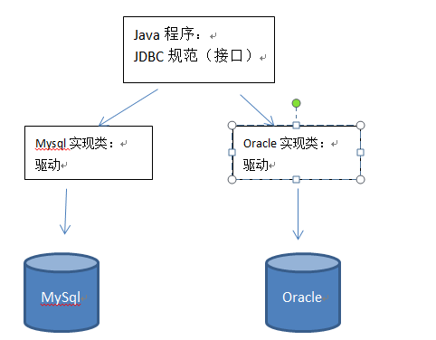
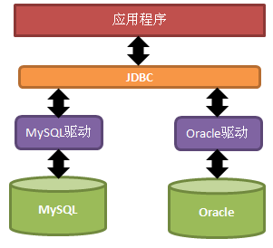
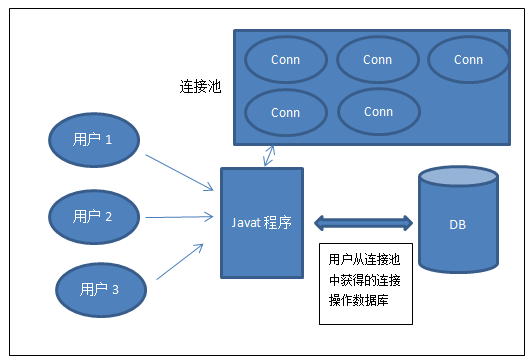

# day03-jdbc&连接池

# 第一章 JDBC

## 1.1 JDBC概述

JDBC（Java DataBase Connectivity,java数据库连接）是一种用于执行SQL语句的Java API。**JDBC是Java访问数据库的标准规范，可以为不同的关系型数据库提供统一访问，它由一组用Java语言编写的接口和类组成。**

JDBC需要连接驱动，驱动是两个设备要进行通信，满足一定通信数据格式，数据格式由设备提供商规定，设备提供商为设备提供驱动软件，通过软件可以与该设备进行通信。
今天我们使用的是mysql的驱动mysql-connector-java-5.1.37-bin.jar



**JDBC规范（掌握四个核心对象）：**

* DriverManager:用于注册驱动
* Connection: 表示与数据库创建的连接
* Statement: 操作数据库sql语句的对象
* ResultSet: 结果集或一张虚拟表

## 1.2 JDBC原理

Java提供访问数据库规范称为JDBC，而生产厂商提供规范的实现类称为驱动。




JDBC是接口，驱动是接口的实现，没有驱动将无法完成数据库连接，从而不能操作数据库！每个数据库厂商都需要提供自己的驱动，用来连接自己公司的数据库，也就是说驱动一般都由数据库生成厂商提供。

## 1.3 JDBC入门案例

### 准备数据

之前我们学习了sql语句的使用，并创建的分类表category，今天我们将使用JDBC对分类表进行增删改查操作。

```mysql
#创建数据库
create database day04;
#使用数据库
use day04;
#创建分类表
create table category(
	cid int PRIMARY KEY AUTO_INCREMENT  ,
  	cname varchar(100)
);
#初始化数据
insert into category (cname) values('家电');
insert into category (cname) values('服饰');
insert into category (cname) values('化妆品');
```

### 导入驱动jar包

创建lib目录，存放mysql的驱动mysql-connector-java-5.1.37-bin.jar

选中mysql的jar包，右键选择“ Add as Library...” 完成jar导入


### 开发步骤

1. 注册驱动.
2. 获得连接.
3. 获得执行sql语句的对象
4. 执行sql语句，并返回结果
5. 处理结果
6. 释放资源.

### 案例实现

```java
//查询所有的分类信息
@Test
public void demo1() throws Exception{
	// 注意：使用JDBC规范，采用都是 java.sql包下的内容
	//1 注册驱动
	Class.forName("com.mysql.jdbc.Driver");
	//2 获得连接
	String url = "jdbc:mysql://localhost:3306/mydb";
	Connection conn = DriverManager.getConnection(url, "root", "root");
	//3获得执行sql语句的对象
	Statement stmt = conn.createStatement();
	//4执行SQL语句
	ResultSet rs = stmt.executeQuery("select * from category");
	
	//5处理结果集
	while(rs.next()){
		// 获得一行数据
		Integer cid = rs.getInt("cid");
		String cname = rs.getString("cname");
		System.out.println(cid + " , " + cname);
	}
	//6释放资源
	rs.close();
	stmt.close();
	conn.close();
}
```

## 1.4 API详解

### API详解：注册驱动

`DriverManager.registerDriver(new com.mysql.jdbc.Driver());`不建议使用，原因有2个：

* 导致驱动被注册2次
* 强烈依赖数据库的驱动jar

解决办法：

* `Class.forName("com.mysql.jdbc.Driver");`

### API详解：获得链接

`static Connection getConnection(String url, String user, String password) `:试图建立到给定数据库 URL 的连接。

* 参数说明：
  * url 需要连接数据库的位置（网址） 
  * user用户名  
  * password 密码
* 例如：`getConnection("jdbc:mysql://localhost:3306/day04", "root", "root");`

> 扩展：
>
> URL:SUN公司与数据库厂商之间的一种协议。
>
> 	jdbc:mysql://localhost:3306/day04
>
> 协议子协议  IP :端口号数据库
> ​	mysql: jdbc:mysql://localhost:3306/day04 或者 jdbc:mysql:///day04（默认本机连接）
> ​	oracle数据库: jdbc:oracle:thin:@localhost:1521:sid

### API详解：java.sql.Connection接口：一个连接 

接口的实现在数据库驱动中。所有与数据库交互都是基于连接对象的。

* `Statement  createStatement(); `//创建操作sql语句的对象

### API详解：java.sql.Statement接口: 操作sql语句，并返回相应结果

```java
String sql = "某SQL语句";
获取Statement语句执行平台：Statement stmt =con.createStatement();
```

常用方法：

* `int executeUpdate(String sql); `--执行insert update delete语句.


* `ResultSet executeQuery(String sql);` --执行select语句.


* `boolean execute(String sql);` --仅当执行select并且有结果时才返回true，执行其他的语句返回false.

### API详解：处理结果集（注：执行insert、update、delete无需处理）

ResultSet实际上就是一张二维的表格，我们可以调用其`boolean next()`方法指向某行记录，当第一次调用`next()`方法时，便指向第一行记录的位置，这时就可以使用ResultSet提供的`getXXX(int col)`方法来获取指定列的数据：(与数组索引从0开始不同，这里索引从1开始)

```java
rs.next();//指向第一行
rs.getInt(1);//获取第一行第一列的数据
```

常用方法：

* `Object getObject(int index)` / `Object getObject(String name)` 获得任意对象
* `String getString(int index)` / `String getString(String name)` 获得字符串


* `int getInt(int index)` / `int getInt(String name)` 获得整形
* `double getDouble(int index)` / `double getDouble(String name) `获得双精度浮点型

### API详解：释放资源

与IO流一样，使用后的东西都需要关闭！关闭的顺序是先得到的后关闭，后得到的先关闭。

```java
rs.close();
stmt.close();
con.close();
```

## 1.5 JDBC工具类

“获得数据库连接”操作，将在以后的增删改查所有功能中都存在，可以封装工具类JDBCUtils。提供获取连接对象的方法，从而达到代码的重复利用。

该工具类提供方法：`public static Connection getConnection()`。代码如下：

```java
public class JdbcUtils {
	
	private static String driver = "com.mysql.jdbc.Driver";
	private static String url = "jdbc:mysql://localhost:3306/webdb_4";
	private static String user = "root";
	private static String password = "root";
	
	static{
		try {
			//注册驱动
			Class.forName(driver);
		} catch (Exception e) {
			throw new RuntimeException(e);
		}
		
	}
	
	/**
	 * 获得连接
	 * @return
	 * @throws SQLException 
	 */
	public static Connection getConnection() throws  SQLException{
		//获得连接
		Connection conn = DriverManager.getConnection(url, user, password);
		return conn;
	}
	
	/**
	 * 释放资源
	 * @param conn
	 * @param st
	 * @param rs
	 */
	public static void closeResource(Connection conn , Statement st , ResultSet rs){
		
		if(rs != null){
			try {
				rs.close();
			} catch (SQLException e) {
			}
		}
		
		if(st != null){
			try {
				st.close();
			} catch (SQLException e) {
			}
		}

		if(conn != null){
			try {
				conn.close();
			} catch (SQLException e) {
			}
		}
		
	}
}
```


## 1.6 JDBC增删改查操作

### 插入

```java
@Test
public void demo01(){
	//添加
	
	Connection conn = null;
	Statement st = null;
	ResultSet rs = null;
	
	try {
		//1 获得连接
		conn = JdbcUtils.getConnection();
		
		//操作
		//1) 获得语句执行者
		st = conn.createStatement();
		//2) 执行sql语句
		int r = st.executeUpdate("insert into category(cname) values('测试')");
		
		//3) 处理结果
		System.out.println(r);
		
	} catch (Exception e) {
		throw new RuntimeException(e);
	} finally{
		//释放资源
		JdbcUtils.closeResource(conn, st, rs);
	}	
}
```

### 修改

```java
@Test
public void demo02(){
	//修改
	Connection conn = null;
	Statement st = null;
	ResultSet rs = null;
	
	try {
		conn = JdbcUtils.getConnection();
		
		st = conn.createStatement();
		int r = st.executeUpdate("update category set cname='测试2' where cid = 4");
		System.out.println(r);
		
	} catch (Exception e) {
		throw new RuntimeException(e);
	} finally{
		JdbcUtils.closeResource(conn, st, rs);
	}
	
}
```

### 删除

```java
@Test
public void demo03(){
	//删除
	Connection conn = null;
	Statement st = null;
	ResultSet rs = null;
	
	try {
		conn = JdbcUtils.getConnection();
		
		//操作
		st = conn.createStatement();
		int r = st.executeUpdate("delete from category where cid = 4");
		System.out.println(r);
		
	} catch (Exception e) {
		throw new RuntimeException(e);
	} finally{
		JdbcUtils.closeResource(conn, st, rs);
	}
	
}
```

### 通过id查询详情

```java
@Test
public void demo04(){
	//通过id查询详情
	Connection conn = null;
	Statement st = null;
	ResultSet rs = null;
	
	try {
		conn = JdbcUtils.getConnection();
		
		//操作
		st = conn.createStatement();
		rs = st.executeQuery("select * from category where cid = 30");
		
		if(rs.next()){
			String cid = rs.getString("cid");
			String cname = rs.getString("cname");
			System.out.println(cid + " @ " + cname );
		} else {
			System.out.println("没有数据");
		}
		
	} catch (Exception e) {
		throw new RuntimeException(e);
	} finally{
		JdbcUtils.closeResource(conn, st, rs);
	}
}
```

### 查询所有

```java
@Test
public void demo05(){
	//查询所有
	Connection conn = null;
	Statement st = null;
	ResultSet rs = null;
	
	try {
		conn = JdbcUtils.getConnection();
		
		//操作
		st = conn.createStatement();
		rs = st.executeQuery("select * from category");
		
		while(rs.next()){
			String cid = rs.getString("cid");
			String cname = rs.getString("cname");
			System.out.println(cid + " @ " + cname );
		}
		
	} catch (Exception e) {
		throw new RuntimeException(e);
	} finally{
		JdbcUtils.closeResource(conn, st, rs);
	}
}
```

# 第二章 PreparedStatement

## 2.1 SQL注入问题

SQL注入：用户输入的内容作为了SQL语句语法的一部分，改变了原有SQL真正的意义。
假设有登录案例SQL语句如下:

```mysql
SELECT * FROM 用户表 WHERE NAME = 用户输入的用户名 AND PASSWORD = 用户输的密码;
```

此时，当用户输入正确的账号与密码后，查询到了信息则让用户登录。但是当用户输入的账号为XXX 密码为：`XXX’  OR ‘a’=’a`时，则真正执行的代码变为：

```mysql
SELECT * FROM 用户表 WHERE NAME = ‘XXX’ AND PASSWORD =’ XXX’  OR ’a’=’a’;
```

此时，上述查询语句时永远可以查询出结果的。那么用户就直接登录成功了，显然我们不希望看到这样的结果，这便是SQL注入问题。
为此，我们使用PreparedStatement来解决对应的问题。

## 2.2 API详解：预处理对象

**preparedStatement**：预编译对象，是Statement对象的子类。

特点：

- 性能高
- 会把sql语句先编译
- 能过滤掉用户输入的关键字。

PreparedStatement预处理对象，处理的每条sql语句中所有的实际参数，都必须使用占位符?替换。

```mysql
String sql = "select * from user where username = ? and password = ?";
```

PreparedStatement使用，需要通过以下3步骤完成：

1. PreparedStatement预处理对象代码：

```java
// 获得预处理对象，需要提供已经使用占位符处理后的SQL语句
PreparedStatement psmt = conn.prepareStatement(sql)
```

1. 设置实际参数

```java
void setXxx(int index, Xxx xx) 将指定参数设置指定类型的值
	参数1：index 实际参数序列号，从1开始。
	参数2：xxx 实际参数值，xxx表示具体的类型。
例如：
setString(2, "1234") 把SQL语句中第2个位置的占位符?替换成实际参数 "1234"
```

1. 执行SQL语句:

```java
int executeUpdate(); --执行insert update delete语句.
ResultSet executeQuery(); --执行select语句.
boolean execute(); --执行select返回true 执行其他的语句返回false.
```

## 2.3 插入

```java
@Test
public void demo01(){
	//添加：向分类表中添加数据
	Connection conn = null;
	PreparedStatement psmt = null;
	ResultSet rs = null;
	
	try {
		//1 获得连接
		conn = JdbcUtils.getConnection();
		//2 处理sql语句
		String sql = "insert into category(cname) values(? )";
		//3获得预处理对象
		psmt = conn.prepareStatement(sql);
		//4设置实际参数
		psmt.setString(1,"预处理");
		//5执行
		int r = psmt.executeUpdate();
		
		System.out.println(r);
		
	} catch (Exception e) {
		throw new RuntimeException(e);
	} finally{
		//6释放资源
		JdbcUtils.closeResource(conn, psmt, rs);
	}
}

```

## 2.4 更新

```java
@Test
public void demo02(){
	//修改
	Connection conn = null;
	PreparedStatement psmt = null;
	ResultSet rs = null;
	
	try {
		conn = JdbcUtils.getConnection();
		
		//1 sql语句
		String sql = "update category set cname = ? where cid = ?";
		//2 获得预处理对象
		psmt = conn.prepareStatement(sql);
		//3设置实际参数
		psmt.setString(1, "测试数据");
		psmt.setInt(2, 4);
		//4执行
		int r = psmt.executeUpdate();
		System.out.println(r);
		
		
	} catch (Exception e) {
		throw new RuntimeException(e);
	} finally{
		JdbcUtils.closeResource(conn, psmt, rs);
	}	
}
```

## 2.5 通过id查询详情

```java
@Test
public void demo05(){
	//通过id查询
	Connection conn = null;
	PreparedStatement psmt = null;
	ResultSet rs = null;
	
	try {
		conn = JdbcUtils.getConnection();
		
		String sql = "select * from category where cid = ?";
		psmt = conn.prepareStatement(sql);
		psmt.setInt(1, 2);
		rs = psmt.executeQuery();
		if(rs.next()){
			System.out.println("查询到");
		} else {
			System.out.println("查询不到");
		}
		
		
	} catch (Exception e) {
		throw new RuntimeException(e);
	} finally{
		JdbcUtils.closeResource(conn, psmt, rs);
	}
}
```


# 第三章 使用连接池重写工具类

## 3.1 连接池原理

连接池理解为存放多个连接的集合。



使用连接池技术的目的：解决建立数据库连接耗费资源和时间很多的问题，提高性能。

## 3.2 编写标准的数据源(规范)

Java为数据库连接池提供了公共的接口：**javax.sql.DataSource**，各个厂商需要让自己的连接池实现这个接口。这样应用程序可以方便的切换不同厂商的连接池！

常见的连接池：C3P0、DRUID。

## 3.3 C3P0连接池

### C3P0连接池工具类编写

C3P0开源免费的连接池！目前使用它的开源项目有：Spring、Hibernate等。使用C3P0连接池需要导入jar包，c3p0使用时还需要添加配置文件“c3p0-config.xml” 

**使用步骤**

1. 添加jar包 
2. 编写配置文件 c3p0-config.xml，放在src中（注：文件名一定不要写错）
3. 编写工具类


- 编写配置文件 c3p0-config.xml

```xml
 <c3p0-config>
   <!-- 使用默认的配置读取连接池对象 -->
   <default-config>
     <!--  连接参数 -->
     <property name="driverClass">com.mysql.jdbc.Driver</property>
     <property name="jdbcUrl">jdbc:mysql://localhost:3306/day03</property>
     <property name="user">root</property>
     <property name="password">root</property>

     <!-- 连接池参数 -->
     <property name="initialPoolSize">5</property>
     <property name="maxPoolSize">10</property>
     <property name="checkoutTimeout">2000</property>
     <property name="maxIdleTime">1000</property>
   </default-config>
 </c3p0-config>
```

**c3p0连接池常用的配置参数：**

| 参数              | 说明       |
| --------------- | -------- |
| initialPoolSize | 初始连接数    |
| maxPoolSize     | 最大连接数    |
| checkoutTimeout | 最大等待时间   |
| maxIdleTime     | 最大空闲回收时间 |

`初始连接数`：刚创建好连接池的时候准备的连接数量
`最大连接数`：连接池中最多可以放多少个连接
`最大等待时间`：连接池中没有连接时最长等待时间
`最大空闲回收时间`：连接池中的空闲连接多久没有使用就会回收


- 编写C3P0工具类

```java
public class JdbcUtils {
    //创建一个C3P0的连接池对象（使用c3p0-config.xml中default-config标签中对应的参数）
    public static DataSource ds = new ComboPooledDataSource();

    //从池中获得一个连接
    public static Connection getConnection() throws SQLException {
        return ds.getConnection();
    }

    //释放资源
    public static void closeAll(ResultSet rs, Statement stmt, Connection conn){
        if (rs != null) {
            try {
                rs.close();
            } catch (SQLException e) {
                throw new RuntimeException(e);
            }
            rs = null;
        }
        if (stmt != null) {
            try {
                stmt.close();
            } catch (SQLException e) {
                throw new RuntimeException(e);
            }
            stmt = null;
        }
        if (conn != null) {
            try {
                conn.close();
            } catch (SQLException e) {
                throw new RuntimeException(e);
            }
            conn = null;
        }
    }
}
```

### C3P0连接池工具类的使用

```java
public class Demo {
	public static void main(String[] args) throws Exception {
		// 拿到连接
		Connection conn = JdbcUtils.getConnection();

		// 执行sql语句
		String sql = "INSERT INTO student VALUES (NULL, ?, ?, ?);";
		PreparedStatement pstmt = conn.prepareStatement(sql);
		pstmt.setString(1, "李四");
		pstmt.setInt(2, 30);
		pstmt.setDouble(3, 50);
		int i = pstmt.executeUpdate();
		System.out.println("影响的函数: " + i);

		// 关闭资源
		JdbcUtils.close(conn, pstmt);
	}
}
```