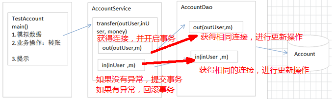
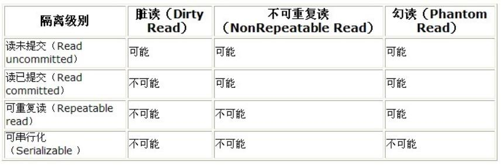
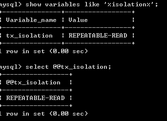
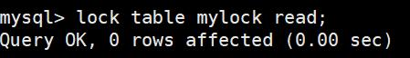
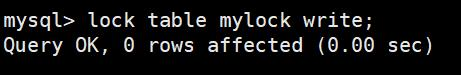
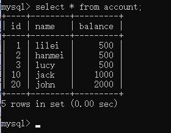

# day04-事务

# 第一章 事务操作

**事务概述**

- 事务指的是逻辑上的一组操作,组成这组操作的各个单元要么全都成功,要么全都失败.
- 事务作用：保证在一个事务中多次SQL操作要么全都成功,要么全都失败.

## 1.1 mysql事务操作

| sql语句             | 描述   |
| ----------------- | ---- |
| start transaction | 开启事务 |
| commit            | 提交事务 |
| rollback          | 回滚事务 |

- 准备数据

```mysql
# 创建一个表：账户表.
create database webdb;
# 使用数据库
use webdb;
# 创建账号表
create table account(
	id int primary key auto_increment,
	name varchar(20),
	money double
);
# 初始化数据
insert into account values (null,'jack',10000);
insert into account values (null,'rose',10000);
insert into account values (null,'tom',10000);
```

- 操作
  - MYSQL中可以有两种方式进行事务的管理：
    - 自动提交：MySql默认自动提交。及执行一条sql语句提交一次事务。
    - 手动提交：先开启，再提交
- 方式1：手动提交

```mysql
start transaction;
update account set money=money-1000 where name='jack';
update account set money=money+1000 where name='rose';
commit;
#或者
rollback;
```

- 方式2：自动提交，通过修改mysql全局变量“autocommit”进行控制

```mysql
show variables like '%commit%';
* 设置自动提交的参数为OFF:
set autocommit = 0;  -- 0:OFF  1:ON
```

## 1.2 jdbc事务操作

| Connection 对象的方法名         | 描述   |
| ------------------------- | ---- |
| conn.setAutoCommit(false) | 开启事务 |
| conn.commit()             | 提交事务 |
| conn.rollback()           | 回滚事务 |

> 代码演示

```java
//事务模板代码
public void demo01() throws SQLException{
	// 获得连接
	Connection conn = null;
	
	try {
		//#1 开始事务
		conn.setAutoCommit(false);
		
		//.... 加钱 ,减钱
		
		//#2 提交事务
		conn.commit();
	} catch (Exception e) {
		//#3 回滚事务
		conn.rollback();
	} finally{
		// 释放资源
		conn.close();
	}
}
```

## 1.3案例：JDBC事务分层（dao、service）传递Connection

### 分析



- 开发中，常使用分层思想
  - 不同的层次结构分配不同的解决过程，各个层次间组成严密的封闭系统

- 不同层级结构彼此平等
- 分层的目的是：
  - 解耦
  - 可维护性
  - 可扩展性
  - 可重用性
- 不同层次，使用不同的包表示
  - com.doit   				公司域名倒写
  - com.doit.dao               dao层
  - com.doit.service        service层
  - com.doit.domain        javabean
  - com.doit.utils              工具

# 第二章 事务总结

## 2.1 事务特性：ACID

- 原子性（Atomicity）原子性是指事务是一个不可分割的工作单位，事务中的操作要么都发生，要么都不发生。 

- 一致性（Consistency）事务前后数据的完整性必须保持一致。

- 隔离性（Isolation）事务的隔离性是指多个用户并发访问数据库时，一个用户的事务不能被其它用户的事务所干扰，多个并发事务之间数据要相互隔离。
- 持久性（Durability）持久性是指一个事务一旦被提交，它对数据库中数据的改变就是永久性的，接下来即使数据库发生故障也不应该对其有任何影响。

## 2.2 并发访问问题

如果不考虑隔离性，事务存在3中并发访问问题。

1. 脏读：一个事务读到了另一个事务未提交的数据.

2. 不可重复读：一个事务读到了另一个事务已经提交(update)的数据。引发另一个事务，在事务中的多次查询结果不一致。
3. 虚读 /幻读：一个事务读到了另一个事务已经提交(insert)的数据。导致另一个事务，在事务中多次查询的结果不一致。

## 2.3 隔离级别：解决问题

- 数据库规范规定了4种隔离级别，分别用于描述两个事务并发的所有情况。

1. **read uncommitted** 读未提交，一个事务读到另一个事务没有提交的数据。

   a)存在：3个问题（脏读、不可重复读、虚读）。

   b)解决：0个问题

2. **read committed** 读已提交，一个事务读到另一个事务已经提交的数据。

   a)存在：2个问题（不可重复读、虚读）。

   b)解决：1个问题（脏读）

3. **repeatable read**:可重复读，在一个事务中读到的数据始终保持一致，无论另一个事务是否提交。

   a)存在：1个问题（虚读）。

   b)解决：2个问题（脏读、不可重复读）

4. **serializable 串行化**，同时只能执行一个事务，相当于事务中的单线程。

   a)存在：0个问题。

   b)解决：3个问题（脏读、不可重复读、虚读）

- 安全和性能对比
  - 安全性：`serializable > repeatable read > read committed > read uncommitted`
  - 性能 ： `serializable < repeatable read < read committed < read uncommitted`
- 常见数据库的默认隔离级别：
  - MySql：`repeatable read`
  - Oracle：`read committed`

  

## 2.4 演示

- 隔离级别演示参考：资料/隔离级别操作过程.doc【增强内容,了解】

- 查询数据库的隔离级别

```mysql
show variables like '%isolation%';
或
select @@tx_isolation;
```



- 设置数据库的隔离级别
  - `set session transactionisolation level` 级别字符串
  - 级别字符串：`readuncommitted`、`read committed`、`repeatable read`、`serializable`
  - 例如：`set session transaction isolation level read uncommitted;`

- 读未提交：readuncommitted
  - A窗口设置隔离级别
    - AB同时开始事务
    - A 查询
    - B 更新，但不提交
    - A 再查询？-- 查询到了未提交的数据
    - B 回滚
    - A 再查询？-- 查询到事务开始前数据

- 读已提交：read committed
  - A窗口设置隔离级别
    - AB同时开启事务
    - A查询
    - B更新、但不提交
    - A再查询？--数据不变，解决问题【脏读】
    - B提交
    - A再查询？--数据改变，存在问题【不可重复读】
- 可重复读：repeatable read
  - A窗口设置隔离级别
    - AB 同时开启事务
    - A查询
    - B更新， 但不提交
    - A再查询？--数据不变，解决问题【脏读】
    - B提交
    - A再查询？--数据不变，解决问题【不可重复读】
    - A提交或回滚
    - A再查询？--数据改变，另一个事务
- 串行化：serializable
  - A窗口设置隔离级别
  - AB同时开启事务
  - A查询
    - B更新？--等待(如果A没有进一步操作，B将等待超时)
    - A回滚
    - B 窗口？--等待结束，可以进行操作


# 第三章 锁

锁是计算机协调多个进程或线程并发访问某一资源的机制。
在数据库中，除了传统的计算资源（如CPU、RAM、I/O等）的争用以外，数据也是一种供需要用户共享的资
源。如何保证数据并发访问的一致性、有效性是所有数据库必须解决的一个问题，锁冲突也是影响数据库并发
访问性能的一个重要因素。打个比方，我们到淘宝上买一件商品，商品只有一件库存，这个时候如果还有另一个人买，那么如何解决是你买到还是另一个人买到的问题？ 这里肯定要用到事务，我们先从库存表中取出物品数量，然后插入订单，付款后插入付款表信息，然后更新商品数量。在这个过程中，使用锁可以对有限的资源进行保护，解决隔离和并发的矛盾。 

**锁分类**
从对数据库操作的类型分，分为读锁和写锁

- 读锁（共享锁，S锁(Shared)）：针对同一份数据，多个读操作可以同时进行而不会互相影响
- 写锁（排它锁，X锁(eXclusive)）：当前写操作没有完成前，它会阻断其他写锁和读锁

从对数据操作的粒度分，分为表锁和行锁

**表锁**

每次操作锁住整张表。开销小，加锁快；不会出现死锁；锁定粒度大，发生锁冲突的概率最高，并发度最低；
一般用在整表数据迁移的场景。

```mysql
CREATE TABLE mylock(
	id INT  PRIMARY KEY AUTO_INCREMENT,
	NAME VARCHAR(20) 
)ENGINE=MYISAM;
INSERT INTO mylock(NAME) VALUES
('a'),
('b'),
('c'),
('d'),
('e');
```

- 手动增加表锁

```
lock table 表名称 read(write),表名称2 read(write);
```

- 查看表上加过的锁

```mysql
show open tables;
```

- 删除表锁

```mysql
unlock tables;
```

案例分析(加读锁）



当前session和其他session都可以读该表,当前session在有锁时不能读其他表

当前session中插入或者更新锁定的表都会报错，其他session插入或更新则会等待



当前session对该表的增删改查都没有问题，其他session对该表的所有操作被阻塞

**结论**

1、对MyISAM表的读操作(加读锁) ,不会阻寒其他进程对同一表的读请求,但会阻赛对同一表的写请求。只有当
读锁释放后,才会执行其它进程的写操作。
2、对MylSAM表的写操作(加写锁) ,会阻塞其他进程对同一表的读和写操作,只有当写锁释放后,才会执行其它进
程的读写操作

**行锁**

每次操作锁住一行数据。开销大，加锁慢；会出现死锁；锁定粒度最小，发生锁冲突的概率最低，并发度最
高。

InnoDB与MYISAM的最大不同有两点：

- InnoDB支持事务（TRANSACTION）
- InnoDB支持行级锁

```mysql
CREATE TABLE account(
	id INT PRIMARY KEY AUTO_INCREMENT,
	NAME VARCHAR(100),
	balance INT 
);

INSERT INTO `account` (`name`,`balance`) VALUES 
('lilei', '450'),
('hanmei', '16000'),
('lucy', '2400');


```

一个session开启事务更新不提交，另一个session更新同一条记录会阻塞，更新不同记录不会阻塞

InnoDB在执行查询语句SELECT时(非串行隔离级别)，不会加锁。但是update、insert、delete操作会加行
锁。

**索引失效导致行锁变表锁**

```mysql
CREATE TABLE test_innodb(
	id INT PRIMARY KEY AUTO_INCREMENT,
	b VARCHAR(100),
    KEY(b)
);
INSERT INTO test_innodb(b) VALUES
('100'),
('200'),
('500'),
('1000'),
('600'),
('700'),
('800');
```

**锁主要是加在索引上，如果对非索引字段更新，行锁可能会变表锁**
session1 执行：update test_innodb set  id = 10 where b = 7000;
session2 对该表任一行操作都会阻塞住

**间隙锁(Gap Lock)**

间隙锁，锁的就是两个值之间的空隙。

```
INSERT INTO account (id , NAME ,balance) VALUES
(10,'jack','1000'),
(20,'john','2000');
```

假设account表中数据如下




那么间隙就有 id 为 (3,10)，(10,20)，(20,正无穷) 这三个区间，
在Session1下面执行 update account set name = 'aaa' where id > 8 and id <18;，则其他Session**没**
**法在这个范围所包含的所有行记录(包括间隙行记录)以及行记录所在的间隙里插入或修改任何数据**，即**id在**
**(3,20]区间都无法修改数据，注意最后那个20也是包含在内的**。
间隙锁是在可重复读隔离级别下才会生效。

**临键锁(Next-key Locks)**
Next-Key Locks是行锁与间隙锁的组合。像上面那个例子里的这个(3,20]的整个区间可以叫做临键锁。


**最终结论**

Innodb存储引擎由于实现了行级锁定，虽然在锁定机制的实现方面所带来的性能损耗可能比表级锁定会要更
高一下，但是在整体并发处理能力方面要远远优于MYISAM的表级锁定的。当系统并发量高的时候，Innodb
的整体性能和MYISAM相比就会有比较明显的优势了。
但是，Innodb的行级锁定同样也有其脆弱的一面，当我们使用不当的时候，可能会让Innodb的整体性能表现
不仅不能比MYISAM高，甚至可能会更差。

```mysql
show status like 'innodb_row_lock%';
```

Innodb_row_lock_time_avg （等待平均时长）
Innodb_row_lock_waits （等待总次数）
Innodb_row_lock_time（等待总时长）

尤其是当等待次数很高，而且每次等待时长也不小的时候，我们就需要分析系统中为什么会有如此多的等待，
然后根据分析结果着手制定优化计划。

**锁优化建议**
尽可能让所有数据检索都通过索引来完成，避免无索引行锁升级为表锁
合理设计索引，尽量缩小锁的范围
尽可能减少检索条件范围，避免间隙锁
尽量控制事务大小，减少锁定资源量和时间长度，涉及事务加锁的sql尽量放在事务最后执行
尽可能低级别事务隔离